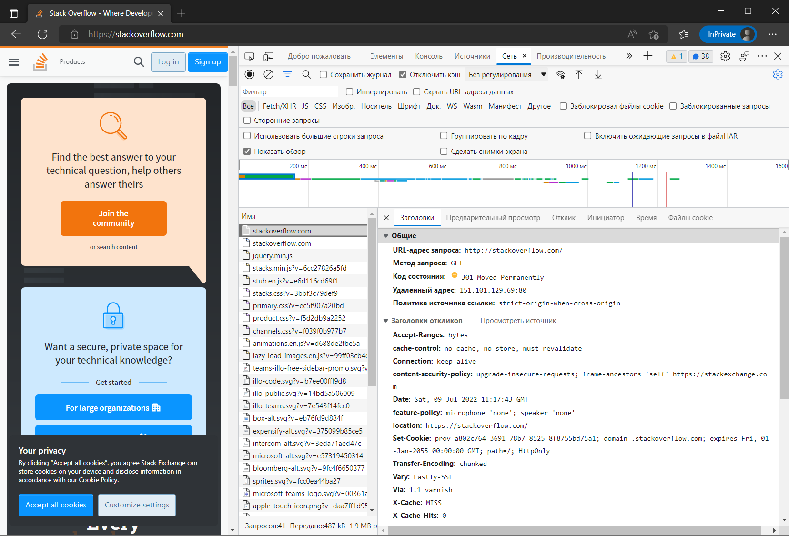

# Домашнее задание к занятию "3.6. Компьютерные сети, лекция 1"

1. Подключитесь утилитой телнет к сайту stackoverflow.com. укажите полученный HTTP код.  
    ```
    HTTP/1.1 301 Moved Permanently
    location: https://stackoverflow.com/questions
    Date: Sat, 09 Jul 2022 11:06:42 GMT
    ```
    `301 Moved Permanently` запрошенный ресурс был окончательно перемещён в URL, указанный в заголовке Location. Браузер в случае такого ответа перенаправляется на эту страницу. Ресурс перемещён по адресу `https://stackoverflow.com/questions`  
2. Подключитесь к сайту  stackoverflow.com в браузере. укажите в ответе полученный HTTP код.  
    ```
    HTTP/1.1 301 Moved Permanently
    location: https://stackoverflow.com/
    Date: Sat, 09 Jul 2022 11:17:43 GMT
    ```
    какой запрос обрабатывался дольше всего.  
    ```
    https://cdn.sstatic.net/Js/third-party/npm/@stackoverflow/stacks/dist/js/stacks.min.js
    ```
    JavaScript 23438 байта выполнялся 253 мс.  
    приложите скриншот консоли браузера.  
      
3. Какой IP адрес у вас в интернете?  
    ```
    
    ```
    
5. Какому провайдеру принадлежит ваш IP адрес?  
    ```
    
    ```
    Какой автономной системе AS?  
    ```
    
    ```
7. Через какие сети проходит пакет, отправленный с вашего компьютера на адрес 8.8.8.8?  
    ```
    
    ```
    Через какие AS?  
    ```
    
    ```
9. Повторите задание 5 в утилите `mtr`  
    ```
    
    ```
    На каком участке наибольшая задержка - delay?  
    ```
    
    ```
11. Какие DNS сервера отвечают за доменное имя dns.google?  
    ```
    
    ```
    Какие A записи?  
    ```
    
    ```
13. Проверьте PTR записи для IP адресов из задания 7  
    ```
    
    ```
     Какое доменное имя привязано к IP?  
     ```
     
     ```

