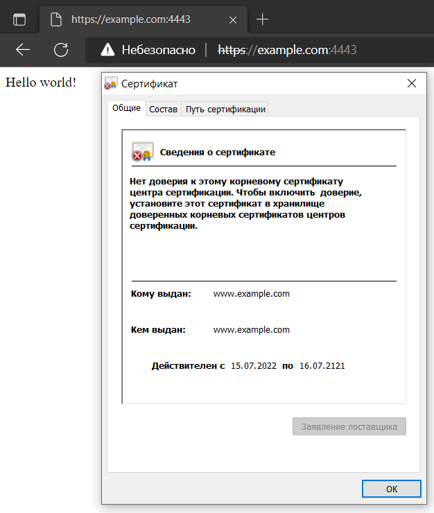

# Домашнее задание к занятию "3.9. Элементы безопасности информационных систем"

1. Установите Bitwarden плагин для браузера. Зарегестрируйтесь и сохраните несколько паролей.  
    Не использую менеджеры паролей в браузере.  

2. Установите Google authenticator на мобильный телефон. Настройте вход в Bitwarden акаунт через Google authenticator OTP.  
    Не использую аутентификаторы в телефоне.  
    
3. Установите apache2, сгенерируйте самоподписанный сертификат, настройте тестовый сайт для работы по HTTPS.
    Установим apache  
    ```
    apt install apache
    ```
    Включим ssl модуль  
    ```
    a2enmod ssl
    systemctl restart apache2
    ```
    Сгенерируем самоподписанный сертификат утилитой `openssl`  
    ```
    openssl req -x509 -nodes -newkey rsa:4096 -sha256 -keyout /etc/ssl/private/private-selfsigned.key -out /etc/ssl/certs/certificated-selfsigned.crt -days 36160  -subj -sha256 -subj "/C=RU/O=Company/OU=DevOps/CN=www.example.com" -addext "subjectAltName=DNS:example.com,DNS:www.example.com" -addext "keyUsage = digitalSignature, keyEncipherment, dataEncipherment, cRLSign, keyCertSign" -addext "extendedKeyUsage = serverAuth, clientAuth" 
    ```
    Создадим конфигурацию нового сайта в Apache  
    ```
    nano /etc/apache2/sites-available/example.com.conf
        <VirtualHost *:443>
        ServerName example.com
        DocumentRoot /var/www/example.com
        SSLEngine on
        SSLCertificateFile /etc/ssl/certs/certificated-selfsigned.crt
        SSLCertificateKeyFile /etc/ssl/private/private-selfsigned.key
        </VirtualHost>
    ```
    Cоздадим директорию нового сайта и стартовую страницу  
    ```
    mkdir /var/www/example.com
    nano /var/www/example.com/index.html
        Hello world!
    ```
    Включим новый сайт в Apache  
    ```
    a2ensite example.com.conf
    systemctl reload apache2
    ```
    Пробросим порт `443` из вирутальной машины на хост порт `4443`.    
    Попробуем открыть в браузере хоста сайт.  
      
    Проверим сайт утилитой `curl` из хоста  
    ```
    curl https://example.com:4443 --verbose --insecure
    *   Trying 127.0.0.1:4443...
    * Connected to example.com (127.0.0.1) port 4443 (#0)
    * ALPN: offers h2
    * ALPN: offers http/1.1
    * TLSv1.0 (OUT), TLS header, Certificate Status (22):
    * TLSv1.3 (OUT), TLS handshake, Client hello (1):
    * TLSv1.2 (IN), TLS header, Certificate Status (22):
    * TLSv1.3 (IN), TLS handshake, Server hello (2):
    * TLSv1.2 (IN), TLS header, Finished (20):
    * TLSv1.2 (IN), TLS header, Supplemental data (23):
    * TLSv1.3 (IN), TLS handshake, Encrypted Extensions (8):
    * TLSv1.2 (IN), TLS header, Supplemental data (23):
    * TLSv1.3 (IN), TLS handshake, Certificate (11):
    * TLSv1.2 (IN), TLS header, Supplemental data (23):
    * TLSv1.3 (IN), TLS handshake, CERT verify (15):
    * TLSv1.2 (IN), TLS header, Supplemental data (23):
    * TLSv1.3 (IN), TLS handshake, Finished (20):
    * TLSv1.2 (OUT), TLS header, Finished (20):
    * TLSv1.3 (OUT), TLS change cipher, Change cipher spec (1):
    * TLSv1.2 (OUT), TLS header, Supplemental data (23):
    * TLSv1.3 (OUT), TLS handshake, Finished (20):
    * SSL connection using TLSv1.3 / TLS_AES_256_GCM_SHA384
    * ALPN: server accepted http/1.1
    * Server certificate:
    *  subject: C=RU; O=Company; OU=DevOps; CN=www.example.com
    *  start date: Jul 15 07:55:23 2022 GMT
    *  expire date: Jul 16 07:55:23 2121 GMT
    *  issuer: C=RU; O=Company; OU=DevOps; CN=www.example.com
    *  SSL certificate verify result: self-signed certificate (18), continuing anyway.
    * TLSv1.2 (OUT), TLS header, Supplemental data (23):
    > GET / HTTP/1.1
    > Host: example.com:4443
    > User-Agent: curl/7.84.0
    > Accept: */*
    >
    * TLSv1.2 (IN), TLS header, Supplemental data (23):
    * TLSv1.3 (IN), TLS handshake, Newsession Ticket (4):
    * TLSv1.2 (IN), TLS header, Supplemental data (23):
    * TLSv1.3 (IN), TLS handshake, Newsession Ticket (4):
    * old SSL session ID is stale, removing
    * TLSv1.2 (IN), TLS header, Supplemental data (23):
    * Mark bundle as not supporting multiuse
    < HTTP/1.1 200 OK
    < Date: Fri, 15 Jul 2022 08:25:51 GMT
    < Server: Apache/2.4.41 (Ubuntu)
    < Last-Modified: Fri, 15 Jul 2022 08:04:44 GMT
    < ETag: "e-5e3d378951099"
    < Accept-Ranges: bytes
    < Content-Length: 14
    < Content-Type: text/html
    <
    Hello world!
    ```
4. Проверьте на TLS уязвимости произвольный сайт в интернете (кроме сайтов МВД, ФСБ, МинОбр, НацБанк, РосКосмос, РосАтом, РосНАНО и любых госкомпаний, объектов КИИ, ВПК ... и тому подобное).  
    Для проверки TLS воспользуемся утилитой `testssl.sh`  
    ```
    wget -O testssl.tar.gz https://codeload.github.com/drwetter/testssl.sh/tar.gz/3.0.4
    mkdir testssl
    tar xf testssl.tar.gz --strip-components=1 -C testssl
    ```
    Запустим сканирование TLS у сайта  
    ```
    ./testssl.sh --sneaky https://2ip.ru
    
    Testing protocols via sockets except NPN+ALPN
    SSLv2      not offered (OK)
    SSLv3      not offered (OK)
    TLS 1      offered (deprecated)
    TLS 1.1    offered (deprecated)
    TLS 1.2    offered (OK)
    TLS 1.3    not offered and downgraded to a weaker protocol
    NPN/SPDY   http/1.1 (advertised)
    ALPN/HTTP2 http/1.1 (offered)
    
    Testing vulnerabilities
    Heartbleed (CVE-2014-0160)                not vulnerable (OK), no heartbeat extension
    CCS (CVE-2014-0224)                       not vulnerable (OK)
    Ticketbleed (CVE-2016-9244), experiment.  not vulnerable (OK)
    ROBOT                                     not vulnerable (OK)
    Secure Renegotiation (RFC 5746)           supported (OK)
    Secure Client-Initiated Renegotiation     not vulnerable (OK)
    CRIME, TLS (CVE-2012-4929)                not vulnerable (OK)
    BREACH (CVE-2013-3587)                    potentially NOT ok, "gzip" HTTP compression detected. - only supplied "/" tested
                                              Can be ignored for static pages or if no secrets in the page
    POODLE, SSL (CVE-2014-3566)               not vulnerable (OK), no SSLv3 support
    TLS_FALLBACK_SCSV (RFC 7507)              Downgrade attack prevention supported (OK)
    SWEET32 (CVE-2016-2183, CVE-2016-6329)    not vulnerable (OK)
    FREAK (CVE-2015-0204)                     not vulnerable (OK)
    DROWN (CVE-2016-0800, CVE-2016-0703)      not vulnerable on this host and port (OK)
                                              make sure you don't use this certificate elsewhere with SSLv2 enabled services
                                              https://censys.io/ipv4?q=E03715E377AADBD111BFF3D1014A6DC14E9FD79D08F9B828DB78ED5B0369BE40 could help you to find out
    LOGJAM (CVE-2015-4000), experimental      not vulnerable (OK): no DH EXPORT ciphers, no DH key detected with <= TLS 1.2
    BEAST (CVE-2011-3389)                     TLS1: ECDHE-RSA-AES256-SHA ECDHE-RSA-AES128-SHA AES256-SHA CAMELLIA256-SHA AES128-SHA CAMELLIA128-SHA
                                              VULNERABLE -- but also supports higher protocols  TLSv1.1 TLSv1.2 (likely mitigated)
    LUCKY13 (CVE-2013-0169), experimental     potentially VULNERABLE, uses cipher block chaining (CBC) ciphers with TLS. Check patches
    RC4 (CVE-2013-2566, CVE-2015-2808)        no RC4 ciphers detected (OK)
    ```
5. Установите на Ubuntu ssh сервер
    ```
    apt install sshd
    ```
    , сгенерируйте новый приватный ключ. 
    ```
    
    ```
    Скопируйте свой публичный ключ на другой сервер
    ```
    
    ```
    . Подключитесь к серверу по SSH-ключу.
6. Переименуйте файлы ключей из задания 5. Настройте файл конфигурации SSH клиента, так чтобы вход на удаленный сервер осуществлялся по имени сервера.
    xxx
    ```
    
    ```
7. Соберите дамп трафика утилитой tcpdump в формате pcap, 100 пакетов. Откройте файл pcap в Wireshark.
    xxx
    ```
    
    ```
