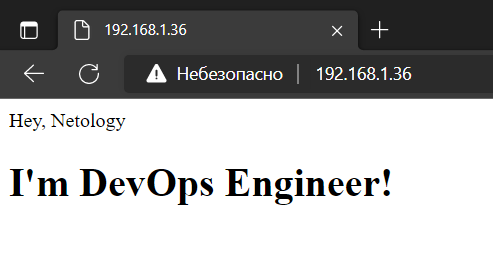

# Домашнее задание к занятию "5.3. Введение. Экосистема. Архитектура. Жизненный цикл Docker контейнера"  
## Задача 1

Сценарий выполения задачи:

- создайте свой репозиторий на https://hub.docker.com;
- выберете любой образ, который содержит веб-сервер Nginx;
- создайте свой fork образа;
- реализуйте функциональность:
запуск веб-сервера в фоне с индекс-страницей, содержащей HTML-код ниже:
```
<html>
<head>
Hey, Netology
</head>
<body>
<h1>I’m DevOps Engineer!</h1>
</body>
</html>
```
Опубликуйте созданный форк в своем репозитории и предоставьте ответ в виде ссылки на https://hub.docker.com/username_repo.

- Убедимся что текущей папке существуют два файла
    - `Dockerfile`
    ```
    FROM nginx:stable-alpine
    COPY ./index.html /usr/share/nginx/html
    ```
    - `index.html`
    ```
    <html>
    <head>
    Hey, Netology
    </head>
    <body>
    <h1>I’m DevOps Engineer!</h1>
    </body>
    </html>
    ```
  
    ```
    ~/docker/nginx# ls
    Dockerfile  index.html
    ```
- Запустим сборку обаза с тегом `yuriartemiev/nginx:local` в текущей директории `.`  
    ```
    docker build -t yuriartemiev/nginx:local .
    ```
- Проверим что обаз создался
    ```
    docker images
    REPOSITORY           TAG             IMAGE ID       CREATED          SIZE
    yuriartemiev/nginx   local           bcc91249bceb   37 seconds ago   23.5MB
    nginx                stable-alpine   075b447b534f   3 weeks ago      23.5MB
    ```
- Запустим контейнер чтобы проверить, что веб-страница доступна. Название контейнера: `nginx`, опубликовать порт `80`.
    ```
    docker run -itd -p 80:80 --name nginx yuriartemiev/nginx:local
    ```
- Посмотрим что контейнер запустился
    ```
    docker ps
    CONTAINER ID IMAGE                    COMMAND                CREATED       STATUS       PORTS                             NAMES
    4005e55336e7 yuriartemiev/nginx:local "/docker-entrypoint.…" 7 seconds ago Up 6 seconds 0.0.0.0:80->80/tcp, :::80->80/tcp nginx
    ```
- Проверим страницу в браузере  
      
- Назначим тег образу
    ```
    docker tag bcc91249bceb yuriartemiev/nginx:netology
    ```
- Подключаемся к Docker Hub
    ```
    docker login -u yuriartemiev
    ```
- Отправим образ в репозиторий
    ```
    docker push yuriartemiev/nginx:netology
    ```
https://hub.docker.com/r/yuriartemiev/nginx


## Задача 2

Посмотрите на сценарий ниже и ответьте на вопрос:
"Подходит ли в этом сценарии использование Docker контейнеров или лучше подойдет виртуальная машина, физическая машина? Может быть возможны разные варианты?"

Детально опишите и обоснуйте свой выбор.

--

Сценарий:

- Высоконагруженное монолитное java веб-приложение;
Монолитное приложение не очень подходит для контейниризации. Потому что контейнеры лучше работают в системе с множеством разных контекстов исполнения. На мой взгляд подойдёт виртуальная машина, как более простая в обслуживании, чем физический сервер.  
- Nodejs веб-приложение;
Контейнеры. NodeJS позволяет запустить приложения с множеством раздельных сервисом.  
- Мобильное приложение c версиями для Android и iOS;
Виртуальные машины. Существуют специальные шаблоны для разработки под Android. Под iOS следует использовать среду от Apple.  
- Шина данных на базе Apache Kafka;
Это приложение можно запустить в контейнере.  
- Elasticsearch кластер для реализации логирования продуктивного веб-приложения - три ноды elasticsearch, два logstash и две ноды kibana;
Контейнеры или виртуальные машины. Если кластер с большим объёмом данных, то виртуальная машина может лучше подходить. Хотя существуют также официальные образы контейнеров.  
- Мониторинг-стек на базе Prometheus и Grafana;
Контейнеры. С возможностью исплоьзования персистентного хранилища.  
- MongoDB, как основное хранилище данных для java-приложения;
Виртуальная машина. С базой данных на контенере могут быть трудности. Виртуальная машины облегчит сопровождение.   
- Gitlab сервер для реализации CI/CD процессов и приватный (закрытый) Docker Registry.
Контейнеры. Подхоидт из-за процесса для построения артефактов с последующем удалением контейнера.  

## Задача 3

- Запустите первый контейнер из образа ***centos*** c любым тэгом в фоновом режиме, подключив папку ```/data``` из текущей рабочей директории на хостовой машине в ```/data``` контейнера;
    ```
    docker run -itd -v "${PWD}"/data:/data --name centos centos:7
    ```
- Запустите второй контейнер из образа ***debian*** в фоновом режиме, подключив папку ```/data``` из текущей рабочей директории на хостовой машине в ```/data``` контейнера;
    ```
    docker run -itd -v "${PWD}"/data:/data --name debian debian:bullseye
    ```
- Подключитесь к первому контейнеру с помощью ```docker exec``` и создайте текстовый файл любого содержания в ```/data```;
    ```
    docker exec -it centos bash
    echo 'Hello from CentOS' >> /data/centos_file
    Ctrl + D
    ```
- Добавьте еще один файл в папку ```/data``` на хостовой машине;
    ```
    echo 'Hello from Local' >> ./data/local_file
    ```
- Подключитесь во второй контейнер и отобразите листинг и содержание файлов в ```/data``` контейнера.
    ```
    docker exec -it debian bash
    ls /data
    centos_file  local_file
    cat /data/centos_file /data/local_file
    Hello from CentOS
    Hello from Local
    ```
 
 
