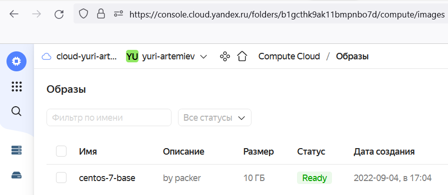
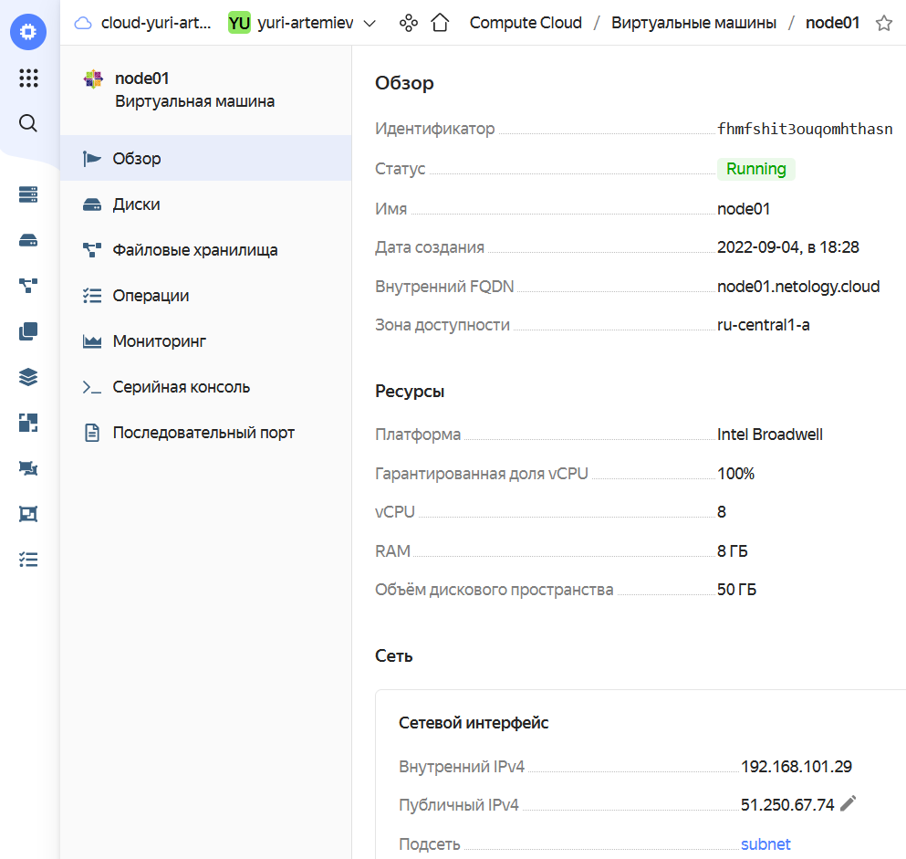

# Домашнее задание к занятию "5.4. Оркестрация группой Docker контейнеров на примере Docker Compose"

## Задача 1

Создать собственный образ операционной системы с помощью Packer.

Для получения зачета, вам необходимо предоставить:
- Скриншот страницы, как на слайде из презентации (слайд 37).

Шаги:  
- Регистрация на Яндекс Облаке console.cloud.yandex.ru  
- Создать платёжный аккаунт с промо-кодом  
- Скачать и установить утилиту `yc`  
    - `curl -sSL https://storage.yandexcloud.net/yandexcloud-yc/install.sh | bash`  
- Запустить утилиту `yc`  
    - `cd src/`  
    - `yc init`  
    - Получить OAuth токен по адресу в браузере `https://oauth.yandex.ru/authorize?response_type=token&client_id=1a6990aa636648e9b2ef855fa7bec2fb`  
    - В утилите `yc`    
        - Вставить токен  
        - Выбрать папку в Яндекс Облаке  
        - Выбрать создания Compute по-умолчанию  
        - Выбрать зону в Яндекс Облаке  
    - Проверим созданные настройки  
        - `yc config list`
            ```
            token: y0_A...
            cloud-id: b1gjd8gta6ntpckrp97r
            folder-id: b1gcthk9ak11bmpnbo7d
            compute-default-zone: ru-central1-a
            ```
    - Создаём сеть в Яндекс Облаке    
        - `yc vpc network create --name net --labels my-label=netology --description "my first network via yc"`  
            ```
            id: enp7b44svg1838v53jrp
            folder_id: b1gcthk9ak11bmpnbo7d
            created_at: "2022-09-04T13:12:07Z"
            name: net
            description: my first network via yc
            labels:
            my-label: netology
            ```
    - Создаём подсеть в Яндекс Облаке  
        - `yc vpc subnet create --name my-subnet-a --zone ru-central1-a --range 10.1.2.0/24 --network-name net --description "my first subnet via yc"`  
            ```
            id: e9bqg9e35b1s8430fk2i
            folder_id: b1gcthk9ak11bmpnbo7d
            created_at: "2022-09-04T13:15:45Z"
            name: my-subnet-a
            description: my first subnet via yc
            network_id: enp7b44svg1838v53jrp
            zone_id: ru-central1-a
            v4_cidr_blocks:
            - 10.1.2.0/24
            ```
    - Создаем IAM токет в Яндекс Облаке  
        - `yc iam create-token`  
            ```
            t1.9eu...
            ```
- Скачать и установить утилиту `packer`  
    - `curl -fsSL https://apt.releases.hashicorp.com/gpg | sudo apt-key add -`  
    - `apt-add-repository "deb [arch=amd64] https://apt.releases.hashicorp.com $(lsb_release -cs) main"`  
    - `apt-get update && apt-get install packer`  
 - Редактируем манифест Packer в файле `centos-7-base.json`  
    -  Изменяем идентификатор каталога Яндекс Облака  
        - `"folder_id": "b1gcthk9ak11bmpnbo7d"`  
    - Изменяем идентификатор подсети в Яндекс Облаке  
        - `"subnet_id": "e9bqg9e35b1s8430fk2i"`  
    - Изменяем токен в Яндекс облаке  
        - `"token": "t1.9euelZqKkMyWnp..."`  
- Генерируем SSH ключи на локальной машине  
    - `ssh-keygen -t rsa -b 2048`  
- Запускаем создание образа через `packet`  
    - `packer build centos-7-base.json`  
        ```
        yandex: Detected instance IP: 130.193.39.47
        ...
        ==> Builds finished. The artifacts of successful builds are:
        --> yandex: A disk image was created: centos-7-base (id: fd8a2pfcnlee71u1g12c) with family name centos
        ```
- Проверим, что образ виртуальной машины в Яндекс Облаке создался с помощью утилиты `yc`  
    - `yc compute image list`  
        ```
        +----------------------+---------------+--------+----------------------+--------+
        |          ID          |     NAME      | FAMILY |     PRODUCT IDS      | STATUS |
        +----------------------+---------------+--------+----------------------+--------+
        | fd8a2pfcnlee71u1g12c | centos-7-base | centos | f2euv1kekdgvc0jrpaet | READY  |
        +----------------------+---------------+--------+----------------------+--------+
        ```

  


## Задача 2

Создать вашу первую виртуальную машину в Яндекс.Облаке.

Для получения зачета, вам необходимо предоставить:
- Скриншот страницы свойств созданной ВМ, как на примере  

Шаги:
- Удаляем сеть и подсеть в Яндекс Облаке перед тем как запускаем Terraform  
    - `yc vpc subnet delete --name my-subnet-a && yc vpc network delete --name net`  
- Скачать и установить утилиту `terraform`  
    - `apt-get update && apt-get install -y gnupg software-properties-common`  
    - `wget -O- https://apt.releases.hashicorp.com/gpg | gpg --dearmor | tee /usr/share/keyrings/hashicorp-archive-keyring.gpg`
    - `echo "deb [signed-by=/usr/share/keyrings/hashicorp-archive-keyring.gpg] https://apt.releases.hashicorp.com $(lsb_release -cs) main" | tee /etc/apt/sources.list.d/hashicorp.list`
    - `apt update && apt-get install terraform`  
- Редактируем переменные Terraform в файле `variables.tf`  
    -  Изменяем идентификатор облака Яндекс Облака  
        ```
        variable "yandex_cloud_id" {
        default = "b1gjd8gta6ntpckrp97r"
        }
        ```
    -  Изменяем идентификатор каталога Яндекс Облака  
        ```
        variable "yandex_folder_id" {
        default = "b1gcthk9ak11bmpnbo7d"
        }
        ```
    -  Изменяем идентификатор образа виртуальной машины Яндекс Облака  
        ```
        variable "centos-7-base" {
        default = "fd8a2pfcnlee71u1g12c"
        }
        ```
Редактируем провайдера Terraform в файле `provider.tf`  
    - Изменяем токен Яндекс Облака   
        ```
        provider "yandex" {
        token = "t1.9eu..."
        cloud_id  = "${var.yandex_cloud_id}"
        folder_id = "${var.yandex_folder_id}"
        zone = "ru-central1-a"
        }
        ```
- Запустить утилиту `terraform`  
    - `cd terraform/`  
    - `terraform init`  
    - Выведем план Terraform   
        - `terraform plan`  
            ```
            Plan: 3 to add, 0 to change, 0 to destroy.
            Changes to Outputs:
            + external_ip_address_node01_yandex_cloud = (known after apply)
            + internal_ip_address_node01_yandex_cloud = (known after apply)
            ```
    - Применим конфигурацию Terraform   
        - `terraform apply --auto-approve`  
            ```
            Apply complete! Resources: 3 added, 0 changed, 0 destroyed.
            Outputs:
            external_ip_address_node01_yandex_cloud = "51.250.67.74"
            internal_ip_address_node01_yandex_cloud = "192.168.101.29"
            ```
 - Проверим, что виртуальная машина в Яндекс Облаке создалась с помощью утилиты `yc`  
    - `yc compute instance list`   
        ```
        +----------------------+--------+---------------+---------+--------------+----------------+
        |          ID          |  NAME  |    ZONE ID    | STATUS  | EXTERNAL IP  |  INTERNAL IP   |
        +----------------------+--------+---------------+---------+--------------+----------------+
        | fhmfshit3ouqomhthasn | node01 | ru-central1-a | RUNNING | 51.250.67.74 | 192.168.101.29 |
        +----------------------+--------+---------------+---------+--------------+----------------+
        ```

  


## Задача 3

Создать ваш первый готовый к боевой эксплуатации компонент мониторинга, состоящий из стека микросервисов.

Для получения зачета, вам необходимо предоставить:
- Скриншот работающего веб-интерфейса Grafana с текущими метриками, как на примере ниже


Удалить использованные ресурсы
    terraform destroy
    yc delete
    
Залить conf файлы в репозиторий
