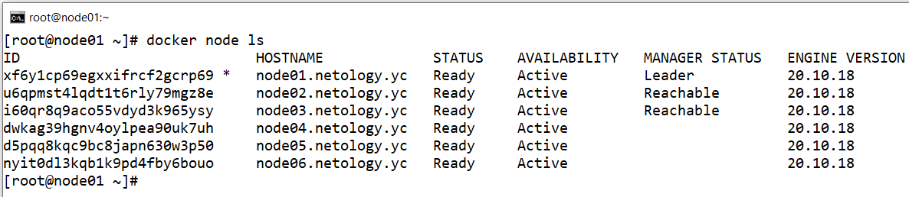
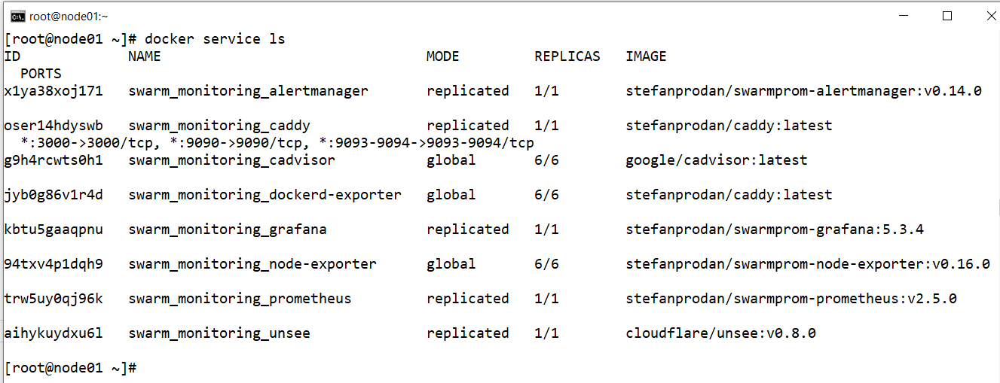

# Домашнее задание к занятию "5.5. Оркестрация кластером Docker контейнеров на примере Docker Swarm"

## Задача 1

Дайте письменые ответы на следующие вопросы:

- В чём отличие режимов работы сервисов в Docker Swarm кластере: replication и global?  
    - `replicated` сервис - администратор docker swarm явно указывает какое количество реплик (контейнеров) запустить на нодах кластера  
    - `global` сервис - оркестратор docker swarm сам запускает реплики на всех нодах кластера  
    
- Какой алгоритм выбора лидера используется в Docker Swarm кластере?
    - В кластере docoker swarm может быть несколько нод с ролью менеджеров. Для того, чтобы чтобы принимать некоторые решения при изменении состояния кластера используется роль лидера менеджеров. Если нода лидера отключается от кластера использвается алгоритм Raft для выбора нового лидера.  
    
- Что такое Overlay Network?  
    - `overlay` сеть осуществляет связь между нодами и сервисами в docker swarm. Это специальный сетевой драйвер docker. Только хосты в swarm могут иметь доступ в overlay сеть. По ней проходит как трафик управления, так и трафик данных от сервисов в кластере.  


## Задача 2

Создать ваш первый Docker Swarm кластер в Яндекс.Облаке

Для получения зачета, вам необходимо предоставить скриншот из терминала (консоли), с выводом команды:
```
docker node ls
```

Шаги:
- Создаём IAM токет в Яндекс Облаке  
    - `yc iam create-token`  
- Создаём сеть в Яндекс Облаке    
    - `yc vpc network create --name net --labels my-label=netology --description "my first network via yc"`  
- Создаём подсеть в Яндекс Облаке  
    - `yc vpc subnet create --name my-subnet-a --zone ru-central1-a --range 10.1.2.0/24 --network-name net --description "my first subnet via yc"`  
- Редактируем манифест Packer в файле `centos-7-base.json`  
    -  Изменяем идентификатор каталога Яндекс Облака  
        - `"folder_id": "b1gcthk9ak11bmpnbo7d"`  
    - Изменяем идентификатор подсети в Яндекс Облаке  
        - `"subnet_id": "e9bqg9e35b1s8430fk2i"`  
    - Изменяем токен для авторизации в Яндекс Облаке  
        - `"token": "t1.9euelZqKkMyWnp..."`
- Запускаем создание образа через `packet`  
    - `cd packer`
    - `packer build centos-7-base.json`  
- Удаляем сеть и подсеть в Яндекс Облаке перед тем как запускаем Terraform  
    - `yc vpc subnet delete --name my-subnet-a && yc vpc network delete --name net`  
- Редактируем переменные Terraform в файле `variables.tf`  
    -  Изменяем идентификатор облака Яндекс Облака  
        ```
        variable "yandex_cloud_id" {
        default = "b1gjd8gta6ntpckrp97r"
        }
        ```
    -  Изменяем идентификатор каталога Яндекс Облака  
        ```
        variable "yandex_folder_id" {
        default = "b1gcthk9ak11bmpnbo7d"
        }
        ```
    -  Изменяем идентификатор образа виртуальной машины Яндекс Облака  
        ```
        variable "centos-7-base" {
        default = "fd83quv4ee0j0vh5iipi"
        }
        ```
- Редактируем провайдера Terraform в файле `provider.tf`  
    - Изменяем токен Яндекс Облака   
        ```
        provider "yandex" {
        token = "t1.9eu..."
        cloud_id  = "${var.yandex_cloud_id}"
        folder_id = "${var.yandex_folder_id}"
        zone = "ru-central1-a"
        }
        ```
- Запускаем утилиту `terraform`  
    - `cd terraform/`  
    - `terraform init`  
    - Выведем план Terraform   
        - `terraform plan`  
    - Применим конфигурацию Terraform   
        - `terraform apply --auto-approve`  

- Посмотрим список запущенных контейнеров на виртуальной машине в Яндекс Облаке  
    - `ssh centos@84.252.131.8`
    - `docker node ls`


  


## Задача 3

Создать ваш первый, готовый к боевой эксплуатации кластер мониторинга, состоящий из стека микросервисов.

Для получения зачета, вам необходимо предоставить скриншот из терминала (консоли), с выводом команды:
```
docker service ls
```


  


- Удалить использованные ресурсы
    - `cd terraform/`
    - `terraform destroy --auto-approve`
    - `yc compute image delete --id fd83quv4ee0j0vh5iipi`
    


