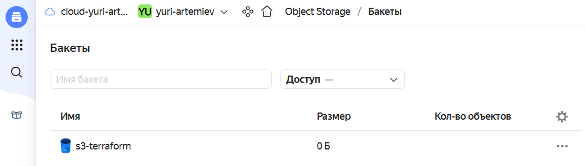
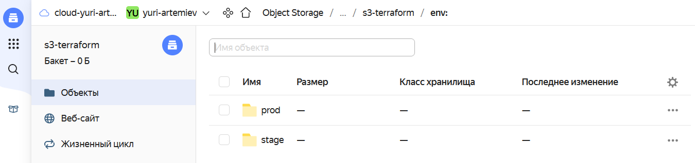

# Домашнее задание к занятию "7.3. Основы и принцип работы Терраформ"

## Задача 1. Создадим бэкэнд в S3 (необязательно, но крайне желательно).

Если в рамках предыдущего задания у вас уже есть аккаунт AWS, то давайте продолжим знакомство со взаимодействием
терраформа и aws. 

1. Создайте s3 бакет, iam роль и пользователя от которого будет работать терраформ. Можно создать отдельного пользователя,
а можно использовать созданного в рамках предыдущего задания, просто добавьте ему необходимы права, как описано 
[здесь](https://www.terraform.io/docs/backends/types/s3.html).
1. Зарегистрируйте бэкэнд в терраформ проекте как описано по ссылке выше. 


Последовательность шагов:
- Регистрация на Яндекс Облаке по адресу `console.cloud.yandex.ru`  
- Создаём платёжный аккаунт с промо-кодом  
- Скачаем и установим утилиту `yc`  
    - `curl -sSL https://storage.yandexcloud.net/yandexcloud-yc/install.sh | bash`  
- Запустим утилиту `yc`:    
    - `yc init`  
    - Получим OAuth токен по адресу в браузере `https://oauth.yandex.ru/authorize?response_type=token&client_id=1a6990aa636648e9b2ef855fa7bec2fb`  
    - В утилите `yc`    
        - Вставим токен  
        - Выберем папку в Яндекс Облаке  
        - Выберем создание Compute по-умолчанию  
        - Выберем зону в Яндекс Облаке  
    - Проверим созданные настройки Яндекс Облака    
        - `yc config list`
            ```
            token: y0_A...
            cloud-id: b1gjd8gta6ntpckrp97r
            folder-id: b1gcthk9ak11bmpnbo7d
            compute-default-zone: ru-central1-a
            ```
- Получим IAM-токен  
    ```
    yc iam create-token
    ```
- Сохраним токен и параметры в переменную окружения  
    ```
    export YC_TOKEN=$(yc iam create-token)
    export YC_CLOUD_ID=$(yc config get cloud-id)
    export YC_FOLDER_ID=$(yc config get folder-id)
    export YC_ZONE=$(yc config get compute-default-zone)
    ```
- Настроем провайдер terraform  
    ```
    nano ~/.terraformrc
    ```
    ```
    provider_installation {
      network_mirror {
        url = "https://terraform-mirror.yandexcloud.net/"
        include = ["registry.terraform.io/*/*"]
      }
      direct {
        exclude = ["registry.terraform.io/*/*"]
      }
    }
    ```
- Сгенерируем SSH ключи на локальной машине  
    ```
    ssh-keygen
    ```
- Создадим конфигурацию terraform  
    ```
    mkdir -p ~/07-03
    nano ~/07-03/main.tf
    ```
    ```
    terraform {
      required_providers {
        yandex = {
          source = "yandex-cloud/yandex"
        }
      }
      required_version = ">= 0.13"
    }

    provider "yandex" {
      zone = "ru-central1-a"
    }
    ```
- Инициализируем провайдер  
    ```
    terraform init
    ```
- Создадим сервисный аккаунт  
    ```
    yc iam service-account create --name terraform
    ```
- Назначим роль editor соданному сервисному аккаунту  
    ```
    yc resource-manager folder add-access-binding yuri-artemiev --role editor --subject serviceAccount:ajeul9o1i22i724de0j4
    ```
- Получим статический ключ доступа. 
    ```
    yc iam access-key create --service-account-name terraform
    ```
    ```
    access_key:
      id: ajel36i7s2obe04e71ig
      service_account_id: ajeul9o1i22i724de0j4
      created_at: "2022-10-16T12:04:26.562235525Z"
      key_id: YCAJEMPlx5hXK5stLB3dXt_Nd
    secret: YCMK...
    ```
- Создадим хранилище в Яндекс Облаке
      
- Настроем бекенд чтобы сохранить состояние Terraform в Object Storage  
    ```
    terraform {
      required_providers {
        yandex = {
          source = "yandex-cloud/yandex"
        }
      }
      required_version = ">= 0.13"
      backend "s3" {
        endpoint   = "storage.yandexcloud.net"
        bucket     = "s3-terraform"
        region     = "ru-central1"
        key        = "terraform.tfstate"
        access_key = "YCAJEMPlx5hXK5stLB3dXt_Nd"
        secret_key = "YCMK..."

        skip_region_validation      = true
        skip_credentials_validation = true
      }
    }

    provider "yandex" {
      zone = "ru-central1-a"
    }
    ```
- Переконфигурируем расположение terraform состояния  
    ```
    terraform init -reconfigure
    ```
    ```
    Initializing the backend...

    Successfully configured the backend "s3"! Terraform will automatically
    use this backend unless the backend configuration changes.

    Initializing provider plugins...
    - Reusing previous version of yandex-cloud/yandex from the dependency lock file
    - Using previously-installed yandex-cloud/yandex v0.80.0

    Terraform has been successfully initialized!
    ```


## Задача 2. Инициализируем проект и создаем воркспейсы. 

1. Выполните `terraform init`:
    * если был создан бэкэнд в S3, то терраформ создат файл стейтов в S3 и запись в таблице 
dynamodb.
    * иначе будет создан локальный файл со стейтами.  
1. Создайте два воркспейса `stage` и `prod`.
    - Запустим команды
        ```
        terraform workspace new stage
        terraform workspace new prod
        ```
    - Проверим хранилище состояний  
          
1. В уже созданный `aws_instance` добавьте зависимость типа инстанса от вокспейса, что бы в разных ворскспейсах 
использовались разные `instance_type`.
1. Добавим `count`. Для `stage` должен создаться один экземпляр `ec2`, а для `prod` два. 
1. Создайте рядом еще один `aws_instance`, но теперь определите их количество при помощи `for_each`, а не `count`.
1. Что бы при изменении типа инстанса не возникло ситуации, когда не будет ни одного инстанса добавьте параметр
жизненного цикла `create_before_destroy = true` в один из рессурсов `aws_instance`.
1. При желании поэкспериментируйте с другими параметрами и рессурсами.

В виде результата работы пришлите:
* Вывод команды `terraform workspace list`.
* Вывод команды `terraform plan` для воркспейса `prod`.  

Порядок действий:
- Выведем список рабочих зон  
    ```
    terraform workspace list
    ```
    ```
      default
    * prod
      stage
    ```
- Создадим конфигурацию terraform main.tf  
    ```
    terraform {
      required_providers {
        yandex = {
          source = "yandex-cloud/yandex"
        }
      }
      required_version = ">= 0.13"
      backend "s3" {
        endpoint   = "storage.yandexcloud.net"
        bucket     = "s3-terraform"
        region     = "ru-central1"
        key        = "terraform.tfstate"
        access_key = "YCAJEMPlx5hXK5stLB3dXt_Nd"
        secret_key = "YCMKnkcqEgSdsnwkWX4kJiwqCxk5ElRnMA4RxMiW"

        skip_region_validation      = true
        skip_credentials_validation = true
      }
    }

    provider "yandex" {
      zone = "ru-central1-a"
    }


    resource "yandex_compute_instance" "vm-1-count" {
      name = "${terraform.workspace}-count-${count.index}"
      count = local.vm-1-count-dic[terraform.workspace]

      resources {
        cores  = 2
        memory = 2
      }

      boot_disk {
        initialize_params {
          image_id = "fd8kdq6d0p8sij7h5qe3"
        }
      }

      network_interface {
        subnet_id = yandex_vpc_subnet.subnet-1.id
        nat       = true
      }

      metadata = {
        ssh-keys = "ubuntu:${file("~/.ssh/id_rsa.pub")}"
      }

      lifecycle {
        create_before_destroy = true
      }
    }


    resource "yandex_compute_instance" "vm-2-foreach" {
      name = "${terraform.workspace}-foreach-${each.key}"
      for_each = local.vm-2-foreach-dic[terraform.workspace]

      resources {
        cores  = 2
        memory = 2
      }

      boot_disk {
        initialize_params {
          image_id = "fd8kdq6d0p8sij7h5qe3"
        }
      }

      network_interface {
        subnet_id = yandex_vpc_subnet.subnet-1.id
        nat       = true
      }

      metadata = {
        ssh-keys = "ubuntu:${file("~/.ssh/id_rsa.pub")}"
      }

      lifecycle {
        create_before_destroy = true
      }
    }


    locals {
      vm-1-count-dic = {
        stage = 1
        prod = 2
      }

      vm-2-foreach-dic = {
        stage = toset(["1"])
        prod = toset(["1", "2"])
      }

    }


    resource "yandex_vpc_network" "network-1" {
      name = "network1"
    }

    resource "yandex_vpc_subnet" "subnet-1" {
      name           = "subnet1"
      zone           = "ru-central1-a"
      network_id     = yandex_vpc_network.network-1.id
      v4_cidr_blocks = ["192.168.10.0/24"]
    }


    output "internal_ip_address_vm_1_count" {
      value = yandex_compute_instance.vm-1-count[*].network_interface.0.ip_address
    }

    output "external_ip_address_vm_1_count" {
      value = yandex_compute_instance.vm-1-count[*].network_interface.0.nat_ip_address
    }

    output "internal_ip_address_vm_2_foreach" {
      value = values(yandex_compute_instance.vm-2-foreach)[*].network_interface.0.ip_address
    }

    output "external_ip_address_vm_2_foreach" {
      value = values(yandex_compute_instance.vm-2-foreach)[*].network_interface.0.nat_ip_address
    }
    ```
- Проверим конфигурацию terraform  
    ```
    terraform validate
    ```
- Подготовим план terraform  
    ```
    terraform plan
    ```
    ```
    Terraform will perform the following actions:

      # yandex_compute_instance.vm-1-count[0] will be created
      + resource "yandex_compute_instance" "vm-1-count" {
          + created_at                = (known after apply)
          + folder_id                 = (known after apply)
          + fqdn                      = (known after apply)
          + hostname                  = (known after apply)
          + id                        = (known after apply)
          + metadata                  = {
              + "ssh-keys" = <<-EOT
                    ubuntu:ssh-rsa AAAAB3NzaC1yc2EAAAADAQABAAABgQDkU4/aw3VSeK0jZMSb1Zu9kYdiVgv14s7UXji/iXvPREPWX+yx4iCtUg0eQqoZU3kxCNdUknYce7mqp0V01OoArlQo7UCUXi+XtyGoHLMO+j1uxdz6vjHWS5CPD9ghvPWcQbC6HkGzowkpwmXVJdxnmBkz8pBgkVklbx9OqYlv9VXqKLjaFejuQfd96cZNZbmseL6DNfmybPytuzAz2YyXeWiKHpALD0NIbZ+4AMAxF5Fcawp9+twaioYuD0Bzo6ktvjF3kjY71hlOStutAAhWKoVBEdW099SySVbqX4GqA5HEHVXYv5sXPvV9l6+4eU6KjAVqnkV39UM6f3BpQbG9Yqc6qP+ORnVCWtOz1oF6Y53bYwmmmfDQ9ix5sItqMMkQpCfV7jwyVc6X47tYsCb6mp8Rb3z6bAKDUNYySMXegiuaFetGbv8WY0PVxngjXLDr2/dEORUfbHruTTQ5/msWdLWY/sSwb+5RVLSnMsiLXG51TF1bgHvz6aMk/mCW2BE= root@07-terraform
                EOT
            }
          + name                      = "prod-count-0"
          + network_acceleration_type = "standard"
          + platform_id               = "standard-v1"
          + service_account_id        = (known after apply)
          + status                    = (known after apply)
          + zone                      = (known after apply)

          + boot_disk {
              + auto_delete = true
              + device_name = (known after apply)
              + disk_id     = (known after apply)
              + mode        = (known after apply)

              + initialize_params {
                  + block_size  = (known after apply)
                  + description = (known after apply)
                  + image_id    = "fd8kdq6d0p8sij7h5qe3"
                  + name        = (known after apply)
                  + size        = (known after apply)
                  + snapshot_id = (known after apply)
                  + type        = "network-hdd"
                }
            }

          + network_interface {
              + index              = (known after apply)
              + ip_address         = (known after apply)
              + ipv4               = true
              + ipv6               = (known after apply)
              + ipv6_address       = (known after apply)
              + mac_address        = (known after apply)
              + nat                = true
              + nat_ip_address     = (known after apply)
              + nat_ip_version     = (known after apply)
              + security_group_ids = (known after apply)
              + subnet_id          = (known after apply)
            }

          + placement_policy {
              + host_affinity_rules = (known after apply)
              + placement_group_id  = (known after apply)
            }

          + resources {
              + core_fraction = 100
              + cores         = 2
              + memory        = 2
            }

          + scheduling_policy {
              + preemptible = (known after apply)
            }
        }

      # yandex_compute_instance.vm-1-count[1] will be created
      + resource "yandex_compute_instance" "vm-1-count" {
          + created_at                = (known after apply)
          + folder_id                 = (known after apply)
          + fqdn                      = (known after apply)
          + hostname                  = (known after apply)
          + id                        = (known after apply)
          + metadata                  = {
              + "ssh-keys" = <<-EOT
                    ubuntu:ssh-rsa AAAAB3NzaC1yc2EAAAADAQABAAABgQDkU4/aw3VSeK0jZMSb1Zu9kYdiVgv14s7UXji/iXvPREPWX+yx4iCtUg0eQqoZU3kxCNdUknYce7mqp0V01OoArlQo7UCUXi+XtyGoHLMO+j1uxdz6vjHWS5CPD9ghvPWcQbC6HkGzowkpwmXVJdxnmBkz8pBgkVklbx9OqYlv9VXqKLjaFejuQfd96cZNZbmseL6DNfmybPytuzAz2YyXeWiKHpALD0NIbZ+4AMAxF5Fcawp9+twaioYuD0Bzo6ktvjF3kjY71hlOStutAAhWKoVBEdW099SySVbqX4GqA5HEHVXYv5sXPvV9l6+4eU6KjAVqnkV39UM6f3BpQbG9Yqc6qP+ORnVCWtOz1oF6Y53bYwmmmfDQ9ix5sItqMMkQpCfV7jwyVc6X47tYsCb6mp8Rb3z6bAKDUNYySMXegiuaFetGbv8WY0PVxngjXLDr2/dEORUfbHruTTQ5/msWdLWY/sSwb+5RVLSnMsiLXG51TF1bgHvz6aMk/mCW2BE= root@07-terraform
                EOT
            }
          + name                      = "prod-count-1"
          + network_acceleration_type = "standard"
          + platform_id               = "standard-v1"
          + service_account_id        = (known after apply)
          + status                    = (known after apply)
          + zone                      = (known after apply)

          + boot_disk {
              + auto_delete = true
              + device_name = (known after apply)
              + disk_id     = (known after apply)
              + mode        = (known after apply)

              + initialize_params {
                  + block_size  = (known after apply)
                  + description = (known after apply)
                  + image_id    = "fd8kdq6d0p8sij7h5qe3"
                  + name        = (known after apply)
                  + size        = (known after apply)
                  + snapshot_id = (known after apply)
                  + type        = "network-hdd"
                }
            }

          + network_interface {
              + index              = (known after apply)
              + ip_address         = (known after apply)
              + ipv4               = true
              + ipv6               = (known after apply)
              + ipv6_address       = (known after apply)
              + mac_address        = (known after apply)
              + nat                = true
              + nat_ip_address     = (known after apply)
              + nat_ip_version     = (known after apply)
              + security_group_ids = (known after apply)
              + subnet_id          = (known after apply)
            }

          + placement_policy {
              + host_affinity_rules = (known after apply)
              + placement_group_id  = (known after apply)
            }

          + resources {
              + core_fraction = 100
              + cores         = 2
              + memory        = 2
            }

          + scheduling_policy {
              + preemptible = (known after apply)
            }
        }

      # yandex_compute_instance.vm-2-foreach["1"] will be created
      + resource "yandex_compute_instance" "vm-2-foreach" {
          + created_at                = (known after apply)
          + folder_id                 = (known after apply)
          + fqdn                      = (known after apply)
          + hostname                  = (known after apply)
          + id                        = (known after apply)
          + metadata                  = {
              + "ssh-keys" = <<-EOT
                    ubuntu:ssh-rsa AAAAB3NzaC1yc2EAAAADAQABAAABgQDkU4/aw3VSeK0jZMSb1Zu9kYdiVgv14s7UXji/iXvPREPWX+yx4iCtUg0eQqoZU3kxCNdUknYce7mqp0V01OoArlQo7UCUXi+XtyGoHLMO+j1uxdz6vjHWS5CPD9ghvPWcQbC6HkGzowkpwmXVJdxnmBkz8pBgkVklbx9OqYlv9VXqKLjaFejuQfd96cZNZbmseL6DNfmybPytuzAz2YyXeWiKHpALD0NIbZ+4AMAxF5Fcawp9+twaioYuD0Bzo6ktvjF3kjY71hlOStutAAhWKoVBEdW099SySVbqX4GqA5HEHVXYv5sXPvV9l6+4eU6KjAVqnkV39UM6f3BpQbG9Yqc6qP+ORnVCWtOz1oF6Y53bYwmmmfDQ9ix5sItqMMkQpCfV7jwyVc6X47tYsCb6mp8Rb3z6bAKDUNYySMXegiuaFetGbv8WY0PVxngjXLDr2/dEORUfbHruTTQ5/msWdLWY/sSwb+5RVLSnMsiLXG51TF1bgHvz6aMk/mCW2BE= root@07-terraform
                EOT
            }
          + name                      = "prod-foreach-1"
          + network_acceleration_type = "standard"
          + platform_id               = "standard-v1"
          + service_account_id        = (known after apply)
          + status                    = (known after apply)
          + zone                      = (known after apply)

          + boot_disk {
              + auto_delete = true
              + device_name = (known after apply)
              + disk_id     = (known after apply)
              + mode        = (known after apply)

              + initialize_params {
                  + block_size  = (known after apply)
                  + description = (known after apply)
                  + image_id    = "fd8kdq6d0p8sij7h5qe3"
                  + name        = (known after apply)
                  + size        = (known after apply)
                  + snapshot_id = (known after apply)
                  + type        = "network-hdd"
                }
            }

          + network_interface {
              + index              = (known after apply)
              + ip_address         = (known after apply)
              + ipv4               = true
              + ipv6               = (known after apply)
              + ipv6_address       = (known after apply)
              + mac_address        = (known after apply)
              + nat                = true
              + nat_ip_address     = (known after apply)
              + nat_ip_version     = (known after apply)
              + security_group_ids = (known after apply)
              + subnet_id          = (known after apply)
            }

          + placement_policy {
              + host_affinity_rules = (known after apply)
              + placement_group_id  = (known after apply)
            }

          + resources {
              + core_fraction = 100
              + cores         = 2
              + memory        = 2
            }

          + scheduling_policy {
              + preemptible = (known after apply)
            }
        }

      # yandex_compute_instance.vm-2-foreach["2"] will be created
      + resource "yandex_compute_instance" "vm-2-foreach" {
          + created_at                = (known after apply)
          + folder_id                 = (known after apply)
          + fqdn                      = (known after apply)
          + hostname                  = (known after apply)
          + id                        = (known after apply)
          + metadata                  = {
              + "ssh-keys" = <<-EOT
                    ubuntu:ssh-rsa AAAAB3NzaC1yc2EAAAADAQABAAABgQDkU4/aw3VSeK0jZMSb1Zu9kYdiVgv14s7UXji/iXvPREPWX+yx4iCtUg0eQqoZU3kxCNdUknYce7mqp0V01OoArlQo7UCUXi+XtyGoHLMO+j1uxdz6vjHWS5CPD9ghvPWcQbC6HkGzowkpwmXVJdxnmBkz8pBgkVklbx9OqYlv9VXqKLjaFejuQfd96cZNZbmseL6DNfmybPytuzAz2YyXeWiKHpALD0NIbZ+4AMAxF5Fcawp9+twaioYuD0Bzo6ktvjF3kjY71hlOStutAAhWKoVBEdW099SySVbqX4GqA5HEHVXYv5sXPvV9l6+4eU6KjAVqnkV39UM6f3BpQbG9Yqc6qP+ORnVCWtOz1oF6Y53bYwmmmfDQ9ix5sItqMMkQpCfV7jwyVc6X47tYsCb6mp8Rb3z6bAKDUNYySMXegiuaFetGbv8WY0PVxngjXLDr2/dEORUfbHruTTQ5/msWdLWY/sSwb+5RVLSnMsiLXG51TF1bgHvz6aMk/mCW2BE= root@07-terraform
                EOT
            }
          + name                      = "prod-foreach-2"
          + network_acceleration_type = "standard"
          + platform_id               = "standard-v1"
          + service_account_id        = (known after apply)
          + status                    = (known after apply)
          + zone                      = (known after apply)

          + boot_disk {
              + auto_delete = true
              + device_name = (known after apply)
              + disk_id     = (known after apply)
              + mode        = (known after apply)

              + initialize_params {
                  + block_size  = (known after apply)
                  + description = (known after apply)
                  + image_id    = "fd8kdq6d0p8sij7h5qe3"
                  + name        = (known after apply)
                  + size        = (known after apply)
                  + snapshot_id = (known after apply)
                  + type        = "network-hdd"
                }
            }

          + network_interface {
              + index              = (known after apply)
              + ip_address         = (known after apply)
              + ipv4               = true
              + ipv6               = (known after apply)
              + ipv6_address       = (known after apply)
              + mac_address        = (known after apply)
              + nat                = true
              + nat_ip_address     = (known after apply)
              + nat_ip_version     = (known after apply)
              + security_group_ids = (known after apply)
              + subnet_id          = (known after apply)
            }

          + placement_policy {
              + host_affinity_rules = (known after apply)
              + placement_group_id  = (known after apply)
            }

          + resources {
              + core_fraction = 100
              + cores         = 2
              + memory        = 2
            }

          + scheduling_policy {
              + preemptible = (known after apply)
            }
        }

      # yandex_vpc_network.network-1 will be created
      + resource "yandex_vpc_network" "network-1" {
          + created_at                = (known after apply)
          + default_security_group_id = (known after apply)
          + folder_id                 = (known after apply)
          + id                        = (known after apply)
          + labels                    = (known after apply)
          + name                      = "network1"
          + subnet_ids                = (known after apply)
        }

      # yandex_vpc_subnet.subnet-1 will be created
      + resource "yandex_vpc_subnet" "subnet-1" {
          + created_at     = (known after apply)
          + folder_id      = (known after apply)
          + id             = (known after apply)
          + labels         = (known after apply)
          + name           = "subnet1"
          + network_id     = (known after apply)
          + v4_cidr_blocks = [
              + "192.168.10.0/24",
            ]
          + v6_cidr_blocks = (known after apply)
          + zone           = "ru-central1-a"
        }

    Plan: 6 to add, 0 to change, 0 to destroy.

    Changes to Outputs:
      + external_ip_address_vm_1_count   = [
          + (known after apply),
          + (known after apply),
        ]
      + external_ip_address_vm_2_foreach = [
          + (known after apply),
          + (known after apply),
        ]
      + internal_ip_address_vm_1_count   = [
          + (known after apply),
          + (known after apply),
        ]
      + internal_ip_address_vm_2_foreach = [
          + (known after apply),
          + (known after apply),
        ]
    ```
- Создадим ресурсы в Яндекс Облаке  
    ```
    terraform apply --auto-approve
    ```
- Проверим, что виртуальная машина в Яндекс Облаке создалась с помощью утилиты yc
    ```
    yc compute instance list
    ```
    ```
    +----------------------+----------------+---------------+---------+---------------+---------------+
    |          ID          |      NAME      |    ZONE ID    | STATUS  |  EXTERNAL IP  |  INTERNAL IP  |
    +----------------------+----------------+---------------+---------+---------------+---------------+
    | fhm6cbb3k8i0epjn0img | prod-foreach-1 | ru-central1-a | RUNNING | 62.84.126.129 | 192.168.10.27 |
    | fhm75qvcbs20cegvbeip | prod-count-0   | ru-central1-a | RUNNING | 62.84.117.210 | 192.168.10.3  |
    | fhmo8qmmtmvn8aetcm6i | prod-foreach-2 | ru-central1-a | RUNNING | 51.250.73.57  | 192.168.10.34 |
    | fhmtk91sv5jj6vh28mhk | prod-count-1   | ru-central1-a | RUNNING | 62.84.125.46  | 192.168.10.21 |
    +----------------------+----------------+---------------+---------+---------------+---------------+
    ```
- Удалим ресурсы в Яндекс Облаке  
    ```
    terraform destroy --auto-approve
    ```


