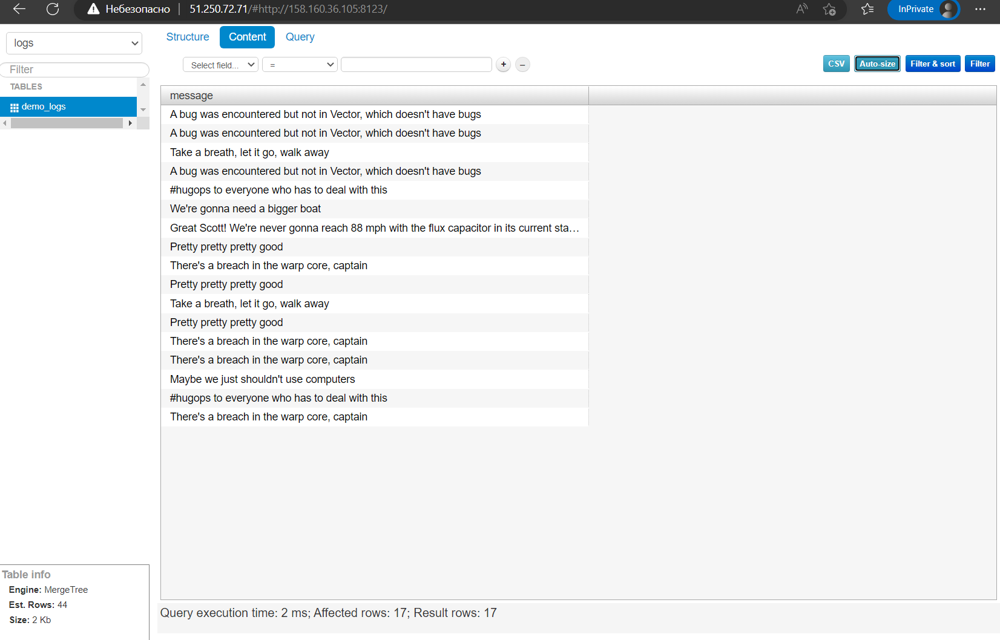

# Домашнее задание к занятию "3. Использование Yandex Cloud"

## Подготовка к выполнению

1. Подготовьте в Yandex Cloud три хоста: для `clickhouse`, для `vector` и для `lighthouse`.

Ссылка на репозиторий LightHouse: https://github.com/VKCOM/lighthouse

## Основная часть

1. Допишите playbook: нужно сделать ещё один play, который устанавливает и настраивает lighthouse.
2. При создании tasks рекомендую использовать модули: `get_url`, `template`, `yum`, `apt`.
3. Tasks должны: скачать статику lighthouse, установить nginx или любой другой webserver, настроить его конфиг для открытия lighthouse, запустить webserver.
4. Приготовьте свой собственный inventory файл `prod.yml`.
5. Запустите `ansible-lint site.yml` и исправьте ошибки, если они есть.
6. Попробуйте запустить playbook на этом окружении с флагом `--check`.
7. Запустите playbook на `prod.yml` окружении с флагом `--diff`. Убедитесь, что изменения на системе произведены.
8. Повторно запустите playbook с флагом `--diff` и убедитесь, что playbook идемпотентен.
9. Подготовьте README.md файл по своему playbook. В нём должно быть описано: что делает playbook, какие у него есть параметры и теги.
10. Готовый playbook выложите в свой репозиторий, поставьте тег `08-ansible-03-yandex` на фиксирующий коммит, в ответ предоставьте ссылку на него.

---


Шаги:
- Устанавливаем утилиту `ansible`  
    ```
    apt install software-properties-common
    apt-add-repository ppa:ansible/ansible
    apt update
    apt install ansible
    ```
- Регистрация на Яндекс Облаке по адресу `console.cloud.yandex.ru`  
- Создаём платёжный аккаунт с промо-кодом  
- Скачаем и установим утилиту `yc`  
    - `curl -sSL https://storage.yandexcloud.net/yandexcloud-yc/install.sh | bash`  
- Запустим утилиту `yc`:    
    - `yc init`  
    - Получим OAuth токен по адресу в браузере `https://oauth.yandex.ru/authorize?response_type=token&client_id=1a6990aa636648e9b2ef855fa7bec2fb`  
    - В утилите `yc`    
        - Вставим токен  
        - Выберем папку в Яндекс Облаке  
        - Выберем создание Compute по-умолчанию  
        - Выберем зону в Яндекс Облаке  
    - Проверим созданные настройки Яндекс Облака    
        - `yc config list`
            ```
            token: y0_A...
            cloud-id: b1gjd8gta6ntpckrp97r
            folder-id: b1gcthk9ak11bmpnbo7d
            compute-default-zone: ru-central1-a
            ```
- Получим IAM-токен  
    ```
    yc iam create-token
    ```
- Сохраним токен и параметры в переменную окружения  
    ```
    export YC_TOKEN=$(yc iam create-token)
    export YC_CLOUD_ID=$(yc config get cloud-id)
    export YC_FOLDER_ID=$(yc config get folder-id)
    export YC_ZONE=$(yc config get compute-default-zone)
    ```
- Сгенерируем SSH ключи на локальной машине  
    ```
    ssh-keygen
    ```
    ```
    Your public key has been saved in /root/.ssh/id_rsa.pub
    ```
- Подготавливаем `group_vars` для переменных групп хостов
    - Создаём папку `group_vars`
    - Создаём файл `clickhouse_group.yml`
        ```
        ---
        clickhouse_packages:
          - clickhouse-common-static-22.9.4.32.x86_64.rpm
          - clickhouse-server-22.9.4.32.x86_64.rpm
          - clickhouse-client-22.9.4.32.x86_64.rpm
        ```
    - Создаём файл `lighthouse_group.yml`
        ```
        ---
        lighthouse_packages: 
          - git
        ```
    - Создаём файл `nginx_group.yml`
        ```
        ---
        nginx_packages: 
          - nginx
        ```
    - Создаём файл `vector_group.yml`
        ```
        ---
        vector_packages: 
          - vector-0.25.1-1.x86_64.rpm
        ```
- Подготавливаем `inventory` для инвентарного файла
    - Создаём папку `inventory`
- Подготавливаем `templates` для шаблонов файлов конфигураций
    - Создаём папку `templates`
    - Создаём файл `config.xml.j2` конфигурация Clickhouse
        ```
        <clickhouse>
            <logger>
                <level>trace</level>
                <log>/var/log/clickhouse-server/clickhouse-server.log</log>
                <errorlog>/var/log/clickhouse-server/clickhouse-server.err.log</errorlog>
                <size>1000M</size>
                <count>10</count>
            </logger>
            <http_port>8123</http_port>
            <tcp_port>9000</tcp_port>
        ...
        ```
    - Создаём файл `nginx.conf.j2` конфигурация nginx
        ```
        user nginx;
        worker_processes auto;
        error_log /var/log/nginx/error.log;
        pid /run/nginx.pid;
        ...
        ```
    - Создаём файл `prod.yml.j2` инвентарный файл
        ```
        ---
        clickhouse_group:
          hosts:
            clickhouse-01:
              ansible_host: {{ clickhouse_vm_ip }}
              ansible_user: yc-user
              ansible_ssh_common_args: -o UserKnownHostsFile=/dev/null -o StrictHostKeyChecking=no
        ...
        ```
    - Создаём файл `vector.toml.j2` конфигруация Vector
        ```
        [sources.dummy_logs]
        type = "demo_logs"
        format = "syslog"
        interval = 30
        ...
        ```
- Подготавливаем `site.yml` для проигрывания Ansible
    - Создаём файл `site.yml`
    - Разделы файла
        - Создание виртуальных машин в Яндекс Облаке
            ```
            - name: Yandex Cloud | Configure Yandex Cloud
              hosts: localhost
              connection: local
              gather_facts: no
            ...
            ```
        - Установка `Clickhouse`
            ```
            - name: Clickhouse | Configure host clickhouse-01
              hosts: clickhouse_group
              become: true
              gather_facts: no
            ...
            ```
        - Установка `Vector`
            ```
            - name: Vector | Configure host vector-01
              hosts: vector_group
              become: true
              gather_facts: no
            ...
            ```
        - Установка `nginx`
            ```
            - name: nginx | Configure host nginx-01
              hosts: nginx_group
              become: true
              gather_facts: no
            ...
            ```
        - Установка `Lighthouse`
            ```
            - name: Lighthouse | Configure host lighthouse-01
              hosts: lighthouse_group
              become: true
              gather_facts: no
            ...
            ```
- Запускаем проигрывание в Ansible  
    `ansible-playbook site.yml`
- Проверим подключение к созданной машине `Clickhouse`
    ```
    ssh -i ~/.ssh/id_rsa yc-user@158.160.36.105
    ```
- Проверяем доступ к веб интерфейсу `Clickhouse`  
    ```
    158.160.36.105:8123/play
    ```
- Проверяем доступ к веб интерфейсу `Lighthouse` 
    ``` 
    51.250.72.71
    ```  
    Указываем адрес и порт `Clickhouse` сервера  
- Проверим логи в базе `Clickhouse` на веб сервере `Lighthouse`  
    
- Проверяем созданный инвентарный файл Ansbible  
    ```
    ./inventory/prod.yml
    ```

