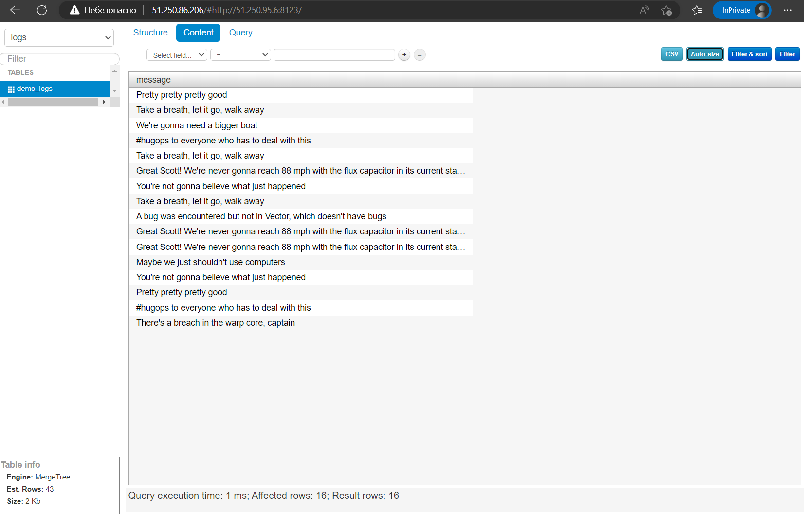

# Домашнее задание к занятию "4. Работа с roles"

## Подготовка к выполнению
1. (Необязательно) Познакомтесь с [lighthouse](https://youtu.be/ymlrNlaHzIY?t=929)
2. Создайте два пустых публичных репозитория в любом своём проекте: vector-role и lighthouse-role.
3. Добавьте публичную часть своего ключа к своему профилю в github.

## Основная часть

Наша основная цель - разбить наш playbook на отдельные roles. Задача: сделать roles для clickhouse, vector и lighthouse и написать playbook для использования этих ролей. Ожидаемый результат: существуют три ваших репозитория: два с roles и один с playbook.

1. Создать в старой версии playbook файл `requirements.yml` и заполнить его следующим содержимым:

   ```yaml
   ---
     - src: git@github.com:AlexeySetevoi/ansible-clickhouse.git
       scm: git
       version: "1.11.0"
       name: clickhouse 
   ```

2. При помощи `ansible-galaxy` скачать себе эту роль.
3. Создать новый каталог с ролью при помощи `ansible-galaxy role init vector-role`.
4. На основе tasks из старого playbook заполните новую role. Разнесите переменные между `vars` и `default`. 
5. Перенести нужные шаблоны конфигов в `templates`.
6. Описать в `README.md` обе роли и их параметры.
7. Повторите шаги 3-6 для lighthouse. Помните, что одна роль должна настраивать один продукт.
8. Выложите все roles в репозитории. Проставьте тэги, используя семантическую нумерацию Добавьте roles в `requirements.yml` в playbook.
9. Переработайте playbook на использование roles. Не забудьте про зависимости lighthouse и возможности совмещения `roles` с `tasks`.
10. Выложите playbook в репозиторий.
11. В ответ приведите ссылки на оба репозитория с roles и одну ссылку на репозиторий с playbook.

---

Шаги:
- Устанавливаем утилиту `ansible`  
    ```
    apt install software-properties-common
    apt-add-repository ppa:ansible/ansible
    apt update
    apt install ansible
    ```
- Регистрация на Яндекс Облаке по адресу `console.cloud.yandex.ru`  
- Создаём платёжный аккаунт с промо-кодом  
- Скачаем и установим утилиту `yc`  
    - `curl -sSL https://storage.yandexcloud.net/yandexcloud-yc/install.sh | bash`  
- Запустим утилиту `yc`:    
    - `yc init`  
    - Получим OAuth токен по адресу в браузере `https://oauth.yandex.ru/authorize?response_type=token&client_id=1a6990aa636648e9b2ef855fa7bec2fb`  
    - В утилите `yc`    
        - Вставим токен  
        - Выберем папку в Яндекс Облаке  
        - Выберем создание Compute по-умолчанию  
        - Выберем зону в Яндекс Облаке  
    - Проверим созданные настройки Яндекс Облака    
        - `yc config list`
            ```
            token: y0_A...
            cloud-id: b1gjd8gta6ntpckrp97r
            folder-id: b1gcthk9ak11bmpnbo7d
            compute-default-zone: ru-central1-a
            ```
- Получим IAM-токен  
    ```
    yc iam create-token
    ```
- Сохраним токен и параметры в переменную окружения  
    ```
    export YC_TOKEN=$(yc iam create-token)
    export YC_CLOUD_ID=$(yc config get cloud-id)
    export YC_FOLDER_ID=$(yc config get folder-id)
    export YC_ZONE=$(yc config get compute-default-zone)
    ```
- Сгенерируем SSH ключи на локальной машине  
    ```
    ssh-keygen
    ```
    ```
    Your public key has been saved in /root/.ssh/id_rsa.pub
    ```
- Создаём каркас ролей
    ```
    mkdir roles/
    cd roles/
    ansible-galaxy role init yandex-cloud
    ansible-galaxy role init clickhouse
    ansible-galaxy role init vector
    ansible-galaxy role init lighthouse
    ```
- Подготавливаем `group_vars` для переменных групп хостов
    - Создаём папку `group_vars`
    - Создаём файл `clickhouse_group.yml`
        ```
        ---
        clickhouse_packages:
          - clickhouse-common-static-22.9.4.32.x86_64.rpm
          - clickhouse-server-22.9.4.32.x86_64.rpm
          - clickhouse-client-22.9.4.32.x86_64.rpm
        ```
    - Создаём файл `lighthouse_group.yml`
        ```
        ---
        nginx_packages: 
          - nginx
          - policycoreutils-python-utils
        lighthouse_packages: 
          - git
        ```
    - Создаём файл `vector_group.yml`
        ```
        ---
        vector_packages: 
          - vector-0.25.1-1.x86_64.rpm
        ```
- Подготавливаем `inventory` для инвентарного файла
    - Создаём папку `inventory`
- Подготавливаем роли в папке `roles`
    - Роль `clickhouse`
        - Задачи в `tastks/main.yml`
            ```
            ---
            # tasks file for clickhouse
            - name: Clickhouse | Wait for SSH banners
              wait_for_connection:
                delay: 5
                timeout: 180
              when: create_clickhouse | bool
            ...
            ```
        - Шаблон в `templates/config.xml.j2`
            ```
            <clickhouse>
                <logger>
                    <level>trace</level>
                    <log>/var/log/clickhouse-server/clickhouse-server.log</log>
                    <errorlog>/var/log/clickhouse-server/clickhouse-server.err.log</errorlog>
                    <size>1000M</size>
                    <count>10</count>
                </logger>
            ...
            ```
    - Роль `lighthouse`
        - Переменные в `defaults/main.yml`
            ```
            ---
            # defaults file for lighthouse
            lighthouse_path: /usr/share/nginx/html
            ```
        - Задачи в `tasks/main.yml`
            ```
            ---
            # tasks file for lighthouse
            - name: nginx | Wait for SSH banners
              wait_for_connection:
                delay: 5
                timeout: 180
              when: create_lighthouse | bool
            ...
            ```
        - Шаблон в `temlpates/nginx.conf.j2`
            ```
            user nginx;
            worker_processes auto;
            error_log /var/log/nginx/error.log;
            pid /run/nginx.pid;
            ...
            ```
    - Роль `vector`
        - Задачи в `tasks/main.yml`
            ```
            ---
            # tasks file for vector
            - name: Vector | Wait for SSH banners
              wait_for_connection:
                delay: 5
                timeout: 180
              when: create_vector | bool
            ...
            ```
        - Шаблон в `temlpates/vector.toml.j2`
            ```
            [sources.dummy_logs]
            type = "demo_logs"
            format = "syslog"
            interval = 30
            ...
            ```
    - Роль `yandex-cloud`
        - Переменные в `defaults/main.yml`
            ```
            ---
            # defaults file for yandex-cloud
            yandex_zone: ru-central1-a
            yandex_image: almalinux-8
            yandex_user: yc-user
            ```
        - Задачи в `tasks/main.yml`
            ```
            ---
            # tasks file for yandex-cloud
            #### Network
            - name: Localhost | Yandex Cloud Create network
              ansible.builtin.command: "yc vpc network create --name network-01 --format json"
              register: network_created
              when: create_network | bool
            ...
            ```
        - Задачи в `tasks/create-vm.yml`
            ```
            - name: Localhost | Yandex Cloud Create machine {{ vm_name }}
              ansible.builtin.command: "yc compute instance create --name {{ vm_name }} --zone {{ yandex_zone }} --network-interface subnet-name=subnet-01,nat-ip-version=ipv4 --create-boot-disk image-folder-id=standard-images,image-family={{ yandex_image }} --ssh-key ~/.ssh/id_rsa.pub --format json"
              register: "vm_created_output"
            ...
            ```
        - Шаблон в `templates/prod.yml.j2`
            ```
            ---
            clickhouse_group:
              hosts:
                clickhouse:
                  ansible_host: {{ clickhouse_vm_ip }}
                  ansible_user: yc-user
                  ansible_ssh_common_args: -o UserKnownHostsFile=/dev/null -o StrictHostKeyChecking=no
            ...
            ```
- Подготавливаем `site.yml` для проигрывания Ansible
    - Создаём файл `site.yml`
    - Файл включает в себя импорт созданных ролей
- Запускаем проигрывание в Ansible  
    `ansible-playbook site.yml`
- Проверим подключение к созданной машине `Clickhouse`
    ```
    ssh -i ~/.ssh/id_rsa yc-user@51.250.95.6
    ```
- Проверяем доступ к веб интерфейсу `Clickhouse`  
    ```
    51.250.95.6:8123/play
    ```
- Проверяем доступ к веб интерфейсу `Lighthouse` 
    ``` 
    51.250.86.206
    ```  
    Указываем адрес и порт `Clickhouse` сервера  
- Проверим логи в базе `Clickhouse` на веб сервере `Lighthouse`  
    
- Проверяем созданный инвентарный файл Ansbible  
    ```
    ./inventory/prod.yml
    ```
