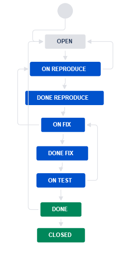
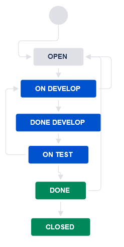

# Домашнее задание к занятию "7.Жизненный цикл ПО"

## Подготовка к выполнению
1. Получить бесплатную [JIRA](https://www.atlassian.com/ru/software/jira/free)
2. Настроить её для своей "команды разработки"
3. Создать доски kanban и scrum

## Основная часть
В рамках основной части необходимо создать собственные workflow для двух типов задач: bug и остальные типы задач. Задачи типа bug должны проходить следующий жизненный цикл:
1. Open -> On reproduce
2. On reproduce -> Open, Done reproduce
3. Done reproduce -> On fix
4. On fix -> On reproduce, Done fix
5. Done fix -> On test
6. On test -> On fix, Done
7. Done -> Closed, Open

Остальные задачи должны проходить по упрощённому workflow:
1. Open -> On develop
2. On develop -> Open, Done develop
3. Done develop -> On test
4. On test -> On develop, Done
5. Done -> Closed, Open

Создать задачу с типом bug, попытаться провести его по всему workflow до Done. Создать задачу с типом epic, к ней привязать несколько задач с типом task, провести их по всему workflow до Done. При проведении обеих задач по статусам использовать kanban. Вернуть задачи в статус Open.
Перейти в scrum, запланировать новый спринт, состоящий из задач эпика и одного бага, стартовать спринт, провести задачи до состояния Closed. Закрыть спринт.

Если всё отработало в рамках ожидания - выгрузить схемы workflow для импорта в XML. Файлы с workflow приложить к решению задания.

---

Шаги:
- Зарегистрируемся в Jira
- Создадим проект типа Kanban и Company manged
- Добавим доску типа Scrum в существующий проект
- Создадим новый bug workflow
    - Свойства проекта -> Workflows
    - Add worflow -> Create new
    - Name: bug workflow
    - Добавив на диаграмму bug workflow статусы
        - Open
        - On reproduce
        - Done reproduce
        - On fix
        - Done fix
        - On test
        - Done
        - Closed
    - Добавим на диаграмму переходы между статусами
    
- Создадим новый all workflow
    - Свойства проекта -> Workflows
    - Add worflow -> Create new
    - Name: all workflow
    - Добавив на диаграмму all workflow статусы
        - Open
        - On develop
        - Done develop
        - On test
        - Done
        - Closed
    - Добавим на диаграмму переходы между статусами
    
- Привяжем workflow к типу задачи
    - Свойства проекта -> Workflows -> Add existing workflow
    - Выберем Bug workflow для типа bug
    - Выберем all workflow для остальных типов
    - Опубликуем новую схему нажав Publish
- Выберем Kanban доску
- Распределим статусы по Kanban доске
    - Зайдём в свойства доски -> Колонки
    - Добавим созданные статусы в колонки
- Создадим задачи с разными типами и проведём их через статусы
- Выберем Scrum доску
- Распределим статусы по Kanban доске
    - Зайдём в свойства доски -> Колонки
    - Добавим созданные статусы в колонки
- Создадим спринт и добавим в него задачи
- Проведём задачи по спринту
- Экспортируем workflow через свойства
    [Bug workflow.xml](Bug workflow.xml)
    [all workflow.xml](all workflow.xml)

