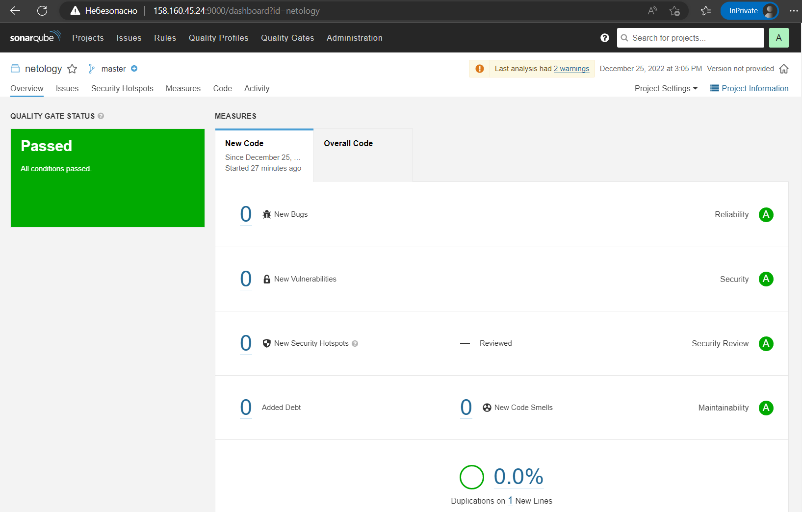

# Домашнее задание к занятию "9.Процессы CI/CD"

## Подготовка к выполнению

1. Создаём 2 VM в yandex cloud со следующими параметрами: 2CPU 4RAM Centos7(остальное по минимальным требованиям)
2. Прописываем в [inventory](./infrastructure/inventory/cicd/hosts.yml) [playbook'a](./infrastructure/site.yml) созданные хосты
3. Добавляем в [files](./infrastructure/files/) файл со своим публичным ключом (id_rsa.pub). Если ключ называется иначе - найдите таску в плейбуке, которая использует id_rsa.pub имя и исправьте на своё
4. Запускаем playbook, ожидаем успешного завершения
5. Проверяем готовность Sonarqube через [браузер](http://localhost:9000)
6. Заходим под admin\admin, меняем пароль на свой
7.  Проверяем готовность Nexus через [бразуер](http://localhost:8081)
8. Подключаемся под admin\admin123, меняем пароль, сохраняем анонимный доступ

## Знакомоство с SonarQube

### Основная часть

1. Создаём новый проект, название произвольное
2. Скачиваем пакет sonar-scanner, который нам предлагает скачать сам sonarqube
3. Делаем так, чтобы binary был доступен через вызов в shell (или меняем переменную PATH или любой другой удобный вам способ)
4. Проверяем `sonar-scanner --version`
5. Запускаем анализатор против кода из директории [example](./example) с дополнительным ключом `-Dsonar.coverage.exclusions=fail.py`
6. Смотрим результат в интерфейсе
7. Исправляем ошибки, которые он выявил(включая warnings)
8. Запускаем анализатор повторно - проверяем, что QG пройдены успешно
9. Делаем скриншот успешного прохождения анализа, прикладываем к решению ДЗ

## Знакомство с Nexus

### Основная часть

1. В репозиторий `maven-public` загружаем артефакт с GAV параметрами:
   1. groupId: netology
   2. artifactId: java
   3. version: 8_282
   4. classifier: distrib
   5. type: tar.gz
2. В него же загружаем такой же артефакт, но с version: 8_102
3. Проверяем, что все файлы загрузились успешно
4. В ответе присылаем файл `maven-metadata.xml` для этого артефекта

### Знакомство с Maven

### Подготовка к выполнению

1. Скачиваем дистрибутив с [maven](https://maven.apache.org/download.cgi)
2. Разархивируем, делаем так, чтобы binary был доступен через вызов в shell (или меняем переменную PATH или любой другой удобный вам способ)
3. Удаляем из `apache-maven-<version>/conf/settings.xml` упоминание о правиле, отвергающем http соединение( раздел mirrors->id: my-repository-http-unblocker)
4. Проверяем `mvn --version`
5. Забираем директорию [mvn](./mvn) с pom

### Основная часть

1. Меняем в `pom.xml` блок с зависимостями под наш артефакт из первого пункта задания для Nexus (java с версией 8_282)
2. Запускаем команду `mvn package` в директории с `pom.xml`, ожидаем успешного окончания
3. Проверяем директорию `~/.m2/repository/`, находим наш артефакт
4. В ответе присылаем исправленный файл `pom.xml`

---

## Шаги:
- Устанавливаем `ansible`  
    ```
    apt install software-properties-common
    apt-add-repository ppa:ansible/ansible
    apt update
    apt install ansible
    ```
- Регистрируемся на Яндекс Облаке по адресу `console.cloud.yandex.ru`  
- Создаём платёжный аккаунт с промо-кодом  
- Скачаем и установим утилиту `yc`  
    - `curl -sSL https://storage.yandexcloud.net/yandexcloud-yc/install.sh | bash`  
- Запустим утилиту `yc`:    
    - `yc init`  
    - Получаем OAuth токен по адресу в браузере `https://oauth.yandex.ru/authorize?response_type=token&client_id=1a6990aa636648e9b2ef855fa7bec2fb`  
    - В утилите `yc`    
        - Вставим токен  
        - Выберем папку в Яндекс Облаке  
        - Выберем создание Compute по-умолчанию  
        - Выберем зону в Яндекс Облаке  
    - Проверим созданные настройки Яндекс Облака    
        - `yc config list`
            ```
            token: y0_A...
            cloud-id: b1gjd8gta6ntpckrp97r
            folder-id: b1gcthk9ak11bmpnbo7d
            compute-default-zone: ru-central1-a
            ```
- Получаем IAM-токен  
    ```
    yc iam create-token
    ```
- Сохраняем токен и параметры в переменную окружения  
    ```
    export YC_TOKEN=$(yc iam create-token)
    export YC_CLOUD_ID=$(yc config get cloud-id)
    export YC_FOLDER_ID=$(yc config get folder-id)
    export YC_ZONE=$(yc config get compute-default-zone)
    ```
- Сгенерируем SSH ключи на локальной машине  
    ```
    ssh-keygen
    ```
    ```
    Your public key has been saved in /root/.ssh/id_rsa.pub
    ```
- Создаём виртуальные машины в Яндекс Облаке
    - Укажем пользователя ansible при создании машины
    - Укажем публичный ключ при создании машины
    - sonar-01: 158.160.45.24
    - nexus-01: 158.160.32.193
- Подключаемся к хостам, чтобы добавить SSH ключи в доверенные на локальной машине
    - ssh ansible@158.160.45.24
    - ssh ansible@158.160.32.193
- Пропишем в файле `infrastructure/inventory/hosts.yml` адреса машин и пользователя ansible
    ```
    ansible_host: 158.160.45.24
    ansible_host: 158.160.32.193
    ansible_user: ansible
    ``` 
- Скопируем публичный ключ SSH в папку `infrastructure/files/id_rsa.pub`
- Запустим проигрывание в Ansible
    `ansible-playbook -i inventory/cicd/hosts.yml site.yml`
- Открываем в браузере
    - sonar: http://158.160.45.24:9000/
        - admin\admin
        - меняем пароль на 1a6990aa636648e9b2ef855fa7bec2fb
    - nexus: http://158.160.32.193:8081/
        - admin\admin123
        - меняем пароль на 1a6990aa636648e9b2ef855fa7bec2fb

### SonarQube
- Создаём проект выбрав в меню `Projects / Manually`
- Назовём проект netology
- Загрузим проект локально
- Создаём токен netology
    - 5c200635a69321679d9f24cd88ddb7d6d5bf1543
- Скачиваем сканер для Python на платформе Linux
    `wget https://binaries.sonarsource.com/Distribution/sonar-scanner-cli/sonar-scanner-cli-4.7.0.2747-linux.zip`
- Распаковываем SonarScanner
    ```
    unzip sonar-scanner-cli-4.7.0.2747-linux.zip -d /usr/local/bin
    ln -s /usr/local/bin/sonar-scanner-4.7.0.2747-linux/bin/sonar-scanner /usr/local/bin/sonar-scanner
    ```
- Проверяем версию
    `sonar-scanner --version`
- Запускаем анализатор кода
    ```
    cd example
    sonar-scanner -Dsonar.projectKey=netology -Dsonar.sources=. -Dsonar.host.url=http://158.160.45.24:9000 -Dsonar.login=5c200635a69321679d9f24cd88ddb7d6d5bf1543 -Dsonar.coverage.exclusions=fail.py
    ```
    ```
    ...
    INFO: ANALYSIS SUCCESSFUL, you can browse http://158.160.45.24:9000/dashboard?id=netology
    ...
    ```
- Проверяем результат тестирование на странице Sonar
- Отредактируем файл `example/fail.py` и проведём тест повторно


### Nexus
- Загружаем артефакт выбрав в меню `Browse / Upload / maven-releases`
- Скачаем файл `Browse / maven-releases / netology / java / maven-metadata.xml` по адресу `http://158.160.32.193:8081/repository/maven-releases/netology/java/maven-metadata.xml`
* [maven-metadata.xml](maven-metadata.xml)

### Maven
- Устанавливаем Java
    ```
    wget https://download.java.net/java/GA/jdk13.0.1/cec27d702aa74d5a8630c65ae61e4305/9/GPL/openjdk-13.0.1_linux-x64_bin.tar.gz
    tar -xvf openjdk-13.0.1_linux-x64_bin.tar.gz
    cp -r jdk-13.0.1 /usr/local/bin
    chmod -R 777 jdk-13.0.1
    rm -rf jdk-13.0.1
    echo "export JAVA_HOME=/usr/local/bin/jdk-13.0.1" >> ~/.profile
    echo "export PATH=$PATH:/usr/local/bin/jdk-13.0.1/bin/" >> ~/.profile
    . ~/.profile
    java -version
    ```
- Скачиваем Maven
    ```
    wget https://dlcdn.apache.org/maven/maven-3/3.8.6/binaries/apache-maven-3.8.6-bin.zip
    ```
- Распаковываем Maven
    ```
    unzip apache-maven-3.8.6-bin.zip -d /usr/local/bin
    ```
- Устанавливаем Maven
    ```
    echo "export M2_HOME=/usr/local/bin/apache-maven-3.8.6" >> ~/.profile
    . ~/.profile
    ln -s /usr/local/bin/apache-maven-3.8.6/bin/mvn /usr/local/bin/mvn
    ```
- Удаляем блок в файле `/usr/local/bin/apache-maven-3.8.6/conf/settings.xml`
- Проверяем версию Maven
    `mvn --version`
- Редактируем файл `mvn/pom.xml`
- Запускаем команду
    ```
    cd mvn
    mvn package
    ```
- Проверим директорию
    ```
    ls -la ~/.m2/repository/netology/java/8_282/
    total 24
    drwxr-xr-x 2 root root 4096 Dec 25 13:23 .
    drwxr-xr-x 3 root root 4096 Dec 25 13:23 ..
    -rw-r--r-- 1 root root    1 Dec 25 13:23 java-8_282-distrib.tar.gz
    -rw-r--r-- 1 root root   40 Dec 25 13:23 java-8_282-distrib.tar.gz.sha1
    -rw-r--r-- 1 root root  392 Dec 25 13:23 java-8_282.pom.lastUpdated
    -rw-r--r-- 1 root root  175 Dec 25 13:23 _remote.repositories
    ```
* [pom.xml](mvn/pom.xml)
