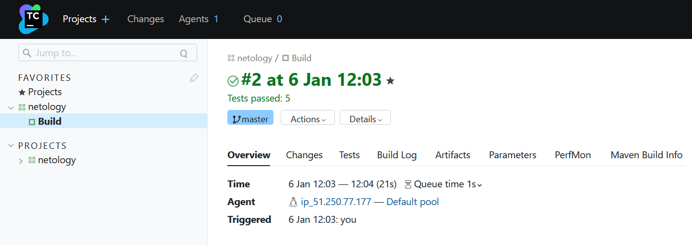
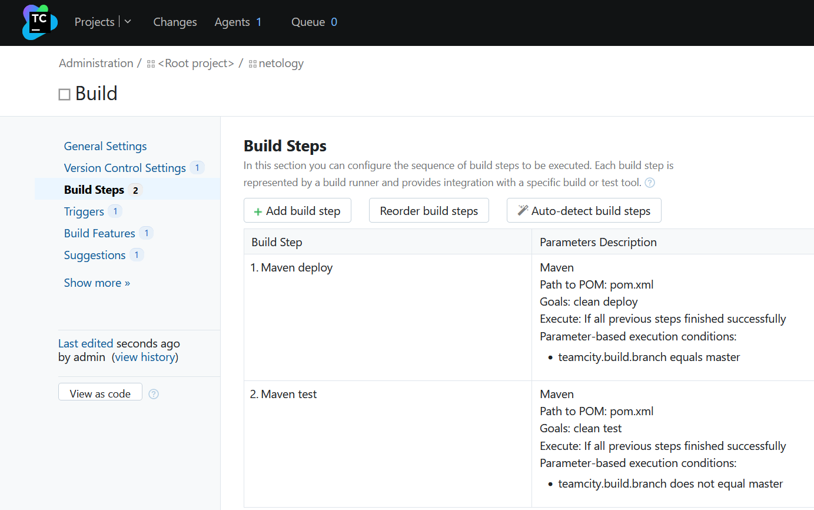
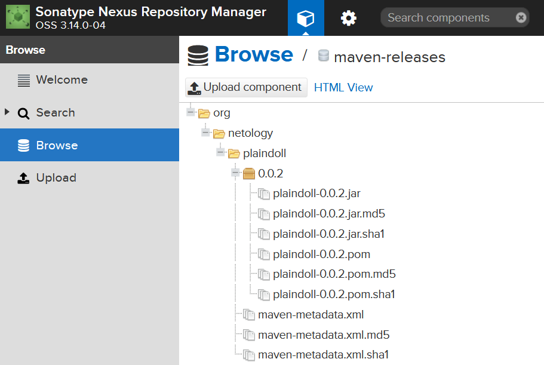
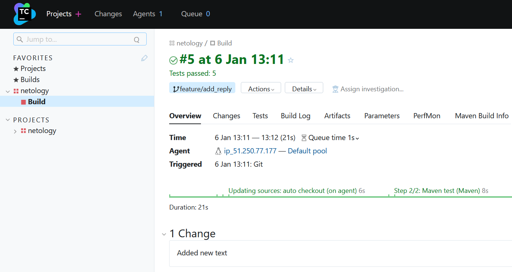
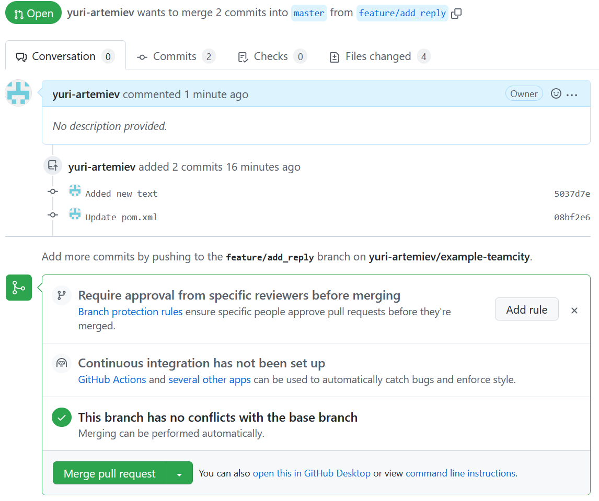
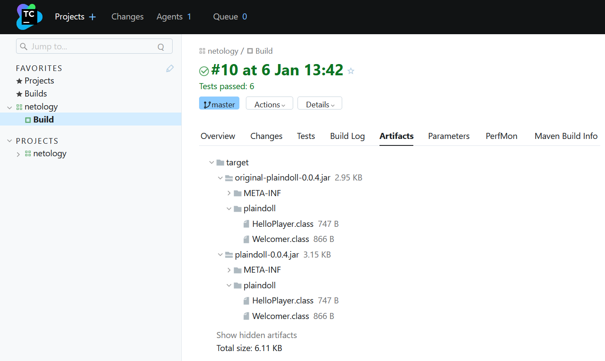
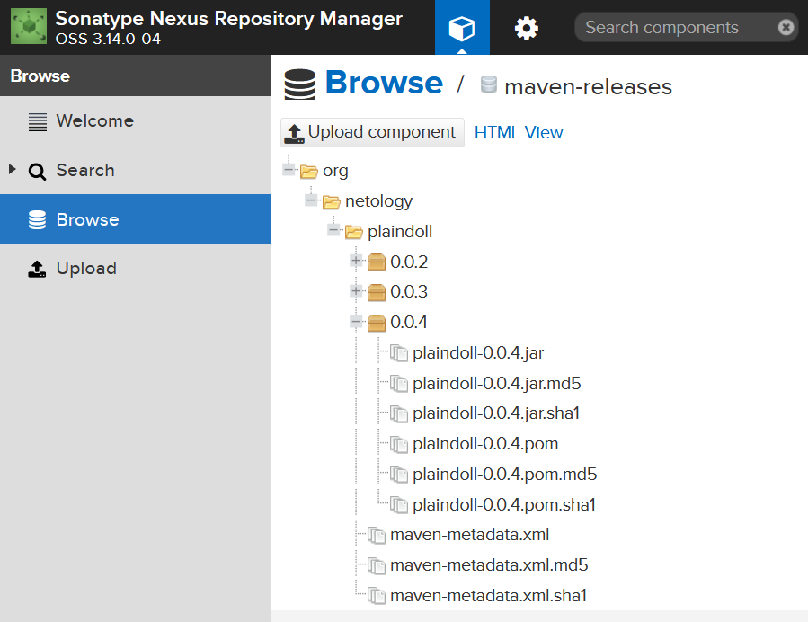

# Домашнее задание к занятию "11.Teamcity"

## Подготовка к выполнению

1. В Ya.Cloud создайте новый инстанс (4CPU4RAM) на основе образа `jetbrains/teamcity-server`
2. Дождитесь запуска teamcity, выполните первоначальную настройку
3. Создайте ещё один инстанс(2CPU4RAM) на основе образа `jetbrains/teamcity-agent`. Пропишите к нему переменную окружения `SERVER_URL: "http://<teamcity_url>:8111"`
4. Авторизуйте агент
5. Сделайте fork [репозитория](https://github.com/aragastmatb/example-teamcity)
6. Создать VM (2CPU4RAM) и запустить [playbook](./infrastructure)

## Основная часть

1. Создайте новый проект в teamcity на основе fork
2. Сделайте autodetect конфигурации
3. Сохраните необходимые шаги, запустите первую сборку master'a
4. Поменяйте условия сборки: если сборка по ветке `master`, то должен происходит `mvn clean deploy`, иначе `mvn clean test`
5. Для deploy будет необходимо загрузить [settings.xml](./teamcity/settings.xml) в набор конфигураций maven у teamcity, предварительно записав туда креды для подключения к nexus
6. В pom.xml необходимо поменять ссылки на репозиторий и nexus
7. Запустите сборку по master, убедитесь что всё прошло успешно, артефакт появился в nexus
8. Мигрируйте `build configuration` в репозиторий
9. Создайте отдельную ветку `feature/add_reply` в репозитории
10. Напишите новый метод для класса Welcomer: метод должен возвращать произвольную реплику, содержащую слово `hunter`
11. Дополните тест для нового метода на поиск слова `hunter` в новой реплике
12. Сделайте push всех изменений в новую ветку в репозиторий
13. Убедитесь что сборка самостоятельно запустилась, тесты прошли успешно
14. Внесите изменения из произвольной ветки `feature/add_reply` в `master` через `Merge`
15. Убедитесь, что нет собранного артефакта в сборке по ветке `master`
16. Настройте конфигурацию так, чтобы она собирала `.jar` в артефакты сборки
17. Проведите повторную сборку мастера, убедитесь, что сбора прошла успешно и артефакты собраны
18. Проверьте, что конфигурация в репозитории содержит все настройки конфигурации из teamcity
19. В ответ предоставьте ссылку на репозиторий

---

## Шаги:
- Устанавливаем `ansible`  
    ```
    apt install software-properties-common
    apt-add-repository ppa:ansible/ansible
    apt update
    apt install ansible
    ```
- Регистрируемся на Яндекс Облаке по адресу `console.cloud.yandex.ru`  
- Создаём платёжный аккаунт с промо-кодом  
- Скачаем и установим утилиту `yc`  
    - `curl -sSL https://storage.yandexcloud.net/yandexcloud-yc/install.sh | bash`  
- Запустим утилиту `yc`:    
    - `yc init`  
    - Получаем OAuth токен по адресу в браузере `https://oauth.yandex.ru/authorize?response_type=token&client_id=1a6990aa636648e9b2ef855fa7bec2fb`  
    - В утилите `yc`    
        - Вставим токен  
        - Выберем папку в Яндекс Облаке  
        - Выберем создание Compute по-умолчанию  
        - Выберем зону в Яндекс Облаке  
    - Проверим созданные настройки Яндекс Облака    
        - `yc config list`
            ```
            token: y0_A...
            cloud-id: b1gjd8gta6ntpckrp97r
            folder-id: b1gcthk9ak11bmpnbo7d
            compute-default-zone: ru-central1-a
            ```
- Получаем IAM-токен  
    ```
    yc iam create-token
    ```
- Сохраняем токен и параметры в переменную окружения  
    ```
    export YC_TOKEN=$(yc iam create-token)
    export YC_CLOUD_ID=$(yc config get cloud-id)
    export YC_FOLDER_ID=$(yc config get folder-id)
    export YC_ZONE=$(yc config get compute-default-zone)
    ```
- Сгенерируем SSH ключи на локальной машине  
    ```
    ssh-keygen
    ```
    ```
    Your public key has been saved in /root/.ssh/id_rsa.pub
    ```
- Создаём контейнер `Teamcity Server` в Яндекс Облаке
    - Укажем образ jetbrains/teamcity-server
    - Укажем пользователя ansible при создании контейнера
    - Укажем публичный ключ при создании контейнера
    - teamcity-server: 158.160.44.39
- Создаём контейнер `Teamcity Agent` в Яндекс Облаке
    - Укажем образ jetbrains/teamcity-agent
    - Укажем переменную окружения `SERVER_URL: http://158.160.44.39:8111`
    - Укажем пользователя ansible при создании контейнера
    - Укажем публичный ключ при создании контейнера
    - teamcity-agent: 51.250.77.177
- Создаём виртуальную машину `Nexus` в Яндекс Облаке
    - Укажем пользователя ansible при создании машины
    - Укажем публичный ключ при создании машины
    - nexus: 62.84.126.44
- Подключаемся к хостам, чтобы добавить SSH ключи в доверенные на локальной машине
    - teamcity-server: `ssh ansible@158.160.44.39`
    - teamcity-agent: `ssh ansible@51.250.77.177`
    - nexus: `ssh ansible@62.84.126.44`
- Пропишем в файле `infrastructure/inventory/cicd/hosts.yml` адрес машины nexus и пользователя ansible
    ```
    ansible_host: 62.84.126.44
    ansible_user: ansible
    ``` 
- Запустим проигрывание в Ansible  
    - `ansible-playbook -i inventory/cicd/hosts.yml site.yml`
- Проведём первичную настройку Teamcity Server
    - В веб браузере откроем панель управления Teamcity `http://158.160.44.39:8111`
    - Выбираем использовать внутреннюю базу данных
    - Создаём пользователя admin / 1a6990aa636648e9b2ef855fa7bec2fb
    - Создадим проект нажав Create project / Manually
- Авторизуем агента Teamcity
    - В панели управления Teamcity Server выберем Agents / Unauthorized
    - Выберем агента и нажмём Authorize
- Создадим форк репозитория `example-teamcity`
    - В веб бразуере откроем репозиторий https://github.com/aragastmatb/example-teamcity
    - Выберем Create a new fork
    - Оставим настройки по умолчанию
    - Нажмём Create fork
    - Адрес форка репозитория: https://github.com/yuri-artemiev/example-teamcity
- Добавим доступ Teamcity к репозиторию
    - На локальной машине сохраним приватный ключ `/root/.ssh/id_rsa`
    - Откроем панель управления Teamcity Server / Root project / SSH keys / Upload SSH key / выберем сохранённый приватный ключ
    - На локальной машине сохраним приватный ключ `/root/.ssh/id_rsa.pub`
    - В веб браузере откроем настройки GitHub аккаунта / SSH and GPG keys / New SSH key / Вставим публичный ключ в поле key
    - В веб браузере форка репозитория нажмём Code / SSH / Copy URL
        - `git@github.com:yuri-artemiev/example-teamcity.git`
- Создадим конфигурацию сборки в Teamcity
    - В панели управления Teamcity Server выберем созданный проект
    - В настройках проекта выберем New build configuration / From repository
        - Repository URL: `git@github.com:yuri-artemiev/example-teamcity.git`
        - Username: `git`
        - Token: публичный ключ
    - Подождём завершение сканирования репозитория
    - Выберем Build step: `Maven`
    - Сохраним конфигурацию
- Поменяем доступ к Nexus
    - В веб бразуере откроем панель управления nexus http://62.84.126.44:8081/
    - Зайдём под пользователем admin\admin123
    - Поменяем пароль на 1a6990aa636648e9b2ef855fa7bec2fb
- В форке репозитория изменим адрес nexus
    - Отредактируем файл [pom.xml](pom.xml)
        ```
        <url>http://62.84.126.44:8081/repository/maven-releases</url>
        ```
- Проверим сборку в Teamcity
    - В панели управления Teamcity Server / в настройках проекта выберем Go to build configuration
    - Запустим сборку выбрав Run
    
- Изменим настройки срабатывания сборок в Teamcity
    - В панели управления Teamcity Server / Projects / netology / Build / Edit configuration / Build Steps
    - Сделаем два шага сборки добавив условие
    - Edit / Add condition
        - teamcity.build.branch equals master
            - Goals: clean deploy
        - teamcity.build.branch does not equal master
            - Goals: clean test

    
- Отредактируем настройки подключения Teamcity к Nexus
    - В [settings.xml](teamcity/settings.xml) файле укажем верные данные
        - `<password>1a6990aa636648e9b2ef855fa7bec2fb</password>`
    - В панели управления Teamcity Server / Projects / netology / Maven Settings / Upload settings file
    - Загрузим отредактированный файл settings.xml
    - В панели управления Teamcity Server / Projects / netology / Build / Edit configuration /  Build Steps / Maven deploy
    - В User settings selection выберем settings.xml
- Запустим новую сборку в Teamcity
    - В панели управления Teamcity Server / Projects / netology / Build 
    - Нажмём кнопку Run
    - Дождёмся окончания сборки
    - Проверем загрузку артефактов в Nexus
        - В панели управления Nexus зайдём в Browse / maven-releases
            
- Сохраним настройки проекта Teamcity в репозитории GitHub
    - В панели управления Teamcity Server / Projects / netology / Edit Project / Versioned Settings
    - Выберем Synchronization enabled
        - VCS root: `git@github.com:yuri-artemiev/example-teamcity.git#refs/heads/master`
- Создадим ветку feature/add_reply в форке репозитория
- Сделаем изменения в новой ветке
    - src/main/java/plaindoll/HelloPlayer.java
        - `System.out.println(welcomer.sayNewText());`
    - src/main/java/plaindoll/Welcomer.java
        ```
        public String sayNewText(){
            return "This is a new text in branch, hunter.";
        }
        ```
    - src/test/java/plaindoll/WelcomerTest.java
        ```
        @Test
        public void welcomerSaysNewText(){
            assertThat(welcomer.sayNewText(), containsString("text"));
        }
        ```
    - Сделаем пуш изменений в новую ветку
- Проверим что Teamcity провёл тесты
    - В панели управления Teamcity Server / Projects / netology / Build 
        
- Изменим версию приложения в новой ветке форка репозитория
    - Отредактируем файл pom.xml 
        ```
        <version>0.0.3</version>
        ```
- Создадим запрос на внедрение изменений в ветку master в репозитории
    - `https://github.com/yuri-artemiev/example-teamcity/pull/1`
    - Выберем Merge pull request / Confirm merge чтобы применить изменения в основную ветку

        
- Настроим конфигурацию сборки в Teamcity
    - В панели управления Teamcity Server / Projects / netology / Build / Edit configuration / General settings
    - Укажем в Artifact paths: `target/*.jar => target`
- Запустим сборку проекта в Teamcity
- Проверим наличие артефактов
    - Teamcity
        
    - Nexus
        

[Репозиторий example-teamcity](https://github.com/yuri-artemiev/example-teamcity)
