# Домашнее задание к занятию "12.Gitlab"

## Подготовка к выполнению

1. Необходимо [подготовить gitlab к работе по инструкции](https://cloud.yandex.ru/docs/tutorials/infrastructure-management/gitlab-containers)
2. Создайте свой новый проект
3. Создайте новый репозиторий в gitlab, наполните его [файлами](./repository)
4. Проект должен быть публичным, остальные настройки по желанию

## Основная часть

### DevOps

В репозитории содержится код проекта на python. Проект - RESTful API сервис. Ваша задача автоматизировать сборку образа с выполнением python-скрипта:
1. Образ собирается на основе [centos:7](https://hub.docker.com/_/centos?tab=tags&page=1&ordering=last_updated)
2. Python версии не ниже 3.7
3. Установлены зависимости: `flask` `flask-jsonpify` `flask-restful`
4. Создана директория `/python_api`
5. Скрипт из репозитория размещён в /python_api
6. Точка вызова: запуск скрипта
7. Если сборка происходит на ветке `master`: должен подняться pod kubernetes на основе образа `python-api`, иначе этот шаг нужно пропустить

### Product Owner

Вашему проекту нужна бизнесовая доработка: необходимо поменять JSON ответа на вызов метода GET `/rest/api/get_info`, необходимо создать Issue в котором указать:
1. Какой метод необходимо исправить
2. Текст с `{ "message": "Already started" }` на `{ "message": "Running"}`
3. Issue поставить label: feature

### Developer

Вам пришел новый Issue на доработку, вам необходимо:
1. Создать отдельную ветку, связанную с этим issue
2. Внести изменения по тексту из задания
3. Подготовить Merge Requst, влить необходимые изменения в `master`, проверить, что сборка прошла успешно


### Tester

Разработчики выполнили новый Issue, необходимо проверить валидность изменений:
1. Поднять докер-контейнер с образом `python-api:latest` и проверить возврат метода на корректность
2. Закрыть Issue с комментарием об успешности прохождения, указав желаемый результат и фактически достигнутый

## Итог

В качестве ответа предоставьте подробные скриншоты по каждому пункту задания:
- файл gitlab-ci.yml,
- Dockerfile, 
- лог успешного выполнения пайплайна,
- решенный Issue.

### :bangbang: После выполнения задания выключите и удалите все задействованные ресурсы в Yandex.Cloud.

## Необязательная часть

Автомазируйте работу тестировщика, пусть у вас будет отдельный конвейер, который автоматически поднимает контейнер и выполняет проверку, например, при помощи curl. На основе вывода - будет приниматься решение об успешности прохождения тестирования


---

## Шаги:
- Регистрируемся на Яндекс Облаке по адресу `console.cloud.yandex.ru`  
- Создаём платёжный аккаунт с промо-кодом  
- Скачаем и установим утилиту `yc`  
    - `curl -sSL https://storage.yandexcloud.net/yandexcloud-yc/install.sh | bash`  
- Запустим утилиту `yc`:    
    - `yc init`  
    - Получаем OAuth токен по адресу в браузере `https://oauth.yandex.ru/authorize?response_type=token&client_id=1a6990aa636648e9b2ef855fa7bec2fb`  
    - В утилите `yc`    
        - Вставим токен  
        - Выберем папку в Яндекс Облаке  
        - Выберем создание Compute по-умолчанию  
        - Выберем зону в Яндекс Облаке  
    - Проверим созданные настройки Яндекс Облака    
        - `yc config list`
            ```
            token: y0_A...
            cloud-id: b1gjd8gta6ntpckrp97r
            folder-id: b1gcthk9ak11bmpnbo7d
            compute-default-zone: ru-central1-a
            ```
- Получаем IAM-токен  
    ```
    yc iam create-token
    ```
- Сохраняем токен и параметры в переменную окружения  
    ```
    export YC_TOKEN=$(yc iam create-token)
    export YC_CLOUD_ID=$(yc config get cloud-id)
    export YC_FOLDER_ID=$(yc config get folder-id)
    export YC_ZONE=$(yc config get compute-default-zone)
    ```
- Сгенерируем SSH ключи на локальной машине  
    ```
    ssh-keygen
    ```
    ```
    Your public key has been saved in /root/.ssh/id_rsa.pub
    ```
- Создаём виртуальную машину `gitlab-master` в Яндекс Облаке
    - В Cloud Marketplace укажем GitLab
    - Укажем пользователя ansible при создании виртуальной машины
    - Укажем публичный ключ SSH при создании виртуальной машины
    - gitlab-master: 51.250.6.93
- Первичная настройка сервера GitLab
    - Подключаемся к хосту, чтобы добавить SSH ключи в доверенные на локальной машине
        - gitlab-master: `ssh ansible@51.250.6.93`
    - Получим пароль администратора GitLab с помощью команды ВМ:
        ```
        cat /etc/gitlab/initial_root_password
        ```
    - Откроем веб панель управления GitLab
        ```
        http://51.250.6.93
        ```
    - Войдём в GitLab с учетной записью root
    - Зададим новый пароль root в Edit profile / Password
- Зададим настройки приватности
    - Admin / Settings / General
    - В блоке Sign-up restrictions отключим опцию Sign-up enabled
- Создадим проект netology нажав кнопку New project
    - Create blank project
    - Project name: netology
    - Visibility level: public
    - Создать проект
    - Settings / CI/CD / Auto DevOps отключим  Default to Auto DevOps pipeline
    - `http://51.250.6.93/root/netology`
- Заполним репозиторий
    - В директории проекта нажмём Add / New file
    - Укажем имя: python-api.py
    - Укажем содержимоев: 
        ```
        from flask import Flask, request
        from flask_restful import Resource, Api
        from json import dumps
        from flask_jsonpify import jsonify

        app = Flask(__name__)
        api = Api(app)

        class Info(Resource):
            def get(self):
                return {'version': 3, 'method': 'GET', 'message': 'Already started'}

        api.add_resource(Info, '/get_info')

        if __name__ == '__main__':
             app.run(host='0.0.0.0', port='5290')

        ```
        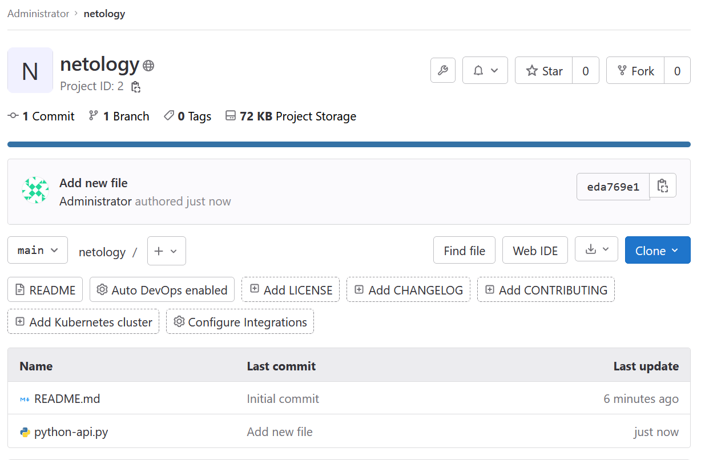
- Установим GitLab Runner
    - Возьмём токен в веб панели управления GitLab 
        - Settings / CI/CD / Runners / Specific runners
            `GR1348941Jm1MoPqzXhYpWPVGz_FF`
    - Подключимся SSH к GitLab серверу
        ```
        ssh ansible@51.250.6.93
        ```
    - Создадим пользователя
        ```
        sudo -i
        useradd --comment 'GitLab Runner' --create-home gitlab-runner --shell /bin/bash
        ```
    - Установим GitLab Runner
        ```
        curl -L --output /usr/local/bin/gitlab-runner https://gitlab-runner-downloads.s3.amazonaws.com/latest/binaries/gitlab-runner-linux-amd64
        chmod +x /usr/local/bin/gitlab-runner
        gitlab-runner install --user=gitlab-runner --working-directory=/home/gitlab-runner
        gitlab-runner start
        ```
    - Зарегистрируем GitLab Runner
        ```
        gitlab-runner register
            GitLab instance URL: http://51.250.6.93
            Registration token: вставим скопированный токен
            Description: gitlab-runner
            Executor: docker
            Docker image: centos:7
        ```
    - Отредактируем настройки GitLab Runner 
        ```
        nano /etc/gitlab-runner/config.toml
            privileged = true
        ```
    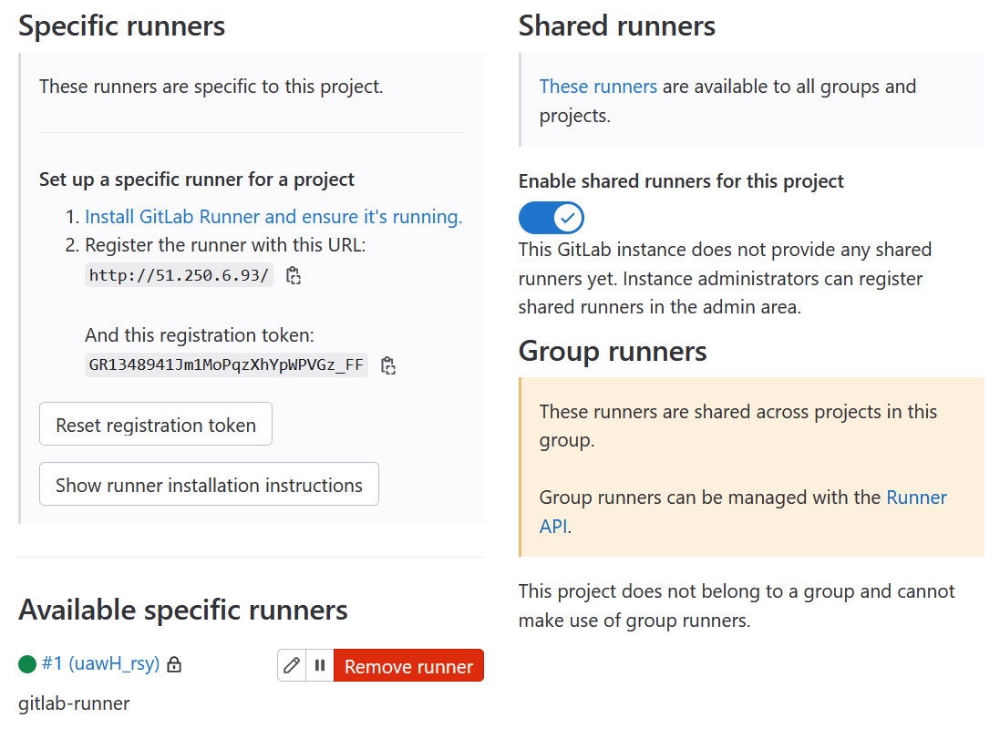
- Подготовим зависимости для GitLab Runner
    - Подключимся SSH к GitLab серверу
        ```
        ssh ansible@51.250.6.93
        ```
    - Установим зависимости
        ```
        sudo -i
        apt update
        apt install -y git ca-certificates curl gnupg lsb-release
        mkdir -p /etc/apt/keyrings
        curl -fsSL https://download.docker.com/linux/ubuntu/gpg | gpg --dearmor -o /etc/apt/keyrings/docker.gpg
        echo "deb [arch=$(dpkg --print-architecture) signed-by=/etc/apt/keyrings/docker.gpg] https://download.docker.com/linux/ubuntu $(lsb_release -cs) stable" | tee /etc/apt/sources.list.d/docker.list > /dev/null
        apt-get update
        apt-get install docker-ce docker-ce-cli containerd.io docker-compose-plugin
        ```
    - Разрешим пользователю доступ к Docker
        ```
        usermod -aG docker gitlab-runner
        ```
- Подготовим зависимости для проекта Python
    - В директории проекта нажмём Add / New file
    - Укажем имя: requirements.txt
    - Укажем содержимоев: 
        ```
        flask
        flask_restful
        flask_jsonpify
        ```
- Создадим Dockerfile для развёртывания контейнера нашего приложения
    - В директории проекта нажмём Add / New file
    - Укажем имя: Dockerfile
    - Укажем содержимоев:
        ```
        FROM centos:7

        RUN yum install python3 python3-pip -y
        COPY requirements.txt requirements.txt
        RUN pip3 install -r requirements.txt
        WORKDIR /python_api
        COPY python-api.py python-api.py
        CMD ["python3", "python-api.py"]
        ```
- Создадим сценарий тестирования
    - Project / CI/CD / Variables / Add variable
        ```
        CI_REGISTRY_USER=yuriartemiev
        CI_REGISTRY_PASSWORD=********
        CI_REGISTRY=docker.io
        CI_REGISTRY_IMAGE=index.docker.io/yuriartemiev/python-api
        ```
    - Project / CI/CD / Editor / Configure pipeline
        ```
        stages:
          - build
          - deploy
        image: docker:20.10.16
        variables:
          DOCKER_HOST: tcp://docker:2375
          DOCKER_TLS_CERTDIR: ""
        services:
          - docker:20.10.16-dind
        builder:
          stage: build
          script:
            - echo "  workdir env $WORDIR"
            - docker build -t python-api:latest .
          except:
            - main
        deployer:
          stage: deploy
          script:
            - echo "  CI_REGISTRY $CI_REGISTRY"
            - echo "  CI_REGISTRY_USER $CI_REGISTRY_USER"
            - echo "  CI_REGISTRY_IMAGE $CI_REGISTRY_IMAGE"
            - docker login -u $CI_REGISTRY_USER -p $CI_REGISTRY_PASSWORD $CI_REGISTRY
            - docker build --pull -t "$CI_REGISTRY_IMAGE" .
            - docker push "$CI_REGISTRY_IMAGE"
          only:
            - main
        ```
- Дождёмся окончания сборки 
    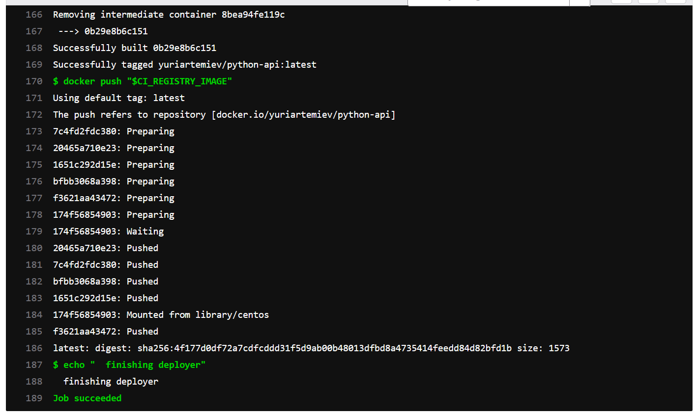
- Создадим Issue
    - Issues / New issue
    - Title: Изменить message
    - Description: Изменить текст с { "message": "Already started" } на { "message": "Running"}
    - Lables: Create project label 
        - Name: feature
    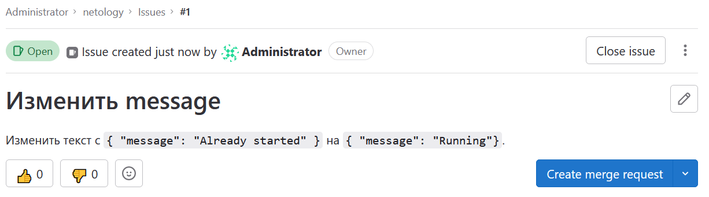
- Создадим отедльную ветку для изменения
    - Выберем нашу заявку в Issues
    - Create merge request and branch
        - Branch name: 1-message
        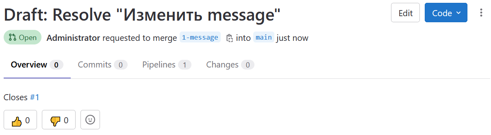
    - Отредактируем файл python-api.py изменив значение `message`
    - Сохраним изменения в ветке `1-message`
        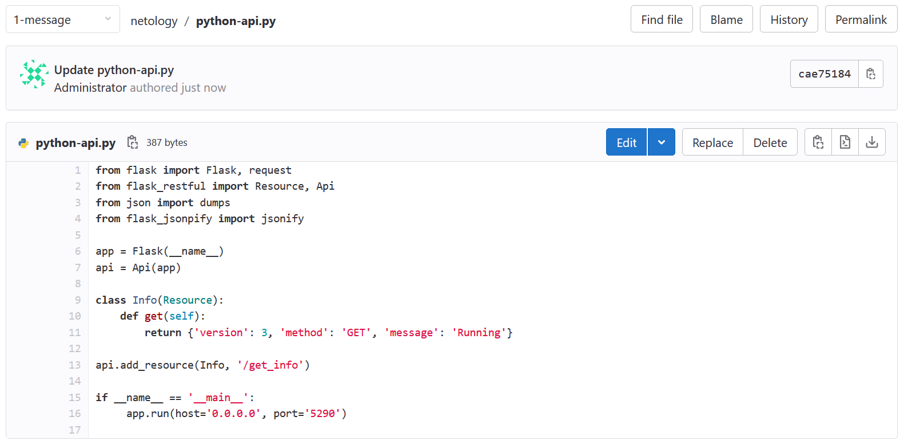
- Применим изменения
    - Переходи на вкладку Merge requests
    - Выбираем наш запрос `1-message`
    - Выбираем Mark as ready
    - Выбираем Merge
        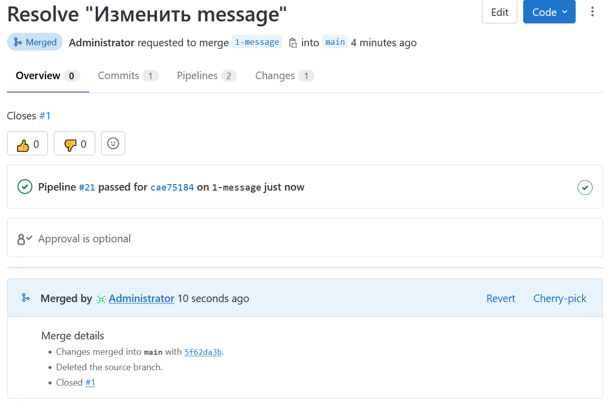
    - Зайдём во вкладку Issue и увидем закрытый тикет в Closed
        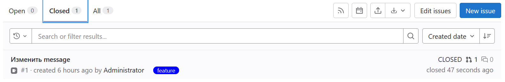
    - Зайдем на влкадку CI/CD Pipelines и увидем что сценарий проигрался
        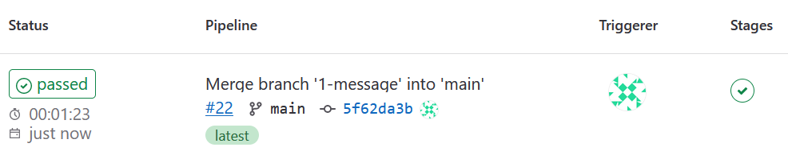
    - Зайдём в репозиторий Dokcer HUB и убдимся что контеёнер создан
        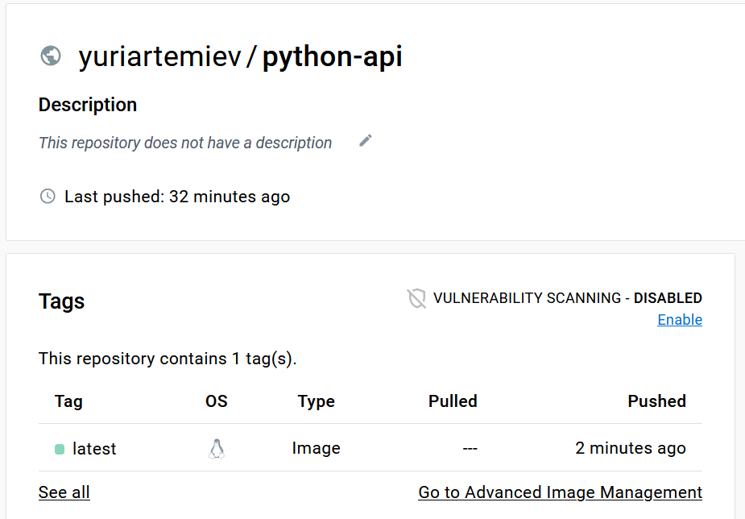
- Проверим контейнер из репозитория
    ```
    docker run --rm -d -p 5290:5290 --name python-api yuriartemiev/python-api
    curl localhost:5290/get_info
        {"version": 3, "method": "GET", "message": "Running"}
    docker stop python-api
    ```
    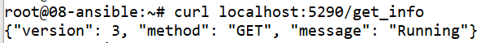


## Комментарии

Похоже, что хранение контейнеров в GitLab сложно настрпоить без сертификата и nginx, что мне выходит кажется выходит за рамки задания. В настройках GitLab сервера по-умолчанию Container Registry остуствует. Пожалуйста осветите эту конфигурацию в лекциях.

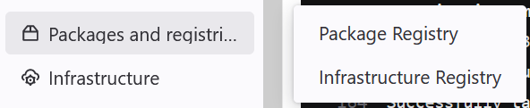

Конфигурация, которая не заработала:
```
    - docker build -t $CI_REGISTRY/root/netology/python-api:latest .
    - docker login -u $CI_REGISTRY_USER -p $CI_REGISTRY_PASSWORD $CI_REGISTRY
    - docker push $CI_REGISTRY/root/netology/python-api:latest
```


