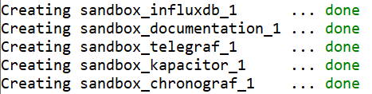
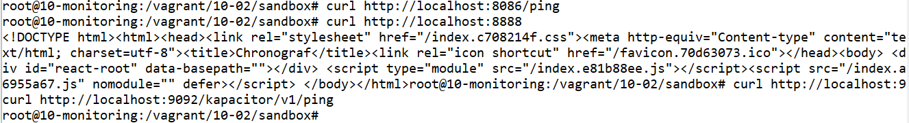
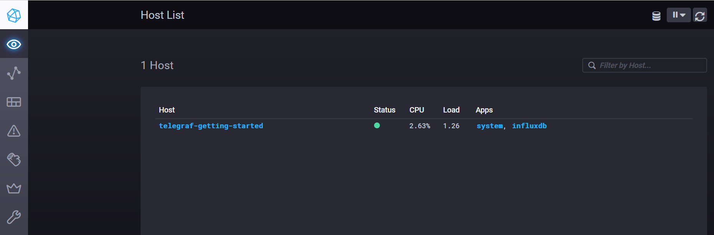
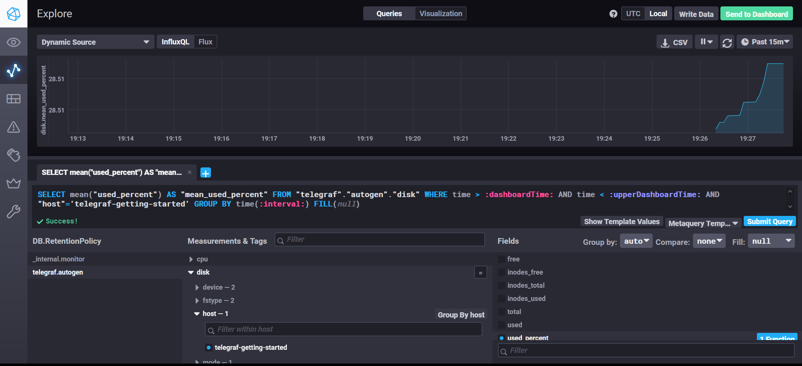
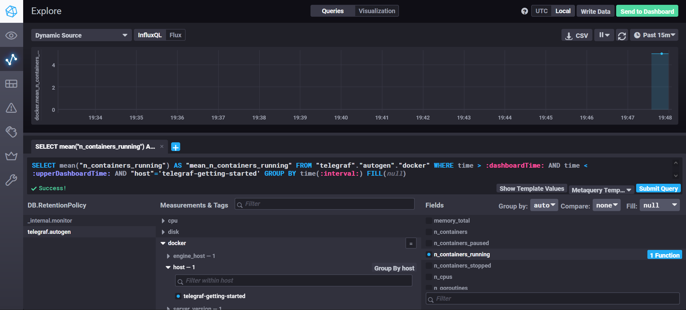

# Домашнее задание к занятию "13.Системы мониторинга"

## Обязательные задания

1. Вас пригласили настроить мониторинг на проект. На онбординге вам рассказали, что проект представляет из себя 
платформу для вычислений с выдачей текстовых отчетов, которые сохраняются на диск. Взаимодействие с платформой 
осуществляется по протоколу http. Также вам отметили, что вычисления загружают ЦПУ. Какой минимальный набор метрик вы
выведите в мониторинг и почему?
#
2. Менеджер продукта посмотрев на ваши метрики сказал, что ему непонятно что такое RAM/inodes/CPUla. Также он сказал, 
что хочет понимать, насколько мы выполняем свои обязанности перед клиентами и какое качество обслуживания. Что вы 
можете ему предложить?
#
3. Вашей DevOps команде в этом году не выделили финансирование на построение системы сбора логов. Разработчики в свою 
очередь хотят видеть все ошибки, которые выдают их приложения. Какое решение вы можете предпринять в этой ситуации, 
чтобы разработчики получали ошибки приложения?
#
4. Вы, как опытный SRE, сделали мониторинг, куда вывели отображения выполнения SLA=99% по http кодам ответов. 
Вычисляете этот параметр по следующей формуле: summ_2xx_requests/summ_all_requests. Данный параметр не поднимается выше 
70%, но при этом в вашей системе нет кодов ответа 5xx и 4xx. Где у вас ошибка?
#
5. Опишите основные плюсы и минусы pull и push систем мониторинга.
#
6. Какие из ниже перечисленных систем относятся к push модели, а какие к pull? А может есть гибридные?

    - Prometheus 
    - TICK
    - Zabbix
    - VictoriaMetrics
    - Nagios
#
7. Склонируйте себе [репозиторий](https://github.com/influxdata/sandbox/tree/master) и запустите TICK-стэк, 
используя технологии docker и docker-compose.

В виде решения на это упражнение приведите выводы команд с вашего компьютера (виртуальной машины):

    - curl http://localhost:8086/ping
    - curl http://localhost:8888
    - curl http://localhost:9092/kapacitor/v1/ping

А также скриншот веб-интерфейса ПО chronograf (`http://localhost:8888`). 

P.S.: если при запуске некоторые контейнеры будут падать с ошибкой - проставьте им режим `Z`, например
`./data:/var/lib:Z`
#
8. Перейдите в веб-интерфейс Chronograf (`http://localhost:8888`) и откройте вкладку `Data explorer`.

    - Нажмите на кнопку `Add a query`
    - Изучите вывод интерфейса и выберите БД `telegraf.autogen`
    - В `measurments` выберите mem->host->telegraf_container_id , а в `fields` выберите used_percent. 
    Внизу появится график утилизации оперативной памяти в контейнере telegraf.
    - Вверху вы можете увидеть запрос, аналогичный SQL-синтаксису. 
    Поэкспериментируйте с запросом, попробуйте изменить группировку и интервал наблюдений.

Для выполнения задания приведите скриншот с отображением метрик утилизации места на диске 
(disk->host->telegraf_container_id) из веб-интерфейса.
#
9. Изучите список [telegraf inputs](https://github.com/influxdata/telegraf/tree/master/plugins/inputs). 
Добавьте в конфигурацию telegraf следующий плагин - [docker](https://github.com/influxdata/telegraf/tree/master/plugins/inputs/docker):
```
[[inputs.docker]]
  endpoint = "unix:///var/run/docker.sock"
```

Дополнительно вам может потребоваться донастройка контейнера telegraf в `docker-compose.yml` дополнительного volume и 
режима privileged:
```
  telegraf:
    image: telegraf:1.4.0
    privileged: true
    volumes:
      - ./etc/telegraf.conf:/etc/telegraf/telegraf.conf:Z
      - /var/run/docker.sock:/var/run/docker.sock:Z
    links:
      - influxdb
    ports:
      - "8092:8092/udp"
      - "8094:8094"
      - "8125:8125/udp"
```

После настройке перезапустите telegraf, обновите веб интерфейс и приведите скриншотом список `measurments` в 
веб-интерфейсе базы telegraf.autogen . Там должны появиться метрики, связанные с docker.

Факультативно можете изучить какие метрики собирает telegraf после выполнения данного задания.

## Дополнительное задание (со звездочкой*) - необязательно к выполнению

1. Вы устроились на работу в стартап. На данный момент у вас нет возможности развернуть полноценную систему 
мониторинга, и вы решили самостоятельно написать простой python3-скрипт для сбора основных метрик сервера. Вы, как 
опытный системный-администратор, знаете, что системная информация сервера лежит в директории `/proc`. 
Также, вы знаете, что в системе Linux есть  планировщик задач cron, который может запускать задачи по расписанию.

Суммировав все, вы спроектировали приложение, которое:
- является python3 скриптом
- собирает метрики из папки `/proc`
- складывает метрики в файл 'YY-MM-DD-awesome-monitoring.log' в директорию /var/log 
(YY - год, MM - месяц, DD - день)
- каждый сбор метрик складывается в виде json-строки, в виде:
  + timestamp (временная метка, int, unixtimestamp)
  + metric_1 (метрика 1)
  + metric_2 (метрика 2)
  
     ...
     
  + metric_N (метрика N)
  
- сбор метрик происходит каждую 1 минуту по cron-расписанию

Для успешного выполнения задания нужно привести:

а) работающий код python3-скрипта,

б) конфигурацию cron-расписания,

в) пример верно сформированного 'YY-MM-DD-awesome-monitoring.log', имеющий не менее 5 записей,

P.S.: количество собираемых метрик должно быть не менее 4-х.
P.P.S.: по желанию можно себя не ограничивать только сбором метрик из `/proc`.

2. В веб-интерфейсе откройте вкладку `Dashboards`. Попробуйте создать свой dashboard с отображением:

    - утилизации ЦПУ
    - количества использованного RAM
    - утилизации пространства на дисках
    - количество поднятых контейнеров
    - аптайм
    - ...
    - фантазируйте)
    
    ---

---

## Шаги:

- Мониторинг параметров:
    - CPU 
    - RAM 
    - Свободное место на системе хранения
    - Задержка на системе хранения
    - Задержка на сетевой системе
    - Количество запросов HTTP

    Это позволит собрать общую картину о работе сервера.

- Для оценки качества обслуживания клиентов мы можем предложим соглашение об уровне оказания сервиса, в котором прописать ключевые метрики и их допустимые значения. Например, процент возврата ошибки HTTP не более 5%.

- Для того, чтобы разработчики получали логи от своих приложений, не разворачивая дополнительную инфраструктуру, можно воспользоваться встроенными системами. Например система syslog, позволяет отправлять ошибки выше определённого уровня по почте. Она является компонентом самой системы и не требует отдельной инфраструктуры.

- Не учтены HTTP коды 3xx (например redirect).

- Плюсы pull систем мониторинга
    - Можно обойтись без агентов
    - Упрощение настройки системы в одном месте - на севере мониторинга
- Минусы pull систем мониторинга
    - Возрастает нагрузка на сервер из контроля опроса агентов
- Плюсы push систем мониторинга
    - Не нужно публиковать входящие порты для подключения со стороны сервера
    - Настройка каждого агента может быть индивидуальной, что даёт возможность более тонкой настройки
    - Снижается нагрузка на сервер, т.к. агент сам инициирует отправку метрик
    - Из предыдущего пункта следует, что теоритически сервер с push моделью может поддерживать большее количество метрик, чем сервер с pull моделью с той же конфигурацией
- Минусы push систем мониторинга
    - Необходим агент
    - Из предыдущего пункта следует увеличение времени на обслуживание системы
- Типы мониторинговых систем
    - Prometheus - pull
        - С возможностью pull через компонент PushGateway
    - TICK - push
    - Zabbix - push и pull
    - VictoriaMetrics - push
    - Nagios - pull
- Установим Docker  
    ```
    apt-get install ca-certificates curl gnupg lsb-release
    mkdir -p /etc/apt/keyrings
    curl -fsSL https://download.docker.com/linux/ubuntu/gpg | gpg --dearmor -o /etc/apt/keyrings/docker.gpg
    echo "deb [arch=$(dpkg --print-architecture) signed-by=/etc/apt/keyrings/docker.gpg] https://download.docker.com/linux/ubuntu $(lsb_release -cs) stable" | tee /etc/apt/sources.list.d/docker.list > /dev/null
    apt-get update
    apt-get install docker-ce docker-ce-cli containerd.io docker-compose-plugin docker-compose
    ```
- Склонируем репозиторий
    ```
    git clone https://github.com/influxdata/sandbox.git
    ```
- Запустим TICK
    ```
    ./sandbox up
    ```
    
- Запустим команды curl
    ```
    curl http://localhost:8086/ping
    curl http://localhost:8888
        <!DOCTYPE html><html><head><link rel="stylesheet" href="/index.c708214f.css"><meta http-equiv="Content-type" content="text/html; charset=utf-8"><title>Chronograf</title><link rel="icon shortcut" href="/favicon.70d63073.ico"></head><body> <div id="react-root" data-basepath=""></div> <script type="module" src="/index.e81b88ee.js"></script><script src="/index.a6955a67.js" nomodule="" defer></script> </body></html>
    curl http://localhost:9092/kapacitor/v1/ping
    ```
    
- Откроем веб браузер 
    - Chronograf - `http://192.168.1.120:8888`
    
- Добавим в конфигурацию `telegraf/telegraf.conf` поддержку disk и mem
    - Память - `[[inputs.mem]]`
    - Диск
    ```
    [[inputs.disk]]
      ignore_fs = ["tmpfs", "devtmpfs", "devfs", "iso9660", "overlay", "aufs", "squashfs"]
    ```
- Перезапустим telegraf для применения настроек
    - `./sandbox restart`
- Посмотрим на использование диска
    
- Отредактируем конфигурацию `docker-compose.yml` для поддержки Docker метрик
    ```
    services:
      telegraf:
        privileged: true
    ```
- Дополнительно потребовалось дать доступ к сокету
    ```
    chmod 666 /var/run/docker.sock
    ```
- Перезапустим контейнеры
    ```
    ./sandbox docker-clean
    ./sandbox up
    ```
- Выведем метрики docker в telegraf
    

