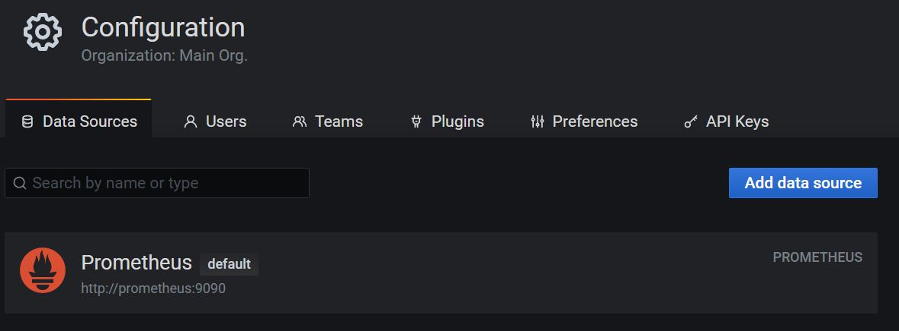
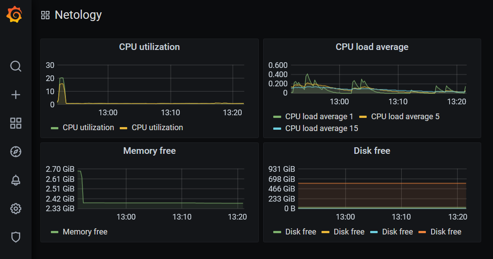
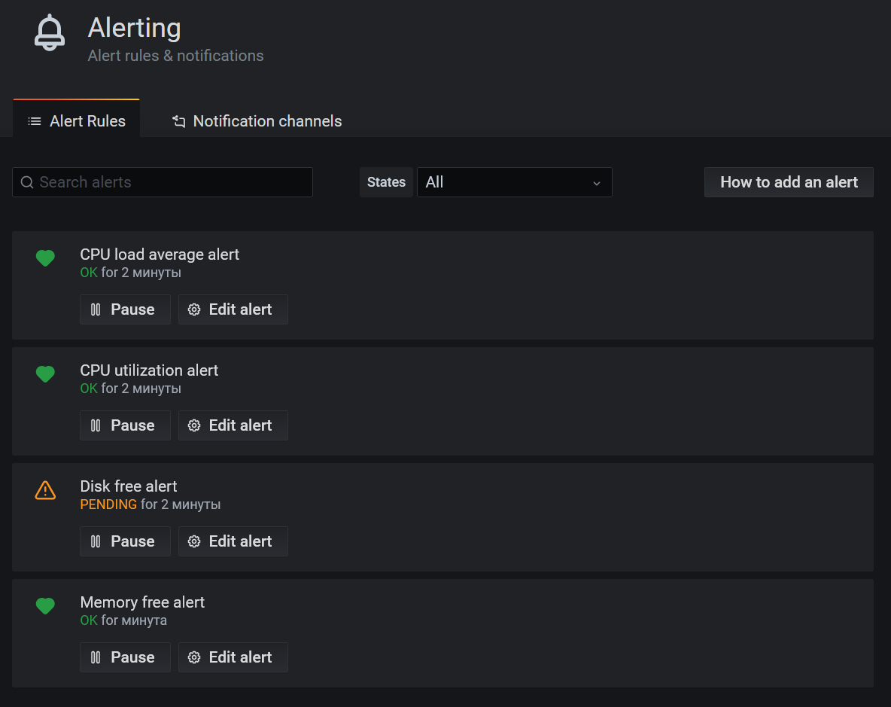

# Домашнее задание к занятию "14.Средство визуализации Grafana"

## Задание повышенной сложности

**В части задания 1** не используйте директорию [help](./help) для сборки проекта, самостоятельно разверните grafana, где в 
роли источника данных будет выступать prometheus, а сборщиком данных node-exporter:
- grafana
- prometheus-server
- prometheus node-exporter

За дополнительными материалами, вы можете обратиться в официальную документацию grafana и prometheus.

В решении к домашнему заданию приведите также все конфигурации/скрипты/манифесты, которые вы 
использовали в процессе решения задания.

**В части задания 3** вы должны самостоятельно завести удобный для вас канал нотификации, например Telegram или Email
и отправить туда тестовые события.

В решении приведите скриншоты тестовых событий из каналов нотификаций.

## Обязательные задания

### Задание 1
Используя директорию [help](./help) внутри данного домашнего задания - запустите связку prometheus-grafana.

Зайдите в веб-интерфейс графана, используя авторизационные данные, указанные в манифесте docker-compose.

Подключите поднятый вами prometheus как источник данных.

Решение домашнего задания - скриншот веб-интерфейса grafana со списком подключенных Datasource.

## Задание 2
Изучите самостоятельно ресурсы:
- [promql-for-humans](https://timber.io/blog/promql-for-humans/#cpu-usage-by-instance)
- [understanding prometheus cpu metrics](https://www.robustperception.io/understanding-machine-cpu-usage)

Создайте Dashboard и в ней создайте следующие Panels:
- Утилизация CPU для nodeexporter (в процентах, 100-idle)
- CPULA 1/5/15
- Количество свободной оперативной памяти
- Количество места на файловой системе

Для решения данного ДЗ приведите promql запросы для выдачи этих метрик, а также скриншот получившейся Dashboard.

## Задание 3
Создайте для каждой Dashboard подходящее правило alert (можно обратиться к первой лекции в блоке "Мониторинг").

Для решения ДЗ - приведите скриншот вашей итоговой Dashboard.

## Задание 4
Сохраните ваш Dashboard.

Для этого перейдите в настройки Dashboard, выберите в боковом меню "JSON MODEL".

Далее скопируйте отображаемое json-содержимое в отдельный файл и сохраните его.

В решении задания - приведите листинг этого файла.

---

## Шаги:

- Установим Docker  
    ```
    apt-get install ca-certificates curl gnupg lsb-release
    mkdir -p /etc/apt/keyrings
    curl -fsSL https://download.docker.com/linux/ubuntu/gpg | gpg --dearmor -o /etc/apt/keyrings/docker.gpg
    echo "deb [arch=$(dpkg --print-architecture) signed-by=/etc/apt/keyrings/docker.gpg] https://download.docker.com/linux/ubuntu $(lsb_release -cs) stable" | tee /etc/apt/sources.list.d/docker.list > /dev/null
    apt-get update
    apt-get install docker-ce docker-ce-cli containerd.io docker-compose-plugin docker-compose
    ```
- Запустим контейнеры в Docker Compose
    ```
    docker-compose -f docker-compose.yml up -d
    ```
- Подключим Prometheus как источник данных в Graphana
    - Откроем веб браузер `http://192.168.1.120:3000'
        - Пароль по умолчанию `admin` / `admin`
    - Перейдём в Configuration / Data sources / Add data source / Prometheus / Select
        - URL: `http://prometheus:9090`
    
- Создадим новый Dashboard
    - Create / Dashboard
- Создадим новую панель на Dashboard
    - Add new panel
        - Title: CPU utilization
            - Data source: Prometheus
            - Metrics:
                - 100 - (rate(node_cpu_seconds_total{job="nodeexporter", mode="idle"}[1m]) * 100)
    - Add new panel
        - Title: CPU load average
            - Data source: Prometheus
            - Metrics:
                - node_load1{job="nodeexporter"}
                - node_load5{job="nodeexporter"}
                - node_load15{job="nodeexporter"}
    - Add new panel
        - Title: Memory free
            - Data source: Prometheus
            - Field / Unit / Data / bytes
            - Metrics:
                - node_memory_MemFree_bytes
    - Add new panel
        - Title: Disk free
            - Data source: Prometheus
            - Field / Unit / Data / bytes
            - Metrics:
                - node_filesystem_free_bytes{fstype!~"tmpfs|fuse.lxcfs|squashfs|vfat"}
    
- Создадим правило Alert на панели
    - Alert / Create alert 
        - Conditions
            - When avg() of qurety is above и указываем значение
    - Проверим список оповещений
        - Alerting / alert rules
    
- Сохраним Dashboard
    - Dashboard settings / JSON Model / Save Changes
    [graphana-dashboard.json](graphana-dashboard.json)

