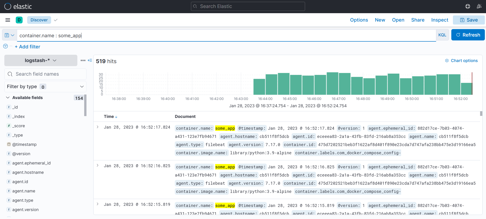

# Домашнее задание к занятию "15.Система сбора логов Elastic Stack"

## Дополнительные ссылки

При выполнении задания пользуйтесь вспомогательными ресурсами:

- [поднимаем elk в докер](https://www.elastic.co/guide/en/elastic-stack-get-started/current/get-started-docker.html)
- [поднимаем elk в докер с filebeat и докер логами](https://www.sarulabs.com/post/5/2019-08-12/sending-docker-logs-to-elasticsearch-and-kibana-with-filebeat.html)
- [конфигурируем logstash](https://www.elastic.co/guide/en/logstash/current/configuration.html)
- [плагины filter для logstash](https://www.elastic.co/guide/en/logstash/current/filter-plugins.html)
- [конфигурируем filebeat](https://www.elastic.co/guide/en/beats/libbeat/5.3/config-file-format.html)
- [привязываем индексы из elastic в kibana](https://www.elastic.co/guide/en/kibana/current/index-patterns.html)
- [как просматривать логи в kibana](https://www.elastic.co/guide/en/kibana/current/discover.html)
- [решение ошибки increase vm.max_map_count elasticsearch](https://stackoverflow.com/questions/42889241/how-to-increase-vm-max-map-count)

В процессе выполнения задания могут возникнуть также не указанные тут проблемы в зависимости от системы.

Используйте output stdout filebeat/kibana и api elasticsearch для изучения корня проблемы и ее устранения.

## Задание повышенной сложности

Не используйте директорию [help](./help) при выполнении домашнего задания.

## Задание 1

Вам необходимо поднять в докере:
- elasticsearch(hot и warm ноды)
- logstash
- kibana
- filebeat

и связать их между собой.

Logstash следует сконфигурировать для приёма по tcp json сообщений.

Filebeat следует сконфигурировать для отправки логов docker вашей системы в logstash.

В директории [help](./help) находится манифест docker-compose и конфигурации filebeat/logstash для быстрого 
выполнения данного задания.

Результатом выполнения данного задания должны быть:
- скриншот `docker ps` через 5 минут после старта всех контейнеров (их должно быть 5)
- скриншот интерфейса kibana
- docker-compose манифест (если вы не использовали директорию help)
- ваши yml конфигурации для стека (если вы не использовали директорию help)

## Задание 2

Перейдите в меню [создания index-patterns  в kibana](http://localhost:5601/app/management/kibana/indexPatterns/create)
и создайте несколько index-patterns из имеющихся.

Перейдите в меню просмотра логов в kibana (Discover) и самостоятельно изучите как отображаются логи и как производить 
поиск по логам.

В манифесте директории help также приведенно dummy приложение, которое генерирует рандомные события в stdout контейнера.
Данные логи должны порождать индекс logstash-* в elasticsearch. Если данного индекса нет - воспользуйтесь советами 
и источниками из раздела "Дополнительные ссылки" данного ДЗ.
 
---

### Как оформить ДЗ?

Выполненное домашнее задание пришлите ссылкой на .md-файл в вашем репозитории.

---

## Шаги:

- Установим Docker  
    ```
    apt-get install ca-certificates curl gnupg lsb-release
    mkdir -p /etc/apt/keyrings
    curl -fsSL https://download.docker.com/linux/ubuntu/gpg | gpg --dearmor -o /etc/apt/keyrings/docker.gpg
    echo "deb [arch=$(dpkg --print-architecture) signed-by=/etc/apt/keyrings/docker.gpg] https://download.docker.com/linux/ubuntu $(lsb_release -cs) stable" | tee /etc/apt/sources.list.d/docker.list > /dev/null
    apt-get update
    apt-get install docker-ce docker-ce-cli containerd.io docker-compose-plugin docker-compose
    ```
- Отредактируем конфигурацию Docker Compose
  - [docker-compose.yml](10-monitoring-04-elk/help/docker-compose.yml)  
    ```dockerfile
    logstash:
        volumes:
          - ./configs/logstash.conf:/usr/share/logstash/pipeline/logstash.conf:Z
          - ./configs/logstash.yml:/usr/share/logstash/config/logstash.yml:Z
    filebeat:
        networks:
          - elastic
    ```
  - [logstash.conf](10-monitoring-04-elk/help/configs/logstash.conf)
    ```text
    input {
      beats {
        port => 5046
        codec => json
      }
    }
    ```
    ```text
    elasticsearch {
      hosts => ["es-hot:9200"]
      index => "logstash-%{+YYYY.MM.dd}"
    }
    ```
- Отредактируем переменные ОС
    ```
    chown -R root configs/filebeat.yml
    echo "vm.max_map_count=262144" >> /etc/sysctl.d/99-sysctl.conf
    sysctl --system
    ```
- Запустим контейнеры в Docker Compose
    ```
    docker-compose -f docker-compose.yml up -d
    ```
- Посмотрим список запущенных контейнеров
    ```
    docker ps
    ```
    ```
    CONTAINER ID                                                       IMAGE                                                  COMMAND                                                        CREATED         STATUS         PORTS                                                           NAMES
    ef393b006159294c6c035a9ead0bcac6eee8bd288c31471fb2c53709907c24db   docker.elastic.co/kibana/kibana:7.11.0                 "/bin/tini -- /usr/local/bin/kibana-docker"                    5 minutes ago   Up 5 minutes   0.0.0.0:5601->5601/tcp, :::5601->5601/tcp                       kibana
    8aaad4ddc8b13923b013399e273ace4621a577823710280bc4c3c10e54d23aa2   docker.elastic.co/logstash/logstash:6.3.2              "/usr/local/bin/docker-entrypoint"                             5 minutes ago   Up 5 minutes   5044/tcp, 9600/tcp, 0.0.0.0:5046->5046/tcp, :::5046->5046/tcp   logstash
    cdee34857345c7520177f58a07cfd579f6508c29cc9f44d90874cc5d81a3457c   docker.elastic.co/elasticsearch/elasticsearch:7.11.0   "/bin/tini -- /usr/local/bin/docker-entrypoint.sh eswrapper"   5 minutes ago   Up 5 minutes   0.0.0.0:9200->9200/tcp, :::9200->9200/tcp, 9300/tcp             es-hot
    efe1a22827dd78876b1c43e5dd0111a64f0126a23dbcab8a6f88c67fd815b8bb   library/python:3.9-alpine                              "python3 /opt/run.py"                                          5 minutes ago   Up 5 minutes                                                                   some_app
    5cb1c2c92edb1703a37a0e061b18861718970f3363470f8a74e3da10660bfd5a   docker.elastic.co/elasticsearch/elasticsearch:7.11.0   "/bin/tini -- /usr/local/bin/docker-entrypoint.sh eswrapper"   5 minutes ago   Up 5 minutes   9200/tcp, 9300/tcp                                              es-warm
    ```
    

- Откроем веб браузер Kibana `http://192.168.1.120:5601`
- Зайдём в меню Management / Stack management / Kibana / Index patterns / Create index pattern
    - Index pattern name: `logstash-*`

    
- Посмотрим логи Kibana перейдя в Analytics / Discover 
    - Query: `container.name : some_app`
    - Index pattern: `logstash-*`

    


