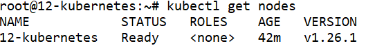
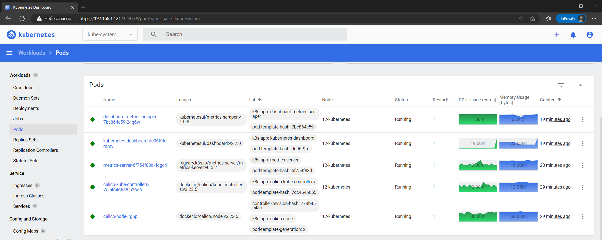

# Домашнее задание к занятию «Kubernetes. Причины появления. Команда kubectl»

### Цель задания

Для экспериментов и валидации ваших решений вам нужно подготовить тестовую среду для работы с Kubernetes. Оптимальное решение — развернуть на рабочей машине или на отдельной виртуальной машине MicroK8S.

------

### Чеклист готовности к домашнему заданию

1. Личный компьютер с ОС Linux или MacOS 

или

2. ВМ c ОС Linux в облаке либо ВМ на локальной машине для установки MicroK8S  

------

### Инструкция к заданию

1. Установка MicroK8S:
    - sudo apt update,
    - sudo apt install snapd,
    - sudo snap install microk8s --classic,
    - добавить локального пользователя в группу `sudo usermod -a -G microk8s $USER`,
    - изменить права на папку с конфигурацией `sudo chown -f -R $USER ~/.kube`.

2. Полезные команды:
    - проверить статус `microk8s status --wait-ready`;
    - подключиться к microK8s и получить информацию можно через команду `microk8s command`, например, `microk8s kubectl get nodes`;
    - включить addon можно через команду `microk8s enable`; 
    - список addon `microk8s status`;
    - вывод конфигурации `microk8s config`;
    - проброс порта для подключения локально `microk8s kubectl port-forward -n kube-system service/kubernetes-dashboard 10443:443`.

3. Настройка внешнего подключения:
    - отредактировать файл /var/snap/microk8s/current/certs/csr.conf.template
    ```shell
    # [ alt_names ]
    # Add
    # IP.4 = 123.45.67.89
    ```
    - обновить сертификаты `sudo microk8s refresh-certs --cert front-proxy-client.crt`.

4. Установка kubectl:
    - curl -LO https://storage.googleapis.com/kubernetes-release/release/`curl -s https://storage.googleapis.com/kubernetes-release/release/stable.txt`/bin/linux/amd64/kubectl;
    - chmod +x ./kubectl;
    - sudo mv ./kubectl /usr/local/bin/kubectl;
    - настройка автодополнения в текущую сессию `bash source <(kubectl completion bash)`;
    - добавление автодополнения в командную оболочку bash `echo "source <(kubectl completion bash)" >> ~/.bashrc`.

------

### Инструменты и дополнительные материалы, которые пригодятся для выполнения задания

1. [Инструкция](https://microk8s.io/docs/getting-started) по установке MicroK8S.
2. [Инструкция](https://kubernetes.io/ru/docs/reference/kubectl/cheatsheet/#bash) по установке автодополнения **kubectl**.
3. [Шпаргалка](https://kubernetes.io/ru/docs/reference/kubectl/cheatsheet/) по **kubectl**.

------

### Задание 1. Установка MicroK8S

1. Установить MicroK8S на локальную машину или на удалённую виртуальную машину.
2. Установить dashboard.
3. Сгенерировать сертификат для подключения к внешнему ip-адресу.

------

### Задание 2. Установка и настройка локального kubectl
1. Установить на локальную машину kubectl.
2. Настроить локально подключение к кластеру.
3. Подключиться к дашборду с помощью port-forward.

------


- Установим Docker  

    ```
    apt-get install ca-certificates curl gnupg lsb-release
    mkdir -p /etc/apt/keyrings
    curl -fsSL https://download.docker.com/linux/ubuntu/gpg | gpg --dearmor -o /etc/apt/keyrings/docker.gpg
    echo "deb [arch=$(dpkg --print-architecture) signed-by=/etc/apt/keyrings/docker.gpg] https://download.docker.com/linux/ubuntu $(lsb_release -cs) stable" | tee /etc/apt/sources.list.d/docker.list > /dev/null
    apt-get update
    apt-get install docker-ce docker-ce-cli containerd.io docker-compose-plugin docker-compose
    ```

- Установим MicroK8S

    ```
    apt update
    apt install snapd
    snap install microk8s --classic
    usermod -a -G microk8s $USER
    chown -f -R $USER ~/.kube
    ```

- Проверим статус MicroK8S

    ```
    microk8s status --wait-ready
    ```
    ```
    microk8s is running
    high-availability: no
      datastore master nodes: 127.0.0.1:19001
      datastore standby nodes: none
    ```

- Подключимся к Kubernetes и выведем список нод

    ```
    microk8s kubectl get nodes
    ```
    ```
    NAME            STATUS   ROLES    AGE     VERSION
    12-kubernetes   Ready    <none>   3m42s   v1.26.1
    ```

- Получим конфигурацию кластера

    ```
    microk8s config
    ```
    ```
    apiVersion: v1
    clusters:
    - cluster:
        certificate-authority-data: LS0...
        server: https://10.0.2.15:16443
      name: microk8s-cluster
    contexts:
    - context:
        cluster: microk8s-cluster
        user: admin
      name: microk8s
    current-context: microk8s
    kind: Config
    preferences: {}
    users:
    - name: admin
      user:
        token: QXc...
    ```

- Включим панель управления

    ```
    microk8s enable dashboard
    ```
    ```
    If RBAC is not enabled access the dashboard using the token retrieved with:

    microk8s kubectl describe secret -n kube-system microk8s-dashboard-token

    Use this token in the https login UI of the kubernetes-dashboard service.

    In an RBAC enabled setup (microk8s enable RBAC) you need to create a user with restricted
    permissions as shown in:
    https://github.com/kubernetes/dashboard/blob/master/docs/user/access-control/creating-sample-user.md
    ```

- Получим токен от доступа к панели управления

    ```
    microk8s kubectl describe secret -n kube-system microk8s-dashboard-token
    ```
    ```
    eyJ...
    ```

- Добавим IP адрес в запрос сертификата

    ```
    nano /var/snap/microk8s/current/certs/csr.conf.template
    ```
    ```
    [ alt_names ]
    ...
    IP.3 = 192.168.1.121
    ```
    ```
    microk8s refresh-certs --cert front-proxy-client.crt
    ```

- Установим kubectl

    ```
    apt-get install -y ca-certificates curl
    curl -fsSLo /etc/apt/keyrings/kubernetes-archive-keyring.gpg https://packages.cloud.google.com/apt/doc/apt-key.gpg
    echo "deb [signed-by=/etc/apt/keyrings/kubernetes-archive-keyring.gpg] https://apt.kubernetes.io/ kubernetes-xenial main" | tee /etc/apt/sources.list.d/kubernetes.list
    apt-get update
    apt-get install kubectl
    ```

- Добавим в bash дополнение kubectl

    ```
    apt-get install bash-completion
    echo 'source <(kubectl completion bash)' >>~/.bashrc
    source ~/.bashrc
    ```

- Создадим kubeconfig для подключения к кластеру

    ```
    nano ~/.kube/config
    ```
    ```
    apiVersion: v1
    clusters:
    - cluster:
        server: https://10.0.2.15:16443
        insecure-skip-tls-verify: true
      name: microk8s-cluster
    contexts:
    - context:
        cluster: microk8s-cluster
        user: admin
      name: microk8s
    current-context: microk8s
    kind: Config
    preferences: {}
    users:
    - name: admin
      user:
        token: QXc...
    ```

- Выведем список нод

    ```
    kubectl get nodes
    ```
    ```
    NAME            STATUS   ROLES    AGE   VERSION
    12-kubernetes   Ready    <none>   42m   v1.26.1
    ```

    

- Сделаем проброс порта 

    ```
    microk8s kubectl port-forward -n kube-system service/kubernetes-dashboard 10443:443  --address 192.168.1.121
    ```
    ```
    Forwarding from 127.0.0.1:10443 -> 8443
    Forwarding from [::1]:10443 -> 8443
    ```

- Зайдём в веб браузере в панель управления и предоставим сгенерированный токен для аутентификации ` https://192.168.1.121:10443`

    


