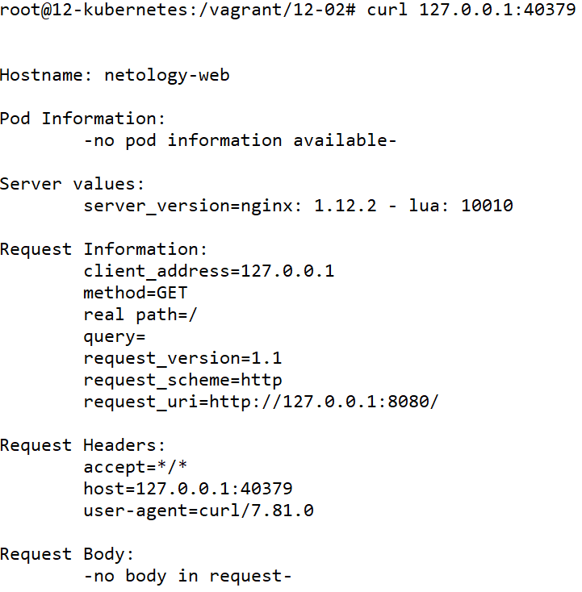

# Домашнее задание к занятию «Базовые объекты K8S»

### Цель задания

В тестовой среде для работы с Kubernetes, установленной в предыдущем ДЗ, необходимо развернуть Pod с приложением и подключиться к нему со своего локального компьютера. 

------

### Чеклист готовности к домашнему заданию

1. Установленное k8s-решение (например, MicroK8S).
2. Установленный локальный kubectl.
3. Редактор YAML-файлов с подключенным Git-репозиторием.

------

### Инструменты и дополнительные материалы, которые пригодятся для выполнения задания

1. Описание [Pod](https://kubernetes.io/docs/concepts/workloads/pods/) и примеры манифестов.
2. Описание [Service](https://kubernetes.io/docs/concepts/services-networking/service/).

------

### Задание 1. Создать Pod с именем hello-world

1. Создать манифест (yaml-конфигурацию) Pod.
2. Использовать image - gcr.io/kubernetes-e2e-test-images/echoserver:2.2.
3. Подключиться локально к Pod с помощью `kubectl port-forward` и вывести значение (curl или в браузере).

------

### Задание 2. Создать Service и подключить его к Pod

1. Создать Pod с именем netology-web.
2. Использовать image — gcr.io/kubernetes-e2e-test-images/echoserver:2.2.
3. Создать Service с именем netology-svc и подключить к netology-web.
4. Подключиться локально к Service с помощью `kubectl port-forward` и вывести значение (curl или в браузере).

------

### Правила приёма работы

1. Домашняя работа оформляется в своем Git-репозитории в файле README.md. Выполненное домашнее задание пришлите ссылкой на .md-файл в вашем репозитории.
2. Файл README.md должен содержать скриншоты вывода команд `kubectl get pods`, а также скриншот результата подключения.
3. Репозиторий должен содержать файлы манифестов и ссылки на них в файле README.md.

------

### Критерии оценки
Зачёт — выполнены все задания, ответы даны в развернутой форме, приложены соответствующие скриншоты и файлы проекта, в выполненных заданиях нет противоречий и нарушения логики.

На доработку — задание выполнено частично или не выполнено, в логике выполнения заданий есть противоречия, существенные недостатки.


----

# Ответ

- Проведём установку MicroK8S из прошлого задания

    ```
    apt-get install ca-certificates curl gnupg lsb-release
    mkdir -p /etc/apt/keyrings
    curl -fsSL https://download.docker.com/linux/ubuntu/gpg | gpg --dearmor -o /etc/apt/keyrings/docker.gpg
    echo "deb [arch=$(dpkg --print-architecture) signed-by=/etc/apt/keyrings/docker.gpg] https://download.docker.com/linux/ubuntu $(lsb_release -cs) stable" | tee /etc/apt/sources.list.d/docker.list > /dev/null
    apt-get update
    apt-get install docker-ce docker-ce-cli containerd.io docker-compose-plugin docker-compose

    apt update
    apt install snapd
    snap install microk8s --classic
    usermod -a -G microk8s $USER
    chown -f -R $USER ~/.kube

    apt-get install -y ca-certificates curl
    curl -fsSLo /etc/apt/keyrings/kubernetes-archive-keyring.gpg https://packages.cloud.google.com/apt/doc/apt-key.gpg
    echo "deb [signed-by=/etc/apt/keyrings/kubernetes-archive-keyring.gpg] https://apt.kubernetes.io/ kubernetes-xenial main" | tee /etc/apt/sources.list.d/kubernetes.list
    apt-get update
    apt-get install kubectl

    kubectl get nodes

    NAME            STATUS   ROLES    AGE    VERSION
    12-kubernetes   Ready    <none>   6d5h   v1.26.3

    microk8s kubectl get pod -A

    NAMESPACE     NAME                                        READY   STATUS    RESTARTS        AGE
    kube-system   kubernetes-dashboard-dc96f9fc-rdnrv         1/1     Running   2 (6h58m ago)   6d5h
    kube-system   dashboard-metrics-scraper-7bc864c59-24q6w   1/1     Running   2 (6h58m ago)   6d5h
    kube-system   metrics-server-6f754f88d-4dgc4              1/1     Running   2 (6h58m ago)   6d5h
    kube-system   calico-node-hvv7c                           1/1     Running   0               6h42m
    kube-system   calico-kube-controllers-64969df687-zzjvs    1/1     Running   0               6h42m
    ```

- Создадим `pod-echoserver.yaml` файл с конфигурацией пода
    ```
    apiVersion: v1
    kind: Pod
    metadata:
      name: hello-world
      labels:
        app: hello-world
    spec:
      containers:
      - name: hello-world
        image: gcr.io/kubernetes-e2e-test-images/echoserver:2.2
        ports:
         - containerPort: 8080
    ```

    

- Применим конфигурацию пода
    ```
    kubectl create -f pod-echoserver.yaml
    ```

- Проверим, что под запустился 
    ```
    kubectl get pod

    NAME          READY   STATUS    RESTARTS   AGE
    hello-world   1/1     Running   0          45s

    kubectl port-forward hello-world :8080

    Forwarding from 127.0.0.1:42209 -> 8080
    Forwarding from [::1]:42209 -> 8080

    curl 127.0.0.1:42209

    Hostname: hello-world
    Pod Information:
            -no pod information available-
    Server values:
            server_version=nginx: 1.12.2 - lua: 10010
    Request Information:
            client_address=127.0.0.1
            method=GET
            real path=/
            query=
            request_version=1.1
            request_scheme=http
            request_uri=http://127.0.0.1:8080/
    Request Headers:
            accept=*/*
            host=127.0.0.1:42209
            user-agent=curl/7.81.0
    Request Body:
            -no body in request-
    ```

    

- Удалим под
    ```
    kubectl delete -f pod-echoserver.yaml
    ```

- Создадим  `pod-netology-web.yaml` файл с конфигурацией пода
    ```
    apiVersion: v1
    kind: Pod
    metadata:
      name: netology-web
      labels:
        app: netology-web
    spec:
      containers:
      - name: netology-web
        image: gcr.io/kubernetes-e2e-test-images/echoserver:2.2
        ports:
         - containerPort: 8080
    ```

    

- Создадим `service-netology-svc.yaml` файл с конфигурацией сервиса
    ```
    apiVersion: v1
    kind: Service
    metadata:
      name: netology-svc
    spec:
      ports:
        - name: echoserver
          port: 80
          protocol: TCP
          targetPort: 8080
      selector:
        app: netology-web
    ```

    

- Применим конфигурацию пода
    ```
    kubectl apply -f pod-netology-web.yaml -f service-netology-svc.yaml
    ```

- Проверим, что под запустился 
    ```
    kubectl get pod

    NAME           READY   STATUS    RESTARTS   AGE
    netology-web   1/1     Running   0          6s

    kubectl get service

    NAME           TYPE        CLUSTER-IP       EXTERNAL-IP   PORT(S)   AGE
    kubernetes     ClusterIP   10.152.183.1     <none>        443/TCP   6d6h
    netology-svc   ClusterIP   10.152.183.103   <none>        80/TCP    18s

    kubectl port-forward service/netology-svc :80

    Forwarding from 127.0.0.1:40379 -> 8080
    Forwarding from [::1]:40379 -> 8080

    curl 127.0.0.1:40379

    Hostname: netology-web
    Pod Information:
            -no pod information available-
    Server values:
            server_version=nginx: 1.12.2 - lua: 10010
    Request Information:
            client_address=127.0.0.1
            method=GET
            real path=/
            query=
            request_version=1.1
            request_scheme=http
            request_uri=http://127.0.0.1:8080/
    Request Headers:
            accept=*/*
            host=127.0.0.1:40379
            user-agent=curl/7.81.0
    Request Body:
            -no body in request-
    ```

    

- Удалим под и сервис

    ```
    kubectl delete -f pod-netology-web.yaml -f service-netology-svc.yaml
    ```
