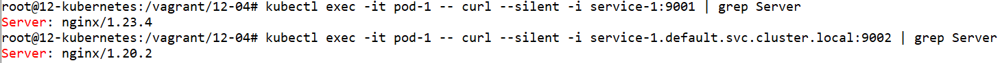

# Домашнее задание к занятию «Сетевое взаимодействие в K8S. Часть 1»

### Цель задания

В тестовой среде Kubernetes необходимо обеспечить доступ к приложению, установленному в предыдущем ДЗ и состоящему из двух контейнеров, по разным портам в разные контейнеры как внутри кластера, так и снаружи.

------

### Чеклист готовности к домашнему заданию

1. Установленное k8s-решение (например, MicroK8S).
2. Установленный локальный kubectl.
3. Редактор YAML-файлов с подключённым Git-репозиторием.

------

### Инструменты и дополнительные материалы, которые пригодятся для выполнения задания

1. [Описание](https://kubernetes.io/docs/concepts/workloads/controllers/deployment/) Deployment и примеры манифестов.
2. [Описание](https://kubernetes.io/docs/concepts/services-networking/service/) Описание Service.
3. [Описание](https://github.com/wbitt/Network-MultiTool) Multitool.

------

### Задание 1. Создать Deployment и обеспечить доступ к контейнерам приложения по разным портам из другого Pod внутри кластера

1. Создать Deployment приложения, состоящего из двух контейнеров (nginx и multitool), с количеством реплик 3 шт.
2. Создать Service, который обеспечит доступ внутри кластера до контейнеров приложения из п.1 по порту 9001 — nginx 80, по 9002 — multitool 8080.
3. Создать отдельный Pod с приложением multitool и убедиться с помощью `curl`, что из пода есть доступ до приложения из п.1 по разным портам в разные контейнеры.
4. Продемонстрировать доступ с помощью `curl` по доменному имени сервиса.
5. Предоставить манифесты Deployment и Service в решении, а также скриншоты или вывод команды п.4.

------

### Задание 2. Создать Service и обеспечить доступ к приложениям снаружи кластера

1. Создать отдельный Service приложения из Задания 1 с возможностью доступа снаружи кластера к nginx, используя тип NodePort.
2. Продемонстрировать доступ с помощью браузера или `curl` с локального компьютера.
3. Предоставить манифест и Service в решении, а также скриншоты или вывод команды п.2.

------

### Правила приёма работы

1. Домашняя работа оформляется в своем Git-репозитории в файле README.md. Выполненное домашнее задание пришлите ссылкой на .md-файл в вашем репозитории.
2. Файл README.md должен содержать скриншоты вывода необходимых команд `kubectl` и скриншоты результатов.
3. Репозиторий должен содержать тексты манифестов или ссылки на них в файле README.md.


------

# Ответ

- Проведём установку MicroK8S из прошлого задания

    ```
    apt-get install ca-certificates curl gnupg lsb-release
    mkdir -p /etc/apt/keyrings
    curl -fsSL https://download.docker.com/linux/ubuntu/gpg | gpg --dearmor -o /etc/apt/keyrings/docker.gpg
    echo "deb [arch=$(dpkg --print-architecture) signed-by=/etc/apt/keyrings/docker.gpg] https://download.docker.com/linux/ubuntu $(lsb_release -cs) stable" | tee /etc/apt/sources.list.d/docker.list > /dev/null
    apt-get update
    apt-get install docker-ce docker-ce-cli containerd.io docker-compose-plugin docker-compose

    apt update
    apt install snapd
    snap install microk8s --classic
    usermod -a -G microk8s $USER
    chown -f -R $USER ~/.kube
    microk8s enable dashboard
    microk8s enable dns

    apt-get install -y ca-certificates curl
    curl -fsSLo /etc/apt/keyrings/kubernetes-archive-keyring.gpg https://packages.cloud.google.com/apt/doc/apt-key.gpg
    echo "deb [signed-by=/etc/apt/keyrings/kubernetes-archive-keyring.gpg] https://apt.kubernetes.io/ kubernetes-xenial main" | tee /etc/apt/sources.list.d/kubernetes.list
    apt-get update
    apt-get install kubectl

    kubectl get nodes

    NAME            STATUS   ROLES    AGE    VERSION
    12-kubernetes   Ready    <none>   6d5h   v1.26.3

    microk8s kubectl get pod -A

    NAMESPACE     NAME                                        READY   STATUS    RESTARTS        AGE
    kube-system   kubernetes-dashboard-dc96f9fc-rdnrv         1/1     Running   2 (6h58m ago)   6d5h
    kube-system   dashboard-metrics-scraper-7bc864c59-24q6w   1/1     Running   2 (6h58m ago)   6d5h
    kube-system   metrics-server-6f754f88d-4dgc4              1/1     Running   2 (6h58m ago)   6d5h
    kube-system   calico-node-hvv7c                           1/1     Running   0               6h42m
    kube-system   calico-kube-controllers-64969df687-zzjvs    1/1     Running   0               6h42m
    ```

## Задание 1.

### 1. Создать Deployment приложения, состоящего из двух контейнеров (nginx и multitool), с количеством реплик 3 шт.

- Создадим файл `deployment-1.yml` с развёртыванием двух контейнеров и количеством реплик 3.

    ```
    ---
    apiVersion: apps/v1
    kind: Deployment
    metadata:
      labels:
        app: deployment-1
      name: deployment-1
      namespace: default
    spec:
      replicas: 3
      selector:
        matchLabels:
          app: deployment-1
      template:
        metadata:
          labels:
            app: deployment-1
        spec:
          containers:
            - name: nginx
              image: nginx:latest
              ports:
                - name: http
                  containerPort: 80
                  protocol: TCP
            - name: multitool
              image: wbitt/network-multitool
              ports:
                - name: http-8080
                  containerPort: 8080
                  protocol: TCP
              env:
                - name: HTTP_PORT
                  value: "8080"
                - name: HTTPS_PORT
                  value: "11443"
    ```

    

- Запускаем развёртывание командой `kubectl create -f deployment-1.yml`

- Проверяем состояние подов командой `kubectl get pods`

    ```
    kubectl get pods

    NAME                            READY   STATUS    RESTARTS   AGE
    deployment-1-74548cd6b4-xh2cx   2/2     Running   0          15s
    deployment-1-74548cd6b4-gqfd5   2/2     Running   0          15s
    deployment-1-74548cd6b4-rm79k   2/2     Running   0          15s
    ```

    


### 2. Создать Service, который обеспечит доступ внутри кластера до контейнеров приложения из п.1 по порту 9001 — nginx 80, по 9002 — multitool 8080.

- Создадим файл `service-1.yml` с развёртыванием сервиса.

    ```
    ---
    apiVersion: v1
    kind: Service
    metadata:
      name: service-1
    spec:
      selector:
        app: deployment-1
      ports:
        - name: nginx-http
          port: 9001
          protocol: TCP
          targetPort: 80
        - name: multitool-http
          port: 9002
          protocol: TCP
          targetPort: 8080
    ```

    

- Запускаем развёртывание командой `kubectl create -f service-1.yml`

- Проверяем состояние сервиса командой `kubectl get service`

    ```
    kubectl get service

    NAME         TYPE        CLUSTER-IP      EXTERNAL-IP   PORT(S)             AGE
    kubernetes   ClusterIP   10.152.183.1    <none>        443/TCP             20d
    service-1    ClusterIP   10.152.183.59   <none>        9001/TCP,9002/TCP   9s
    ```

    


### 3. Создать отдельный Pod с приложением multitool и убедиться с помощью `curl`, что из пода есть доступ до приложения из п.1 по разным портам в разные контейнеры.

- Создадим файл `pod-1.yml` с развёртыванием пода.

    ```
    ---
    apiVersion: v1
    kind: Pod
    metadata:
      name: pod-1
      labels:
        app: pod-1
    spec:
      containers:
        - name: multitool
          image: wbitt/network-multitool
          ports:
            - name: http-1080
              containerPort: 1080
              protocol: TCP
          env:
            - name: HTTP_PORT
              value: "1080"
            - name: HTTPS_PORT
              value: "10443"
    ```

    


- Запускаем развёртывание командой `kubectl create -f pod-1.yml`

- Проверяем состояние подов командой `kubectl get pod`

    ```
    kubectl get pod -o wide

    NAME                            READY   STATUS    RESTARTS   AGE     IP           NODE            NOMINATED NODE   READINESS GATES
    deployment-1-74548cd6b4-xh2cx   2/2     Running   0          4m46s   10.1.2.100   12-kubernetes   <none>           <none>
    deployment-1-74548cd6b4-gqfd5   2/2     Running   0          4m46s   10.1.2.101   12-kubernetes   <none>           <none>
    deployment-1-74548cd6b4-rm79k   2/2     Running   0          4m46s   10.1.2.102   12-kubernetes   <none>           <none>
    pod-1                           1/1     Running   0          23s     10.1.2.103   12-kubernetes   <none>           <none>
    ```

    


- Проверим результат команды curl из пода multitool

    - У нас есть следующие IP адреса:

        - Pod IP:

            - 10.1.2.100
            - 10.1.2.101
            - 10.1.2.102

        - Service IP:

            - 10.152.183.59

    - У нас есть следующие порты:

        - Pod port:

            - 80
            - 8080

        - Service port:

            - 9001
            - 9002

    - Запустим проверки портов из пода multitool:

        - До подов:

            ```
            kubectl exec -it pod-1 -- curl --silent -i 10.1.2.100:80 | grep Server
            kubectl exec -it pod-1 -- curl --silent -i 10.1.2.101:8080 | grep Server
            ```

            

        - До сервисов:

            ```
            kubectl exec -it pod-1 -- curl --silent -i 10.152.183.59:9001 | grep Server
            kubectl exec -it pod-1 -- curl --silent -i 10.152.183.59:9002 | grep Server
            ```

            

    Увидим, что сетевой доступ до подов и сервисов возможен из другого пода.


### 4. Продемонстрировать доступ с помощью `curl` по доменному имени сервиса.


- Проверим запуск curl из пода multitool

    ```
    kubectl exec -it pod-1 -- curl --silent -i service-1:9001 | grep Server
    kubectl exec -it pod-1 -- curl --silent -i service-1.default.svc.cluster.local:9002 | grep Server
    ```

    

    Увидим, что доступ по относительному и абсолютному DNS имени сервиса возможен из другого пода.


### 5. Предоставить манифесты Deployment и Service в решении, а также скриншоты или вывод команды п.4.


- Удалим развёрнутые ресурсы

    ```
    kubectl delete -f service-1.yml
    ```


## Задание 2.

### 1. Создать отдельный Service приложения из Задания 1 с возможностью доступа снаружи кластера к nginx, используя тип NodePort.


- Создадим файл `service-2.yml` с развёртыванием сервиса.

    ```
    ---
    apiVersion: v1
    kind: Service
    metadata:
      name: service-2
    spec:
      type: NodePort
      selector:
        app: deployment-1
      ports:
        - name: nginx-http
          port: 9001
          nodePort: 30000
          protocol: TCP
          targetPort: 80
    ```

    

- Запускаем развёртывание командой `kubectl create -f service-2.yml`

- Проверяем состояние сервиса командой `kubectl get service`

    ```
    kubectl get service

    NAME         TYPE        CLUSTER-IP       EXTERNAL-IP   PORT(S)          AGE
    kubernetes   ClusterIP   10.152.183.1     <none>        443/TCP          20d
    service-2    NodePort    10.152.183.127   <none>        9001:30000/TCP   6s
    ```

    


### 2. Продемонстрировать доступ с помощью браузера или `curl` с локального компьютера.

- Проверим IP адрес нод

    ```
    kubectl get node -o yaml | grep IPv4Address

          projectcalico.org/IPv4Address: 192.168.1.121/24
    ```

- Проверим запуск curl из локального компьютера 

    ```
    curl --silent -i 192.168.1.121:30000 | findstr Server
    ```

    

    Увидим, что доступ до сервиса по адресу ноды возможен из локального компьютера.


### 3. Предоставить манифест и Service в решении, а также скриншоты или вывод команды п.2.


- Удалим развёрнутые ресурсы

    ```
    kubectl delete -f deployment-1.yml -f pod-1.yml -f service-2.yml
    ```


