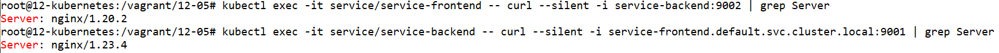

# Домашнее задание к занятию «Сетевое взаимодействие в K8S. Часть 2»

### Цель задания

В тестовой среде Kubernetes необходимо обеспечить доступ к двум приложениям снаружи кластера по разным путям.

------

### Чеклист готовности к домашнему заданию

1. Установленное k8s-решение (например, MicroK8S).
2. Установленный локальный kubectl.
3. Редактор YAML-файлов с подключённым Git-репозиторием.

------

### Инструменты и дополнительные материалы, которые пригодятся для выполнения задания

1. [Инструкция](https://microk8s.io/docs/getting-started) по установке MicroK8S.
2. [Описание](https://kubernetes.io/docs/concepts/services-networking/service/) Service.
3. [Описание](https://kubernetes.io/docs/concepts/services-networking/ingress/) Ingress.
4. [Описание](https://github.com/wbitt/Network-MultiTool) Multitool.

------

### Задание 1. Создать Deployment приложений backend и frontend

1. Создать Deployment приложения _frontend_ из образа nginx с количеством реплик 3 шт.
2. Создать Deployment приложения _backend_ из образа multitool. 
3. Добавить Service, которые обеспечат доступ к обоим приложениям внутри кластера. 
4. Продемонстрировать, что приложения видят друг друга с помощью Service.
5. Предоставить манифесты Deployment и Service в решении, а также скриншоты или вывод команды п.4.

------

### Задание 2. Создать Ingress и обеспечить доступ к приложениям снаружи кластера

1. Включить Ingress-controller в MicroK8S.
2. Создать Ingress, обеспечивающий доступ снаружи по IP-адресу кластера MicroK8S так, чтобы при запросе только по адресу открывался _frontend_ а при добавлении /api - _backend_.
3. Продемонстрировать доступ с помощью браузера или `curl` с локального компьютера.
4. Предоставить манифесты и скриншоты или вывод команды п.2.

------

### Правила приема работы

1. Домашняя работа оформляется в своем Git-репозитории в файле README.md. Выполненное домашнее задание пришлите ссылкой на .md-файл в вашем репозитории.
2. Файл README.md должен содержать скриншоты вывода необходимых команд `kubectl` и скриншоты результатов.
3. Репозиторий должен содержать тексты манифестов или ссылки на них в файле README.md.

------


# Ответ

- Проведём установку MicroK8S из прошлого задания

    ```
    apt-get install ca-certificates curl gnupg lsb-release
    mkdir -p /etc/apt/keyrings
    curl -fsSL https://download.docker.com/linux/ubuntu/gpg | gpg --dearmor -o /etc/apt/keyrings/docker.gpg
    echo "deb [arch=$(dpkg --print-architecture) signed-by=/etc/apt/keyrings/docker.gpg] https://download.docker.com/linux/ubuntu $(lsb_release -cs) stable" | tee /etc/apt/sources.list.d/docker.list > /dev/null
    apt-get update
    apt-get install docker-ce docker-ce-cli containerd.io docker-compose-plugin docker-compose

    apt update
    apt install snapd
    snap install microk8s --classic
    usermod -a -G microk8s $USER
    chown -f -R $USER ~/.kube
    microk8s enable dashboard
    microk8s enable dns

    apt-get install -y ca-certificates curl
    curl -fsSLo /etc/apt/keyrings/kubernetes-archive-keyring.gpg https://packages.cloud.google.com/apt/doc/apt-key.gpg
    echo "deb [signed-by=/etc/apt/keyrings/kubernetes-archive-keyring.gpg] https://apt.kubernetes.io/ kubernetes-xenial main" | tee /etc/apt/sources.list.d/kubernetes.list
    apt-get update
    apt-get install kubectl

    kubectl get nodes

    NAME            STATUS   ROLES    AGE    VERSION
    12-kubernetes   Ready    <none>   6d5h   v1.26.3

    microk8s kubectl get pod -A

    NAMESPACE     NAME                                        READY   STATUS    RESTARTS        AGE
    kube-system   kubernetes-dashboard-dc96f9fc-rdnrv         1/1     Running   2 (6h58m ago)   6d5h
    kube-system   dashboard-metrics-scraper-7bc864c59-24q6w   1/1     Running   2 (6h58m ago)   6d5h
    kube-system   metrics-server-6f754f88d-4dgc4              1/1     Running   2 (6h58m ago)   6d5h
    kube-system   calico-node-hvv7c                           1/1     Running   0               6h42m
    kube-system   calico-kube-controllers-64969df687-zzjvs    1/1     Running   0               6h42m
    ```

## Задание 1.


### 1. Создать Deployment приложения _frontend_ из образа nginx с количеством реплик 3 шт.

- Создадим файл `deployment-frontend.yml` с развёртыванием frontend с количеством реплик 3.

    ```
    ---
    apiVersion: apps/v1
    kind: Deployment
    metadata:
      labels:
        app: deployment-frontend
      name: deployment-frontend
      namespace: default
    spec:
      replicas: 3
      selector:
        matchLabels:
          app: deployment-frontend
      template:
        metadata:
          labels:
            app: deployment-frontend
        spec:
          containers:
            - name: nginx
              image: nginx:latest
              ports:
                - name: http
                  containerPort: 80
                  protocol: TCP
    ```

    

- Запускаем развёртывание командой `kubectl create -f deployment-frontend.yml`

- Проверяем состояние подов командой `kubectl get pods`

    ```
    kubectl get pods

    NAME                                   READY   STATUS    RESTARTS   AGE
    deployment-frontend-648fb7955c-cw296   1/1     Running   0          9s
    deployment-frontend-648fb7955c-q8z42   1/1     Running   0          9s
    deployment-frontend-648fb7955c-bqj79   1/1     Running   0          9s
    ```

    


### 2. Создать Deployment приложения _backend_ из образа multitool. 

- Создадим файл `deployment-backend.yml` с развёртыванием multitool.

    ```
    ---
    apiVersion: apps/v1
    kind: Deployment
    metadata:
      labels:
        app: deployment-backend
      name: deployment-backend
      namespace: default
    spec:
      replicas: 1
      selector:
        matchLabels:
          app: deployment-backend
      template:
        metadata:
          labels:
            app: deployment-backend
        spec:
          containers:
            - name: multitool
              image: wbitt/network-multitool
              ports:
                - name: http-8080
                  containerPort: 8080
                  protocol: TCP
              env:
                - name: HTTP_PORT
                  value: "8080"
                - name: HTTPS_PORT
                  value: "11443"
    ```

    

- Запускаем развёртывание командой `kubectl create -f deployment-backend.yml`

- Проверяем состояние подов командой `kubectl get pods`

    ```
    kubectl get pods

    NAME                                   READY   STATUS    RESTARTS   AGE
    deployment-frontend-648fb7955c-cw296   1/1     Running   0          88s
    deployment-frontend-648fb7955c-q8z42   1/1     Running   0          88s
    deployment-frontend-648fb7955c-bqj79   1/1     Running   0          88s
    deployment-backend-cb46d4f6d-kj6zq     1/1     Running   0          8s
    ```

    


### 3. Добавить Service, которые обеспечат доступ к обоим приложениям внутри кластера. 


- Создадим файл `service-frontend.yml` с развёртыванием сервиса для frontend.

    ```
    ---
    apiVersion: v1
    kind: Service
    metadata:
      name: service-frontend
    spec:
      selector:
        app: deployment-frontend
      ports:
        - name: nginx-http
          port: 9001
          protocol: TCP
          targetPort: 80
    ```

    

- Запускаем развёртывание командой `kubectl create -f service-frontend.yml`

- Создадим файл `service-backend.yml` с развёртыванием сервиса для backend.

    ```
    ---
    apiVersion: v1
    kind: Service
    metadata:
      name: service-backend
    spec:
      selector:
        app: deployment-backend
      ports:
        - name: multitool-http
          port: 9002
          protocol: TCP
          targetPort: 8080
    ```

    

- Запускаем развёртывание командой `kubectl create -f service-backend.yml`

- Проверяем состояние сервиса командой `kubectl get service`

    ```
    kubectl get service

    NAME               TYPE        CLUSTER-IP       EXTERNAL-IP   PORT(S)    AGE
    kubernetes         ClusterIP   10.152.183.1     <none>        443/TCP    22d
    service-frontend   ClusterIP   10.152.183.232   <none>        9001/TCP   31s
    service-backend    ClusterIP   10.152.183.102   <none>        9002/TCP   14s
    ```

    


### 4. Продемонстрировать, что приложения видят друг друга с помощью Service.


- Проверим запуск curl из сервисов

    ```
    kubectl exec -it service/service-frontend -- curl --silent -i service-backend:9002 | grep Server
    kubectl exec -it service/service-backend -- curl --silent -i service-frontend.default.svc.cluster.local:9001 | grep Server
    ```

    

    Увидим, что доступ по относительному и абсолютному DNS имени сервиса возможен из другого сервиса.


### 5. Предоставить манифесты Deployment и Service в решении, а также скриншоты или вывод команды п.4.

## Задание 2.

### 1. Включить Ingress-controller в MicroK8S.

- Включим ingress контроллер командой `microk8s enable ingress`


### 2. Создать Ingress, обеспечивающий доступ снаружи по IP-адресу кластера MicroK8S так, чтобы при запросе только по адресу открывался _frontend_ а при добавлении /api - _backend_.

- Создадим файл `ingress-1.yml` с развёртыванием ingress правила.

    ```
    ---
    apiVersion: networking.k8s.io/v1
    kind: Ingress
    metadata:
      name: ingress-1
      annotations:
        nginx.ingress.kubernetes.io/rewrite-target: /
    spec:
      rules:
      - http:
          paths:
          - path: /
            pathType: Prefix
            backend:
              service:
                name: service-frontend
                port:
                  number: 9001
          - path: /api
            pathType: Prefix
            backend:
              service:
                name: service-backend
                port:
                  number: 9002
    ```

    

    Аннотация `nginx.ingress.kubernetes.io/rewrite-target: /` важна, поскольку она переписывает путь URL с `/api` на `/` перед передачей запроса на внутренний сервис. Это позволяет внутренней службе обрабатывать запросы без необходимости специально реализовывать логику для `/api`.

    Если мы удалим аннотацию `rewrite-target`, контроллер Ingress не будет переписывать путь и будет пересылать запросы на backend сервис с префиксом `/api`. Backend сервис должен знать об этом префиксе и правильно обрабатывать запрос. Если backend сервис не настроен на обработку префикса `/api`, запрос приведёт к ошибке 404.

- Запускаем развёртывание командой `kubectl create -f ingress-1.yml`

- Проверяем состояние подов командой `kubectl describe ingress`

    ```
    kubectl describe ingress

    Name:             ingress-1
    Labels:           <none>
    Namespace:        default
    Address:          127.0.0.1
    Ingress Class:    public
    Default backend:  <default>
    Rules:
      Host        Path  Backends
      ----        ----  --------
      *
                  /      service-frontend:9001 (10.1.2.114:80,10.1.2.115:80,10.1.2.117:80)
                  /api   service-backend:9002 (10.1.2.116:8080)
    Annotations:  nginx.ingress.kubernetes.io/rewrite-target: /
    Events:
      Type    Reason  Age                From                      Message
      ----    ------  ----               ----                      -------
      Normal  Sync    16s (x2 over 39s)  nginx-ingress-controller  Scheduled for sync
    ```

    


### 3. Продемонстрировать доступ с помощью браузера или `curl` с локального компьютера.

- Проверим IP адрес нод

    ```
    kubectl get node -o yaml | grep IPv4Address

          projectcalico.org/IPv4Address: 192.168.1.121/24
    ```

- Проверим запуск curl из локального компьютера 

    ```
    curl --silent -i 192.168.1.121 | findstr Welcome
    curl --silent -i 192.168.1.121/api | findstr WBITT
    ```

    

    Увидим, что доступ по адресу ноды в зависимости от префикса URL подключается либо к frontend сервису, либо к backend сервису.


### 4. Предоставить манифесты и скриншоты или вывод команды п.2.

- Удалим развёрнутые ресурсы

    ```
    kubectl delete -f deployment-frontend.yml -f deployment-backend.yml -f service-frontend.yml -f service-backend.yml -f ingress-1.yml.yml
    ```
