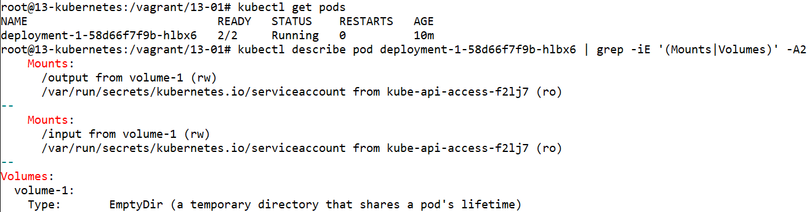
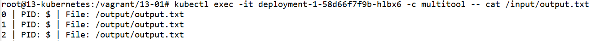
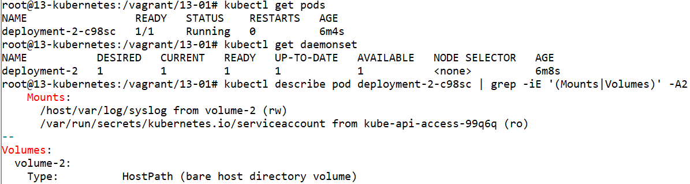
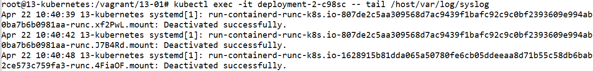

# Домашнее задание к занятию «Хранение в K8s. Часть 1»

### Цель задания

В тестовой среде Kubernetes нужно обеспечить обмен файлами между контейнерам пода и доступ к логам ноды.

------

### Чеклист готовности к домашнему заданию

1. Установленное K8s-решение (например, MicroK8S).
2. Установленный локальный kubectl.
3. Редактор YAML-файлов с подключенным GitHub-репозиторием.

------

### Дополнительные материалы для выполнения задания

1. [Инструкция по установке MicroK8S](https://microk8s.io/docs/getting-started).
2. [Описание Volumes](https://kubernetes.io/docs/concepts/storage/volumes/).
3. [Описание Multitool](https://github.com/wbitt/Network-MultiTool).

------

### Задание 1 

**Что нужно сделать**

Создать Deployment приложения, состоящего из двух контейнеров и обменивающихся данными.

1. Создать Deployment приложения, состоящего из контейнеров busybox и multitool.
2. Сделать так, чтобы busybox писал каждые пять секунд в некий файл в общей директории.
3. Обеспечить возможность чтения файла контейнером multitool.
4. Продемонстрировать, что multitool может читать файл, который периодоически обновляется.
5. Предоставить манифесты Deployment в решении, а также скриншоты или вывод команды из п. 4.

------

### Задание 2

**Что нужно сделать**

Создать DaemonSet приложения, которое может прочитать логи ноды.

1. Создать DaemonSet приложения, состоящего из multitool.
2. Обеспечить возможность чтения файла `/var/log/syslog` кластера MicroK8S.
3. Продемонстрировать возможность чтения файла изнутри пода.
4. Предоставить манифесты Deployment, а также скриншоты или вывод команды из п. 2.

------

### Правила приёма работы

1. Домашняя работа оформляется в своём Git-репозитории в файле README.md. Выполненное задание пришлите ссылкой на .md-файл в вашем репозитории.
2. Файл README.md должен содержать скриншоты вывода необходимых команд `kubectl`, а также скриншоты результатов.
3. Репозиторий должен содержать тексты манифестов или ссылки на них в файле README.md.

------


# Ответ

- Проведём установку MicroK8S из прошлого задания

    ```
    apt-get install ca-certificates curl gnupg lsb-release
    mkdir -p /etc/apt/keyrings
    curl -fsSL https://download.docker.com/linux/ubuntu/gpg | gpg --dearmor -o /etc/apt/keyrings/docker.gpg
    echo "deb [arch=$(dpkg --print-architecture) signed-by=/etc/apt/keyrings/docker.gpg] https://download.docker.com/linux/ubuntu $(lsb_release -cs) stable" | tee /etc/apt/sources.list.d/docker.list > /dev/null
    apt-get update
    apt-get install docker-ce docker-ce-cli containerd.io docker-compose-plugin docker-compose

    apt update
    apt install snapd
    snap install microk8s --classic
    usermod -a -G microk8s $USER
    chown -f -R $USER ~/.kube
    microk8s enable dashboard
    microk8s enable dns
    microk8s enable ingress

    apt-get install -y ca-certificates curl
    curl -fsSLo /etc/apt/keyrings/kubernetes-archive-keyring.gpg https://packages.cloud.google.com/apt/doc/apt-key.gpg
    echo "deb [signed-by=/etc/apt/keyrings/kubernetes-archive-keyring.gpg] https://apt.kubernetes.io/ kubernetes-xenial main" | tee /etc/apt/sources.list.d/kubernetes.list
    apt-get update
    apt-get install kubectl
    microk8s config > ~/.kube/config

    kubectl get nodes

    NAME            STATUS   ROLES    AGE   VERSION
    13-kubernetes   Ready    <none>   16m   v1.26.3
    ```

## Задание 1.


### 1. Создать Deployment приложения, состоящего из контейнеров busybox и multitool.

### 2. Сделать так, чтобы busybox писал каждые пять секунд в некий файл в общей директории.

### 3. Обеспечить возможность чтения файла контейнером multitool.

- Создадим файл `deployment-1.yml` с развёртыванием двух контейнеров с общим томом. 

    ```
    ---
    apiVersion: apps/v1
    kind: Deployment
    metadata:
      name: deployment-1
      labels:
        app: deployment-1
      namespace: default
    spec:
      replicas: 1
      selector:
        matchLabels:
          app: deployment-1
      template:
        metadata:
          labels:
            app: deployment-1
        spec:
          containers:
            - name: busybox
              image: busybox
              command: ['sh', '-c', 'i=0; file="/output/output.txt"; while true; do echo "$((i++)) | PID: $$ | File: $(readlink -f $file)" >> $file; sleep 5; done']
              volumeMounts:
                - name: volume-1
                  mountPath: /output
            - name: multitool
              image: wbitt/network-multitool
              volumeMounts:
                - name: volume-1
                  mountPath: /input
          volumes:
            - name: volume-1
              emptyDir: {}
    ```

    

- Запускаем развёртывание командой `kubectl create -f deployment-1.yml`

- Проверяем состояние подов командой `kubectl get pods` и `kubectl describe pod`

    ```
    kubectl get pods

    NAME                            READY   STATUS    RESTARTS   AGE
    deployment-1-58d66f7f9b-hlbx6   2/2     Running   0          10m


    kubectl describe pod deployment-1-58d66f7f9b-hlbx6 | grep -iE '(Mounts|Volumes)' -A2

        Mounts:
          /output from volume-1 (rw)
          /var/run/secrets/kubernetes.io/serviceaccount from kube-api-access-f2lj7 (ro)
    --
        Mounts:
          /input from volume-1 (rw)
          /var/run/secrets/kubernetes.io/serviceaccount from kube-api-access-f2lj7 (ro)
    --
    Volumes:
      volume-1:
        Type:       EmptyDir (a temporary directory that shares a pod's lifetime)

    ```

    

### 4. Продемонстрировать, что multitool может читать файл, который периодоически обновляется.

- Проверим чтение файла из контейнера

    ```
    kubectl exec -it deployment-1-58d66f7f9b-hlbx6 -c multitool -- cat /input/output.txt

    0 | PID: $ | File: /output/output.txt
    1 | PID: $ | File: /output/output.txt
    2 | PID: $ | File: /output/output.txt
    ...
    ```

    

    Увидим, что доступ к файлу, записанному в одном контейнере, возможен из другого контейнера.

### 5. Предоставить манифесты Deployment в решении, а также скриншоты или вывод команды из п. 4.

- Удалим развёрнутые ресурсы

    ```
    kubectl delete -f deployment-1.yml
    ```


## Задание 2.

### 1. Создать DaemonSet приложения, состоящего из multitool.

### 2. Обеспечить возможность чтения файла `/var/log/syslog` кластера MicroK8S.

- Создадим файл `deployment-2.yml` с развёртыванием контейнера с доступом к локальному файлу. 

    ```
    ---
    apiVersion: apps/v1
    kind: DaemonSet
    metadata:
      name: deployment-2
      labels:
        app: deployment-2
      namespace: default
    spec:
      selector:
        matchLabels:
          app: deployment-2
      template:
        metadata:
          labels:
            app: deployment-2
        spec:
          containers:
            - name: multitool
              image: wbitt/network-multitool
              volumeMounts:
                - name: volume-2
                  mountPath: /host/var/log/syslog
          volumes:
            - name: volume-2
              hostPath:
                path: /var/log/syslog
    ```

    

- Запускаем развёртывание командой `kubectl create -f deployment-2.yml`

- Проверяем состояние подов командой `kubectl get pods`, `kubectl get daemonset` и `kubectl describe pod`

    ```
    kubectl get pods

    NAME                 READY   STATUS    RESTARTS   AGE
    deployment-2-c98sc   1/1     Running   0          64s

    kubectl get daemonset

    NAME           DESIRED   CURRENT   READY   UP-TO-DATE   AVAILABLE   NODE SELECTOR   AGE
    deployment-2   1         1         1       1            1           <none>          69s


    kubectl describe pod deployment-2-c98sc | grep -iE '(Mounts|Volumes)' -A2

        Mounts:
          /host/var/log/syslog from volume-2 (rw)
          /var/run/secrets/kubernetes.io/serviceaccount from kube-api-access-99q6q (ro)
    --
    Volumes:
      volume-2:
        Type:          HostPath (bare host directory volume)
    ```

    

### 3. Продемонстрировать возможность чтения файла изнутри пода.

- Проверим чтение файла из пода

    ```
    kubectl exec -it deployment-2-c98sc -- tail /host/var/log/syslog

    Apr 22 10:40:39 13-kubernetes systemd[1]: run-containerd-runc-k8s.io-807de2c5aa309568d7ac9439f1bafc92c9c0bf2393609e994ab0ba7b6b0981aa-runc.xf2PwL.mount: Deactivated successfully.
    Apr 22 10:40:42 13-kubernetes systemd[1]: run-containerd-runc-k8s.io-807de2c5aa309568d7ac9439f1bafc92c9c0bf2393609e994ab0ba7b6b0981aa-runc.J7B4Rd.mount: Deactivated successfully.
    ...
    ```

    

    Увидим, что доступ к файлу, находящемуся на локальной машине, доступен из пода.

### 4. Предоставить манифесты Deployment, а также скриншоты или вывод команды из п. 2.

- Удалим развёрнутые ресурсы

    ```
    kubectl delete -f deployment-2.yml
    ```
