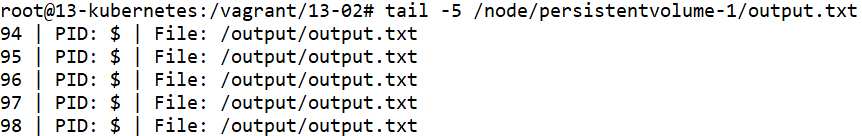

# Домашнее задание к занятию «Хранение в K8s. Часть 1»

### Цель задания

В тестовой среде Kubernetes нужно обеспечить обмен файлами между контейнерам пода и доступ к логам ноды.

------

### Чеклист готовности к домашнему заданию

1. Установленное K8s-решение (например, MicroK8S).
2. Установленный локальный kubectl.
3. Редактор YAML-файлов с подключенным GitHub-репозиторием.

# Домашнее задание к занятию «Хранение в K8s. Часть 2»

### Цель задания

В тестовой среде Kubernetes нужно создать PV и продемострировать запись и хранение файлов.

------

### Чеклист готовности к домашнему заданию

1. Установленное K8s-решение (например, MicroK8S).
2. Установленный локальный kubectl.
3. Редактор YAML-файлов с подключенным GitHub-репозиторием.

------

### Дополнительные материалы для выполнения задания

1. [Инструкция по установке NFS в MicroK8S](https://microk8s.io/docs/nfs). 
2. [Описание Persistent Volumes](https://kubernetes.io/docs/concepts/storage/persistent-volumes/). 
3. [Описание динамического провижининга](https://kubernetes.io/docs/concepts/storage/dynamic-provisioning/). 
4. [Описание Multitool](https://github.com/wbitt/Network-MultiTool).

------

### Задание 1

**Что нужно сделать**

Создать Deployment приложения, использующего локальный PV, созданный вручную.

1. Создать Deployment приложения, состоящего из контейнеров busybox и multitool.
2. Создать PV и PVC для подключения папки на локальной ноде, которая будет использована в поде.
3. Продемонстрировать, что multitool может читать файл, в который busybox пишет каждые пять секунд в общей директории. 
4. Удалить Deployment и PVC. Продемонстрировать, что после этого произошло с PV. Пояснить, почему.
5. Продемонстрировать, что файл сохранился на локальном диске ноды. Удалить PV.  Продемонстрировать что произошло с файлом после удаления PV. Пояснить, почему.
5. Предоставить манифесты, а также скриншоты или вывод необходимых команд.

------

### Задание 2

**Что нужно сделать**

Создать Deployment приложения, которое может хранить файлы на NFS с динамическим созданием PV.

1. Включить и настроить NFS-сервер на MicroK8S.
2. Создать Deployment приложения состоящего из multitool, и подключить к нему PV, созданный автоматически на сервере NFS.
3. Продемонстрировать возможность чтения и записи файла изнутри пода. 
4. Предоставить манифесты, а также скриншоты или вывод необходимых команд.

------


# Ответ

- Проведём установку MicroK8S из прошлого задания

    ```
    apt-get install ca-certificates curl gnupg lsb-release
    mkdir -p /etc/apt/keyrings
    curl -fsSL https://download.docker.com/linux/ubuntu/gpg | gpg --dearmor -o /etc/apt/keyrings/docker.gpg
    echo "deb [arch=$(dpkg --print-architecture) signed-by=/etc/apt/keyrings/docker.gpg] https://download.docker.com/linux/ubuntu $(lsb_release -cs) stable" | tee /etc/apt/sources.list.d/docker.list > /dev/null
    apt-get update
    apt-get install docker-ce docker-ce-cli containerd.io docker-compose-plugin docker-compose

    apt update
    apt install snapd
    snap install microk8s --classic
    usermod -a -G microk8s $USER
    chown -f -R $USER ~/.kube
    microk8s enable dashboard
    microk8s enable dns
    microk8s enable ingress

    apt-get install -y ca-certificates curl
    curl -fsSLo /etc/apt/keyrings/kubernetes-archive-keyring.gpg https://packages.cloud.google.com/apt/doc/apt-key.gpg
    echo "deb [signed-by=/etc/apt/keyrings/kubernetes-archive-keyring.gpg] https://apt.kubernetes.io/ kubernetes-xenial main" | tee /etc/apt/sources.list.d/kubernetes.list
    apt-get update
    apt-get install kubectl
    microk8s config > ~/.kube/config

    kubectl get nodes

    NAME            STATUS   ROLES    AGE   VERSION
    13-kubernetes   Ready    <none>   16m   v1.26.3
    ```

## Задание 1.


### 1. Создать Deployment приложения, состоящего из контейнеров busybox и multitool.

### 2. Создать PV и PVC для подключения папки на локальной ноде, которая будет использована в поде.


- Создадим папку на локальном хосте для использования в качестве тома
    ```
    mkdir -p /node/persistentvolume-1
    ```

- Включим в mikrok8s поддержку локального хранения

    ```
    microk8s enable hostpath-storage
    ```

- Создадим файл `persistentvolume-1.yml` с развёртыванием постоянного тома. 

    ```

    ```

    

- Создадим файл `persistentvolumeclaim-1.yml` с развёртыванием заявки на том. 

    ```

    ```

    


- Запускаем развёртывание командой `kubectl apply -f persistentvolume-1.yml -f persistentvolumeclaim-1.yml`

- Проверяем состояние томов и их заявок командой `kubectl get persistentvolume,persistentvolumeclaim`

    ```
    kubectl get persistentvolume,persistentvolumeclaim
    NAME                                  CAPACITY   ACCESS MODES   RECLAIM POLICY   STATUS   CLAIM                             STORAGECLASS     REASON   AGE
    persistentvolume/persistentvolume-1   1Gi        RWO            Delete           Bound    default/persistentvolumeclaim-1   storageclass-1            63s

    NAME                                            STATUS   VOLUME               CAPACITY   ACCESS MODES   STORAGECLASS     AGE
    persistentvolumeclaim/persistentvolumeclaim-1   Bound    persistentvolume-1   1Gi        RWO            storageclass-1   63s
    ```

    


- Создадим файл `deployment-1.yml` с развёртыванием двух контейнеров с общим томом. 

    ```

    ```

    

- Запускаем развёртывание командой `kubectl apply -f deployment-1.yml`

- Проверяем состояние подов командой `kubectl get pods` и `kubectl describe pod`

    ```
    kubectl get pods
    NAME                            READY   STATUS    RESTARTS   AGE
    deployment-1-5899f984f6-lf6wq   2/2     Running   0          2m17s

    kubectl describe pod deployment-1-5899f984f6-lf6wq | grep -iE '(Mounts|Volumes)' -A2
        Mounts:
          /output from volume-1 (rw)
          /var/run/secrets/kubernetes.io/serviceaccount from kube-api-access-wq8kc (ro)
    --
        Mounts:
          /input from volume-1 (rw)
          /var/run/secrets/kubernetes.io/serviceaccount from kube-api-access-wq8kc (ro)
    --
    Volumes:
      volume-1:
        Type:       PersistentVolumeClaim (a reference to a PersistentVolumeClaim in the same namespace)
    ```

    


### 3. Продемонстрировать, что multitool может читать файл, в который busybox пишет каждые пять секунд в общей директории. 

- Проверим чтение файла из контейнера

    ```
    kubectl exec -it deployment-1-5899f984f6-lf6wq -c multitool -- cat /input/output.txt

    0 | PID: $ | File: /output/output.txt
    1 | PID: $ | File: /output/output.txt
    2 | PID: $ | File: /output/output.txt
    ...
    ```

    

    Увидим, что доступ к файлу, записанному в одном контейнере, возможен из другого контейнера.


### 4. Удалить Deployment и PVC. Продемонстрировать, что после этого произошло с PV. Пояснить, почему.

- Удалим развёрнутый deployment и persistentvolumeclaim

    ```
    kubectl delete -f deployment-1.yml -f persistentvolumeclaim-1.yml
    ```

- Посмотрим состояние persistent volume командой `kubectl get persistentvolume` и `kubectl describe persistentvolume`

    ```
    kubectl get persistentvolume

    NAME                 CAPACITY   ACCESS MODES   RECLAIM POLICY   STATUS   CLAIM                             STORAGECLASS     REASON   AGE
    persistentvolume-1   1Gi        RWO            Delete           Failed   default/persistentvolumeclaim-1   storageclass-1            12m

    kubectl describe persistentvolume | grep -i Events -A3

    Events:
      Type     Reason              Age    From                         Message
      ----     ------              ----   ----                         -------
      Warning  VolumeFailedDelete  2m57s  persistentvolume-controller  host_path deleter only supports /tmp/.+ but received provided /node/persistentvolume-1
    ```

    

    Увидим, что том остался, статус тома поменялся на Failed.


### 5. Продемонстрировать, что файл сохранился на локальном диске ноды. Удалить PV.  Продемонстрировать что произошло с файлом после удаления PV. Пояснить, почему.

- Проверим файл на локальном диске ноды
    ```
    tail -5 /node/persistentvolume-1/output.txt

    94 | PID: $ | File: /output/output.txt
    95 | PID: $ | File: /output/output.txt
    96 | PID: $ | File: /output/output.txt
    97 | PID: $ | File: /output/output.txt
    98 | PID: $ | File: /output/output.txt
    ```

    

    Увидим, что файл сохранился на локальном диске ноды.

- Удалим развёрнутый persistent volume
    ```
    kubectl delete -f persistentvolume-1.yml
    ```

- Проверим файл на локальном диске после удаления persistentvolume
    ```
    ls -lah /node/persistentvolume-1/output.txt

    -rw-r--r-- 1 root root 3.8K May  7 13:35 /node/persistentvolume-1/output.txt
    ```

    

    Увидим, что файл остался на локальном хосте после удаления persistent volume. Вероятно это произошло потому что политику возврата с типом Delete поддерживают только облачные провайдеры: AWS EBS, GCE PD, Azure Disk и Cinder.

### 5. Предоставить манифесты, а также скриншоты или вывод необходимых команд.


## Задание 2.


### 1. Включить и настроить NFS-сервер на MicroK8S.

- Установим NFS сервер на локальном хосте
    ```
    apt-get install nfs-kernel-server
    ```

- Создадим папку на локальном хосте для использования в качестве шары
    ```
    mkdir -p /node/nfsserver-1
    chown nobody:nogroup /node/nfsserver-1
    chmod 0777 /node/nfsserver-1
    ```

- Добавим шару в NFS сервер
    ```
    echo '/node/nfsserver-1 10.0.0.0/8(rw,sync,no_subtree_check)' > /etc/exports
    echo '/node/nfsserver-1 192.168.0.0/16(rw,sync,no_subtree_check)' >> /etc/exports
    ```

- Перезапустим NFS сервер
    ```
    systemctl restart nfs-kernel-server
    ```

- Установим CSI драйвер для NFS с помощью Helm
    ```
    microk8s enable helm3
    microk8s helm3 repo add csi-driver-nfs https://raw.githubusercontent.com/kubernetes-csi/csi-driver-nfs/master/charts
    microk8s helm3 repo update
    microk8s helm3 install csi-driver-nfs csi-driver-nfs/csi-driver-nfs --namespace kube-system --set kubeletDir=/var/snap/microk8s/common/var/lib/kubelet
    ```


### 2. Создать Deployment приложения состоящего из multitool, и подключить к нему PV, созданный автоматически на сервере NFS.

- Создадим файл `storageclass-2.yml` с развёртыванием класса хранилища. 

    ```

    ```

    

- Запускаем развёртывание командой `kubectl apply -f storageclass-2.yml`

- Проверяем состояние класса хранилища командой `kubectl get storageclass`

    ```
    kubectl get storageclass storageclass-2

    NAME             PROVISIONER      RECLAIMPOLICY   VOLUMEBINDINGMODE   ALLOWVOLUMEEXPANSION   AGE
    storageclass-2   nfs.csi.k8s.io   Delete          Immediate           false                  19s
    ```

    

    Увидим, что класс хранилища развернулся.


- Создадим файл `persistentvolumeclaim-2.yml` с развёртыванием заявки на том. 

    ```

    ```

    


- Запускаем развёртывание командой `kubectl apply -f persistentvolumeclaim-2.yml`

- Проверяем состояние томов и их заявок командой `kubectl get persistentvolume,persistentvolumeclaim`

    ```
    kubectl get persistentvolume,persistentvolumeclaim

    NAME                                                        CAPACITY   ACCESS MODES   RECLAIM POLICY   STATUS   CLAIM                             STORAGECLASS     REASON   AGE
    persistentvolume/pvc-d15bc178-69d6-4837-9007-9c38105ec8ed   1Gi        RWO            Delete           Bound    default/persistentvolumeclaim-2   storageclass-2            3m46s

    NAME                                            STATUS   VOLUME                                     CAPACITY   ACCESS MODES   STORAGECLASS     AGE
    persistentvolumeclaim/persistentvolumeclaim-2   Bound    pvc-d15bc178-69d6-4837-9007-9c38105ec8ed   1Gi        RWO            storageclass-2   3m46s

    kubectl describe pvc | grep -i Events -A5

    Events:
      Type    Reason                 Age    From                                                               Message
      ----    ------                 ----   ----                                                               -------
      Normal  Provisioning           3m52s  nfs.csi.k8s.io_13-kubernetes_95fc45db-39eb-477f-af21-74a06978e18c  External provisioner is provisioning volume for claim "default/persistentvolumeclaim-2"
      Normal  ExternalProvisioning   3m52s  persistentvolume-controller                                        waiting for a volume to be created, either by external provisioner "nfs.csi.k8s.io" or manually created by system administrator
      Normal  ProvisioningSucceeded  3m52s  nfs.csi.k8s.io_13-kubernetes_95fc45db-39eb-477f-af21-74a06978e18c  Successfully provisioned volume pvc-d15bc178-69d6-4837-9007-9c38105ec8ed
    ```

    

    Увидим, что том развернулся автоматически (для этого не потребовалось отдельно разворачивать том).


- Создадим файл `deployment-2.yml` с развёртыванием контейнера с томом. 

    ```

    ```

    

- Запускаем развёртывание командой `kubectl apply -f deployment-2.yml`

- Проверяем состояние подов командой `kubectl get pods` и `kubectl describe pod`

    ```
    kubectl get pods

    NAME                            READY   STATUS    RESTARTS   AGE
    deployment-2-5ff688c8cf-nxxdb   1/1     Running   0          10s

    kubectl describe pod deployment-2-5ff688c8cf-nxxdb | grep -iE '(Mounts|Volumes)' -A2

        Mounts:
          /input from volume-2 (rw)
          /var/run/secrets/kubernetes.io/serviceaccount from kube-api-access-vxxrb (ro)
    --
    Volumes:
      volume-2:
        Type:       PersistentVolumeClaim (a reference to a PersistentVolumeClaim in the same namespace)
    ```

    


### 3. Продемонстрировать возможность чтения и записи файла изнутри пода. 

- Проверим запись и чтение файла из контейнера

    ```
    kubectl exec -it deployment-2-5ff688c8cf-nxxdb -c multitool -- sh -c "date > /input/output.txt"
    kubectl exec -it deployment-2-5ff688c8cf-nxxdb -c multitool -- cat /input/output.txt

    Sun May  7 15:42:45 UTC 2023
    ```

    

    Увидим, что файл доступен на запись и чтение из пода.

- Проверим файл на локальном диске ноды
    ```
    tail /node/nfsserver-1/pvc-d15bc178-69d6-4837-9007-9c38105ec8ed/output.txt

    Sun May  7 15:42:45 UTC 2023
    ```

    

    Увидим, что файл сохранился на локальном диске ноды.
    

### 4. Предоставить манифесты, а также скриншоты или вывод необходимых команд.


- Удалим развёрнутый deployment, persistentvolumeclaim и storageclass

    ```
    kubectl delete -f deployment-2.yml -f persistentvolumeclaim-2.yml -f storageclass-2.yml
    ```

- Посмотрим состояние persistent volume командой `kubectl get persistentvolume` 

    ```
    kubectl get persistentvolume

    No resources found
    ```

    

    Увидим, что том удалился автоматически (потому что мы удалили заявку на том, по которой он был создан)


- Проверим файл на локальном диске после удаления persistentvolume
    ```
    ls -lah /node/nfsserver-1/

    total 8.0K
    drwxrwxrwx 2 nobody nogroup 4.0K May  7 15:45 .
    drwxr-xr-x 4 root   root    4.0K May  7 14:05 ..
    ```

    

    Увидим, что данные на локальном хосте удалились вместе с томом. Значит делаем вывод:
    - При удалении заявки на том с hostPath: файл остаётся на локальном хосте
    - При удалении заявки на том, автоматически созданный по заявке: файл удаляется на локальном хосте

