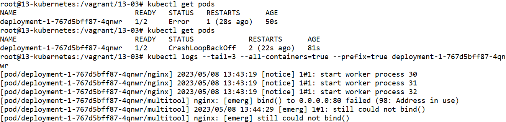
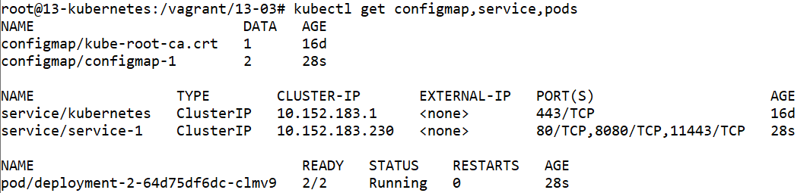
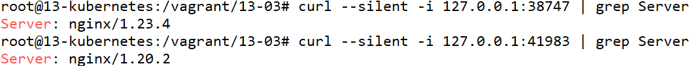
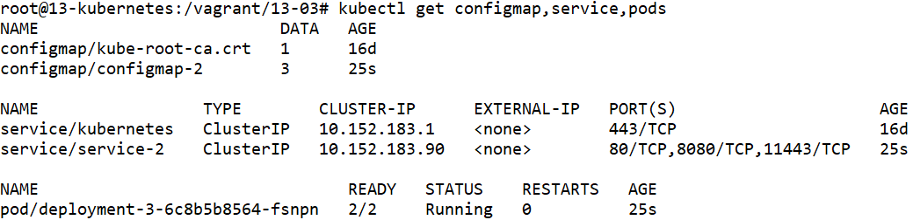
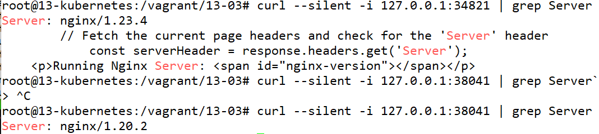
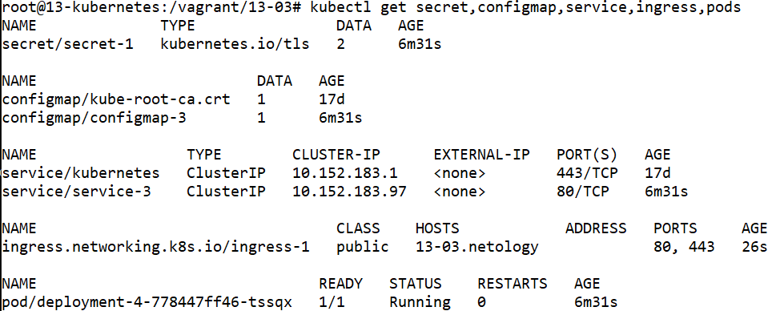
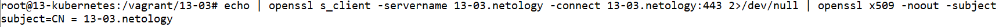
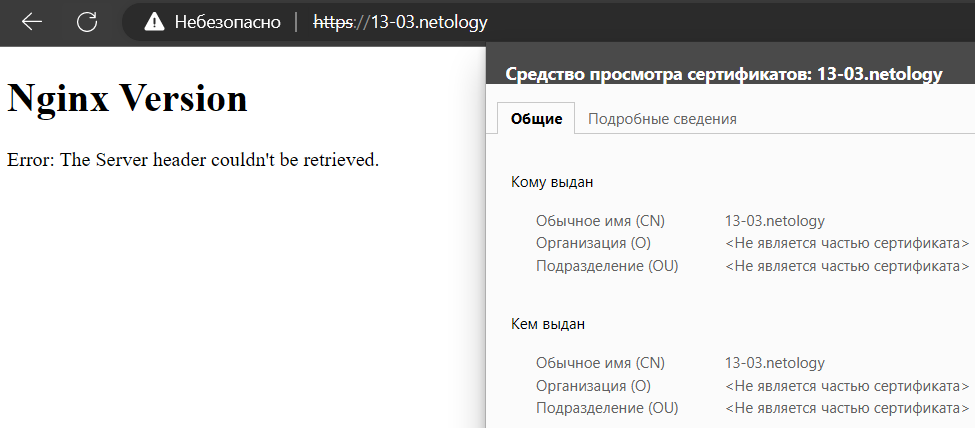

# Домашнее задание к занятию «Конфигурация приложений»

### Цель задания

В тестовой среде Kubernetes необходимо создать конфигурацию и продемонстрировать работу приложения.

------

### Чеклист готовности к домашнему заданию

1. Установленное K8s-решение (например, MicroK8s).
2. Установленный локальный kubectl.
3. Редактор YAML-файлов с подключённым GitHub-репозиторием.

------

### Инструменты и дополнительные материалы, которые пригодятся для выполнения задания

1. [Описание](https://kubernetes.io/docs/concepts/configuration/secret/) Secret.
2. [Описание](https://kubernetes.io/docs/concepts/configuration/configmap/) ConfigMap.
3. [Описание](https://github.com/wbitt/Network-MultiTool) Multitool.

------

### Задание 1. Создать Deployment приложения и решить возникшую проблему с помощью ConfigMap. Добавить веб-страницу

1. Создать Deployment приложения, состоящего из контейнеров busybox и multitool.
2. Решить возникшую проблему с помощью ConfigMap.
3. Продемонстрировать, что pod стартовал и оба конейнера работают.
4. Сделать простую веб-страницу и подключить её к Nginx с помощью ConfigMap. Подключить Service и показать вывод curl или в браузере.
5. Предоставить манифесты, а также скриншоты или вывод необходимых команд.

------

### Задание 2. Создать приложение с вашей веб-страницей, доступной по HTTPS 

1. Создать Deployment приложения, состоящего из Nginx.
2. Создать собственную веб-страницу и подключить её как ConfigMap к приложению.
3. Выпустить самоподписной сертификат SSL. Создать Secret для использования сертификата.
4. Создать Ingress и необходимый Service, подключить к нему SSL в вид. Продемонстировать доступ к приложению по HTTPS. 
4. Предоставить манифесты, а также скриншоты или вывод необходимых команд.

------


# Ответ

- Проведём установку MicroK8S из прошлого задания

    ```
    apt-get install ca-certificates curl gnupg lsb-release
    mkdir -p /etc/apt/keyrings
    curl -fsSL https://download.docker.com/linux/ubuntu/gpg | gpg --dearmor -o /etc/apt/keyrings/docker.gpg
    echo "deb [arch=$(dpkg --print-architecture) signed-by=/etc/apt/keyrings/docker.gpg] https://download.docker.com/linux/ubuntu $(lsb_release -cs) stable" | tee /etc/apt/sources.list.d/docker.list > /dev/null
    apt-get update
    apt-get install docker-ce docker-ce-cli containerd.io docker-compose-plugin docker-compose

    apt update
    apt install snapd
    snap install microk8s --classic
    usermod -a -G microk8s $USER
    chown -f -R $USER ~/.kube
    microk8s enable dashboard
    microk8s enable dns
    microk8s enable ingress
    microk8s enable hostpath-storage
    microk8s enable helm3
    microk8s helm3 repo add csi-driver-nfs https://raw.githubusercontent.com/kubernetes-csi/csi-driver-nfs/master/charts
    microk8s helm3 repo update
    microk8s helm3 install csi-driver-nfs csi-driver-nfs/csi-driver-nfs --namespace kube-system --set kubeletDir=/var/snap/microk8s/common/var/lib/kubelet

    apt-get install -y ca-certificates curl
    curl -fsSLo /etc/apt/keyrings/kubernetes-archive-keyring.gpg https://packages.cloud.google.com/apt/doc/apt-key.gpg
    echo "deb [signed-by=/etc/apt/keyrings/kubernetes-archive-keyring.gpg] https://apt.kubernetes.io/ kubernetes-xenial main" | tee /etc/apt/sources.list.d/kubernetes.list
    apt-get update
    apt-get install kubectl
    microk8s config > ~/.kube/config

    kubectl get nodes

    NAME            STATUS   ROLES    AGE   VERSION
    13-kubernetes   Ready    <none>   16m   v1.26.3
    ```

## Задание 1.

### 1. Создать Deployment приложения, состоящего из контейнеров busybox и multitool.

- Создадим файл `deployment-1.yml` с развёртыванием двух контейнеров с настройками по умолчанию.

    ```
    ---
    apiVersion: apps/v1
    kind: Deployment
    metadata:
      labels:
        app: deployment-1
      name: deployment-1
      namespace: default
    spec:
      replicas: 1
      selector:
        matchLabels:
          app: deployment-1
      template:
        metadata:
          labels:
            app: deployment-1
        spec:
          containers:
            - name: nginx
              image: nginx:latest
              ports:
                - name: http
                  containerPort: 80
                  protocol: TCP
            - name: multitool
              image: wbitt/network-multitool
              ports:
                - name: http-8080
                  containerPort: 8080
                  protocol: TCP
    ```

    

- Запускаем развёртывание командой `kubectl apply -f deployment-1.yml`

- Проверяем состояние подов командой `kubectl get pods` 
    ```
    kubectl get pods

    NAME                            READY   STATUS             RESTARTS      AGE
    deployment-1-767d5bff87-4qnwr   1/2     CrashLoopBackOff   2 (22s ago)   81s
    ```

- Проверим логи пода командой `kubectl logs`
    ```
    kubectl logs --tail=3 --all-containers=true --prefix=true deployment-1-767d5bff87-4qnwr

    [pod/deployment-1-767d5bff87-4qnwr/multitool] nginx: [emerg] bind() to 0.0.0.0:80 failed (98: Address in use)
    [pod/deployment-1-767d5bff87-4qnwr/multitool] 2023/05/08 13:44:29 [emerg] 1#1: still could not bind()
    [pod/deployment-1-767d5bff87-4qnwr/multitool] nginx: [emerg] still could not bind()
    ```

    

    Делаем вывод об ошибке `bind() to 0.0.0.0:80 failed (98: Address in use)`, что контейнер `multitool` не может подключиться к порту `80`. Следуя [описанию на сайте Multitool](https://github.com/wbitt/Network-MultiTool#configurable-http-and-https-ports) поменяем порты через переменные окружения.

- Выключим неработающий манифест командой `kubectl delete -f deployment-1.yml`


### 2. Решить возникшую проблему с помощью ConfigMap.

- Создадим файл `configmap-1.yml` с конфигурацией портов.

    ```
    ---
    apiVersion: v1
    kind: ConfigMap
    metadata:
      name: configmap-1
    data:
      http-port: "8080"
      https-port: "11443"
    ```

    

- Создадим файл `service-1.yml` с конфигурацией сервиса

    ```
    ---
    apiVersion: v1
    kind: Service
    metadata:
      name: service-1
    spec:
      selector:
        app: deployment-2
      ports:
        - name: nginx-http
          port: 80
          protocol: TCP
          targetPort: 80
        - name: multitool-http
          port: 8080
          protocol: TCP
          targetPort: 8080
        - name: multitool-https
          port: 11443
          protocol: TCP
          targetPort: 11443
    ```

    

- Создадим файл `deployment-2.yml` с развёртыванием двух контейнеров с переменными окружения.

    ```
    ---
    apiVersion: apps/v1
    kind: Deployment
    metadata:
      labels:
        app: deployment-2
      name: deployment-2
      namespace: default
    spec:
      replicas: 1
      selector:
        matchLabels:
          app: deployment-2
      template:
        metadata:
          labels:
            app: deployment-2
        spec:
          containers:
            - name: nginx
              image: nginx:latest
              ports:
                - name: http
                  containerPort: 80
                  protocol: TCP
            - name: multitool
              image: wbitt/network-multitool
              ports:
                - name: http-8080
                  containerPort: 8080
                  protocol: TCP
              env:
                - name: HTTP_PORT
                  valueFrom:
                    configMapKeyRef:
                      name: configmap-1
                      key: http-port
                - name: HTTPS_PORT
                  valueFrom:
                    configMapKeyRef:
                      name: configmap-1
                      key: https-port
    ```

    

- Запускаем развёртывание командой `kubectl apply -f configmap-1.yml -f service-1.yml -f deployment-2.yml`


### 3. Продемонстрировать, что pod стартовал и оба конейнера работают.

- Проверяем состояние подов командой `kubectl get configmap,service,pods`

    ```
    kubectl get configmap,service,pods
    NAME                         DATA   AGE
    configmap/configmap-1        2      28s

    NAME                 TYPE        CLUSTER-IP       EXTERNAL-IP   PORT(S)                     AGE
    service/service-1    ClusterIP   10.152.183.230   <none>        80/TCP,8080/TCP,11443/TCP   28s

    NAME                                READY   STATUS    RESTARTS   AGE
    pod/deployment-2-64d75df6dc-clmv9   2/2     Running   0          28s
    ```

    

- Проверим работу контейнеров через проброс портов до сервиса

    - `kubectl port-forward service/service-1 :80`
    - `curl --silent -i 127.0.0.1:38747 | grep Server`
    - `kubectl port-forward service/service-1 :8080`
    - `curl --silent -i 127.0.0.1:41983 | grep Server`

    

    Увидим, что контейнер multitool использует переменную среды, загруженную из хранилища configmap.


- Удалим развёрнутые ресурсы командой `kubectl delete`

    ```
    kubectl delete -f deployment-2.yml -f service-1.yml -f configmap-1.yml
    ```


### 4. Сделать простую веб-страницу и подключить её к Nginx с помощью ConfigMap. Подключить Service и показать вывод curl или в браузере.


- Создадим файл `configmap-2.yml` с конфигурацией портов и веб страницы.

    ```
    ---
    apiVersion: v1
    kind: ConfigMap
    metadata:
      name: configmap-2
    data:
      http-port: "8080"
      https-port: "11443"
      index.html:  |
        <!DOCTYPE html>
        <html lang="en">
        <head>
            <meta charset="UTF-8">
            <title>Nginx Version</title>
            <script>
                // Fetch the current page headers and check for the 'Server' header
                async function getNginxVersion() {
                    const response = await fetch(document.location.href);
                    const serverHeader = response.headers.get('Server');
                    if (serverHeader && serverHeader.includes('nginx')) {
                        const nginxVersion = serverHeader.replace('nginx/', '');
                        document.getElementById('nginx-version').textContent = nginxVersion;
                    } else {
                        document.getElementById('nginx-version').textContent = 'Nginx version not available';
                    }
                }
            </script>
        </head>
        <body onload="getNginxVersion()">
            <h1>Nginx Version</h1>
            <p>Running Nginx Server: <span id="nginx-version"></span></p>
        </body>
        </html>
    ```

    

- Создадим файл `service-2.yml` с конфигурацией сервиса

    ```
    ---
    apiVersion: v1
    kind: Service
    metadata:
      name: service-2
    spec:
      selector:
        app: deployment-3
      ports:
        - name: nginx-http
          port: 80
          protocol: TCP
          targetPort: 80
        - name: multitool-http
          port: 8080
          protocol: TCP
          targetPort: 8080
        - name: multitool-https
          port: 11443
          protocol: TCP
          targetPort: 11443
    ```

    

- Создадим файл `deployment-3.yml` с развёртыванием двух контейнеров с переменными окружения и томом.

    ```
    ---
    apiVersion: apps/v1
    kind: Deployment
    metadata:
      labels:
        app: deployment-3
      name: deployment-3
      namespace: default
    spec:
      replicas: 1
      selector:
        matchLabels:
          app: deployment-3
      template:
        metadata:
          labels:
            app: deployment-3
        spec:
          containers:
            - name: nginx
              image: nginx:latest
              ports:
                - name: http
                  containerPort: 80
                  protocol: TCP
              volumeMounts:
                - name: volume-1
                  mountPath: /usr/share/nginx/html/
            - name: multitool
              image: wbitt/network-multitool
              ports:
                - name: http-8080
                  containerPort: 8080
                  protocol: TCP
              env:
                - name: HTTP_PORT
                  valueFrom:
                    configMapKeyRef:
                      name: configmap-2
                      key: http-port
                - name: HTTPS_PORT
                  valueFrom:
                    configMapKeyRef:
                      name: configmap-2
                      key: https-port
          volumes:
            - name: volume-1
              configMap:
                name: configmap-2
    ```

    

- Запускаем развёртывание командой `kubectl apply -f configmap-2.yml -f service-2.yml -f deployment-3.yml`


### 5. Предоставить манифесты, а также скриншоты или вывод необходимых команд.

- Проверяем состояние подов командой `kubectl get configmap,service,pods`

    ```
    kubectl get configmap,service,pods
    NAME                         DATA   AGE
    configmap/configmap-2        3      25s

    NAME                 TYPE        CLUSTER-IP      EXTERNAL-IP   PORT(S)                     AGE
    service/service-2    ClusterIP   10.152.183.90   <none>        80/TCP,8080/TCP,11443/TCP   25s

    NAME                                READY   STATUS    RESTARTS   AGE
    pod/deployment-3-6c8b5b8564-fsnpn   2/2     Running   0          25s
    ```

    

- Проверим работу контейнеров через проброс портов до сервиса

    - `kubectl port-forward service/service-2 :80`
    - `curl --silent -i 127.0.0.1:34821 | grep Server`
    - `kubectl port-forward service/service-2 :8080`
    - `curl --silent -i 127.0.0.1:38041 | grep Server`

    

    Увидим, что nginx использует страницу, загруженную из хранилища configmap.


- Удалим развёрнутые ресурсы командой `kubectl delete`

    ```
    kubectl delete -f deployment-3.yml -f service-2.yml -f configmap-2.yml
    ```


## Задание 2.


### 1. Создать Deployment приложения, состоящего из Nginx.
### 2. Создать собственную веб-страницу и подключить её как ConfigMap к приложению.
### 3. Выпустить самоподписной сертификат SSL. Создать Secret для использования сертификата.
### 4. Создать Ingress и необходимый Service, подключить к нему SSL в вид. Продемонстировать доступ к приложению по HTTPS. 
### 4. Предоставить манифесты, а также скриншоты или вывод необходимых команд.

- Создадим самоподписанный сертификат
    ```
    openssl req -x509 -newkey rsa:4096 -sha256 -nodes -keyout 13-03.netology.key -out 13-03.netology.crt -subj "/CN=13-03.netology" -days 365
    ```

- Сконвертируем сертификат и закрытый ключ в base64 формат
    ```
    cat 13-03.netology.key | base64
    cat 13-03.netology.crt | base64
    ```

- Создадим файл `secret-1.yml` с конфигурацией секретов

    ```
    ---
    apiVersion: v1
    kind: Secret
    metadata:
      name: secret-1
    type: kubernetes.io/tls
    data:
      tls.crt: |
        LS0tLS1CRUdJTiBDRVJUSUZJQ0FURS0tLS0tCk1JSUZFekNDQXZ1Z0F3SUJBZ0lVQVBGSXZiSkc0
        ...
      tls.key: |
        LS0tLS1CRUdJTiBQUklWQVRFIEtFWS0tLS0tCk1JSUpRUUlCQURBTkJna3Foa2lHOXcwQkFRRUZB
        ...
    ```

    Значения для сертификата и закрытого ключа возьмём из сконвертированных в base64 файлов

    

- Создадим файл `configmap-3.yml` с конфигурацией веб страницы

    ```
    ---
    apiVersion: v1
    kind: ConfigMap
    metadata:
      name: configmap-3
    data:
      index.html:  |
        <!DOCTYPE html>
        <html lang="en">
        <head>
          <meta charset="UTF-8">
          <title>Nginx Version</title>
        </head>
        <body>
          <h1>Nginx Version</h1>
          <div id="nginx-version"></div>
          <script>
            function getNginxVersion() {
              var xmlhttp = new XMLHttpRequest();
              xmlhttp.onreadystatechange = function() {
                if (xmlhttp.readyState == XMLHttpRequest.DONE) {
                  if (xmlhttp.status == 200) {
                    var serverHeader = xmlhttp.getResponseHeader("Server");
                    if (serverHeader) {
                      document.getElementById("nginx-version").innerHTML = "Nginx Server version: " + serverHeader;
                    } else {
                      document.getElementById("nginx-version").innerHTML = "Error: The Server header couldn't be retrieved.";
                    }
                  } else {
                    document.getElementById("nginx-version").innerHTML = "Error: The request to the server failed.";
                  }
                }
              };
              xmlhttp.open("HEAD", window.location.href, true);
              xmlhttp.send();
            }
            getNginxVersion();
          </script>
        </body>
        </html>
    ```

    

- Создадим файл `service-3.yml` с конфигурацией сервиса

    ```
    ---
    apiVersion: v1
    kind: Service
    metadata:
      name: service-3
    spec:
      selector:
        app: deployment-4
      ports:
        - name: nginx-http
          port: 80
          protocol: TCP
          targetPort: 80
    ```

    

- Создадим файл `ingress-1.yml` с конфигурацией входящего правила

    ```
    ---
    apiVersion: networking.k8s.io/v1
    kind: Ingress
    metadata:
      name: ingress-1
      annotations:
        nginx.ingress.kubernetes.io/rewrite-target: /
    spec:
      rules:
        - host: 13-03.netology
          http:
            paths:
              - path: /
                pathType: Prefix
                backend:
                  service:
                    name: service-3
                    port:
                      number: 80
      tls:
        - hosts:
            - 13-03.netology
          secretName: secret-1
    ```

    

- Создадим файл `deployment-4.yml` с развёртыванием контейнера с переменными окружения, томом и сертификатом.

    ```
    ---
    apiVersion: apps/v1
    kind: Deployment
    metadata:
      labels:
        app: deployment-4
      name: deployment-4
      namespace: default
    spec:
      replicas: 1
      selector:
        matchLabels:
          app: deployment-4
      template:
        metadata:
          labels:
            app: deployment-4
        spec:
          containers:
            - name: nginx
              image: nginx:latest
              ports:
                - name: http
                  containerPort: 80
                  protocol: TCP
              volumeMounts:
                - name: volume-2
                  mountPath: /usr/share/nginx/html/
          volumes:
            - name: volume-2
              configMap:
                name: configmap-3
    ```

    

- Запускаем развёртывание командой `kubectl apply -f secret-1.yml -f configmap-3.yml  -f service-3.yml -f ingress-1.yml -f deployment-4.yml`


- Проверим IP адрес ноды

    ```
    kubectl get node -o yaml | grep IPv4Address

          projectcalico.org/IPv4Address: 192.168.1.122/24
    ```

- Добавим `13-03.netology` в файл `/etc/hosts`
    ```
    echo '192.168.1.122 13-03.netology' >> /etc/hosts
    ```

- Проверяем состояние подов командой `kubectl get secret,configmap,service,ingress,pods`

    ```
    kubectl get secret,configmap,service,ingress,pods

    NAME              TYPE                DATA   AGE
    secret/secret-1   kubernetes.io/tls   2      6m31s

    NAME                         DATA   AGE
    configmap/kube-root-ca.crt   1      17d
    configmap/configmap-3        1      6m31s

    NAME                 TYPE        CLUSTER-IP      EXTERNAL-IP   PORT(S)   AGE
    service/kubernetes   ClusterIP   10.152.183.1    <none>        443/TCP   17d
    service/service-3    ClusterIP   10.152.183.97   <none>        80/TCP    6m31s

    NAME                                  CLASS    HOSTS            ADDRESS   PORTS     AGE
    ingress.networking.k8s.io/ingress-1   public   13-03.netology             80, 443   26s

    NAME                                READY   STATUS    RESTARTS   AGE
    pod/deployment-4-778447ff46-tssqx   1/1     Running   0          6m31s
    ```

    

- Проверим работу приложения запросив сертификат через входящее правило

    ```
    echo | openssl s_client -servername 13-03.netology -connect 13-03.netology:443 2>/dev/null | openssl x509 -noout -subject
    ```

    
    

    Увидим, что входящее правило ingress использует сертификат, загруженный из хранилища secret. 

- Удалим развёрнутые ресурсы командой `kubectl delete`

    ```
    kubectl delete -f deployment-4.yml -f ingress-1.yml -f service-3.yml -f configmap-3.yml -f secret-1.yml
    ```