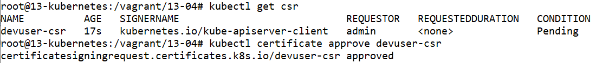
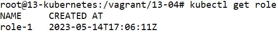
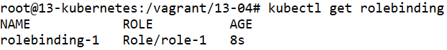
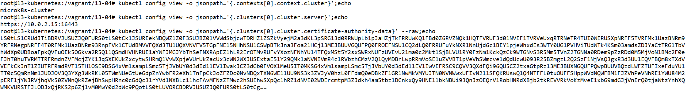
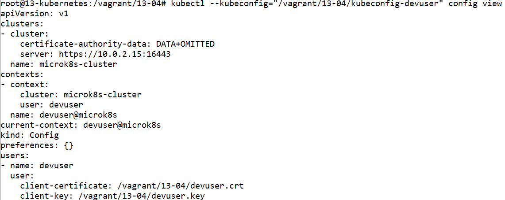
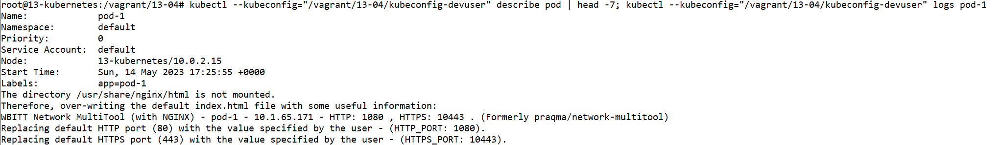
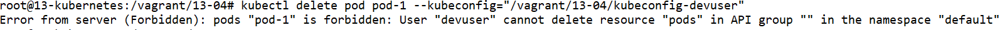

# Домашнее задание к занятию «Управление доступом»

### Цель задания

В тестовой среде Kubernetes нужно предоставить ограниченный доступ пользователю.

------

### Чеклист готовности к домашнему заданию

1. Установлено k8s-решение, например MicroK8S.
2. Установленный локальный kubectl.
3. Редактор YAML-файлов с подключённым github-репозиторием.

------

### Инструменты / дополнительные материалы, которые пригодятся для выполнения задания

1. [Описание](https://kubernetes.io/docs/reference/access-authn-authz/rbac/) RBAC.
2. [Пользователи и авторизация RBAC в Kubernetes](https://habr.com/ru/company/flant/blog/470503/).
3. [RBAC with Kubernetes in Minikube](https://medium.com/@HoussemDellai/rbac-with-kubernetes-in-minikube-4deed658ea7b).

------

### Задание 1. Создайте конфигурацию для подключения пользователя

1. Создайте и подпишите SSL-сертификат для подключения к кластеру.
2. Настройте конфигурационный файл kubectl для подключения.
3. Создайте роли и все необходимые настройки для пользователя.
4. Предусмотрите права пользователя. Пользователь может просматривать логи подов и их конфигурацию (`kubectl logs pod <pod_id>`, `kubectl describe pod <pod_id>`).
5. Предоставьте манифесты и скриншоты и/или вывод необходимых команд.

------


# Ответ

- Проведём установку MicroK8S из прошлого задания

    ```
    apt-get install ca-certificates curl gnupg lsb-release
    mkdir -p /etc/apt/keyrings
    curl -fsSL https://download.docker.com/linux/ubuntu/gpg | gpg --dearmor -o /etc/apt/keyrings/docker.gpg
    echo "deb [arch=$(dpkg --print-architecture) signed-by=/etc/apt/keyrings/docker.gpg] https://download.docker.com/linux/ubuntu $(lsb_release -cs) stable" | tee /etc/apt/sources.list.d/docker.list > /dev/null
    apt-get update
    apt-get install docker-ce docker-ce-cli containerd.io docker-compose-plugin docker-compose

    apt update
    apt install snapd
    snap install microk8s --classic
    usermod -a -G microk8s $USER
    chown -f -R $USER ~/.kube
    microk8s enable dashboard
    microk8s enable dns
    microk8s enable ingress
    microk8s enable hostpath-storage
    microk8s enable helm3
    microk8s helm3 repo add csi-driver-nfs https://raw.githubusercontent.com/kubernetes-csi/csi-driver-nfs/master/charts
    microk8s helm3 repo update
    microk8s helm3 install csi-driver-nfs csi-driver-nfs/csi-driver-nfs --namespace kube-system --set kubeletDir=/var/snap/microk8s/common/var/lib/kubelet

    apt-get install -y ca-certificates curl
    curl -fsSLo /etc/apt/keyrings/kubernetes-archive-keyring.gpg https://packages.cloud.google.com/apt/doc/apt-key.gpg
    echo "deb [signed-by=/etc/apt/keyrings/kubernetes-archive-keyring.gpg] https://apt.kubernetes.io/ kubernetes-xenial main" | tee /etc/apt/sources.list.d/kubernetes.list
    apt-get update
    apt-get install kubectl
    microk8s config > ~/.kube/config

    kubectl get nodes

    NAME            STATUS   ROLES    AGE   VERSION
    13-kubernetes   Ready    <none>   16m   v1.26.3
    ```

- Включим поддержку RBAC в MicroK8S командой `microk8s enable rbac`

- Создадим запрос сертификата `devuser.csr` для пользователя

    ```
    openssl genrsa -out devuser.key 2048
    openssl req -new -key devuser.key -out devuser.csr -subj "/CN=devuser"
    ```

    

    

- Получим base64 от созданного запроса на сертификат командой `base64 < devuser.csr`

- Создадим файл `devuser-csr.yml` с запросом сертификата в Kubernetes
    ```
    ---
    apiVersion: certificates.k8s.io/v1
    kind: CertificateSigningRequest
    metadata:
      name: devuser-csr
    spec:
      groups:
        - system:authenticated
      request: LS0...
      signerName: kubernetes.io/kube-apiserver-client
      usages:
        - digital signature
        - key encipherment
        - client auth
    ```
    
    Добавим в `request` данные от команды base64

    

- Запустим развёртывание командой `kubectl apply -f devuser-csr.yml`

- Подтвердим запрос сертифаката командой `kubectl certificate approve`
    ```
    kubectl get csr
    kubectl certificate approve devuser-csr
    ```

    

- Получим сертификат пользователя для доступа к кластеру командой `kubectl`
    ```
    kubectl get csr devuser-csr -o jsonpath='{.status.certificate}' | base64 --decode > devuser.crt
    ```

    

- Создадим файл `role-1.yml` с развёртыванием роли

    ```
    ---
    apiVersion: rbac.authorization.k8s.io/v1
    kind: Role
    metadata:
      name: role-1
      namespace: default
    rules:
      - apiGroups: [""]
        resources: ["pods", "pods/log"]
        verbs: ["get", "watch", "list"]
    ```

- Запускаем развёртывание командой `kubectl apply -f role-1.yml`

- Подтвердим создадние роли командой `kubectl get role`
    ```
    kubectl get role

    NAME     CREATED AT
    role-1   2023-05-14T17:06:11Z
    ```

    

- Создадим файл `rolebinding-1.yml` с развёртыванием привязки роли

    ```
    ---
    apiVersion: rbac.authorization.k8s.io/v1
    kind: RoleBinding
    metadata:
      name: rolebinding-1
      namespace: default
    subjects:
    - kind: User
      name: devuser
      apiGroup: rbac.authorization.k8s.io
    roleRef:
      kind: Role
      name: role-1
      apiGroup: rbac.authorization.k8s.io
    ```

- Запускаем развёртывание командой `kubectl apply -f rolebinding-1.yml`

- Подтвердим создание привязки роли командой `kubectl get rolebinding`

    ```
    kubectl get rolebinding

    NAME            ROLE          AGE
    rolebinding-1   Role/role-1   8s
    ```

    

- Создадим файл `pod-1.yml` с развёртыванием тестового пода

    ```
    ---
    apiVersion: v1
    kind: Pod
    metadata:
      name: pod-1
      labels:
        app: pod-1
    spec:
      containers:
        - name: multitool
          image: wbitt/network-multitool
          ports:
            - name: http-1080
              containerPort: 1080
              protocol: TCP
          env:
            - name: HTTP_PORT
              value: "1080"
            - name: HTTPS_PORT
              value: "10443"
    ```

    

- Запускаем развёртывание командой `kubectl apply -f pod-1.yml`

- Получим настройки `kubeconfig` для подключения с помощью команды `kubectl`

    ```
    kubectl config view -o jsonpath='{.contexts[0].context.cluster}'
    kubectl config view -o jsonpath='{.clusters[0].cluster.server}'
    kubectl config view -o jsonpath='{.clusters[0].cluster.certificate-authority-data}' --raw
    ```

    

- Создадим файл `kubeconfig-devuser` для подключения к кластеру пользователем `devuser`

    ```
    apiVersion: v1
    kind: Config
    preferences: {}
    clusters:
    - cluster:
        certificate-authority-data: LS0...
        server: https://10.0.2.15:16443
      name: microk8s-cluster
    contexts:
    - context:
        cluster: microk8s-cluster
        user: devuser
      name: devuser@microk8s
    current-context: devuser@microk8s
    users:
    - name: devuser
      user:
        client-certificate: /vagrant/13-04/devuser.crt
        client-key: /vagrant/13-04/devuser.key
    ```

    Добавим данные в файл `kubeconfig-devuser`:
    - `certificate-authority-data` и `server` из вывода в прошлом пункте
    - `client-certificate` и `client-key` пути к файлам `devuser.crt` и `devuser.key`

    

- Проверим конфигурацию командой `kubectl`
    ```
    kubectl config view --kubeconfig="/vagrant/13-04/kubeconfig-devuser" 
    ```

    

    Увидим, что используется пользователь `devuser`

- Проверим подключение к кластеру под пользователем `devuser` командой `kubectl`
    ```
    kubectl describe pod --kubeconfig="/vagrant/13-04/kubeconfig-devuser"
    ```
    ```
    Name:             pod-1
    Namespace:        default
    Priority:         0
    Service Account:  default
    Node:             13-kubernetes/10.0.2.15
    Start Time:       Sun, 14 May 2023 17:25:55 +0000
    Labels:           app=pod-1
    ...
    ```

    ```
    kubectl logs pod-1 --kubeconfig="/vagrant/13-04/kubeconfig-devuser"
    ```
    ```
    The directory /usr/share/nginx/html is not mounted.
    Therefore, over-writing the default index.html file with some useful information:
    WBITT Network MultiTool (with NGINX) - pod-1 - 10.1.65.171 - HTTP: 1080 , HTTPS: 10443 . (Formerly praqma/network-multitool)
    Replacing default HTTP port (80) with the value specified by the user - (HTTP_PORT: 1080).
    Replacing default HTTPS port (443) with the value specified by the user - (HTTPS_PORT: 10443).
    ```

    

    Увидим, что пользователь `devuser` может подключиться, посмотреть под и прочитать логи

- Проверим уровень доступа пользователе `devuser` командой `kubectl`
    ```
    kubectl delete pod pod-1 --kubeconfig="/vagrant/13-04/kubeconfig-devuser"

    Error from server (Forbidden): pods "pod-1" is forbidden: User "devuser" cannot delete resource "pods" in API group "" in the namespace "default"
    ```

    

    Увидим, что под пользователем нельзя удалить под. Делаем вывод, что доступ в роли работает.

- Удалим развёрнутые ресурсы командой `kubectl delete`

    ```
    kubectl delete pod pod-1
    ```
