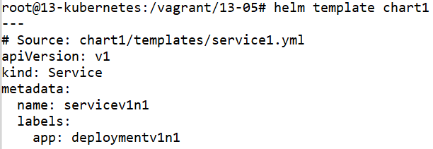
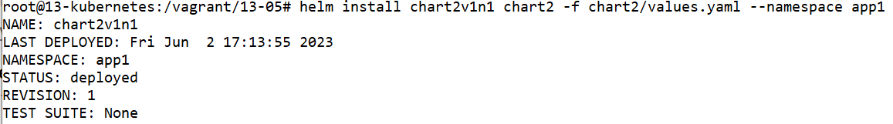

# Домашнее задание к занятию «Helm»

### Цель задания

В тестовой среде Kubernetes необходимо установить и обновить приложения с помощью Helm.

------

### Чеклист готовности к домашнему заданию

1. Установленное k8s-решение, например, MicroK8S.
2. Установленный локальный kubectl.
3. Установленный локальный Helm.
4. Редактор YAML-файлов с подключенным репозиторием GitHub.

------

### Инструменты и дополнительные материалы, которые пригодятся для выполнения задания

1. [Инструкция](https://helm.sh/docs/intro/install/) по установке Helm. [Helm completion](https://helm.sh/docs/helm/helm_completion/).

------

### Задание 1. Подготовить Helm-чарт для приложения

1. Необходимо упаковать приложение в чарт для деплоя в разные окружения. 
2. Каждый компонент приложения деплоится отдельным deployment’ом или statefulset’ом.
3. В переменных чарта измените образ приложения для изменения версии.

------
### Задание 2. Запустить две версии в разных неймспейсах

1. Подготовив чарт, необходимо его проверить. Запуститe несколько копий приложения.
2. Одну версию в namespace=app1, вторую версию в том же неймспейсе, третью версию в namespace=app2.
3. Продемонстрируйте результат.


------


# Ответ

- Проведём установку MicroK8S из прошлого задания

    ```
    apt-get install ca-certificates curl gnupg lsb-release
    mkdir -p /etc/apt/keyrings
    curl -fsSL https://download.docker.com/linux/ubuntu/gpg | gpg --dearmor -o /etc/apt/keyrings/docker.gpg
    echo "deb [arch=$(dpkg --print-architecture) signed-by=/etc/apt/keyrings/docker.gpg] https://download.docker.com/linux/ubuntu $(lsb_release -cs) stable" | tee /etc/apt/sources.list.d/docker.list > /dev/null
    apt-get update
    apt-get install docker-ce docker-ce-cli containerd.io docker-compose-plugin docker-compose

    apt update
    apt install snapd
    snap install microk8s --classic
    usermod -a -G microk8s $USER
    chown -f -R $USER ~/.kube
    microk8s enable dashboard
    microk8s enable dns
    microk8s enable ingress
    microk8s enable hostpath-storage
    microk8s enable rbac
    microk8s enable helm3
    microk8s helm3 repo add csi-driver-nfs https://raw.githubusercontent.com/kubernetes-csi/csi-driver-nfs/master/charts
    microk8s helm3 repo update
    microk8s helm3 install csi-driver-nfs csi-driver-nfs/csi-driver-nfs --namespace kube-system --set kubeletDir=/var/snap/microk8s/common/var/lib/kubelet

    apt-get install -y ca-certificates curl
    curl -fsSLo /etc/apt/keyrings/kubernetes-archive-keyring.gpg https://packages.cloud.google.com/apt/doc/apt-key.gpg
    echo "deb [signed-by=/etc/apt/keyrings/kubernetes-archive-keyring.gpg] https://apt.kubernetes.io/ kubernetes-xenial main" | tee /etc/apt/sources.list.d/kubernetes.list
    apt-get update
    apt-get install kubectl
    microk8s config > ~/.kube/config

    kubectl get nodes

    NAME            STATUS   ROLES    AGE   VERSION
    13-kubernetes   Ready    <none>   16m   v1.26.3
    ```

- Установим Helm

    ```
    curl https://baltocdn.com/helm/signing.asc | gpg --dearmor | tee /usr/share/keyrings/helm.gpg > /dev/null
    apt-get install apt-transport-https --yes
    echo "deb [arch=$(dpkg --print-architecture) signed-by=/usr/share/keyrings/helm.gpg] https://baltocdn.com/helm/stable/debian/ all main" | tee /etc/apt/sources.list.d/helm-stable-debian.list
    apt-get update
    apt-get install helm
    ```

## Задание 1.

- Создадим шаблон Helm командой `helm create`

    ```
    helm create chart1
    ```

- Создадим файл `chart1/templates/deployment1.yml` для развёртывания приложения 1

    ```
    ---
    apiVersion: apps/v1
    kind: Deployment
    metadata:
      labels:
        app: deployment1{{ .Values.chartVersion }}
      name: deployment1{{ .Values.chartVersion }}
      namespace: default
    spec:
      replicas: {{ .Values.deployment1.replicaCount }}
      selector:
        matchLabels:
          app: deployment1{{ .Values.chartVersion }}
      template:
        metadata:
          labels:
            app: deployment1{{ .Values.chartVersion }}
        spec:
          containers:
            - name: nginx
              image: nginx:{{ .Values.deployment1.imageVersion }}
              ports:
                - name: http-{{ .Values.deployment1.containerPort }}
                  containerPort: {{ .Values.deployment1.containerPort }}
                  protocol: TCP
    ```

    

- Создадим файл `chart1/templates/deployment2.yml` для развёртывания приложения 2

    ```
    ---
    apiVersion: apps/v1
    kind: Deployment
    metadata:
      labels:
        app: deployment2{{ .Values.chartVersion }}
      name: deployment2{{ .Values.chartVersion }}
      namespace: default
    spec:
      replicas: {{ .Values.deployment2.replicaCount }}
      selector:
        matchLabels:
          app: deployment2{{ .Values.chartVersion }}
      template:
        metadata:
          labels:
            app: deployment2{{ .Values.chartVersion }}
        spec:
          containers:
            - name: multitool
              image: wbitt/network-multitool:{{ .Values.deployment2.imageVersion }}
              ports:
                - name: http-{{ .Values.deployment2.containerPort }}
                  containerPort: {{ .Values.deployment2.containerPort }}
                  protocol: TCP
              env:
                - name: HTTP_PORT
                  value: "{{ .Values.deployment2.containerPort }}"
                - name: HTTPS_PORT
                  value: "11443"
    ```

    

- Создадим файл `chart1/templates/service1.yml` для развёртывания сервиса 1

    ```
    ---
    apiVersion: v1
    kind: Service
    metadata:
      name: service1{{ .Values.chartVersion }}
      labels:
        app: deployment1{{ .Values.chartVersion }}
    spec:
      selector:
        app: deployment1{{ .Values.chartVersion }}
      ports:
        - name: http-{{ .Values.service1.servicePort }}
          port: {{ .Values.service1.servicePort }}
          protocol: TCP
          targetPort: {{ .Values.deployment1.containerPort }}

    ```

    

- Создадим файл `chart1/templates/service2.yml` для развёртывания сервиса 2

    ```
    ---
    apiVersion: v1
    kind: Service
    metadata:
      name: service2{{ .Values.chartVersion }}
      labels:
        app: deployment2{{ .Values.chartVersion }}
    spec:
      selector:
        app: deployment2{{ .Values.chartVersion }}
      ports:
        - name: http-{{ .Values.service2.servicePort }}
          port: {{ .Values.service2.servicePort }}
          protocol: TCP
          targetPort: {{ .Values.deployment2.containerPort }}
        - name: multitool-https
          port: 11443
          protocol: TCP
          targetPort: 11443
    ```

    

- Создадим файл `chart1/Chart.yaml` для информации о чарте

    ```
    apiVersion: v2
    name: chart1
    description: A Helm chart for Kubernetes

    type: application

    version: "1"
    appVersion: "1"
    ```

    

- Создадим файл `chart1/values.yaml` для переменных чарта

    ```
    ---
    chartVersion: "v1n1"

    deployment1:
      replicaCount: 1
      imageVersion: "1.23"
      containerPort: 80

    deployment2:
      replicaCount: 1
      imageVersion: "openshift"
      containerPort: 8080

    service1:
      servicePort: 80

    service2:
      servicePort: 8080
    ```

    


- Проверим конструктор чарта запустив команду `helm template`

    ```
    helm template chart1

    ---
    # Source: chart1/templates/service1.yml
    apiVersion: v1
    kind: Service
    metadata:
      name: servicev1n1
      labels:
        app: deploymentv1n1
    ...
    ```

    

    Увидем, что переменные из файла `values.yaml` применились к манифестам для Kubernetes.

- Проверим синтаксис чарта запустив команду `htlm lint`

    ```
    helm lint chart1

    ==> Linting chart1
    [INFO] Chart.yaml: icon is recommended

    1 chart(s) linted, 0 chart(s) failed
    ```

    

- Запустим развёртывание чарта командой `helm install`

    ```
    helm install chart1v1n1 chart1

    NAME: chart1v1n1
    LAST DEPLOYED: Wed May 31 18:31:12 2023
    NAMESPACE: default
    STATUS: deployed
    REVISION: 1
    TEST SUITE: None
    ```

    

- Проверим развёртывание командами `helm ls` и `kubectl get deployment`

    ```
    helm ls

    NAME            NAMESPACE       REVISION        UPDATED                                 STATUS          CHART           APP VERSION
    chart1v1n1      default         1               2023-05-31 18:31:12.740804872 +0000 UTC deployed        chart1-1        1

    kubectl get deployment

    NAME              READY   UP-TO-DATE   AVAILABLE   AGE
    deployment2v1n1   1/1     1            1           40s
    deployment1v1n1   1/1     1            1           40s
    ```

    

    Увидим, что helm релиз развернулся из чарта.

- Создадим файл `chart1/values2.yaml` для переменных чарта

    ```
    ---
    chartVersion: "v2n1"

    deployment1:
      replicaCount: 1
      imageVersion: "1.24"
      containerPort: 80

    deployment2:
      replicaCount: 1
      imageVersion: "fedora-minimal"
      containerPort: 8080

    service1:
      servicePort: 80

    service2:
      servicePort: 8080
    ```

    

- Изменим файл `chart1/Chart.yaml`  для изменения версии чарта и приложения

    ```
    apiVersion: v2
    name: chart1
    description: A Helm chart for Kubernetes

    type: application

    version: "2"
    appVersion: "2"
    ```

- Проверим версию контейнера в чарте запустив команду `helm template`

    ```
    helm template -f chart1/values2.yaml chart1 | grep image

    image: nginx:1.24
    image: wbitt/network-multitool:fedora-minimal
    ```

    

    Увидим, что версия контейнера изменилась на указанную в файле `values2.yaml`

- Запустим обновление работающего чарта командой `helm upgrade`

    ```
    helm upgrade chart1v1n1 chart1 -f chart1/values2.yaml

    Release "chart1v1n1" has been upgraded. Happy Helming!
    NAME: chart1v1n1
    LAST DEPLOYED: Wed May 31 18:50:10 2023
    NAMESPACE: default
    STATUS: deployed
    REVISION: 2
    TEST SUITE: None
    ```

    

- Проверим развёртывание командами `helm ls` и `kubectl describe deployment`

    ```
    helm ls

    NAME            NAMESPACE       REVISION        UPDATED                                 STATUS          CHART           APP VERSION
    chart1v1n1      default         2               2023-05-31 18:50:10.878482288 +0000 UTC deployed        chart1-2        2

    kubectl get deployment

    NAME              READY   UP-TO-DATE   AVAILABLE   AGE
    deployment1v2n1   1/1     1            1           66s
    deployment2v2n1   1/1     1            1           66s

    kubectl describe deployment | grep Image

    Image:        nginx:1.24
    Image:      wbitt/network-multitool:fedora-minimal
    ```

    

    Увидим, что поменялась версия чарта и приложения.

- Удалим релиз командой `helm uninstall`

    ```
    helm uninstall chart1v1n1
    ```


## Задание 2.

- Создадим namespace в Kubernetes командой `kubectl create namespace`

    ```
    kubectl create namespace app1
    kubectl create namespace app2
    ```

    


- Создадим новый чарт командой `helm create`

    ```
    helm create chart2
    ```

- Создадим файл `chart2/templates/deployment1.yml` для развёртывания приложения 1

    ```
    ---
    apiVersion: apps/v1
    kind: Deployment
    metadata:
      labels:
        app: deployment1{{ .Values.chartVersion }}
      name: deployment1{{ .Values.chartVersion }}
      namespace: {{ .Release.Namespace }}
    spec:
      replicas: {{ .Values.deployment1.replicaCount }}
      selector:
        matchLabels:
          app: deployment1{{ .Values.chartVersion }}
      template:
        metadata:
          labels:
            app: deployment1{{ .Values.chartVersion }}
        spec:
          containers:
            - name: nginx
              image: nginx:{{ .Values.deployment1.imageVersion }}
              ports:
                - name: http-{{ .Values.deployment1.containerPort }}
                  containerPort: {{ .Values.deployment1.containerPort }}
                  protocol: TCP
    ```

    

- Создадим файл `chart2/templates/deployment2.yml` для развёртывания приложения 2

    ```
    ---
    apiVersion: apps/v1
    kind: Deployment
    metadata:
      labels:
        app: deployment2{{ .Values.chartVersion }}
      name: deployment2{{ .Values.chartVersion }}
      namespace: {{ .Release.Namespace }}
    spec:
      replicas: {{ .Values.deployment2.replicaCount }}
      selector:
        matchLabels:
          app: deployment2{{ .Values.chartVersion }}
      template:
        metadata:
          labels:
            app: deployment2{{ .Values.chartVersion }}
        spec:
          containers:
            - name: multitool
              image: wbitt/network-multitool:{{ .Values.deployment2.imageVersion }}
              ports:
                - name: http-{{ .Values.deployment2.containerPort }}
                  containerPort: {{ .Values.deployment2.containerPort }}
                  protocol: TCP
              env:
                - name: HTTP_PORT
                  value: "{{ .Values.deployment2.containerPort }}"
                - name: HTTPS_PORT
                  value: "11443"
    ```

    

- Создадим файл `chart2/templates/service1.yml` для развёртывания сервиса 1

    ```
    ---
    apiVersion: v1
    kind: Service
    metadata:
      name: service1{{ .Values.chartVersion }}
      labels:
        app: deployment1{{ .Values.chartVersion }}
      namespace: {{ .Release.Namespace }}
    spec:
      selector:
        app: deployment1{{ .Values.chartVersion }}
      ports:
        - name: http-{{ .Values.service1.servicePort }}
          port: {{ .Values.service1.servicePort }}
          protocol: TCP
          targetPort: {{ .Values.deployment1.containerPort }}

    ```

    

- Создадим файл `chart2/templates/service2.yml` для развёртывания сервиса 2

    ```
    ---
    apiVersion: v1
    kind: Service
    metadata:
      name: service2{{ .Values.chartVersion }}
      labels:
        app: deployment2{{ .Values.chartVersion }}
      namespace: {{ .Release.Namespace }}
    spec:
      selector:
        app: deployment2{{ .Values.chartVersion }}
      ports:
        - name: http-{{ .Values.service2.servicePort }}
          port: {{ .Values.service2.servicePort }}
          protocol: TCP
          targetPort: {{ .Values.deployment2.containerPort }}
        - name: multitool-https
          port: 11443
          protocol: TCP
          targetPort: 11443
    ```

    

- Создадим файл `chart2/Chart.yaml` для информации о чарте

    ```
    apiVersion: v2
    name: chart2
    description: A Helm chart for Kubernetes

    type: application

    version: "1"
    appVersion: "1"
    ```

    

- Создадим файл `chart2/values.yaml` для переменных чарта

    ```
    ---
    chartVersion: "v1n1"

    deployment1:
      replicaCount: 1
      imageVersion: "1.23"
      containerPort: 80

    deployment2:
      replicaCount: 1
      imageVersion: "openshift"
      containerPort: 8080

    service1:
      servicePort: 80

    service2:
      servicePort: 8080
    ```

    

- Создадим файл `chart2/values2.yaml` для переменных чарта

    ```
    ---
    chartVersion: "v2n1"

    deployment1:
      replicaCount: 1
      imageVersion: "1.24"
      containerPort: 80

    deployment2:
      replicaCount: 1
      imageVersion: "fedora-minimal"
      containerPort: 8080

    service1:
      servicePort: 80

    service2:
      servicePort: 8080
    ```

    

- Создадим файл `chart2/values3.yaml` для переменных чарта

    ```
    ---
    chartVersion: "v3n2"

    deployment1:
      replicaCount: 1
      imageVersion: "1.25"
      containerPort: 80

    deployment2:
      replicaCount: 1
      imageVersion: "alpine-minimal"
      containerPort: 8080

    service1:
      servicePort: 80

    service2:
      servicePort: 8080
    ```

    

- Запустим развёртывание чарта командой `helm install`

    ```
    helm install chart2v1n1 chart2 -f chart2/values.yaml --namespace app1

    NAME: chart2v1n1
    LAST DEPLOYED: Fri Jun  2 17:13:55 2023
    NAMESPACE: app1
    STATUS: deployed
    REVISION: 1
    TEST SUITE: None
    ```

    


- Изменим файл `chart2/Chart.yaml` для изменения версии чарта и приложения

    ```
    apiVersion: v2
    name: chart2
    description: A Helm chart for Kubernetes

    type: application

    version: "2"
    appVersion: "2"
    ```

- Запустим развёртывание чарта командой `helm install`

    ```
    helm install chart2v2n1 chart2 -f chart2/values2.yaml --namespace app1

    NAME: chart2v2n1
    LAST DEPLOYED: Fri Jun  2 17:19:17 2023
    NAMESPACE: app1
    STATUS: deployed
    REVISION: 1
    TEST SUITE: None
    ```

    

- Изменим файл `chart2/Chart.yaml` для изменения версии чарта и приложения

    ```
    apiVersion: v2
    name: chart2
    description: A Helm chart for Kubernetes

    type: application

    version: "3"
    appVersion: "3"
    ```

- Запустим развёртывание чарта командой `helm install`

    ```
    helm install chart2v3n2 chart2 -f chart2/values3.yaml --namespace app2

    NAME: chart2v3n2
    LAST DEPLOYED: Fri Jun  2 17:23:11 2023
    NAMESPACE: app2
    STATUS: deployed
    REVISION: 1
    TEST SUITE: None
    ```

    


- Проверим развёртывание командами `helm ls` и `kubectl describe deployment`

    ```
    helm ls --all-namespaces

    NAME            NAMESPACE       REVISION        UPDATED                                 STATUS          CHART                   APP VERSION
    chart2v1n1      app1            1               2023-06-02 17:13:55.629149091 +0000 UTC deployed        chart2-1                1
    chart2v2n1      app1            1               2023-06-02 17:19:17.123534491 +0000 UTC deployed        chart2-2                2
    chart2v3n2      app2            1               2023-06-02 17:23:11.304244366 +0000 UTC deployed        chart2-3                3

    kubectl get deployment --all-namespaces

    NAMESPACE     NAME                        READY   UP-TO-DATE   AVAILABLE   AGE
    app1          deployment1v1n1             1/1     1            1           10m
    app1          deployment2v1n1             1/1     1            1           10m
    app1          deployment2v2n1             1/1     1            1           4m45s
    app1          deployment1v2n1             1/1     1            1           4m45s
    app2          deployment2v3n2             1/1     1            1           51s
    app2          deployment1v3n2             1/1     1            1           51s

    kubectl describe deployment --namespace app1 | grep Image

    Image:        nginx:1.23
    Image:      wbitt/network-multitool:openshift
    Image:      wbitt/network-multitool:fedora-minimal
    Image:        nginx:1.24

    kubectl describe deployment --namespace app2 | grep Image

    Image:      wbitt/network-multitool:alpine-minimal
    Image:        nginx:1.25
    ```

    

    Увидим, что чарты Helm и развёртывания Kubernetes развернулись в два namespace, и версии приложений соответствуют заданным в файлах: `chart2/values.yaml`, `chart2/values2.yaml`, `chart2/values3.yaml`.

- Удалим релиз командой `helm uninstall`

    ```
    helm uninstall chart2v1n1 --namespace app1
    helm uninstall chart2v2n1 --namespace app1
    helm uninstall chart2v3n2 --namespace app2
    kubectl delete namespace app1
    kubectl delete namespace app2
    ```


