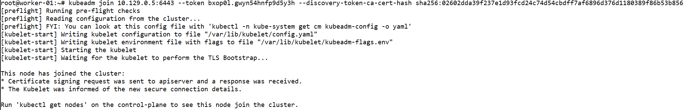

# Домашнее задание к занятию «Установка Kubernetes»

### Цель задания

Установить кластер K8s.

### Чеклист готовности к домашнему заданию

1. Развёрнутые ВМ с ОС Ubuntu 20.04-lts.


### Инструменты и дополнительные материалы, которые пригодятся для выполнения задания

1. [Инструкция по установке kubeadm](https://kubernetes.io/docs/setup/production-environment/tools/kubeadm/create-cluster-kubeadm/).
2. [Документация kubespray](https://kubespray.io/).

-----

### Задание 1. Установить кластер k8s с 1 master node

1. Подготовка работы кластера из 5 нод: 1 мастер и 4 рабочие ноды.
2. В качестве CRI — containerd.
3. Запуск etcd производить на мастере.
4. Способ установки выбрать самостоятельно.

## Дополнительные задания (со звёздочкой)

**Настоятельно рекомендуем выполнять все задания под звёздочкой.** Их выполнение поможет глубже разобраться в материале.   
Задания под звёздочкой необязательные к выполнению и не повлияют на получение зачёта по этому домашнему заданию. 

------
### Задание 2*. Установить HA кластер

1. Установить кластер в режиме HA.
2. Использовать нечётное количество Master-node.
3. Для cluster ip использовать keepalived или другой способ.

### Правила приёма работы

1. Домашняя работа оформляется в своем Git-репозитории в файле README.md. Выполненное домашнее задание пришлите ссылкой на .md-файл в вашем репозитории.
2. Файл README.md должен содержать скриншоты вывода необходимых команд `kubectl get nodes`, а также скриншоты результатов.
3. Репозиторий должен содержать тексты манифестов или ссылки на них в файле README.md.

------


# Ответ

- Регистрируемся на Яндекс Облаке по адресу `console.cloud.yandex.ru`  
- Создаём платёжный аккаунт с промо-кодом  
- Скачаем и установим утилиту `yc`  
    - `curl -sSL https://storage.yandexcloud.net/yandexcloud-yc/install.sh | bash`  
- Запустим утилиту `yc`:    
    - `yc init`  
    - Получаем OAuth токен по адресу в браузере `https://oauth.yandex.ru/authorize?response_type=token&client_id=1a6990aa636648e9b2ef855fa7bec2fb`  
    - В утилите `yc`    
        - Вставим токен  
        - Выберем папку в Яндекс Облаке  
        - Выберем создание Compute по-умолчанию  
        - Выберем зону в Яндекс Облаке  
    - Проверим созданные настройки Яндекс Облака    

        ```
        yc config list

        token: y0_A...
        cloud-id: b1gjd8gta6ntpckrp97r
        folder-id: b1gcthk9ak11bmpnbo7d
        compute-default-zone: ru-central1-b
        ```

- Получаем IAM-токен  

    ```
    yc iam create-token
    ```

- Сохраняем токен и параметры в переменную окружения  

    ```
    export YC_TOKEN=$(yc iam create-token)
    export YC_CLOUD_ID=$(yc config get cloud-id)
    export YC_FOLDER_ID=$(yc config get folder-id)
    export YC_ZONE=$(yc config get compute-default-zone)
    ```

- Сгенерируем SSH ключи на локальной машине  
    ```
    ssh-keygen
    ```
    ```
    Your public key has been saved in /root/.ssh/id_rsa.pub
    ```

- Создадим виртуальные машины в Яндекс Облаке

    - 1 мастер нода
    - 4 рабочие ноды
    - Выберем ОС Ubuntu 20.04
    - Укажем публичный ключ сгенерированный ранее
    - Создадим пользователя netology

    ```
    yc compute instance list

    +----------------------+-----------+---------------+---------+----------------+-------------+
    |          ID          |   NAME    |    ZONE ID    | STATUS  |  EXTERNAL IP   | INTERNAL IP |
    +----------------------+-----------+---------------+---------+----------------+-------------+
    | epd2ka2jerrcjvpbv3oh | worker-02 | ru-central1-b | RUNNING | 158.160.23.209 | 10.129.0.4  |
    | epdb616vcvdmu55vt6eu | worker-03 | ru-central1-b | RUNNING | 51.250.27.5    | 10.129.0.35 |
    | epdloncvvl48s2liu1kv | master-01 | ru-central1-b | RUNNING | 158.160.22.66  | 10.129.0.5  |
    | epdqept3klcdlpvrpom6 | worker-04 | ru-central1-b | RUNNING | 158.160.21.113 | 10.129.0.17 |
    | epdtvsug3p01kkm4bgnb | worker-01 | ru-central1-b | RUNNING | 158.160.7.7    | 10.129.0.27 |
    +----------------------+-----------+---------------+---------+----------------+-------------+
    ```

    

- Подключимся к мастер ноде

    ```
    ssh -i ~/.ssh/id_rsa netology@158.160.22.66
    ```

    - Установим kubeadm, kubelet, kubectl

        ```
        apt-get update
        apt-get install -y apt-transport-https ca-certificates curl
        mkdir -p /etc/apt/keyrings
        curl -fsSL https://packages.cloud.google.com/apt/doc/apt-key.gpg | gpg --dearmor -o /etc/apt/keyrings/kubernetes-archive-keyring.gpg
        echo "deb [signed-by=/etc/apt/keyrings/kubernetes-archive-keyring.gpg] https://apt.kubernetes.io/ kubernetes-xenial main" | tee /etc/apt/sources.list.d/kubernetes.list
        apt-get update
        apt-get install -y kubelet kubeadm kubectl
        apt-mark hold kubelet kubeadm kubectl
        ```

    - Включим IP forward

        ```
        modprobe br_netfilter
        modprobe overlay
        echo "net.ipv4.ip_forward=1" >> /etc/sysctl.conf
        echo "net.bridge.bridge-nf-call-iptables=1" >> /etc/sysctl.conf
        echo "net.bridge.bridge-nf-call-arptables=1" >> /etc/sysctl.conf
        echo "net.bridge.bridge-nf-call-ip6tables=1" >> /etc/sysctl.conf
        sysctl -p /etc/sysctl.conf
        cat <<EOF | sudo tee /etc/modules-load.d/containerd.conf
        overlay
        br_netfilter
        EOF
        ```

    - Установим containerd среду выполнения контейнеров

        ```
        apt-get update
        apt-get install ca-certificates curl gnupg
        install -m 0755 -d /etc/apt/keyrings
        curl -fsSL https://download.docker.com/linux/ubuntu/gpg | gpg --dearmor -o /etc/apt/keyrings/docker.gpg
        chmod a+r /etc/apt/keyrings/docker.gpg
        echo "deb [arch="$(dpkg --print-architecture)" signed-by=/etc/apt/keyrings/docker.gpg] https://download.docker.com/linux/ubuntu "$(. /etc/os-release && echo "$VERSION_CODENAME")" stable" | tee /etc/apt/sources.list.d/docker.list > /dev/null
        apt-get update
        apt-get install containerd.io
        mkdir -p /etc/containerd
        containerd config default | tee /etc/containerd/config.toml
        nano /etc/containerd/config.toml
            [plugins."io.containerd.grpc.v1.cri".containerd.runtimes.runc.options]
                BinaryName = ""
                CriuImagePath = ""
                CriuPath = ""
                CriuWorkPath = ""
                IoGid = 0
                IoUid = 0
                NoNewKeyring = false
                NoPivotRoot = false
                Root = ""
                ShimCgroup = ""
                SystemdCgroup = true
        systemctl restart containerd
        systemctl enable kubelet
        ```

    - Установим мастер ноду

        ```
        kubeadm config images pull
        kubeadm init --apiserver-advertise-address=10.129.0.5 --pod-network-cidr 10.244.0.0/16  --apiserver-cert-extra-sans=158.160.22.66,master-01.ru-central1.internal
        ```

        где:

            - `apiserver-advertise-address` - адрес API сервера (мастер ноды)
            - `pod-network-cidr` - подсеть для подов
            - `apiserver-cert-extra-sans` - дополнительные именя в сертификате API сервера. Нужно указать те, по которым будет подключаться клиенты kubectl

        ```
        Your Kubernetes control-plane has initialized successfully!

        To start using your cluster, you need to run the following as a regular user:

          mkdir -p $HOME/.kube
          sudo cp -i /etc/kubernetes/admin.conf $HOME/.kube/config
          sudo chown $(id -u):$(id -g) $HOME/.kube/config

        Alternatively, if you are the root user, you can run:

          export KUBECONFIG=/etc/kubernetes/admin.conf

        You should now deploy a pod network to the cluster.
        Run "kubectl apply -f [podnetwork].yaml" with one of the options listed at:
          https://kubernetes.io/docs/concepts/cluster-administration/addons/

        Then you can join any number of worker nodes by running the following on each as root:

        kubeadm join 10.129.0.5:6443 --token bxop0l.gwyn54hnfp9d5y3h \
                --discovery-token-ca-cert-hash sha256:02602dda39f237e1d93fcd24c74d54cbdff7af6896d376d1180389f86b53b856
        ```

        


    - Создадим kubeconfig на мастер ноде

        ```
        mkdir -p $HOME/.kube
        cp -i /etc/kubernetes/admin.conf $HOME/.kube/config
        chown $(id -u):$(id -g) $HOME/.kube/config
        ```

    - Устанавливаем сетевой плагин на мастер ноде

        ```
        kubectl apply -f https://github.com/coreos/flannel/raw/master/Documentation/kube-flannel.yml
        ```
        ```
        namespace/kube-flannel created
        clusterrole.rbac.authorization.k8s.io/flannel created
        clusterrolebinding.rbac.authorization.k8s.io/flannel created
        serviceaccount/flannel created
        configmap/kube-flannel-cfg created
        daemonset.apps/kube-flannel-ds created
        ```

        

- Подключимся к каждой рабочей ноде

    ```
    ssh -i ~/.ssh/id_rsa netology@158.160.7.7
    ```

    Используем эту инструкцию для настройки на всех рабочих нодах.

    - Установим kubeadm, kubelet, kubectl

        ```
        apt-get update
        apt-get install -y apt-transport-https ca-certificates curl
        mkdir -p /etc/apt/keyrings
        curl -fsSL https://packages.cloud.google.com/apt/doc/apt-key.gpg | gpg --dearmor -o /etc/apt/keyrings/kubernetes-archive-keyring.gpg
        echo "deb [signed-by=/etc/apt/keyrings/kubernetes-archive-keyring.gpg] https://apt.kubernetes.io/ kubernetes-xenial main" | tee /etc/apt/sources.list.d/kubernetes.list
        apt-get update
        apt-get install -y kubelet kubeadm kubectl
        apt-mark hold kubelet kubeadm kubectl
        ```

    - Включим IP forward

        ```
        modprobe br_netfilter
        modprobe overlay
        echo "net.ipv4.ip_forward=1" >> /etc/sysctl.conf
        echo "net.bridge.bridge-nf-call-iptables=1" >> /etc/sysctl.conf
        echo "net.bridge.bridge-nf-call-arptables=1" >> /etc/sysctl.conf
        echo "net.bridge.bridge-nf-call-ip6tables=1" >> /etc/sysctl.conf
        sysctl -p /etc/sysctl.conf
        cat <<EOF | sudo tee /etc/modules-load.d/containerd.conf
        overlay
        br_netfilter
        EOF
        ```

    - Установим containerd среду выполнения контейнеров

        ```
        apt-get update
        apt-get install ca-certificates curl gnupg
        install -m 0755 -d /etc/apt/keyrings
        curl -fsSL https://download.docker.com/linux/ubuntu/gpg | gpg --dearmor -o /etc/apt/keyrings/docker.gpg
        chmod a+r /etc/apt/keyrings/docker.gpg
        echo "deb [arch="$(dpkg --print-architecture)" signed-by=/etc/apt/keyrings/docker.gpg] https://download.docker.com/linux/ubuntu "$(. /etc/os-release && echo "$VERSION_CODENAME")" stable" | tee /etc/apt/sources.list.d/docker.list > /dev/null
        apt-get update
        apt-get install containerd.io
        mkdir -p /etc/containerd
        containerd config default | tee /etc/containerd/config.toml
        nano /etc/containerd/config.toml
            [plugins."io.containerd.grpc.v1.cri".containerd.runtimes.runc.options]
                BinaryName = ""
                CriuImagePath = ""
                CriuPath = ""
                CriuWorkPath = ""
                IoGid = 0
                IoUid = 0
                NoNewKeyring = false
                NoPivotRoot = false
                Root = ""
                ShimCgroup = ""
                SystemdCgroup = true
        systemctl restart containerd
        systemctl enable kubelet
        ```

    - На рабочей ноде введём в кластер

        ```
        kubeadm join 10.129.0.5:6443 --token bxop0l.gwyn54hnfp9d5y3h --discovery-token-ca-cert-hash sha256:02602dda39f237e1d93fcd24c74d54cbdff7af6896d376d1180389f86b53b856
        ```
        ```
        This node has joined the cluster:
        * Certificate signing request was sent to apiserver and a response was received.
        * The Kubelet was informed of the new secure connection details.

        Run 'kubectl get nodes' on the control-plane to see this node join the cluster.
        ```

        Команду взяли из вывода команды при создании мастер ноды.

        

- Установим kubectl на локальную машину

    ```
    apt-get update
    apt-get install -y ca-certificates curl
    apt-get install -y apt-transport-https
    mkdir -p /etc/apt/keyrings
    curl -fsSL https://packages.cloud.google.com/apt/doc/apt-key.gpg | gpg --dearmor -o /etc/apt/keyrings/kubernetes-archive-keyring.gpg
    echo "deb [signed-by=/etc/apt/keyrings/kubernetes-archive-keyring.gpg] https://apt.kubernetes.io/ kubernetes-xenial main" | tee /etc/apt/sources.list.d/kubernetes.list
    apt-get update
    apt-get install -y kubectl
    apt-mark hold kubectl
    ```

- Сохраним kubeconfig из мастер ноды на локальную машину

    ```
    mkdir -p $HOME/.kube
    rsync --rsync-path="sudo rsync" netology@158.160.22.66:/root/.kube/config /root/.kube/config
    chown $(id -u):$(id -g) $HOME/.kube/config
    ```

- Поменяем адрес подключения на внешний IP мастер ноды в kubeconfig на локальной машине

    ```
    nano /root/.kube/config

        - cluster:
            certificate-authority-data: LS0tLS1CRUdJTiBDRVJUSUZJQ0FURS0tLS0tCk1JSUMvakNDQWVhZ0F3SUJBZ0lCQURBTkJna3Foa2lHOXcwQkFRc0ZBREFWTVJNd0VRWURWUVFERXdwcmRXSmwKY201bGRHVnpNQjRYRFRJek1EWXlOVEV6TkRZMU9Gb1hEVE16TURZeU1qRXpORFkxT0Zv>    server: https://158.160.22.66:6443
          name: kubernetes
    ```

- Посмотрим состояния нод в кластере Kubernetes с помощью команды `kubectl`

    ```
    kubectl get nodes

    NAME        STATUS   ROLES           AGE   VERSION
    master-01   Ready    control-plane   50m   v1.27.3
    worker-01   Ready    <none>          27m   v1.27.3
    worker-02   Ready    <none>          22m   v1.27.3
    worker-03   Ready    <none>          20m   v1.27.3
    worker-04   Ready    <none>          17m   v1.27.3
    ```

    

    Увидим, что все 5 нод готовы к работе.

    ```
    kubectl get pods --all-namespaces -o wide

    NAMESPACE      NAME                                READY   STATUS    RESTARTS   AGE   IP            NODE        NOMINATED NODE   READINESS GATES
    kube-flannel   kube-flannel-ds-bpwwl               1/1     Running   0          32m   10.129.0.27   worker-01   <none>           <none>
    kube-flannel   kube-flannel-ds-k9nwb               1/1     Running   0          24m   10.129.0.35   worker-03   <none>           <none>
    kube-flannel   kube-flannel-ds-n7lj5               1/1     Running   0          21m   10.129.0.17   worker-04   <none>           <none>
    kube-flannel   kube-flannel-ds-qnmjh               1/1     Running   0          27m   10.129.0.4    worker-02   <none>           <none>
    kube-flannel   kube-flannel-ds-sw775               1/1     Running   0          42m   10.129.0.5    master-01   <none>           <none>
    kube-system    coredns-5d78c9869d-fzcln            1/1     Running   0          55m   10.244.0.2    master-01   <none>           <none>
    kube-system    coredns-5d78c9869d-sm5c6            1/1     Running   0          55m   10.244.0.3    master-01   <none>           <none>
    kube-system    etcd-master-01                      1/1     Running   0          55m   10.129.0.5    master-01   <none>           <none>
    kube-system    kube-apiserver-master-01            1/1     Running   0          55m   10.129.0.5    master-01   <none>           <none>
    kube-system    kube-controller-manager-master-01   1/1     Running   0          55m   10.129.0.5    master-01   <none>           <none>
    kube-system    kube-proxy-cnzwb                    1/1     Running   0          24m   10.129.0.35   worker-03   <none>           <none>
    kube-system    kube-proxy-s4s98                    1/1     Running   0          32m   10.129.0.27   worker-01   <none>           <none>
    kube-system    kube-proxy-tc8dz                    1/1     Running   0          55m   10.129.0.5    master-01   <none>           <none>
    kube-system    kube-proxy-tkgmw                    1/1     Running   0          27m   10.129.0.4    worker-02   <none>           <none>
    kube-system    kube-proxy-vcv7g                    1/1     Running   0          21m   10.129.0.17   worker-04   <none>           <none>
    kube-system    kube-scheduler-master-01            1/1     Running   0          55m   10.129.0.5    master-01   <none>           <none>
    ```

    
