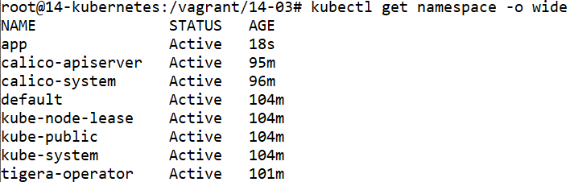
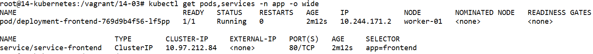

# Домашнее задание к занятию «Как работает сеть в K8s»

### Цель задания

Настроить сетевую политику доступа к подам.

### Чеклист готовности к домашнему заданию

1. Кластер K8s с установленным сетевым плагином Calico.

### Инструменты и дополнительные материалы, которые пригодятся для выполнения задания

1. [Документация Calico](https://www.tigera.io/project-calico/).
2. [Network Policy](https://kubernetes.io/docs/concepts/services-networking/network-policies/).
3. [About Network Policy](https://docs.projectcalico.org/about/about-network-policy).

-----

### Задание 1. Создать сетевую политику или несколько политик для обеспечения доступа

1. Создать deployment'ы приложений frontend, backend и cache и соответсвующие сервисы.
2. В качестве образа использовать network-multitool.
3. Разместить поды в namespace App.
4. Создать политики, чтобы обеспечить доступ frontend -> backend -> cache. Другие виды подключений должны быть запрещены.
5. Продемонстрировать, что трафик разрешён и запрещён.

### Правила приёма работы

1. Домашняя работа оформляется в своём Git-репозитории в файле README.md. Выполненное домашнее задание пришлите ссылкой на .md-файл в вашем репозитории.
2. Файл README.md должен содержать скриншоты вывода необходимых команд, а также скриншоты результатов.
3. Репозиторий должен содержать тексты манифестов или ссылки на них в файле README.md.

-----


# Ответ
# Подготовка кластера к заданию


## Виртуальные машины
- Регистрируемся на Яндекс Облаке по адресу `console.cloud.yandex.ru`  
- Создаём платёжный аккаунт с промо-кодом  
- Скачаем и установим утилиту `yc`  
    - `curl -sSL https://storage.yandexcloud.net/yandexcloud-yc/install.sh | bash`  
- Запустим утилиту `yc`:    
    - `yc init`  
    - Получаем OAuth токен по адресу в браузере `https://oauth.yandex.ru/authorize?response_type=token&client_id=1a6990aa636648e9b2ef855fa7bec2fb`  
    - В утилите `yc`    
        - Вставим токен  
        - Выберем папку в Яндекс Облаке  
        - Выберем создание Compute по-умолчанию  
        - Выберем зону в Яндекс Облаке  
    - Проверим созданные настройки Яндекс Облака    

        ```
        yc config list

        token: y0_A...
        cloud-id: b1gjd8gta6ntpckrp97r
        folder-id: b1gcthk9ak11bmpnbo7d
        compute-default-zone: ru-central1-b
        ```

- Получаем IAM-токен  

    ```
    yc iam create-token
    ```

- Сохраняем токен и параметры в переменную окружения  

    ```
    export YC_TOKEN=$(yc iam create-token)
    export YC_CLOUD_ID=$(yc config get cloud-id)
    export YC_FOLDER_ID=$(yc config get folder-id)
    export YC_ZONE=$(yc config get compute-default-zone)
    ```

- Сгенерируем SSH ключи на локальной машине  
    ```
    ssh-keygen
    ```
    ```
    Your public key has been saved in /root/.ssh/id_rsa.pub
    ```

- Создадим виртуальные машины в Яндекс Облаке

    - 1 мастер нода
    - 4 рабочие ноды
    - Выберем ОС Ubuntu 22.04
    - Укажем публичный ключ сгенерированный ранее
    - Создадим пользователя netology

    ```
    yc compute instance list

    +----------------------+-----------+---------------+---------+----------------+-------------+
    |          ID          |   NAME    |    ZONE ID    | STATUS  |  EXTERNAL IP   | INTERNAL IP |
    +----------------------+-----------+---------------+---------+----------------+-------------+
    | epd6dje8agje8vl3obuk | worker-04 | ru-central1-b | RUNNING | 158.160.65.59  | 10.129.0.19 |
    | epdcmf7e9ced8ld7c64e | worker-01 | ru-central1-b | RUNNING | 51.250.98.68   | 10.129.0.6  |
    | epdh3ritt494f0ems0q6 | worker-02 | ru-central1-b | RUNNING | 51.250.22.197  | 10.129.0.34 |
    | epdpbdnffgu10neqp9t9 | master-01 | ru-central1-b | RUNNING | 51.250.110.232 | 10.129.0.27 |
    | epduet3v7as5qji8hicr | worker-03 | ru-central1-b | RUNNING | 158.160.75.24  | 10.129.0.33 |
    +----------------------+-----------+---------------+---------+----------------+-------------+
    ```


## Мастер нода

- Подключимся к мастер ноде

    ```
    ssh -i ~/.ssh/id_rsa netology@51.250.110.232
    ```

    - Включим IP forward

        ```
        modprobe br_netfilter
        modprobe overlay
        echo "net.ipv4.ip_forward=1" >> /etc/sysctl.conf
        echo "net.bridge.bridge-nf-call-iptables=1" >> /etc/sysctl.conf
        echo "net.bridge.bridge-nf-call-arptables=1" >> /etc/sysctl.conf
        echo "net.bridge.bridge-nf-call-ip6tables=1" >> /etc/sysctl.conf
        sysctl -p /etc/sysctl.conf
        cat <<EOF | sudo tee /etc/modules-load.d/containerd.conf
        overlay
        br_netfilter
        EOF
        ```

    - Установим kubeadm, kubelet, kubectl

        ```
        apt-get update
        apt-get install -y apt-transport-https ca-certificates curl
        mkdir -p /etc/apt/keyrings
        curl -fsSL https://packages.cloud.google.com/apt/doc/apt-key.gpg | gpg --dearmor -o /etc/apt/keyrings/kubernetes-archive-keyring.gpg
        echo "deb [signed-by=/etc/apt/keyrings/kubernetes-archive-keyring.gpg] https://apt.kubernetes.io/ kubernetes-xenial main" | tee /etc/apt/sources.list.d/kubernetes.list
        apt-get update
        apt-get install -y kubelet kubeadm kubectl
        apt-mark hold kubelet kubeadm kubectl
        ```

    - Установим containerd среду выполнения контейнеров

        ```
        apt-get update
        apt-get install ca-certificates curl gnupg
        install -m 0755 -d /etc/apt/keyrings
        curl -fsSL https://download.docker.com/linux/ubuntu/gpg | gpg --dearmor -o /etc/apt/keyrings/docker.gpg
        chmod a+r /etc/apt/keyrings/docker.gpg
        echo "deb [arch="$(dpkg --print-architecture)" signed-by=/etc/apt/keyrings/docker.gpg] https://download.docker.com/linux/ubuntu "$(. /etc/os-release && echo "$VERSION_CODENAME")" stable" | tee /etc/apt/sources.list.d/docker.list > /dev/null
        apt-get update
        apt-get install containerd.io
        mkdir -p /etc/containerd
        containerd config default | tee /etc/containerd/config.toml
        sed -i 's/            SystemdCgroup = false/            SystemdCgroup = true/' /etc/containerd/config.toml
        systemctl restart containerd
        systemctl enable kubelet
        ```

    - Установим мастер ноду

        ```
        kubeadm config images pull
        kubeadm init --apiserver-advertise-address=10.129.0.27 --pod-network-cidr 10.244.0.0/16  --apiserver-cert-extra-sans=51.250.110.232,master-01.ru-central1.internal
        ```

        Получим команду для подключения рабочих нод в кластер:

        ```
        Then you can join any number of worker nodes by running the following on each as root:

        kubeadm join 10.129.0.27:6443 --token j0huz0.3x5cm2etbrghilcv --discovery-token-ca-cert-hash sha256:0e0c02bdabd79828103ca0f798b562d2f50948f474135e92709301495ca0468e
        ```

        где:

        - `apiserver-advertise-address` - адрес API сервера (мастер ноды)
        - `pod-network-cidr` - подсеть для подов, должна отличаться от подсети ноды
        - `apiserver-cert-extra-sans` - дополнительные именя в сертификате API сервера. Нужно указать те, по которым будет подключаться клиенты kubectl

    - Создадим kubeconfig на мастер ноде

        ```
        mkdir -p $HOME/.kube
        cp -i /etc/kubernetes/admin.conf $HOME/.kube/config
        chown $(id -u):$(id -g) $HOME/.kube/config
        ```

    - Устанавливаем сетевой плагин Calico на мастер ноде

        ```
        kubectl create -f https://raw.githubusercontent.com/projectcalico/calico/v3.26.1/manifests/tigera-operator.yaml
        curl https://raw.githubusercontent.com/projectcalico/calico/v3.26.1/manifests/custom-resources.yaml -O --silent
        sed -i 's/192\.168\.0\.0/10\.244\.0\.0/g' custom-resources.yaml
        kubectl create -f custom-resources.yaml
        ```

        Укажем подсеть для подов, должна соответствовать той при создании кластера.


## Рабочая нода


- Подключимся к каждой рабочей ноде

    ```
    ssh -i ~/.ssh/id_rsa netology@51.250.98.68
    ```

    Используем эту инструкцию для настройки на всех рабочих нодах.

    - Включим IP forward

        ```
        modprobe br_netfilter
        modprobe overlay
        echo "net.ipv4.ip_forward=1" >> /etc/sysctl.conf
        echo "net.bridge.bridge-nf-call-iptables=1" >> /etc/sysctl.conf
        echo "net.bridge.bridge-nf-call-arptables=1" >> /etc/sysctl.conf
        echo "net.bridge.bridge-nf-call-ip6tables=1" >> /etc/sysctl.conf
        sysctl -p /etc/sysctl.conf
        cat <<EOF | sudo tee /etc/modules-load.d/containerd.conf
        overlay
        br_netfilter
        EOF
        ```

    - Установим kubeadm, kubelet, kubectl

        ```
        apt-get update
        apt-get install -y apt-transport-https ca-certificates curl
        mkdir -p /etc/apt/keyrings
        curl -fsSL https://packages.cloud.google.com/apt/doc/apt-key.gpg | gpg --dearmor -o /etc/apt/keyrings/kubernetes-archive-keyring.gpg
        echo "deb [signed-by=/etc/apt/keyrings/kubernetes-archive-keyring.gpg] https://apt.kubernetes.io/ kubernetes-xenial main" | tee /etc/apt/sources.list.d/kubernetes.list
        apt-get update
        apt-get install -y kubelet kubeadm kubectl
        apt-mark hold kubelet kubeadm kubectl
        ```


    - Установим containerd среду выполнения контейнеров

        ```
        apt-get update
        apt-get install ca-certificates curl gnupg
        install -m 0755 -d /etc/apt/keyrings
        curl -fsSL https://download.docker.com/linux/ubuntu/gpg | gpg --dearmor -o /etc/apt/keyrings/docker.gpg
        chmod a+r /etc/apt/keyrings/docker.gpg
        echo "deb [arch="$(dpkg --print-architecture)" signed-by=/etc/apt/keyrings/docker.gpg] https://download.docker.com/linux/ubuntu "$(. /etc/os-release && echo "$VERSION_CODENAME")" stable" | tee /etc/apt/sources.list.d/docker.list > /dev/null
        apt-get update
        apt-get install containerd.io
        mkdir -p /etc/containerd
        containerd config default | tee /etc/containerd/config.toml
        sed -i 's/            SystemdCgroup = false/            SystemdCgroup = true/' /etc/containerd/config.toml
        systemctl restart containerd
        systemctl enable kubelet
        ```

    - На рабочей ноде введём в кластер

        ```
        kubeadm join 10.129.0.27:6443 --token j0huz0.3x5cm2etbrghilcv --discovery-token-ca-cert-hash sha256:0e0c02bdabd79828103ca0f798b562d2f50948f474135e92709301495ca0468e
        ```

    Возьмём команду из вывода при создании кластера


## Локальная машина

- Установим kubectl на локальную машину

    ```
    apt-get update
    apt-get install -y ca-certificates curl
    apt-get install -y apt-transport-https
    mkdir -p /etc/apt/keyrings
    curl -fsSL https://packages.cloud.google.com/apt/doc/apt-key.gpg | gpg --dearmor -o /etc/apt/keyrings/kubernetes-archive-keyring.gpg
    echo "deb [signed-by=/etc/apt/keyrings/kubernetes-archive-keyring.gpg] https://apt.kubernetes.io/ kubernetes-xenial main" | tee /etc/apt/sources.list.d/kubernetes.list
    apt-get update
    apt-get install -y kubectl
    apt-mark hold kubectl
    ```

- Сохраним kubeconfig из мастер ноды на локальную машину

    ```
    mkdir -p $HOME/.kube
    rsync --rsync-path="sudo rsync" netology@51.250.110.232:/root/.kube/config /root/.kube/config
    sed -i 's/10\.129\.0\.27/51\.250\.110\.232/g' /root/.kube/config
    chown $(id -u):$(id -g) $HOME/.kube/config
    ```

    Укажем публичный IP мастер ноды

- Посмотрим состояния нод в кластере Kubernetes с помощью команды `kubectl`

    ```
    kubectl get nodes

    NAME        STATUS   ROLES           AGE     VERSION
    master-01   Ready    control-plane   35m     v1.27.3
    worker-01   Ready    <none>          14m     v1.27.3
    worker-02   Ready    <none>          9m48s   v1.27.3
    worker-03   Ready    <none>          6m43s   v1.27.3
    worker-04   Ready    <none>          4m13s   v1.27.3
    ```


# Задание 1.


1. Создать deployment'ы приложений frontend, backend и cache и соответсвующие сервисы.
2. В качестве образа использовать network-multitool.
3. Разместить поды в namespace App.
4. Создать политики, чтобы обеспечить доступ frontend -> backend -> cache. Другие виды подключений должны быть запрещены.
5. Продемонстрировать, что трафик разрешён и запрещён.


## Namespace

- Создадим файл `namespace.yml`

    ```
    apiVersion: v1
    kind: Namespace
    metadata:
      name: app
    ```

    

- Применим конфигурацию с помощью команды `kubectl`

    ```
    kubectl create -f namespace.yml
    ```

    

## Frontend

- Создадим файл `deployment-frontend.yml`

    ```
    ---
    apiVersion: apps/v1
    kind: Deployment
    metadata:
      labels:
        app: deployment-frontend
      name: deployment-frontend
      namespace: app
    spec:
      replicas: 1
      selector:
        matchLabels:
          app: frontend
      template:
        metadata:
          labels:
            app: frontend
        spec:
          containers:
            - name: frontend-multitool
              image: wbitt/network-multitool
              ports:
                - name: port-80
                  containerPort: 80
                  protocol: TCP
              env:
                - name: HTTP_PORT
                  value: "80"
                - name: HTTPS_PORT
                  value: "443"
    ```

    

- Создадим файл `service-frontend.yml`

    ```
    ---
    apiVersion: v1
    kind: Service
    metadata:
      name: service-frontend
      namespace: app
    spec:
      selector:
        app: frontend
      ports:
        - name: port-80
          port: 80
          protocol: TCP
          targetPort: 80
    ```

    

- Применим конфигурацию с помощью команды `kubectl`

    ```
    kubectl create -f deployment-frontend.yml -f service-frontend.yml
    ```

    

## Backend


## Cache


    Отметим, что каждое развёртывание это один под. Каждый под имеет свой IP адрес. Поэтому не возникает конфликтов с портами.

## Network policy


Проверим запуск curl из сервисов

kubectl exec -it service/service-frontend -- curl --silent -i service-backend:9002 | grep Server
kubectl exec -it service/service-backend -- curl --silent -i service-frontend.default.svc.cluster.local:9001 | grep Server

Увидим, что доступ по относительному и абсолютному DNS имени сервиса возможен из другого сервиса.


