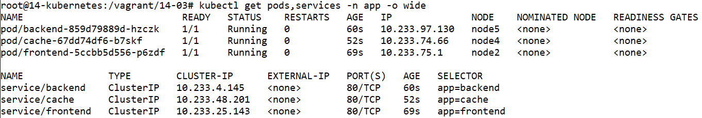
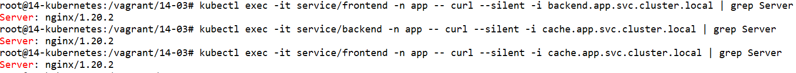
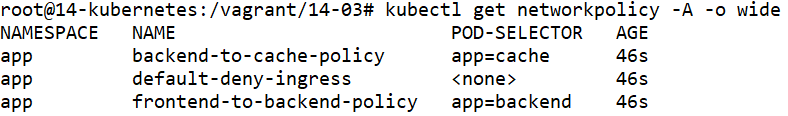
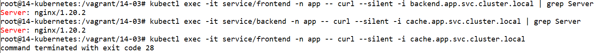

# Домашнее задание к занятию «Как работает сеть в K8s»

### Цель задания

Настроить сетевую политику доступа к подам.

### Чеклист готовности к домашнему заданию

1. Кластер K8s с установленным сетевым плагином Calico.

### Инструменты и дополнительные материалы, которые пригодятся для выполнения задания

1. [Документация Calico](https://www.tigera.io/project-calico/).
2. [Network Policy](https://kubernetes.io/docs/concepts/services-networking/network-policies/).
3. [About Network Policy](https://docs.projectcalico.org/about/about-network-policy).

-----

### Задание 1. Создать сетевую политику или несколько политик для обеспечения доступа

1. Создать deployment'ы приложений frontend, backend и cache и соответсвующие сервисы.
2. В качестве образа использовать network-multitool.
3. Разместить поды в namespace App.
4. Создать политики, чтобы обеспечить доступ frontend -> backend -> cache. Другие виды подключений должны быть запрещены.
5. Продемонстрировать, что трафик разрешён и запрещён.

### Правила приёма работы

1. Домашняя работа оформляется в своём Git-репозитории в файле README.md. Выполненное домашнее задание пришлите ссылкой на .md-файл в вашем репозитории.
2. Файл README.md должен содержать скриншоты вывода необходимых команд, а также скриншоты результатов.
3. Репозиторий должен содержать тексты манифестов или ссылки на них в файле README.md.

-----


# Ответ
# Подготовка кластера к заданию
Пришлось создавать кластер с помощью Kubespray, т.к. в кластере kubeadm с calico не запустилась сеть. Ошибка подключения:
```
kubectl get services -A
NAMESPACE          NAME                              TYPE        CLUSTER-IP       EXTERNAL-IP   PORT(S)
calico-apiserver   calico-api                        ClusterIP   10.97.58.14      <none>        443/TCP
calico-system      calico-kube-controllers-metrics   ClusterIP   None             <none>        9094/TCP
calico-system      calico-typha                      ClusterIP   10.104.112.44    <none>        5473/TCP
default            backend                           ClusterIP   10.102.129.160   <none>        80/TCP
default            cache                             ClusterIP   10.98.209.211    <none>        80/TCP
default            frontend                          ClusterIP   10.102.118.183   <none>        80/TCP
default            kubernetes                        ClusterIP   10.96.0.1        <none>        443/TCP
kube-system        kube-dns                          ClusterIP   10.96.0.10       <none>        53/UDP,53/TCP,9153/TCP

kubectl run -it busybox --image=busybox -- sh
/ # nslookup kubernetes.default
Server:    10.96.0.10
Address 1: 10.96.0.10
nslookup: can't resolve 'kubernetes.default'
/ # ping 10.96.0.10
PING 10.96.0.10 (10.96.0.10): 56 data bytes
^C
--- 10.96.0.10 ping statistics ---
22 packets transmitted, 0 packets received, 100% packet loss
/ # nc -vz 10.102.118.183 80
10.102.118.183 (10.102.118.183:80) open
/ # nc -vz 10.96.0.1 443
10.96.0.1 (10.96.0.1:443) open
/ # nc -vz 10.96.0.10 53
nc: 10.96.0.10 (10.96.0.10:53): Connection timed out
/ # nc -vz 10.97.58.14 443
nc: 10.97.58.14 (10.97.58.14:443): Connection timed out
```


## Виртуальные машины
- Регистрируемся на Яндекс Облаке по адресу `console.cloud.yandex.ru`  
- Создаём платёжный аккаунт с промо-кодом  
- Скачаем и установим утилиту `yc`  
    - `curl -sSL https://storage.yandexcloud.net/yandexcloud-yc/install.sh | bash`  
- Запустим утилиту `yc`:    
    - `yc init`  
    - Получаем OAuth токен по адресу в браузере `https://oauth.yandex.ru/authorize?response_type=token&client_id=1a6990aa636648e9b2ef855fa7bec2fb`  
    - В утилите `yc`    
        - Вставим токен  
        - Выберем папку в Яндекс Облаке  
        - Выберем создание Compute по-умолчанию  
        - Выберем зону в Яндекс Облаке  
    - Проверим созданные настройки Яндекс Облака    

        ```
        yc config list

        token: y0_A...
        cloud-id: b1gjd8gta6ntpckrp97r
        folder-id: b1gcthk9ak11bmpnbo7d
        compute-default-zone: ru-central1-b
        ```

- Получаем IAM-токен  

    ```
    yc iam create-token
    ```

- Сохраняем токен и параметры в переменную окружения  

    ```
    export YC_TOKEN=$(yc iam create-token)
    export YC_CLOUD_ID=$(yc config get cloud-id)
    export YC_FOLDER_ID=$(yc config get folder-id)
    export YC_ZONE=$(yc config get compute-default-zone)
    ```

- Сгенерируем SSH ключи на локальной машине  
    ```
    ssh-keygen
    ```
    ```
    Your public key has been saved in /root/.ssh/id_rsa.pub
    ```

- Создадим виртуальные машины в Яндекс Облаке

    - 1 мастер нода
    - 4 рабочие ноды
    - Выберем ОС Ubuntu 22.04
    - Укажем публичный ключ сгенерированный ранее
    - Создадим пользователя netology

    ```
    yc compute instance list

    +----------------------+-----------+---------------+---------+----------------+-------------+
    |          ID          |   NAME    |    ZONE ID    | STATUS  |  EXTERNAL IP   | INTERNAL IP |
    +----------------------+-----------+---------------+---------+----------------+-------------+
    | epd19crlthdepg4cb7ut | worker-02 | ru-central1-b | RUNNING | 84.252.139.70  | 10.129.0.4  |
    | epd22vmmk5lcte6aqa3h | worker-04 | ru-central1-b | RUNNING | 84.201.143.180 | 10.129.0.26 |
    | epd592298h5dv9kqu699 | master-01 | ru-central1-b | RUNNING | 51.250.101.92  | 10.129.0.17 |
    | epd798kqisll1ve28j7h | worker-01 | ru-central1-b | RUNNING | 51.250.107.104 | 10.129.0.24 |
    | epdqpebrnm8daha4q6dp | worker-03 | ru-central1-b | RUNNING | 62.84.121.237  | 10.129.0.27 |
    +----------------------+-----------+---------------+---------+----------------+-------------+
    ```


# Мастер нода

- Подключаемся к ноде

    ```
    ssh -i ~/.ssh/id_rsa netology@51.250.101.92
    ```

- Подготавливаем kubespray

    ```
    apt-get update -y
    apt-get install git pip -y
    git clone https://github.com/kubernetes-sigs/kubespray
    cd kubespray
    pip3 install -r requirements.txt
    cp -rfp inventory/sample inventory/mycluster
    declare -a IPS=(10.129.0.17 10.129.0.24 10.129.0.4 10.129.0.27 10.129.0.26)
    ```

    - указываем локальные IP адреса машин из Яндекс Облака
    - первый адрес мастер ноды

- Генерируем файл инвентаризации для Ansible

    ```
    CONFIG_FILE=inventory/mycluster/hosts.yaml python3 contrib/inventory_builder/inventory.py ${IPS[@]}
    nano inventory/mycluster/hosts.yaml
    ```
    - оставим одну мастер ноду 
    - оставим четыре рабочих ноды

    ```
    all:
      hosts:
        node1:
          ansible_host: 10.129.0.17
          ip: 10.129.0.17
          access_ip: 10.129.0.17
        node2:
          ansible_host: 10.129.0.24
          ip: 10.129.0.24
          access_ip: 10.129.0.24
        node3:
          ansible_host: 10.129.0.4
          ip: 10.129.0.4
          access_ip: 10.129.0.4
        node4:
          ansible_host: 10.129.0.27
          ip: 10.129.0.27
          access_ip: 10.129.0.27
        node5:
          ansible_host: 10.129.0.26
          ip: 10.129.0.26
          access_ip: 10.129.0.26
      children:
        kube_control_plane:
          hosts:
            node1:
        kube_node:
          hosts:
            node2:
            node3:
            node4:
            node5:
        etcd:
          hosts:
            node1:
        k8s_cluster:
          children:
            kube_control_plane:
            kube_node:
        calico_rr:
          hosts: {}
    ```

    ![hosts.yaml]hosts.yaml


- Отредактируем inventory/mycluster/group_vars/k8s_cluster/k8s-cluster.yml
    ```
    sed -i 's/# supplementary_addresses_in_ssl_keys: \[10\.0\.0\.1, 10\.0\.0\.2, 10\.0\.0\.3\]/supplementary_addresses_in_ssl_keys: \[51\.250\.101\.92, master-01\.ru-central1\.internal\]/g' inventory/mycluster/group_vars/k8s_cluster/k8s-cluster.yml
    ```

    Добавим имя и внеший адрес в сертификат


# Локальная машина

- Скопируем закрытый ключ с локальной машины на мастер ноду

    ```
    rsync --rsync-path="sudo rsync" /root/.ssh/id_rsa netology@51.250.101.92:/root/.ssh/id_rsa
    ```

# Мастер нода

- Применим конфигурацию Ansible

    ```
    chmod 600 /root/.ssh/id_rsa
    ansible-playbook -i inventory/mycluster/hosts.yaml -u netology -b -v --private-key=/root/.ssh/id_rsa cluster.yml
    ```

    Укажем пользователя и закрытый ключ для подключения к нодам


- Создадим kubeconfig на мастер ноде

    ```
    mkdir -p $HOME/.kube
    cp -i /etc/kubernetes/admin.conf $HOME/.kube/config
    chown $(id -u):$(id -g) $HOME/.kube/config
    ```

## Локальная машина

- Установим kubectl на локальную машину

    ```
    apt-get update
    apt-get install -y ca-certificates curl apt-transport-https
    mkdir -p /etc/apt/keyrings
    curl -fsSL https://packages.cloud.google.com/apt/doc/apt-key.gpg | gpg --dearmor -o /etc/apt/keyrings/kubernetes-archive-keyring.gpg
    echo "deb [signed-by=/etc/apt/keyrings/kubernetes-archive-keyring.gpg] https://apt.kubernetes.io/ kubernetes-xenial main" | tee /etc/apt/sources.list.d/kubernetes.list
    apt-get update
    apt-get install -y kubectl
    apt-mark hold kubectl
    ```

- Сохраним kubeconfig из мастер ноды на локальную машину

    ```
    mkdir -p $HOME/.kube
    rsync --rsync-path="sudo rsync" netology@51.250.101.92:/root/.kube/config /root/.kube/config
    sed -i 's/127\.0\.0\.1/51\.250\.101\.92/g' /root/.kube/config
    chown $(id -u):$(id -g) $HOME/.kube/config
    ```

    Укажем публичный IP мастер ноды

- Посмотрим состояния нод в кластере Kubernetes с помощью команды `kubectl`

    ```
    kubectl get nodes

    NAME    STATUS   ROLES           AGE   VERSION
    node1   Ready    control-plane   13m   v1.26.6
    node2   Ready    <none>          12m   v1.26.6
    node3   Ready    <none>          11m   v1.26.6
    node4   Ready    <none>          12m   v1.26.6
    node5   Ready    <none>          12m   v1.26.6
    ```


# Задание 1.

## Namespace

- Создадим файл `namespace.yml`

    ```
    apiVersion: v1
    kind: Namespace
    metadata:
      name: app
    ```

    

- Применим конфигурацию с помощью команды `kubectl`

    ```
    kubectl create -f namespace.yml
    ```


## Frontend

- Создадим файл `deployment-frontend.yml`

    ```
    ---
    apiVersion: apps/v1
    kind: Deployment
    metadata:
      labels:
        app: deployment-frontend
      name: deployment-frontend
      namespace: app
    spec:
      replicas: 1
      selector:
        matchLabels:
          app: frontend
      template:
        metadata:
          labels:
            app: frontend
        spec:
          containers:
            - name: frontend-multitool
              image: wbitt/network-multitool
    ```

    

- Создадим файл `service-frontend.yml`

    ```
    ---
    apiVersion: v1
    kind: Service
    metadata:
      name: service-frontend
      namespace: app
    spec:
      selector:
        app: frontend
      ports:
        - name: port-80
          port: 80
          protocol: TCP
          targetPort: 80
    ```

    

- Применим конфигурацию с помощью команды `kubectl`

    ```
    kubectl create -f deployment-frontend.yml -f service-frontend.yml
    ```


## Backend

- Создадим файл `deployment-backend.yml`

    ```
    ---
    apiVersion: apps/v1
    kind: Deployment
    metadata:
      labels:
        app: deployment-backend
      name: deployment-backend
      namespace: app
    spec:
      replicas: 1
      selector:
        matchLabels:
          app: backend
      template:
        metadata:
          labels:
            app: backend
        spec:
          containers:
            - name: backend-multitool
              image: wbitt/network-multitool
    ```

    

- Создадим файл `service-backend.yml`

    ```
    ---
    apiVersion: v1
    kind: Service
    metadata:
      name: service-backend
      namespace: app
    spec:
      selector:
        app: backend
      ports:
        - name: port-80
          port: 80
          protocol: TCP
          targetPort: 80
    ```

    

- Применим конфигурацию с помощью команды `kubectl`

    ```
    kubectl create -f deployment-backend.yml -f service-backend.yml
    ```


## Cache

- Создадим файл `deployment-cache.yml`

    ```
    ---
    apiVersion: apps/v1
    kind: Deployment
    metadata:
      labels:
        app: deployment-cache
      name: deployment-cache
      namespace: app
    spec:
      replicas: 1
      selector:
        matchLabels:
          app: cache
      template:
        metadata:
          labels:
            app: cache
        spec:
          containers:
            - name: cache-multitool
              image: wbitt/network-multitool
    ```

    

- Создадим файл `service-cache.yml`

    ```
    ---
    apiVersion: v1
    kind: Service
    metadata:
      name: service-cache
      namespace: app
    spec:
      selector:
        app: cache
      ports:
        - name: port-80
          port: 80
          protocol: TCP
          targetPort: 80
    ```

    

- Применим конфигурацию с помощью команды `kubectl`

    ```
    kubectl create -f deployment-cache.yml -f service-cache.yml
    ```

    


Отметим, что каждое развёртывание это один под. Каждый под имеет свой IP адрес. Поэтому не возникает конфликтов с портами, потому что каждое приложение в своём поде.

## Network policy

- Проверим запуск curl из сервисов

    ```
    kubectl exec -it service/frontend -n app -- curl --silent -i backend.app.svc.cluster.local | grep Server
    kubectl exec -it service/backend -n app -- curl --silent -i cache.app.svc.cluster.local | grep Server
    kubectl exec -it service/frontend -n app -- curl --silent -i cache.app.svc.cluster.local | grep Server
    ```

    

    - Обратим внимание, что полный путь включает namespace.
    - Обратим внимание, на полный сетевой доступ.

- Создадим файл `networkpolicy-default.yml`

    ```
    ---
    apiVersion: networking.k8s.io/v1
    kind: NetworkPolicy
    metadata:
      name: default-deny-ingress
      namespace: app
    spec:
      podSelector: {}
      policyTypes:
        - Ingress
    ```

    

- Создадим файл `networkpolicy-backend.yml`

    ```
    ---
    apiVersion: networking.k8s.io/v1
    kind: NetworkPolicy
    metadata:
      name: frontend-to-backend-policy
      namespace: app
    spec:
      podSelector:
        matchLabels:
          app: backend
      policyTypes:
        - Ingress
      ingress:
        - from:
          - podSelector:
              matchLabels:
                app: frontend
          ports:
            - protocol: TCP
              port: 80
            - protocol: TCP
              port: 443
    ```

    

- Создадим файл `networkpolicy-cache.yml`

    ```
    ---
    apiVersion: networking.k8s.io/v1
    kind: NetworkPolicy
    metadata:
      name: frontend-to-backend-policy
      namespace: app
    spec:
      podSelector:
        matchLabels:
          app: backend
      policyTypes:
        - Ingress
      ingress:
        - from:
          - podSelector:
              matchLabels:
                app: frontend
          ports:
            - protocol: TCP
              port: 80
            - protocol: TCP
              port: 443
    ```

    

- Применим конфигурацию с помощью команды `kubectl`

    ```
    kubectl create -f networkpolicy-default.yml -f networkpolicy-backend.yml -f networkpolicy-cache.yml
    ```

    


- Проверим сетевой доступ между сервисами с помощью `curl`

    ```
    kubectl exec -it service/frontend -n app -- curl --silent -i backend.app.svc.cluster.local | grep Server
    kubectl exec -it service/backend -n app -- curl --silent -i cache.app.svc.cluster.local | grep Server
    kubectl exec -it service/frontend -n app -- curl --silent -i cache.app.svc.cluster.local | grep Server
    ```

    

    Обратим внимание, что полный сетевой доступ пропал. Правило по умолчанию запрещает подключения не разрешённые специально. Среди разрешённых подключений нет подключения от frontend до cache. Поэтому мы видим ошибку соединения. Это значит, что сетевые политики работают.

