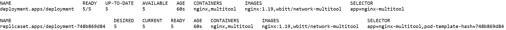
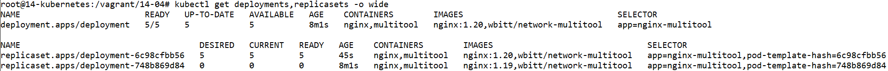
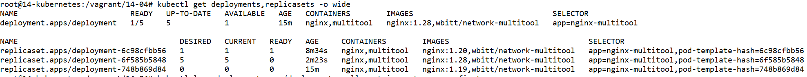
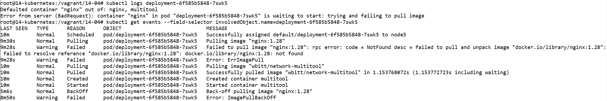
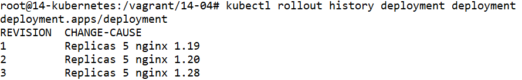
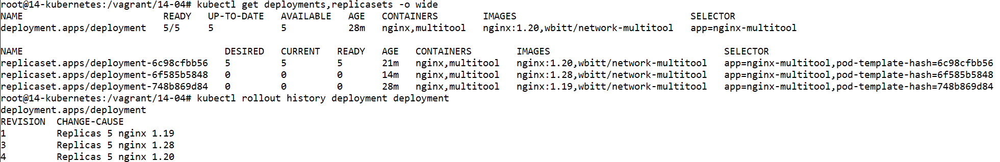

# Домашнее задание к занятию «Обновление приложений»

### Цель задания

Выбрать и настроить стратегию обновления приложения.

### Чеклист готовности к домашнему заданию

1. Кластер K8s.

### Инструменты и дополнительные материалы, которые пригодятся для выполнения задания

1. [Документация Updating a Deployment](https://kubernetes.io/docs/concepts/workloads/controllers/deployment/#updating-a-deployment).
2. [Статья про стратегии обновлений](https://habr.com/ru/companies/flant/articles/471620/).

-----

### Задание 1. Выбрать стратегию обновления приложения и описать ваш выбор

1. Имеется приложение, состоящее из нескольких реплик, которое требуется обновить.
2. Ресурсы, выделенные для приложения, ограничены, и нет возможности их увеличить.
3. Запас по ресурсам в менее загруженный момент времени составляет 20%.
4. Обновление мажорное, новые версии приложения не умеют работать со старыми.
5. Вам нужно объяснить свой выбор стратегии обновления приложения.

### Задание 2. Обновить приложение

1. Создать deployment приложения с контейнерами nginx и multitool. Версию nginx взять 1.19. Количество реплик — 5.
2. Обновить версию nginx в приложении до версии 1.20, сократив время обновления до минимума. Приложение должно быть доступно.
3. Попытаться обновить nginx до версии 1.28, приложение должно оставаться доступным.
4. Откатиться после неудачного обновления.

## Дополнительные задания — со звёздочкой*

Задания дополнительные, необязательные к выполнению, они не повлияют на получение зачёта по домашнему заданию. **Но мы настоятельно рекомендуем вам выполнять все задания со звёздочкой.** Это поможет лучше разобраться в материале.   

### Задание 3*. Создать Canary deployment

1. Создать два deployment'а приложения nginx.
2. При помощи разных ConfigMap сделать две версии приложения — веб-страницы.
3. С помощью ingress создать канареечный деплоймент, чтобы можно было часть трафика перебросить на разные версии приложения.

### Правила приёма работы

1. Домашняя работа оформляется в своем Git-репозитории в файле README.md. Выполненное домашнее задание пришлите ссылкой на .md-файл в вашем репозитории.
2. Файл README.md должен содержать скриншоты вывода необходимых команд, а также скриншоты результатов.
3. Репозиторий должен содержать тексты манифестов или ссылки на них в файле README.md.

-----


# Ответ
# Подготовка кластера к заданию


## Виртуальные машины
- Регистрируемся на Яндекс Облаке по адресу `console.cloud.yandex.ru`  
- Создаём платёжный аккаунт с промо-кодом  
- Скачаем и установим утилиту `yc`  
    - `curl -sSL https://storage.yandexcloud.net/yandexcloud-yc/install.sh | bash`  
- Запустим утилиту `yc`:    
    - `yc init`  
    - Получаем OAuth токен по адресу в браузере `https://oauth.yandex.ru/authorize?response_type=token&client_id=1a6990aa636648e9b2ef855fa7bec2fb`  
    - В утилите `yc`    
        - Вставим токен  
        - Выберем папку в Яндекс Облаке  
        - Выберем создание Compute по-умолчанию  
        - Выберем зону в Яндекс Облаке  
    - Проверим созданные настройки Яндекс Облака    

        ```
        yc config list

        token: y0_A...
        cloud-id: b1gjd8gta6ntpckrp97r
        folder-id: b1gcthk9ak11bmpnbo7d
        compute-default-zone: ru-central1-b
        ```

- Получаем IAM-токен  

    ```
    yc iam create-token
    ```

- Сохраняем токен и параметры в переменную окружения  

    ```
    export YC_TOKEN=$(yc iam create-token)
    export YC_CLOUD_ID=$(yc config get cloud-id)
    export YC_FOLDER_ID=$(yc config get folder-id)
    export YC_ZONE=$(yc config get compute-default-zone)
    ```

- Сгенерируем SSH ключи на локальной машине  
    ```
    ssh-keygen
    ```
    ```
    Your public key has been saved in /root/.ssh/id_rsa.pub
    ```

- Создадим виртуальные машины в Яндекс Облаке

    - 1 мастер нода
    - 4 рабочие ноды
    - Выберем ОС Ubuntu 22.04
    - Укажем публичный ключ сгенерированный ранее
    - Создадим пользователя netology

    ```
    yc compute instance list

    +----------------------+-----------+---------------+---------+----------------+-------------+
    |          ID          |   NAME    |    ZONE ID    | STATUS  |  EXTERNAL IP   | INTERNAL IP |
    +----------------------+-----------+---------------+---------+----------------+-------------+
    | epd19crlthdepg4cb7ut | worker-02 | ru-central1-b | RUNNING | 84.252.139.70  | 10.129.0.4  |
    | epd22vmmk5lcte6aqa3h | worker-04 | ru-central1-b | RUNNING | 84.201.143.180 | 10.129.0.26 |
    | epd592298h5dv9kqu699 | master-01 | ru-central1-b | RUNNING | 51.250.101.92  | 10.129.0.17 |
    | epd798kqisll1ve28j7h | worker-01 | ru-central1-b | RUNNING | 51.250.107.104 | 10.129.0.24 |
    | epdqpebrnm8daha4q6dp | worker-03 | ru-central1-b | RUNNING | 62.84.121.237  | 10.129.0.27 |
    +----------------------+-----------+---------------+---------+----------------+-------------+
    ```


# Мастер нода

- Подключаемся к ноде

    ```
    ssh -i ~/.ssh/id_rsa netology@51.250.101.92
    ```

- Подготавливаем kubespray

    ```
    apt-get update -y
    apt-get install git pip -y
    git clone https://github.com/kubernetes-sigs/kubespray
    cd kubespray
    pip3 install -r requirements.txt
    cp -rfp inventory/sample inventory/mycluster
    declare -a IPS=(10.129.0.17 10.129.0.24 10.129.0.4 10.129.0.27 10.129.0.26)
    ```

    - указываем локальные IP адреса машин из Яндекс Облака
    - первый адрес мастер ноды

- Генерируем файл инвентаризации для Ansible

    ```
    CONFIG_FILE=inventory/mycluster/hosts.yaml python3 contrib/inventory_builder/inventory.py ${IPS[@]}
    nano inventory/mycluster/hosts.yaml
    ```
    - оставим одну мастер ноду 
    - оставим четыре рабочих ноды

    ```
    all:
      hosts:
        node1:
          ansible_host: 10.129.0.17
          ip: 10.129.0.17
          access_ip: 10.129.0.17
        node2:
          ansible_host: 10.129.0.24
          ip: 10.129.0.24
          access_ip: 10.129.0.24
        node3:
          ansible_host: 10.129.0.4
          ip: 10.129.0.4
          access_ip: 10.129.0.4
        node4:
          ansible_host: 10.129.0.27
          ip: 10.129.0.27
          access_ip: 10.129.0.27
        node5:
          ansible_host: 10.129.0.26
          ip: 10.129.0.26
          access_ip: 10.129.0.26
      children:
        kube_control_plane:
          hosts:
            node1:
        kube_node:
          hosts:
            node2:
            node3:
            node4:
            node5:
        etcd:
          hosts:
            node1:
        k8s_cluster:
          children:
            kube_control_plane:
            kube_node:
        calico_rr:
          hosts: {}
    ```

    


- Отредактируем inventory/mycluster/group_vars/k8s_cluster/k8s-cluster.yml
    ```
    sed -i 's/# supplementary_addresses_in_ssl_keys: \[10\.0\.0\.1, 10\.0\.0\.2, 10\.0\.0\.3\]/supplementary_addresses_in_ssl_keys: \[51\.250\.101\.92, master-01\.ru-central1\.internal\]/g' inventory/mycluster/group_vars/k8s_cluster/k8s-cluster.yml
    ```

    Добавим имя и внешний адрес мастер ноды в сертификат кластера


# Локальная машина

- Скопируем закрытый ключ с локальной машины на мастер ноду

    ```
    rsync --rsync-path="sudo rsync" /root/.ssh/id_rsa netology@51.250.101.92:/root/.ssh/id_rsa
    ```

# Мастер нода

- Применим конфигурацию Ansible

    ```
    chmod 600 /root/.ssh/id_rsa
    ansible-playbook -i inventory/mycluster/hosts.yaml -u netology -b -v --private-key=/root/.ssh/id_rsa cluster.yml
    ```

    Укажем пользователя и закрытый ключ для подключения к нодам


- Создадим kubeconfig на мастер ноде

    ```
    mkdir -p $HOME/.kube
    cp -i /etc/kubernetes/admin.conf $HOME/.kube/config
    chown $(id -u):$(id -g) $HOME/.kube/config
    ```

## Локальная машина

- Установим kubectl на локальную машину

    ```
    apt-get update
    apt-get install -y ca-certificates curl apt-transport-https
    mkdir -p /etc/apt/keyrings
    curl -fsSL https://packages.cloud.google.com/apt/doc/apt-key.gpg | gpg --dearmor -o /etc/apt/keyrings/kubernetes-archive-keyring.gpg
    echo "deb [signed-by=/etc/apt/keyrings/kubernetes-archive-keyring.gpg] https://apt.kubernetes.io/ kubernetes-xenial main" | tee /etc/apt/sources.list.d/kubernetes.list
    apt-get update
    apt-get install -y kubectl
    apt-mark hold kubectl
    ```

- Сохраним kubeconfig из мастер ноды на локальную машину

    ```
    mkdir -p $HOME/.kube
    rsync --rsync-path="sudo rsync" netology@51.250.101.92:/root/.kube/config /root/.kube/config
    sed -i 's/127\.0\.0\.1/51\.250\.101\.92/g' /root/.kube/config
    chown $(id -u):$(id -g) $HOME/.kube/config
    ```

    Укажем публичный IP мастер ноды

- Посмотрим состояния нод в кластере Kubernetes с помощью команды `kubectl`

    ```
    kubectl get nodes

    NAME    STATUS   ROLES           AGE   VERSION
    node1   Ready    control-plane   13m   v1.26.6
    node2   Ready    <none>          12m   v1.26.6
    node3   Ready    <none>          11m   v1.26.6
    node4   Ready    <none>          12m   v1.26.6
    node5   Ready    <none>          12m   v1.26.6
    ```


# Задание 1.

Выбираем вариант обновления recreate из-за ограниченности ресурсов и несовместимости версий. При таком обновлении сначала удаляется старая версия, потом разворачивается новая версия. К сожалению это приведёт к недоступности приложения на период развёртывания.


# Задание 2.

- Создадим файл `deployemnt-1.yml`

    ```
    ---
    apiVersion: apps/v1
    kind: Deployment
    metadata:
      name: deployment
      labels:
        app: nginx-multitool
      annotations:
        kubernetes.io/change-cause: "Replicas 5 nginx 1.19"
    spec:
      replicas: 5
      strategy:
        type: RollingUpdate
        rollingUpdate:
          maxSurge: 85%
          maxUnavailable: 85%
      selector:
        matchLabels:
          app: nginx-multitool
      template:
        metadata:
          labels:
            app: nginx-multitool
        spec:
          containers:
          - name: nginx
            image: nginx:1.19
            ports:
              - containerPort: 80
          - name: multitool
            image: wbitt/network-multitool
            ports:
              - containerPort: 8080
            env:
              - name: HTTP_PORT
                value: "8080"
              - name: HTTPS_PORT
                value: "11443"
    ```

    

- Запустим развёртывание командой `kubectl`

    ```
    kubectl apply -f deployment-1.yml
    ```

- Проверим статус командой `kubectl`

    ```
    kubectl get deployments,replicasets -o wide

    NAME                         READY   UP-TO-DATE   AVAILABLE   AGE   CONTAINERS        IMAGES                               SELECTOR
    deployment.apps/deployment   5/5     5            5           60s   nginx,multitool   nginx:1.19,wbitt/network-multitool   app=nginx-multitool

    NAME                                    DESIRED   CURRENT   READY   AGE   CONTAINERS        IMAGES                               SELECTOR
    replicaset.apps/deployment-748b869d84   5         5         5       60s   nginx,multitool   nginx:1.19,wbitt/network-multitool   app=nginx-multitool,pod-template-hash=748b869d84
    ```

    


- Создадим файл `deployemnt-2.yml`

    ```
    ---
    apiVersion: apps/v1
    kind: Deployment
    metadata:
      name: deployment
      labels:
        app: nginx-multitool
      annotations:
        kubernetes.io/change-cause: "Replicas 5 nginx 1.20"
    spec:
      replicas: 5
      strategy:
        type: RollingUpdate
        rollingUpdate:
          maxSurge: 85%
          maxUnavailable: 85%
      selector:
        matchLabels:
          app: nginx-multitool
      template:
        metadata:
          labels:
            app: nginx-multitool
        spec:
          containers:
          - name: nginx
            image: nginx:1.20
            ports:
              - containerPort: 80
          - name: multitool
            image: wbitt/network-multitool
            ports:
              - containerPort: 8080
            env:
              - name: HTTP_PORT
                value: "8080"
              - name: HTTPS_PORT
                value: "11443"
    ```

    

    Изменено: версия nginx 1.20

- Запустим развёртывание командой `kubectl`

    ```
    kubectl apply -f deployment-2.yml
    ```

- Проверим статус командой `kubectl`

    ```
    kubectl get deployments,replicasets -o wide

    NAME                         READY   UP-TO-DATE   AVAILABLE   AGE    CONTAINERS        IMAGES                               SELECTOR
    deployment.apps/deployment   5/5     5            5           8m1s   nginx,multitool   nginx:1.20,wbitt/network-multitool   app=nginx-multitool

    NAME                                    DESIRED   CURRENT   READY   AGE    CONTAINERS        IMAGES                               SELECTOR
    replicaset.apps/deployment-6c98cfbb56   5         5         5       45s    nginx,multitool   nginx:1.20,wbitt/network-multitool   app=nginx-multitool,pod-template-hash=6c98cfbb56
    replicaset.apps/deployment-748b869d84   0         0         0       8m1s   nginx,multitool   nginx:1.19,wbitt/network-multitool   app=nginx-multitool,pod-template-hash=748b869d84
    ```

    

- Создадим файл `deployemnt-3.yml`

    ```
    ---
    apiVersion: apps/v1
    kind: Deployment
    metadata:
      name: deployment
      labels:
        app: nginx-multitool
      annotations:
        kubernetes.io/change-cause: "Replicas 5 nginx 1.28"
    spec:
      replicas: 5
      strategy:
        type: RollingUpdate
        rollingUpdate:
          maxSurge: 85%
          maxUnavailable: 85%
      selector:
        matchLabels:
          app: nginx-multitool
      template:
        metadata:
          labels:
            app: nginx-multitool
        spec:
          containers:
          - name: nginx
            image: nginx:1.28
            ports:
              - containerPort: 80
          - name: multitool
            image: wbitt/network-multitool
            ports:
              - containerPort: 8080
            env:
              - name: HTTP_PORT
                value: "8080"
              - name: HTTPS_PORT
                value: "11443"
    ```

    

    Изменено: версия nginx 1.28

- Запустим развёртывание командой `kubectl`

    ```
    kubectl apply -f deployment-3.yml
    ```

- Проверим статус командой `kubectl`

    ```
    kubectl get deployments,replicasets -o wide

    NAME                         READY   UP-TO-DATE   AVAILABLE   AGE   CONTAINERS        IMAGES                               SELECTOR
    deployment.apps/deployment   1/5     5            1           15m   nginx,multitool   nginx:1.28,wbitt/network-multitool   app=nginx-multitool

    NAME                                    DESIRED   CURRENT   READY   AGE     CONTAINERS        IMAGES                               SELECTOR
    replicaset.apps/deployment-6c98cfbb56   1         1         1       8m34s   nginx,multitool   nginx:1.20,wbitt/network-multitool   app=nginx-multitool,pod-template-hash=6c98cfbb56
    replicaset.apps/deployment-6f585b5848   5         5         0       2m23s   nginx,multitool   nginx:1.28,wbitt/network-multitool   app=nginx-multitool,pod-template-hash=6f585b5848
    replicaset.apps/deployment-748b869d84   0         0         0       15m     nginx,multitool   nginx:1.19,wbitt/network-multitool   app=nginx-multitool,pod-template-hash=748b869d84
    ```

    

    ```
    kubectl logs deployment-6f585b5848-7swk5

    Defaulted container "nginx" out of: nginx, multitool
    Error from server (BadRequest): container "nginx" in pod "deployment-6f585b5848-7swk5" is waiting to start: trying and failing to pull image


    kubectl get events --field-selector involvedObject.name=deployment-6f585b5848-7swk5

    LAST SEEN   TYPE      REASON      OBJECT                            MESSAGE
    10m         Normal    Scheduled   pod/deployment-6f585b5848-7swk5   Successfully assigned default/deployment-6f585b5848-7swk5 to node5
    9m30s       Normal    Pulling     pod/deployment-6f585b5848-7swk5   Pulling image "nginx:1.28"
    9m28s       Warning   Failed      pod/deployment-6f585b5848-7swk5   Failed to pull image "nginx:1.28": rpc error: code = NotFound desc = failed to pull and unpack image "docker.io/library/nginx:1.28": failed to resolve reference "docker.io/library/nginx:1.28": docker.io/library/nginx:1.28: not found
    9m28s       Warning   Failed      pod/deployment-6f585b5848-7swk5   Error: ErrImagePull
    10m         Normal    Pulling     pod/deployment-6f585b5848-7swk5   Pulling image "wbitt/network-multitool"
    10m         Normal    Pulled      pod/deployment-6f585b5848-7swk5   Successfully pulled image "wbitt/network-multitool" in 1.153768072s (1.153772723s including waiting)
    10m         Normal    Created     pod/deployment-6f585b5848-7swk5   Created container multitool
    10m         Normal    Started     pod/deployment-6f585b5848-7swk5   Started container multitool
    5m6s        Normal    BackOff     pod/deployment-6f585b5848-7swk5   Back-off pulling image "nginx:1.28"
    8m50s       Warning   Failed      pod/deployment-6f585b5848-7swk5   Error: ImagePullBackOff
    ```

    

    Увидим, что часть подов остаётся доступной.

- Просмотрим историю развёртываний командой `kubectl`

    ```
    kubectl rollout history deployment deployment

    deployment.apps/deployment
    REVISION  CHANGE-CAUSE
    1         Replicas 5 nginx 1.19
    2         Replicas 5 nginx 1.20
    3         Replicas 5 nginx 1.28
    ```

    

- Отменим последнее развёртывание командой `kubectl`

    ```
    kubectl rollout undo deployment deployment
    ```

- Проверим статус командой `kubectl`

    ```
    kubectl get deployments,replicasets -o wide

    NAME                         READY   UP-TO-DATE   AVAILABLE   AGE   CONTAINERS        IMAGES                               SELECTOR
    deployment.apps/deployment   5/5     5            5           28m   nginx,multitool   nginx:1.20,wbitt/network-multitool   app=nginx-multitool

    NAME                                    DESIRED   CURRENT   READY   AGE   CONTAINERS        IMAGES                               SELECTOR
    replicaset.apps/deployment-6c98cfbb56   5         5         5       21m   nginx,multitool   nginx:1.20,wbitt/network-multitool   app=nginx-multitool,pod-template-hash=6c98cfbb56
    replicaset.apps/deployment-6f585b5848   0         0         0       14m   nginx,multitool   nginx:1.28,wbitt/network-multitool   app=nginx-multitool,pod-template-hash=6f585b5848
    replicaset.apps/deployment-748b869d84   0         0         0       28m   nginx,multitool   nginx:1.19,wbitt/network-multitool   app=nginx-multitool,pod-template-hash=748b869d84

    kubectl rollout history deployment deployment

    deployment.apps/deployment
    REVISION  CHANGE-CAUSE
    1         Replicas 5 nginx 1.19
    3         Replicas 5 nginx 1.28
    4         Replicas 5 nginx 1.20
    ```

    

    Увидим, что ревизия nginx 1.20 поменяла номер с 2 на 4.
