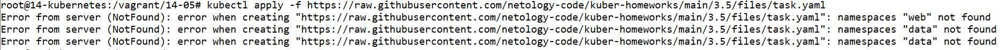
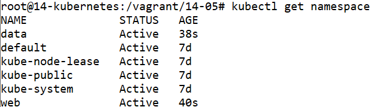
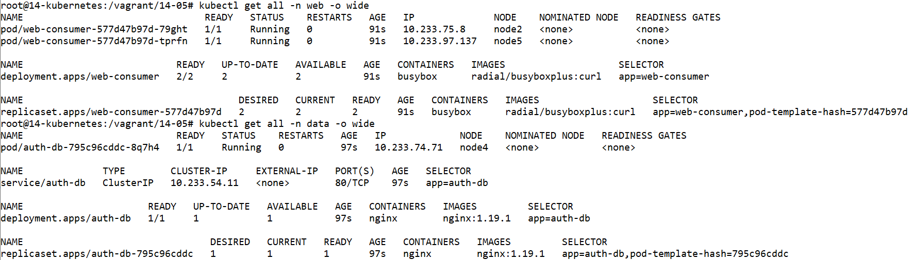
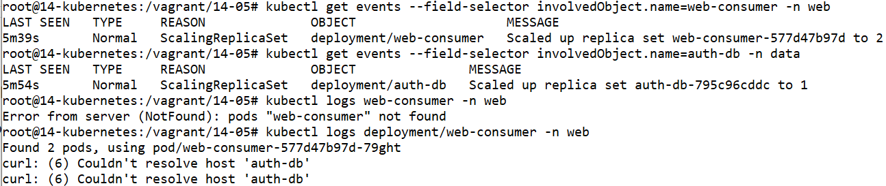
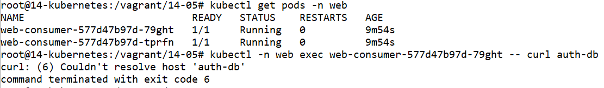
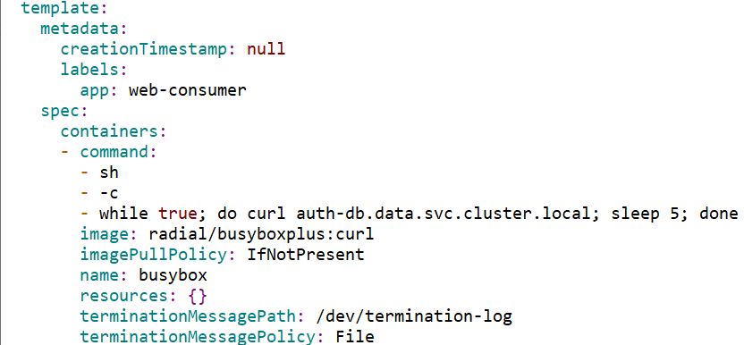

# Домашнее задание к занятию Troubleshooting

### Цель задания

Устранить неисправности при деплое приложения.

### Чеклист готовности к домашнему заданию

1. Кластер K8s.

### Задание. При деплое приложение web-consumer не может подключиться к auth-db. Необходимо это исправить

1. Установить приложение по команде:
```shell
kubectl apply -f https://raw.githubusercontent.com/netology-code/kuber-homeworks/main/3.5/files/task.yaml
```
2. Выявить проблему и описать.
3. Исправить проблему, описать, что сделано.
4. Продемонстрировать, что проблема решена.


### Правила приёма работы

1. Домашняя работа оформляется в своём Git-репозитории в файле README.md. Выполненное домашнее задание пришлите ссылкой на .md-файл в вашем репозитории.
2. Файл README.md должен содержать скриншоты вывода необходимых команд, а также скриншоты результатов.
3. Репозиторий должен содержать тексты манифестов или ссылки на них в файле README.md.

-----


# Ответ
# Подготовка кластера к заданию


## Виртуальные машины
- Регистрируемся на Яндекс Облаке по адресу `console.cloud.yandex.ru`  
- Создаём платёжный аккаунт с промо-кодом  
- Скачаем и установим утилиту `yc`  
    - `curl -sSL https://storage.yandexcloud.net/yandexcloud-yc/install.sh | bash`  
- Запустим утилиту `yc`:    
    - `yc init`  
    - Получаем OAuth токен по адресу в браузере `https://oauth.yandex.ru/authorize?response_type=token&client_id=1a6990aa636648e9b2ef855fa7bec2fb`  
    - В утилите `yc`    
        - Вставим токен  
        - Выберем папку в Яндекс Облаке  
        - Выберем создание Compute по-умолчанию  
        - Выберем зону в Яндекс Облаке  
    - Проверим созданные настройки Яндекс Облака    

        ```
        yc config list

        token: y0_A...
        cloud-id: b1gjd8gta6ntpckrp97r
        folder-id: b1gcthk9ak11bmpnbo7d
        compute-default-zone: ru-central1-b
        ```

- Получаем IAM-токен  

    ```
    yc iam create-token
    ```

- Сохраняем токен и параметры в переменную окружения  

    ```
    export YC_TOKEN=$(yc iam create-token)
    export YC_CLOUD_ID=$(yc config get cloud-id)
    export YC_FOLDER_ID=$(yc config get folder-id)
    export YC_ZONE=$(yc config get compute-default-zone)
    ```

- Сгенерируем SSH ключи на локальной машине  
    ```
    ssh-keygen
    ```
    ```
    Your public key has been saved in /root/.ssh/id_rsa.pub
    ```

- Создадим виртуальные машины в Яндекс Облаке

    - 1 мастер нода
    - 4 рабочие ноды
    - Выберем ОС Ubuntu 22.04
    - Укажем публичный ключ сгенерированный ранее
    - Создадим пользователя netology

    ```
    yc compute instance list

    +----------------------+-----------+---------------+---------+----------------+-------------+
    |          ID          |   NAME    |    ZONE ID    | STATUS  |  EXTERNAL IP   | INTERNAL IP |
    +----------------------+-----------+---------------+---------+----------------+-------------+
    | epd19crlthdepg4cb7ut | worker-02 | ru-central1-b | RUNNING | 84.252.139.70  | 10.129.0.4  |
    | epd22vmmk5lcte6aqa3h | worker-04 | ru-central1-b | RUNNING | 84.201.143.180 | 10.129.0.26 |
    | epd592298h5dv9kqu699 | master-01 | ru-central1-b | RUNNING | 51.250.101.92  | 10.129.0.17 |
    | epd798kqisll1ve28j7h | worker-01 | ru-central1-b | RUNNING | 51.250.107.104 | 10.129.0.24 |
    | epdqpebrnm8daha4q6dp | worker-03 | ru-central1-b | RUNNING | 62.84.121.237  | 10.129.0.27 |
    +----------------------+-----------+---------------+---------+----------------+-------------+
    ```


# Мастер нода

- Подключаемся к ноде

    ```
    ssh -i ~/.ssh/id_rsa netology@51.250.101.92
    ```

- Подготавливаем kubespray

    ```
    apt-get update -y
    apt-get install git pip -y
    git clone https://github.com/kubernetes-sigs/kubespray
    cd kubespray
    pip3 install -r requirements.txt
    cp -rfp inventory/sample inventory/mycluster
    declare -a IPS=(10.129.0.17 10.129.0.24 10.129.0.4 10.129.0.27 10.129.0.26)
    ```

    - указываем локальные IP адреса машин из Яндекс Облака
    - первый адрес мастер ноды

- Генерируем файл инвентаризации для Ansible

    ```
    CONFIG_FILE=inventory/mycluster/hosts.yaml python3 contrib/inventory_builder/inventory.py ${IPS[@]}
    nano inventory/mycluster/hosts.yaml
    ```
    - оставим одну мастер ноду 
    - оставим четыре рабочих ноды

    ```
    all:
      hosts:
        node1:
          ansible_host: 10.129.0.17
          ip: 10.129.0.17
          access_ip: 10.129.0.17
        node2:
          ansible_host: 10.129.0.24
          ip: 10.129.0.24
          access_ip: 10.129.0.24
        node3:
          ansible_host: 10.129.0.4
          ip: 10.129.0.4
          access_ip: 10.129.0.4
        node4:
          ansible_host: 10.129.0.27
          ip: 10.129.0.27
          access_ip: 10.129.0.27
        node5:
          ansible_host: 10.129.0.26
          ip: 10.129.0.26
          access_ip: 10.129.0.26
      children:
        kube_control_plane:
          hosts:
            node1:
        kube_node:
          hosts:
            node2:
            node3:
            node4:
            node5:
        etcd:
          hosts:
            node1:
        k8s_cluster:
          children:
            kube_control_plane:
            kube_node:
        calico_rr:
          hosts: {}
    ```

    


- Отредактируем inventory/mycluster/group_vars/k8s_cluster/k8s-cluster.yml
    ```
    sed -i 's/# supplementary_addresses_in_ssl_keys: \[10\.0\.0\.1, 10\.0\.0\.2, 10\.0\.0\.3\]/supplementary_addresses_in_ssl_keys: \[51\.250\.101\.92, master-01\.ru-central1\.internal\]/g' inventory/mycluster/group_vars/k8s_cluster/k8s-cluster.yml
    ```

    Добавим имя и внешний адрес мастер ноды в сертификат кластера


# Локальная машина

- Скопируем закрытый ключ с локальной машины на мастер ноду

    ```
    rsync --rsync-path="sudo rsync" /root/.ssh/id_rsa netology@51.250.101.92:/root/.ssh/id_rsa
    ```

# Мастер нода

- Применим конфигурацию Ansible

    ```
    chmod 600 /root/.ssh/id_rsa
    ansible-playbook -i inventory/mycluster/hosts.yaml -u netology -b -v --private-key=/root/.ssh/id_rsa cluster.yml
    ```

    Укажем пользователя и закрытый ключ для подключения к нодам


- Создадим kubeconfig на мастер ноде

    ```
    mkdir -p $HOME/.kube
    cp -i /etc/kubernetes/admin.conf $HOME/.kube/config
    chown $(id -u):$(id -g) $HOME/.kube/config
    ```

## Локальная машина

- Установим kubectl на локальную машину

    ```
    apt-get update
    apt-get install -y ca-certificates curl apt-transport-https
    mkdir -p /etc/apt/keyrings
    curl -fsSL https://packages.cloud.google.com/apt/doc/apt-key.gpg | gpg --dearmor -o /etc/apt/keyrings/kubernetes-archive-keyring.gpg
    echo "deb [signed-by=/etc/apt/keyrings/kubernetes-archive-keyring.gpg] https://apt.kubernetes.io/ kubernetes-xenial main" | tee /etc/apt/sources.list.d/kubernetes.list
    apt-get update
    apt-get install -y kubectl
    apt-mark hold kubectl
    ```

- Сохраним kubeconfig из мастер ноды на локальную машину

    ```
    mkdir -p $HOME/.kube
    rsync --rsync-path="sudo rsync" netology@51.250.101.92:/root/.kube/config /root/.kube/config
    sed -i 's/127\.0\.0\.1/51\.250\.101\.92/g' /root/.kube/config
    chown $(id -u):$(id -g) $HOME/.kube/config
    ```

    Укажем публичный IP мастер ноды

- Посмотрим состояния нод в кластере Kubernetes с помощью команды `kubectl`

    ```
    kubectl get nodes

    NAME    STATUS   ROLES           AGE   VERSION
    node1   Ready    control-plane   13m   v1.26.6
    node2   Ready    <none>          12m   v1.26.6
    node3   Ready    <none>          11m   v1.26.6
    node4   Ready    <none>          12m   v1.26.6
    node5   Ready    <none>          12m   v1.26.6
    ```


# Задание 1.

- Применим манифест Kubernetes

    ```
    kubectl apply -f https://raw.githubusercontent.com/netology-code/kuber-homeworks/main/3.5/files/task.yaml

    Error from server (NotFound): error when creating "https://raw.githubusercontent.com/netology-code/kuber-homeworks/main/3.5/files/task.yaml": namespaces "web" not found
    Error from server (NotFound): error when creating "https://raw.githubusercontent.com/netology-code/kuber-homeworks/main/3.5/files/task.yaml": namespaces "data" not found
    Error from server (NotFound): error when creating "https://raw.githubusercontent.com/netology-code/kuber-homeworks/main/3.5/files/task.yaml": namespaces "data" not found
    ```

    

    Получим ошибку про несуществующее пространство имён.

- Создадим namespace командой `kubectl`

    ```
    kubectl create namespace web
    kubectl create namespace data
    ```

    

- Применим манифест Kubernetes

    ```
    kubectl apply -f https://raw.githubusercontent.com/netology-code/kuber-homeworks/main/3.5/files/task.yaml

    deployment.apps/web-consumer created
    deployment.apps/auth-db created
    service/auth-db created
    ```

- Проверим созданные артефакты в пространствах имён

    ```
    kubectl get all -n web -o wide

    NAME                                READY   STATUS    RESTARTS   AGE   IP              NODE    NOMINATED NODE   READINESS GATES
    pod/web-consumer-577d47b97d-79ght   1/1     Running   0          91s   10.233.75.8     node2   <none>           <none>
    pod/web-consumer-577d47b97d-tprfn   1/1     Running   0          91s   10.233.97.137   node5   <none>           <none>

    NAME                           READY   UP-TO-DATE   AVAILABLE   AGE   CONTAINERS   IMAGES                    SELECTOR
    deployment.apps/web-consumer   2/2     2            2           91s   busybox      radial/busyboxplus:curl   app=web-consumer

    NAME                                      DESIRED   CURRENT   READY   AGE   CONTAINERS   IMAGES                    SELECTOR
    replicaset.apps/web-consumer-577d47b97d   2         2         2       91s   busybox      radial/busyboxplus:curl   app=web-consumer,pod-template-hash=577d47b97d


    kubectl get all -n data -o wide

    NAME                           READY   STATUS    RESTARTS   AGE   IP             NODE    NOMINATED NODE   READINESS GATES
    pod/auth-db-795c96cddc-8q7h4   1/1     Running   0          97s   10.233.74.71   node4   <none>           <none>

    NAME              TYPE        CLUSTER-IP     EXTERNAL-IP   PORT(S)   AGE   SELECTOR
    service/auth-db   ClusterIP   10.233.54.11   <none>        80/TCP    97s   app=auth-db

    NAME                      READY   UP-TO-DATE   AVAILABLE   AGE   CONTAINERS   IMAGES         SELECTOR
    deployment.apps/auth-db   1/1     1            1           97s   nginx        nginx:1.19.1   app=auth-db

    NAME                                 DESIRED   CURRENT   READY   AGE   CONTAINERS   IMAGES         SELECTOR
    replicaset.apps/auth-db-795c96cddc   1         1         1       97s   nginx        nginx:1.19.1   app=auth-db,pod-template-hash=795c96cddc
    ```

    


- Проверим логи

    ```
    kubectl logs deployment/web-consumer -n web
    Found 2 pods, using pod/web-consumer-577d47b97d-79ght
    curl: (6) Couldn't resolve host 'auth-db'
    curl: (6) Couldn't resolve host 'auth-db'
    ```

    

    Увидим что у подов в web-consumer нет возможности разрешить имя auth-db

- Проверим рарзрешение имён вручную командой `kubectl`

    ```
    kubectl -n web exec web-consumer-577d47b97d-79ght -- curl auth-db
    curl: (6) Couldn't resolve host 'auth-db'
    command terminated with exit code 6
    ```

    

- Проверим возможно ли разрешение полного имени (FQDN)

    ```
    kubectl -n web exec web-consumer-577d47b97d-79ght -- curl --silent -I auth-db.data.svc.cluster.local

    HTTP/1.1 200 OK
    Server: nginx/1.19.1
    Date: Sun, 09 Jul 2023 11:43:47 GMT
    Content-Type: text/html
    Content-Length: 612
    Last-Modified: Tue, 07 Jul 2020 15:52:25 GMT
    Connection: keep-alive
    ETag: "5f049a39-264"
    Accept-Ranges: bytes
    ```

    Увидим, что разрешение по полному имени работает. Полное имя включает в себя пространство имён `data` для пода `auth-db`. 

    - Отредактируем манифест для пода развёртывания `web-condumer`
    ```
    kubectl edit -n web deployments/web-consumer
    ```

    

    Добавим полное имя до пода `auth-db`

- Проверим логи

    ```
    kubectl logs deployment/web-consumer -n web

    Found 2 pods, using pod/web-consumer-7f687d84fc-7zsff
    working. Further configuration is required.</p>

    <p>For online documentation and support please refer to
    <a href="http://nginx.org/">nginx.org</a>.<br/>
    Commercial support is available at
    <a href="http://nginx.com/">nginx.com</a>.</p>

    <p><em>Thank you for using nginx.</em></p>
    </body>
    </html>

    kubectl logs deployment/auth-db -n data

    10.233.97.138 - - [09/Jul/2023:11:53:16 +0000] "GET / HTTP/1.1" 200 612 "-" "curl/7.35.0" "-"
    10.233.75.10 - - [09/Jul/2023:11:53:17 +0000] "GET / HTTP/1.1" 200 612 "-" "curl/7.35.0" "-"
    10.233.97.138 - - [09/Jul/2023:11:53:21 +0000] "GET / HTTP/1.1" 200 612 "-" "curl/7.35.0" "-"
    10.233.75.10 - - [09/Jul/2023:11:53:22 +0000] "GET / HTTP/1.1" 200 612 "-" "curl/7.35.0" "-"
    10.233.97.138 - - [09/Jul/2023:11:53:26 +0000] "GET / HTTP/1.1" 200 612 "-" "curl/7.35.0" "-"
    10.233.75.10 - - [09/Jul/2023:11:53:27 +0000] "GET / HTTP/1.1" 200 612 "-" "curl/7.35.0" "-"
    10.233.97.138 - - [09/Jul/2023:11:53:31 +0000] "GET / HTTP/1.1" 200 612 "-" "curl/7.35.0" "-"
    10.233.75.10 - - [09/Jul/2023:11:53:32 +0000] "GET / HTTP/1.1" 200 612 "-" "curl/7.35.0" "-"
    10.233.97.138 - - [09/Jul/2023:11:53:36 +0000] "GET / HTTP/1.1" 200 612 "-" "curl/7.35.0" "-"
    10.233.75.10 - - [09/Jul/2023:11:53:37 +0000] "GET / HTTP/1.1" 200 612 "-" "curl/7.35.0" "-"
    ```

    

    Увидим, что доступ из `web-consumer` в `auth-db` появился. Проблема устранена.

