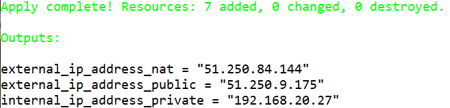

# Домашнее задание к занятию "15.1. Организация сети"

Домашнее задание будет состоять из обязательной части, которую необходимо выполнить на провайдере Яндекс.Облако и дополнительной части в AWS по желанию. Все домашние задания в 15 блоке связаны друг с другом и в конце представляют пример законченной инфраструктуры.  
Все задания требуется выполнить с помощью Terraform, результатом выполненного домашнего задания будет код в репозитории. 

Перед началом работ следует настроить доступ до облачных ресурсов из Terraform используя материалы прошлых лекций и [ДЗ](https://github.com/netology-code/virt-homeworks/tree/master/07-terraform-02-syntax ). А также заранее выбрать регион (в случае AWS) и зону.

---
## Задание 1. Яндекс.Облако (обязательное к выполнению)

1. Создать VPC.
- Создать пустую VPC. Выбрать зону.
2. Публичная подсеть.
- Создать в vpc subnet с названием public, сетью 192.168.10.0/24.
- Создать в этой подсети NAT-инстанс, присвоив ему адрес 192.168.10.254. В качестве image_id использовать fd80mrhj8fl2oe87o4e1
- Создать в этой публичной подсети виртуалку с публичным IP и подключиться к ней, убедиться что есть доступ к интернету.
3. Приватная подсеть.
- Создать в vpc subnet с названием private, сетью 192.168.20.0/24.
- Создать route table. Добавить статический маршрут, направляющий весь исходящий трафик private сети в NAT-инстанс
- Создать в этой приватной подсети виртуалку с внутренним IP, подключиться к ней через виртуалку, созданную ранее и убедиться что есть доступ к интернету

Resource terraform для ЯО
- [VPC subnet](https://registry.terraform.io/providers/yandex-cloud/yandex/latest/docs/resources/vpc_subnet)
- [Route table](https://registry.terraform.io/providers/yandex-cloud/yandex/latest/docs/resources/vpc_route_table)
- [Compute Instance](https://registry.terraform.io/providers/yandex-cloud/yandex/latest/docs/resources/compute_instance)
---
## Задание 2*. AWS (необязательное к выполнению)

1. Создать VPC.
- Cоздать пустую VPC с подсетью 10.10.0.0/16.
2. Публичная подсеть.
- Создать в vpc subnet с названием public, сетью 10.10.1.0/24
- Разрешить в данной subnet присвоение public IP по-умолчанию. 
- Создать Internet gateway 
- Добавить в таблицу маршрутизации маршрут, направляющий весь исходящий трафик в Internet gateway.
- Создать security group с разрешающими правилами на SSH и ICMP. Привязать данную security-group на все создаваемые в данном ДЗ виртуалки
- Создать в этой подсети виртуалку и убедиться, что инстанс имеет публичный IP. Подключиться к ней, убедиться что есть доступ к интернету.
- Добавить NAT gateway в public subnet.
3. Приватная подсеть.
- Создать в vpc subnet с названием private, сетью 10.10.2.0/24
- Создать отдельную таблицу маршрутизации и привязать ее к private-подсети
- Добавить Route, направляющий весь исходящий трафик private сети в NAT.
- Создать виртуалку в приватной сети.
- Подключиться к ней по SSH по приватному IP через виртуалку, созданную ранее в публичной подсети и убедиться, что с виртуалки есть выход в интернет.

Resource terraform
- [VPC](https://registry.terraform.io/providers/hashicorp/aws/latest/docs/resources/vpc)
- [Subnet](https://registry.terraform.io/providers/hashicorp/aws/latest/docs/resources/subnet)
- [Internet Gateway](https://registry.terraform.io/providers/hashicorp/aws/latest/docs/resources/internet_gateway)


# Ответ

## Подготовка к заданию

- Регистрация на Яндекс Облаке по адресу `console.cloud.yandex.ru`  
- Создаём платёжный аккаунт с промо-кодом  
- Скачаем и установим утилиту `yc`  
    - `curl -sSL https://storage.yandexcloud.net/yandexcloud-yc/install.sh | bash`  
- Запустим утилиту `yc`:    
    - `yc init`  
    - Получим OAuth токен по адресу в браузере `https://oauth.yandex.ru/authorize?response_type=token&client_id=1a6990aa636648e9b2ef855fa7bec2fb`  
    - В утилите `yc`    
        - Вставим токен из браузера
        - Выберем папку в Яндекс Облаке  
        - Выберем создание Compute по-умолчанию  
        - Выберем зону в Яндекс Облаке  
    - Проверим созданные настройки Яндекс Облака    
        - `yc config list`
            ```
            token: y0_A...
            cloud-id: b1gjd8gta6ntpckrp97r
            folder-id: b1gcthk9ak11bmpnbo7d
            compute-default-zone: ru-central1-a
            ```
- Получим IAM-токен  
    ```
    yc iam create-token
    ```
- Сохраним токен и параметры в переменную окружения  
    ```
    export YC_TOKEN=$(yc iam create-token)
    export YC_CLOUD_ID=$(yc config get cloud-id)
    export YC_FOLDER_ID=$(yc config get folder-id)
    export YC_ZONE=$(yc config get compute-default-zone)
    ```

- Установим последнюю версию Terraform пакета в Ubuntu:

    ```
    wget -O- https://apt.releases.hashicorp.com/gpg | gpg --dearmor | sudo tee /usr/share/keyrings/hashicorp-archive-keyring.gpg
    echo "deb [signed-by=/usr/share/keyrings/hashicorp-archive-keyring.gpg] https://apt.releases.hashicorp.com $(lsb_release -cs) main" | sudo tee /etc/apt/sources.list.d/hashicorp.list
    sudo apt update && sudo apt install terraform
    ```


- Настроем провайдер terraform  
    ```
    ~/.terraformrc

    provider_installation {
      network_mirror {
        url = "https://terraform-mirror.yandexcloud.net/"
        include = ["registry.terraform.io/*/*"]
      }
      direct {
        exclude = ["registry.terraform.io/*/*"]
      }
    }
    ```
- Сгенерируем SSH ключи на локальной машине  
    ```
    ssh-keygen
    ```
- Создадим файл `main.tf`
    ```
    terraform {
      required_providers {
        yandex = {
          source = "yandex-cloud/yandex"
        }
      }
      required_version = ">= 0.13"
    }

    provider "yandex" {
      zone = "ru-central1-a"
    }
    ```
- Инициализируем провайдер  
    ```
    terraform init
    ```


## Задание 1.

- Отредактируем файл `main.tf`

    ```
    # Variables
    variable "yc_token" {
      default = "t1.9eue..."
    }
    variable "yc_cloud_id" {
      default = "b1gjd8gta6ntpckrp97r"
    }
    variable "yc_folder_id" {
      default = "b1gcthk9ak11bmpnbo7d"
    }
    variable "yc_region" {
      default = "ru-central1-a"
    }


    # Terraform providers
    terraform {
      required_providers {
        yandex = {
          source = "yandex-cloud/yandex"
        }
      }
      required_version = ">= 0.13"
    }
    provider "yandex" {
      token     = var.yc_token
      cloud_id  = var.yc_cloud_id
      folder_id = var.yc_folder_id
      zone = var.yc_region
    }


    # Network
    ## VPC
    resource "yandex_vpc_network" "network-netology" {
      name = "network-netology"
    }
    ## Public subnet
    resource "yandex_vpc_subnet" "public" {
      name           = "public"
      zone           = var.yc_region
      network_id     = yandex_vpc_network.network-netology.id
      v4_cidr_blocks = ["192.168.10.0/24"]
    }
    ## Private subnet
    resource "yandex_vpc_subnet" "private" {
      name           = "private"
      zone           = var.yc_region
      network_id     = yandex_vpc_network.network-netology.id
      route_table_id = yandex_vpc_route_table.netology-rt.id
      v4_cidr_blocks = ["192.168.20.0/24"]
    }
    ## Routing table
    resource "yandex_vpc_route_table" "netology-rt" {
      name       = "netology-rt"
      network_id = yandex_vpc_network.network-netology.id
      static_route {
        destination_prefix = "0.0.0.0/0"
        next_hop_address   = "192.168.10.254"
      }
    }


    # Compute instance
    ## Public instance
    resource "yandex_compute_instance" "public-instance" {
      name = "public-instance"
      hostname = "public-instance"
      zone     = var.yc_region
      resources {
        cores  = 2
        memory = 2
      }
      boot_disk {
        initialize_params {
          image_id = "fd8bkgba66kkf9eenpkb"
        }
      }
      network_interface {
        subnet_id = yandex_vpc_subnet.public.id
        nat       = true
      }
      metadata = {
        ssh-keys = "ubuntu:${file("~/.ssh/id_rsa.pub")}"
      }
    }
    ## NAT instance
    resource "yandex_compute_instance" "nat-instance" {
      name = "nat-instance"
      hostname = "nat-instance"
      zone     = var.yc_region
      resources {
        cores  = 2
        memory = 2
      }
      boot_disk {
        initialize_params {
          image_id = "fd80mrhj8fl2oe87o4e1"
        }
      }
      network_interface {
        subnet_id = yandex_vpc_subnet.public.id
        ip_address = "192.168.10.254"
        nat       = true
      }
      metadata = {
        ssh-keys = "ubuntu:${file("~/.ssh/id_rsa.pub")}"
      }
    }
    ## Private instance
    resource "yandex_compute_instance" "private-instance" {
      name = "private-instance"
      hostname = "private-instance"
      zone     = var.yc_region
      resources {
        cores  = 2
        memory = 2
      }
      boot_disk {
        initialize_params {
          image_id = "fd8bkgba66kkf9eenpkb"
        }
      }
      network_interface {
        subnet_id = yandex_vpc_subnet.private.id
      }
      metadata = {
        ssh-keys = "ubuntu:${file("~/.ssh/id_rsa.pub")}"
      }
    }


    # Output
    output "internal_ip_address_private" {
      value = yandex_compute_instance.private-instance.network_interface.0.ip_address
    }
    output "external_ip_address_public" {
      value = yandex_compute_instance.public-instance.network_interface.0.nat_ip_address
    }
    output "external_ip_address_nat" {
      value = yandex_compute_instance.nat-instance.network_interface.0.nat_ip_address
    }
    ```


    

- Проверим конфигурацию terraform  
    ```
    terraform validate
    ```
- Подготовим план terraform  
    ```
    terraform plan
    ```

    

- Создадим ресурсы в Яндекс Облаке  
    ```
    terraform apply --auto-approve
    
    external_ip_address_nat = "51.250.84.144"
    external_ip_address_public = "51.250.9.175"
    internal_ip_address_private = "192.168.20.27"
    ```

    

- Проверим, что виртуальная машина в Яндекс Облаке создалась с помощью утилиты yc
    ```
    yc compute instance list

    +----------------------+------------------+---------------+---------+---------------+----------------+
    |          ID          |       NAME       |    ZONE ID    | STATUS  |  EXTERNAL IP  |  INTERNAL IP   |
    +----------------------+------------------+---------------+---------+---------------+----------------+
    | fhmden3va91mhvd26k82 | private-instance | ru-central1-a | RUNNING |               | 192.168.20.27  |
    | fhmk9lm64qim9eff8mt9 | nat-instance     | ru-central1-a | RUNNING | 51.250.84.144 | 192.168.10.254 |
    | fhmkqnrc2iq918itnl1q | public-instance  | ru-central1-a | RUNNING | 51.250.9.175  | 192.168.10.11  |
    +----------------------+------------------+---------------+---------+---------------+----------------+
    ```

    

    Увидим, что:
 
    - Private ВМ не имеет внешнего IP адреса
    - NAT ВМ имеет внутренний IP адрес, указанный в манифесте

    ```
    yc vpc subnet list

    +----------------------+---------+----------------------+----------------------+---------------+-------------------+
    |          ID          |  NAME   |      NETWORK ID      |    ROUTE TABLE ID    |     ZONE      |       RANGE       |
    +----------------------+---------+----------------------+----------------------+---------------+-------------------+
    | e9b745dujsj2q4rado9q | public  | enp3tr4e51eoa1pb1jef |                      | ru-central1-a | [192.168.10.0/24] |
    | e9bclg4vqas7klvkqk4j | private | enp3tr4e51eoa1pb1jef | enpusqlsr3vvl41sd70c | ru-central1-a | [192.168.20.0/24] |
    +----------------------+---------+----------------------+----------------------+---------------+-------------------+
    ```

    

    Увидим, что Private сеть имеет привязанную таблицу маршрутизации

- Подключимся к публичному инстансу

    ```
    ssh ubuntu@51.250.9.175
    ```

    

    Увидим, что доступ с публичного инстанса в Интернет проходит.

- Скопируем закрытый ключ SSH с публичного инстанса на Private

    ```
    scp -i ~/.ssh/id_rsa ~/.ssh/id_rsa ubuntu@51.250.9.175:~/.ssh/id_rsa
    ssh ubuntu@51.250.9.175
    ssh ubuntu@192.168.20.27
    ```

    

    Увидим, что доступ с Private инстанса в Интернет проходит.

- Создать в этой публичной подсети виртуалку с публичным IP и подключиться к ней, убедиться что есть доступ к интернету.

- Создать в этой приватной подсети виртуалку с внутренним IP, подключиться к ней через виртуалку, созданную ранее и убедиться что есть доступ к интернету


- Удалим ресурсы в Яндекс Облаке  
    ```
    terraform destroy --auto-approve
    ```


