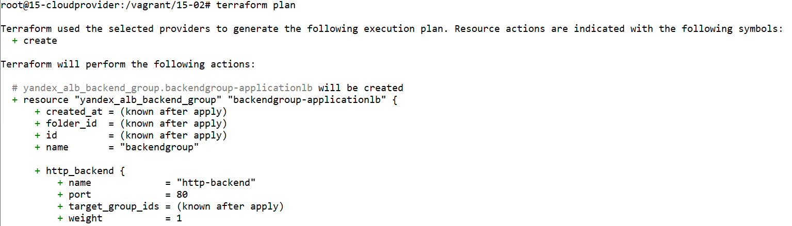
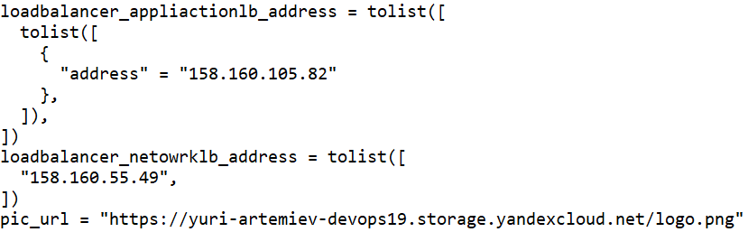
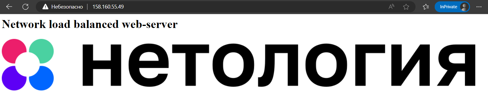
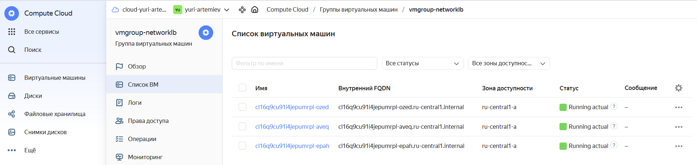

# Домашнее задание к занятию «Вычислительные мощности. Балансировщики нагрузки»  

### Подготовка к выполнению задания

1. Домашнее задание состоит из обязательной части, которую нужно выполнить на провайдере Yandex Cloud, и дополнительной части в AWS (выполняется по желанию). 
2. Все домашние задания в блоке 15 связаны друг с другом и в конце представляют пример законченной инфраструктуры.  
3. Все задания нужно выполнить с помощью Terraform. Результатом выполненного домашнего задания будет код в репозитории. 
4. Перед началом работы настройте доступ к облачным ресурсам из Terraform, используя материалы прошлых лекций и домашних заданий.

---
## Задание 1. Yandex Cloud 

**Что нужно сделать**

1. Создать бакет Object Storage и разместить в нём файл с картинкой:

 - Создать бакет в Object Storage с произвольным именем (например, _имя_студента_дата_).
 - Положить в бакет файл с картинкой.
 - Сделать файл доступным из интернета.
 
2. Создать группу ВМ в public подсети фиксированного размера с шаблоном LAMP и веб-страницей, содержащей ссылку на картинку из бакета:

 - Создать Instance Group с тремя ВМ и шаблоном LAMP. Для LAMP рекомендуется использовать `image_id = fd827b91d99psvq5fjit`.
 - Для создания стартовой веб-страницы рекомендуется использовать раздел `user_data` в [meta_data](https://cloud.yandex.ru/docs/compute/concepts/vm-metadata).
 - Разместить в стартовой веб-странице шаблонной ВМ ссылку на картинку из бакета.
 - Настроить проверку состояния ВМ.
 
3. Подключить группу к сетевому балансировщику:

 - Создать сетевой балансировщик.
 - Проверить работоспособность, удалив одну или несколько ВМ.
4. (дополнительно)* Создать Application Load Balancer с использованием Instance group и проверкой состояния.

Полезные документы:

- [Compute instance group](https://registry.terraform.io/providers/yandex-cloud/yandex/latest/docs/resources/compute_instance_group).
- [Network Load Balancer](https://registry.terraform.io/providers/yandex-cloud/yandex/latest/docs/resources/lb_network_load_balancer).
- [Группа ВМ с сетевым балансировщиком](https://cloud.yandex.ru/docs/compute/operations/instance-groups/create-with-balancer).

---
## Задание 2*. AWS (задание со звёздочкой)

Это необязательное задание. Его выполнение не влияет на получение зачёта по домашней работе.

**Что нужно сделать**

Используя конфигурации, выполненные в домашнем задании из предыдущего занятия, добавить к Production like сети Autoscaling group из трёх EC2-инстансов с  автоматической установкой веб-сервера в private домен.

1. Создать бакет S3 и разместить в нём файл с картинкой:

 - Создать бакет в S3 с произвольным именем (например, _имя_студента_дата_).
 - Положить в бакет файл с картинкой.
 - Сделать доступным из интернета.
2. Сделать Launch configurations с использованием bootstrap-скрипта с созданием веб-страницы, на которой будет ссылка на картинку в S3. 
3. Загрузить три ЕС2-инстанса и настроить LB с помощью Autoscaling Group.

Resource Terraform:

- [S3 bucket](https://registry.terraform.io/providers/hashicorp/aws/latest/docs/resources/s3_bucket)
- [Launch Template](https://registry.terraform.io/providers/hashicorp/aws/latest/docs/resources/launch_template).
- [Autoscaling group](https://registry.terraform.io/providers/hashicorp/aws/latest/docs/resources/autoscaling_group).
- [Launch configuration](https://registry.terraform.io/providers/hashicorp/aws/latest/docs/resources/launch_configuration).

Пример bootstrap-скрипта:

```
#!/bin/bash
yum install httpd -y
service httpd start
chkconfig httpd on
cd /var/www/html
echo "<html><h1>My cool web-server</h1></html>" > index.html
```
### Правила приёма работы

Домашняя работа оформляется в своём Git репозитории в файле README.md. Выполненное домашнее задание пришлите ссылкой на .md-файл в вашем репозитории.
Файл README.md должен содержать скриншоты вывода необходимых команд, а также скриншоты результатов.
Репозиторий должен содержать тексты манифестов или ссылки на них в файле README.md.


-----

# Ответ

## Подготовка к заданию

- Регистрация на Яндекс Облаке по адресу `console.cloud.yandex.ru`  
- Создаём платёжный аккаунт с промо-кодом  
- Скачаем и установим утилиту `yc`  
    - `curl -sSL https://storage.yandexcloud.net/yandexcloud-yc/install.sh | bash`  
- Запустим утилиту `yc`:    
    - `yc init`  
    - Получим OAuth токен по адресу в браузере `https://oauth.yandex.ru/authorize?response_type=token&client_id=1a6990aa636648e9b2ef855fa7bec2fb`  
    - В утилите `yc`    
        - Вставим токен из браузера
        - Выберем папку в Яндекс Облаке  
        - Выберем создание Compute по-умолчанию  
        - Выберем зону в Яндекс Облаке  
    - Проверим созданные настройки Яндекс Облака    
        - `yc config list`
            ```
            token: y0_A...
            cloud-id: b1gjd8gta6ntpckrp97r
            folder-id: b1gcthk9ak11bmpnbo7d
            compute-default-zone: ru-central1-a
            ```
- Получим IAM-токен  
    ```
    yc iam create-token
    ```
- Сохраним токен и параметры в переменную окружения  
    ```
    export YC_TOKEN=$(yc iam create-token)
    export YC_CLOUD_ID=$(yc config get cloud-id)
    export YC_FOLDER_ID=$(yc config get folder-id)
    export YC_ZONE=$(yc config get compute-default-zone)
    ```

- Установим последнюю версию Terraform пакета в Ubuntu:

    ```
    wget -O- https://apt.releases.hashicorp.com/gpg | gpg --dearmor | sudo tee /usr/share/keyrings/hashicorp-archive-keyring.gpg
    echo "deb [signed-by=/usr/share/keyrings/hashicorp-archive-keyring.gpg] https://apt.releases.hashicorp.com $(lsb_release -cs) main" | sudo tee /etc/apt/sources.list.d/hashicorp.list
    sudo apt update && sudo apt install terraform
    ```


- Настроем провайдер Terraform добавив файл `~/.terraformrc`
    ```
    provider_installation {
      network_mirror {
        url = "https://terraform-mirror.yandexcloud.net/"
        include = ["registry.terraform.io/*/*"]
      }
      direct {
        exclude = ["registry.terraform.io/*/*"]
      }
    }
    ```
- Сгенерируем SSH ключи на локальной машине  
    ```
    ssh-keygen
    ```
- Создадим файл `main.tf` для Terraform
    ```
    terraform {
      required_providers {
        yandex = {
          source = "yandex-cloud/yandex"
        }
      }
      required_version = ">= 0.13"
    }

    provider "yandex" {
      zone = "ru-central1-a"
    }
    ```
- Инициализируем провайдер  
    ```
    terraform init
    ```

## Задание 1.

- Возьмём за основу файл `main.tf` для Terraform из предыдущего занятия и отредактируем добавив новый функционал

- Конфигурация объекта хранения

```
resource "yandex_iam_service_account" "serviceaccount-bucket" {
  name        = "serviceaccount-bucket"
}
resource "yandex_resourcemanager_folder_iam_member" "roleassignment-storageeditor" {
  folder_id = var.yc_folder_id
  role      = "storage.editor"
  member    = "serviceAccount:${yandex_iam_service_account.serviceaccount-bucket.id}"
}
resource "yandex_iam_service_account_static_access_key" "accesskey-bucket" {
  service_account_id = yandex_iam_service_account.serviceaccount-bucket.id
}
resource "yandex_storage_bucket" "yuri-artemiev-devops19" {
  access_key = yandex_iam_service_account_static_access_key.accesskey-bucket.access_key
  secret_key = yandex_iam_service_account_static_access_key.accesskey-bucket.secret_key
  bucket     = "yuri-artemiev-devops19"
  default_storage_class = "STANDARD"
  acl           = "public-read"
  force_destroy = "true"
  anonymous_access_flags {
    read = true
    list = true
    config_read = true
  }
}
resource "yandex_storage_object" "logo" {
  access_key = yandex_iam_service_account_static_access_key.accesskey-bucket.access_key
  secret_key = yandex_iam_service_account_static_access_key.accesskey-bucket.secret_key
  bucket     = yandex_storage_bucket.yuri-artemiev-devops19.id
  key        = "logo.png"
  source     = "logo.png"
}
```

- Конфигурация группы виртуальных машин

```
resource "yandex_compute_instance_group" "vmgroup-networklb" {
  name               = "vmgroup-networklb"
  folder_id          = var.yc_folder_id
  service_account_id = "${yandex_iam_service_account.serviceaccount-vmgroup.id}"
  instance_template {
    platform_id = "standard-v1"
    resources {
      memory = 2
      cores  = 2
    }
    boot_disk {
      initialize_params {
        image_id = "fd827b91d99psvq5fjit"
      }
    }
    network_interface {
      network_id = "${yandex_vpc_network.network-netology.id}"
      subnet_ids = ["${yandex_vpc_subnet.public.id}"]
    }
    metadata = {
      ssh-keys  = "ubuntu:${file("~/.ssh/id_rsa.pub")}"
      user-data = "#!/bin/bash\n cd /var/www/html\n echo \"<html><h1>Network load balanced web-server</h1></html>\" > index.html"
    }
    labels = {
      group = "network-load-balanced"
    }
  }
  scale_policy {
    fixed_scale {
      size = 3
    }
  }
  allocation_policy {
    zones = [var.yc_region]
  }
  deploy_policy {
    max_unavailable = 2
    max_expansion   = 1
  }
  load_balancer {
    target_group_name        = "targtet-networklb"
  }
  health_check {
    interval = 15
    timeout = 5
    healthy_threshold = 5
    unhealthy_threshold = 2
    http_options {
      path = "/"
      port = 80
    }
  }
}
```

- Конфигурация балансировщика

```
resource "yandex_lb_network_load_balancer" "loadbalacner-networklb" {
  name = "loadbalacner-networklb"
  listener {
    name = "loadbalancer-networklb-listener"
    port = 80
    external_address_spec {
      ip_version = "ipv4"
    }
  }
  attached_target_group {
    target_group_id = yandex_compute_instance_group.vmgroup-networklb.load_balancer.0.target_group_id
    healthcheck {
      name = "http"
      interval = 10
      timeout = 5
      unhealthy_threshold = 2
      healthy_threshold = 5
      http_options {
        port = 80
        path = "/"
      }
    }
  }
}
```

- Полный файл конфигурации Terraform

    

- Проверим конфигурацию Terraform  
    ```
    terraform validate
    ```
- Подготовим план Terraform  
    ```
    terraform plan
    ```

    

- Создадим ресурсы в Яндекс Облаке  
    ```
    terraform apply --auto-approve

    Apply complete! Resources: 16 added, 0 changed, 0 destroyed.
    loadbalancer_appliactionlb_address = tolist([
      tolist([
        {
          "address" = "158.160.105.82"
        },
      ]),
    ])
    loadbalancer_netowrklb_address = tolist([
      "158.160.55.49",
    ])
    pic_url = "https://yuri-artemiev-devops19.storage.yandexcloud.net/logo.png"
    ```

    


- Подключимся к балансировщику по IP

    ```
    http://158.160.55.49
    ```

    

    Увидим, что страница с картинкой отображается

- Посмотрим на список виртуальных машин в группе

    

- Удалим ресурсы в Яндекс Облаке  
    ```
    terraform destroy --auto-approve
    ```