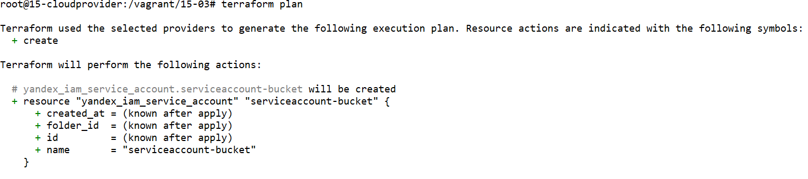
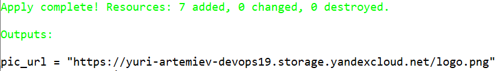
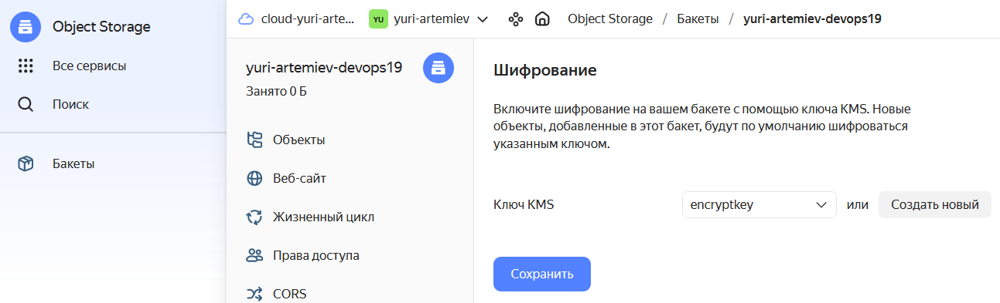

# Домашнее задание к занятию «Безопасность в облачных провайдерах»  

Используя конфигурации, выполненные в рамках предыдущих домашних заданий, нужно добавить возможность шифрования бакета.

---
## Задание 1. Yandex Cloud   

1. С помощью ключа в KMS необходимо зашифровать содержимое бакета:

 - создать ключ в KMS;
 - с помощью ключа зашифровать содержимое бакета, созданного ранее.
2. (Выполняется не в Terraform)* Создать статический сайт в Object Storage c собственным публичным адресом и сделать доступным по HTTPS:

 - создать сертификат;
 - создать статическую страницу в Object Storage и применить сертификат HTTPS;
 - в качестве результата предоставить скриншот на страницу с сертификатом в заголовке (замочек).

Полезные документы:

- [Настройка HTTPS статичного сайта](https://cloud.yandex.ru/docs/storage/operations/hosting/certificate).
- [Object Storage bucket](https://registry.terraform.io/providers/yandex-cloud/yandex/latest/docs/resources/storage_bucket).
- [KMS key](https://registry.terraform.io/providers/yandex-cloud/yandex/latest/docs/resources/kms_symmetric_key).

--- 
## Задание 2*. AWS (задание со звёздочкой)

Это необязательное задание. Его выполнение не влияет на получение зачёта по домашней работе.

**Что нужно сделать**

1. С помощью роли IAM записать файлы ЕС2 в S3-бакет:
 - создать роль в IAM для возможности записи в S3 бакет;
 - применить роль к ЕС2-инстансу;
 - с помощью bootstrap-скрипта записать в бакет файл веб-страницы.
2. Организация шифрования содержимого S3-бакета:

 - используя конфигурации, выполненные в домашнем задании из предыдущего занятия, добавить к созданному ранее бакету S3 возможность шифрования Server-Side, используя общий ключ;
 - включить шифрование SSE-S3 бакету S3 для шифрования всех вновь добавляемых объектов в этот бакет.

3. *Создание сертификата SSL и применение его к ALB:

 - создать сертификат с подтверждением по email;
 - сделать запись в Route53 на собственный поддомен, указав адрес LB;
 - применить к HTTPS-запросам на LB созданный ранее сертификат.

Resource Terraform:

- [IAM Role](https://registry.terraform.io/providers/hashicorp/aws/latest/docs/resources/iam_role).
- [AWS KMS](https://registry.terraform.io/providers/hashicorp/aws/latest/docs/resources/kms_key).
- [S3 encrypt with KMS key](https://registry.terraform.io/providers/hashicorp/aws/latest/docs/resources/s3_bucket_object#encrypting-with-kms-key).

Пример bootstrap-скрипта:

```
#!/bin/bash
yum install httpd -y
service httpd start
chkconfig httpd on
cd /var/www/html
echo "<html><h1>My cool web-server</h1></html>" > index.html
aws s3 mb s3://mysuperbacketname2021
aws s3 cp index.html s3://mysuperbacketname2021
```

### Правила приёма работы

Домашняя работа оформляется в своём Git репозитории в файле README.md. Выполненное домашнее задание пришлите ссылкой на .md-файл в вашем репозитории.
Файл README.md должен содержать скриншоты вывода необходимых команд, а также скриншоты результатов.
Репозиторий должен содержать тексты манифестов или ссылки на них в файле README.md.


-----

# Ответ

## Подготовка к заданию

- Регистрация на Яндекс Облаке по адресу `console.cloud.yandex.ru`  
- Создаём платёжный аккаунт с промо-кодом  
- Скачаем и установим утилиту `yc`  
    - `curl -sSL https://storage.yandexcloud.net/yandexcloud-yc/install.sh | bash`  
- Запустим утилиту `yc`:    
    - `yc init`  
    - Получим OAuth токен по адресу в браузере `https://oauth.yandex.ru/authorize?response_type=token&client_id=1a6990aa636648e9b2ef855fa7bec2fb`  
    - В утилите `yc`    
        - Вставим токен из браузера
        - Выберем папку в Яндекс Облаке  
        - Выберем создание Compute по-умолчанию  
        - Выберем зону в Яндекс Облаке  
    - Проверим созданные настройки Яндекс Облака    
        - `yc config list`
            ```
            token: y0_A...
            cloud-id: b1gjd8gta6ntpckrp97r
            folder-id: b1gcthk9ak11bmpnbo7d
            compute-default-zone: ru-central1-a
            ```
- Получим IAM-токен  
    ```
    yc iam create-token
    ```
- Сохраним токен и параметры в переменную окружения  
    ```
    export YC_TOKEN=$(yc iam create-token)
    export YC_CLOUD_ID=$(yc config get cloud-id)
    export YC_FOLDER_ID=$(yc config get folder-id)
    export YC_ZONE=$(yc config get compute-default-zone)
    ```

- Установим последнюю версию Terraform пакета в Ubuntu:

    ```
    wget -O- https://apt.releases.hashicorp.com/gpg | gpg --dearmor | sudo tee /usr/share/keyrings/hashicorp-archive-keyring.gpg
    echo "deb [signed-by=/usr/share/keyrings/hashicorp-archive-keyring.gpg] https://apt.releases.hashicorp.com $(lsb_release -cs) main" | sudo tee /etc/apt/sources.list.d/hashicorp.list
    sudo apt update && sudo apt install terraform
    ```


- Настроем провайдер Terraform добавив файл `~/.terraformrc`
    ```
    provider_installation {
      network_mirror {
        url = "https://terraform-mirror.yandexcloud.net/"
        include = ["registry.terraform.io/*/*"]
      }
      direct {
        exclude = ["registry.terraform.io/*/*"]
      }
    }
    ```
- Сгенерируем SSH ключи на локальной машине  
    ```
    ssh-keygen
    ```
- Создадим файл `main.tf` для Terraform
    ```
    terraform {
      required_providers {
        yandex = {
          source = "yandex-cloud/yandex"
        }
      }
      required_version = ">= 0.13"
    }

    provider "yandex" {
      zone = "ru-central1-a"
    }
    ```
- Инициализируем провайдер  
    ```
    terraform init
    ```

## Задание 1.

- Возьмём за основу файл `main.tf` для Terraform из предыдущего занятия и отредактируем добавив новый функционал

- Конфигурация объекта хранения

```
# Bucket
resource "yandex_iam_service_account" "serviceaccount-bucket" {
  name        = "serviceaccount-bucket"
}
resource "yandex_resourcemanager_folder_iam_member" "roleassignment-storageeditor" {
  folder_id = var.yc_folder_id
  role      = "storage.editor"
  member    = "serviceAccount:${yandex_iam_service_account.serviceaccount-bucket.id}"
}
resource "yandex_resourcemanager_folder_iam_member" "roleassignment-encrypterdecrypter" {
  folder_id = var.yc_folder_id
  role      = "kms.keys.encrypterDecrypter"
  member    = "serviceAccount:${yandex_iam_service_account.serviceaccount-bucket.id}"
}
resource "yandex_iam_service_account_static_access_key" "accesskey-bucket" {
  service_account_id = yandex_iam_service_account.serviceaccount-bucket.id
}
resource "yandex_kms_symmetric_key" "encryptkey" {
  name              = "encryptkey"
  default_algorithm = "AES_256"
}
resource "yandex_storage_bucket" "yuri-artemiev-devops19" {
  access_key = yandex_iam_service_account_static_access_key.accesskey-bucket.access_key
  secret_key = yandex_iam_service_account_static_access_key.accesskey-bucket.secret_key
  bucket     = "yuri-artemiev-devops19"
  default_storage_class = "STANDARD"
  acl           = "public-read"
  force_destroy = "true"
  anonymous_access_flags {
    read = true
    list = true
    config_read = true
  }
  server_side_encryption_configuration {
    rule {
      apply_server_side_encryption_by_default {
        kms_master_key_id = yandex_kms_symmetric_key.encryptkey.id
        sse_algorithm     = "aws:kms"
      }
    }
  }
}
resource "yandex_storage_object" "logo" {
  access_key = yandex_iam_service_account_static_access_key.accesskey-bucket.access_key
  secret_key = yandex_iam_service_account_static_access_key.accesskey-bucket.secret_key
  bucket     = yandex_storage_bucket.yuri-artemiev-devops19.id
  key        = "logo.png"
  source     = "logo.png"
}
```

- Полный файл конфигурации Terraform

    

- Проверим конфигурацию Terraform  
    ```
    terraform validate
    ```
- Подготовим план Terraform  
    ```
    terraform plan
    ```

    

- Создадим ресурсы в Яндекс Облаке  
    ```
    terraform apply --auto-approve

    Apply complete! Resources: 7 added, 0 changed, 0 destroyed.

    Outputs:

    pic_url = "https://yuri-artemiev-devops19.storage.yandexcloud.net/logo.png"
    ```

    

    Доступ по ссылке выдаёт ошибку Access Denied, потому что объект зашифрован.


- Посмотрим на хранилище объектов в Яндекс Облаке

    

    Увидим, что хранилище использует ключ шифрования

- Удалим ресурсы в Яндекс Облаке  
    ```
    terraform destroy --auto-approve
    ```

