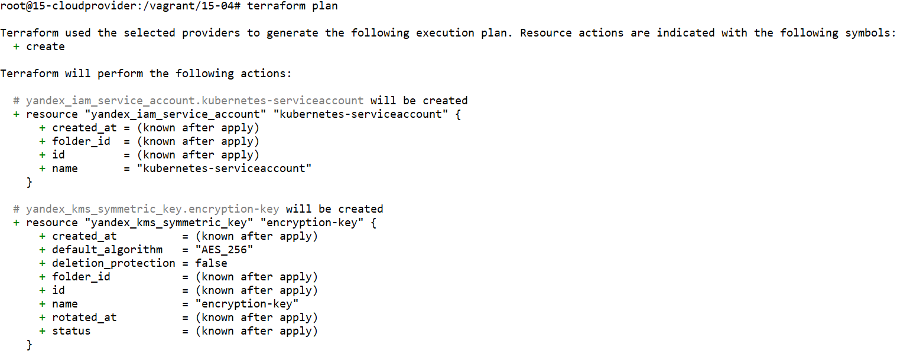
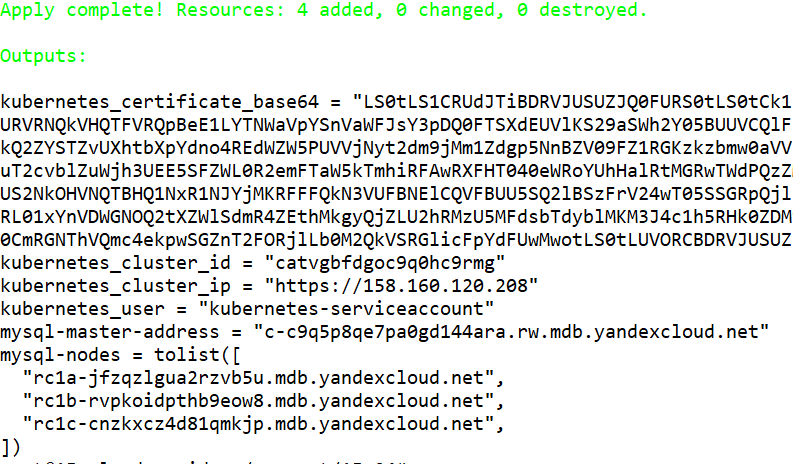
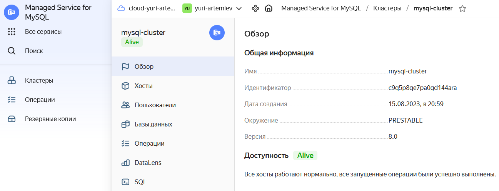
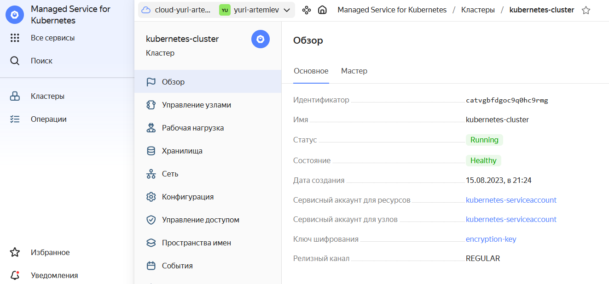
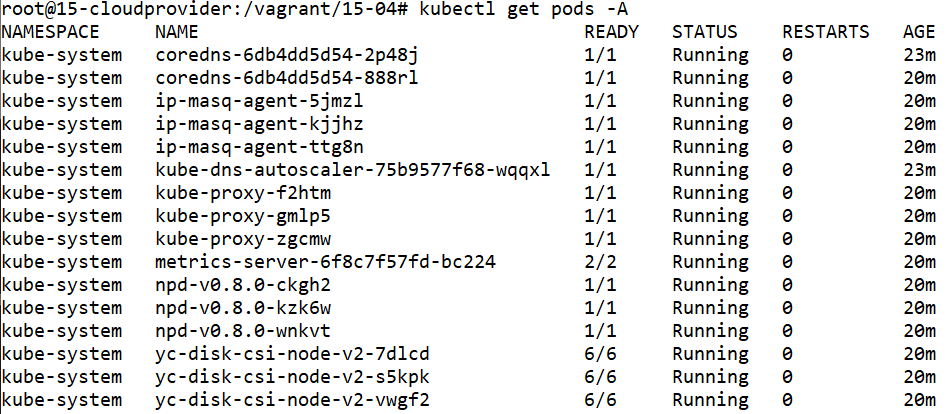
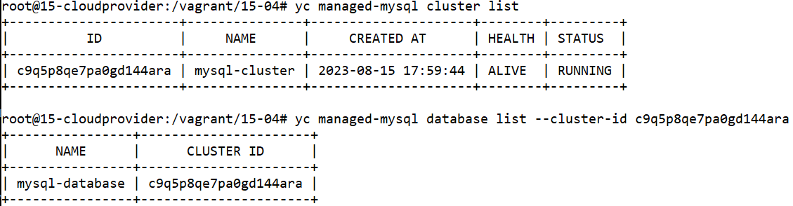
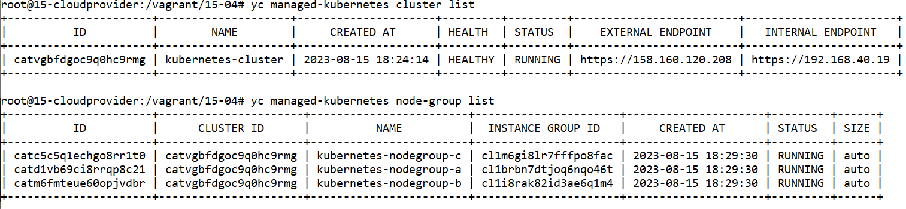
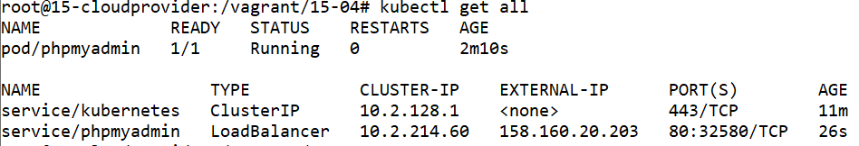
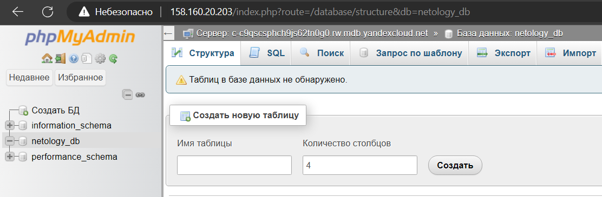

# Домашнее задание к занятию «Кластеры. Ресурсы под управлением облачных провайдеров»

### Цели задания 

1. Организация кластера Kubernetes и кластера баз данных MySQL в отказоустойчивой архитектуре.
2. Размещение в private подсетях кластера БД, а в public — кластера Kubernetes.

---
## Задание 1. Yandex Cloud

1. Настроить с помощью Terraform кластер баз данных MySQL.

 - Используя настройки VPC из предыдущих домашних заданий, добавить дополнительно подсеть private в разных зонах, чтобы обеспечить отказоустойчивость. 
 - Разместить ноды кластера MySQL в разных подсетях.
 - Необходимо предусмотреть репликацию с произвольным временем технического обслуживания.
 - Использовать окружение Prestable, платформу Intel Broadwell с производительностью 50% CPU и размером диска 20 Гб.
 - Задать время начала резервного копирования — 23:59.
 - Включить защиту кластера от непреднамеренного удаления.
 - Создать БД с именем `netology_db`, логином и паролем.

2. Настроить с помощью Terraform кластер Kubernetes.

 - Используя настройки VPC из предыдущих домашних заданий, добавить дополнительно две подсети public в разных зонах, чтобы обеспечить отказоустойчивость.
 - Создать отдельный сервис-аккаунт с необходимыми правами. 
 - Создать региональный мастер Kubernetes с размещением нод в трёх разных подсетях.
 - Добавить возможность шифрования ключом из KMS, созданным в предыдущем домашнем задании.
 - Создать группу узлов, состояющую из трёх машин с автомасштабированием до шести.
 - Подключиться к кластеру с помощью `kubectl`.
 - *Запустить микросервис phpmyadmin и подключиться к ранее созданной БД.
 - *Создать сервис-типы Load Balancer и подключиться к phpmyadmin. Предоставить скриншот с публичным адресом и подключением к БД.

Полезные документы:

- [MySQL cluster](https://registry.terraform.io/providers/yandex-cloud/yandex/latest/docs/resources/mdb_mysql_cluster).
- [Создание кластера Kubernetes](https://cloud.yandex.ru/docs/managed-kubernetes/operations/kubernetes-cluster/kubernetes-cluster-create)
- [K8S Cluster](https://registry.terraform.io/providers/yandex-cloud/yandex/latest/docs/resources/kubernetes_cluster).
- [K8S node group](https://registry.terraform.io/providers/yandex-cloud/yandex/latest/docs/resources/kubernetes_node_group).

--- 
## Задание 2*. Вариант с AWS (задание со звёздочкой)

Это необязательное задание. Его выполнение не влияет на получение зачёта по домашней работе.

**Что нужно сделать**

1. Настроить с помощью Terraform кластер EKS в три AZ региона, а также RDS на базе MySQL с поддержкой MultiAZ для репликации и создать два readreplica для работы.
 
 - Создать кластер RDS на базе MySQL.
 - Разместить в Private subnet и обеспечить доступ из public сети c помощью security group.
 - Настроить backup в семь дней и MultiAZ для обеспечения отказоустойчивости.
 - Настроить Read prelica в количестве двух штук на два AZ.

2. Создать кластер EKS на базе EC2.

 - С помощью Terraform установить кластер EKS на трёх EC2-инстансах в VPC в public сети.
 - Обеспечить доступ до БД RDS в private сети.
 - С помощью kubectl установить и запустить контейнер с phpmyadmin (образ взять из docker hub) и проверить подключение к БД RDS.
 - Подключить ELB (на выбор) к приложению, предоставить скрин.

Полезные документы:

- [Модуль EKS](https://learn.hashicorp.com/tutorials/terraform/eks).

### Правила приёма работы

Домашняя работа оформляется в своём Git репозитории в файле README.md. Выполненное домашнее задание пришлите ссылкой на .md-файл в вашем репозитории.
Файл README.md должен содержать скриншоты вывода необходимых команд, а также скриншоты результатов.
Репозиторий должен содержать тексты манифестов или ссылки на них в файле README.md.


-----

# Ответ

## Подготовка к заданию

- Регистрация на Яндекс Облаке по адресу `console.cloud.yandex.ru`  
- Создаём платёжный аккаунт с промо-кодом  
- Скачаем и установим утилиту `yc`  
    - `curl -sSL https://storage.yandexcloud.net/yandexcloud-yc/install.sh | bash`  
- Запустим утилиту `yc`:    
    - `yc init`  
    - Получим OAuth токен по адресу в браузере `https://oauth.yandex.ru/authorize?response_type=token&client_id=1a6990aa636648e9b2ef855fa7bec2fb`  
    - В утилите `yc`    
        - Вставим токен из браузера
        - Выберем папку в Яндекс Облаке  
        - Выберем создание Compute по-умолчанию  
        - Выберем зону в Яндекс Облаке  
    - Проверим созданные настройки Яндекс Облака    
        - `yc config list`
            ```
            token: y0_A...
            cloud-id: b1gjd8gta6ntpckrp97r
            folder-id: b1gcthk9ak11bmpnbo7d
            compute-default-zone: ru-central1-a
            ```
- Получим IAM-токен  
    ```
    yc iam create-token
    ```
- Сохраним токен и параметры в переменную окружения  
    ```
    export YC_TOKEN=$(yc iam create-token)
    export YC_CLOUD_ID=$(yc config get cloud-id)
    export YC_FOLDER_ID=$(yc config get folder-id)
    export YC_ZONE=$(yc config get compute-default-zone)
    ```

- Установим последнюю версию Terraform пакета в Ubuntu:

    ```
    wget -O- https://apt.releases.hashicorp.com/gpg | gpg --dearmor | sudo tee /usr/share/keyrings/hashicorp-archive-keyring.gpg
    echo "deb [signed-by=/usr/share/keyrings/hashicorp-archive-keyring.gpg] https://apt.releases.hashicorp.com $(lsb_release -cs) main" | sudo tee /etc/apt/sources.list.d/hashicorp.list
    sudo apt update && sudo apt install terraform
    ```


- Настроем провайдер Terraform добавив файл `~/.terraformrc`
    ```
    provider_installation {
      network_mirror {
        url = "https://terraform-mirror.yandexcloud.net/"
        include = ["registry.terraform.io/*/*"]
      }
      direct {
        exclude = ["registry.terraform.io/*/*"]
      }
    }
    ```
- Сгенерируем SSH ключи на локальной машине  
    ```
    ssh-keygen
    ```
- Создадим файл `main.tf` для Terraform
    ```
    terraform {
      required_providers {
        yandex = {
          source = "yandex-cloud/yandex"
        }
      }
      required_version = ">= 0.13"
    }

    provider "yandex" {
      zone = "ru-central1-a"
    }
    ```
- Инициализируем провайдер  
    ```
    terraform init
    ```

## Задание.

- Возьмём за основу файл `main.tf` для Terraform из предыдущего занятия и отредактируем добавив новый функционал

- Конфигурация MySQL кластера

    ```
    resource "yandex_mdb_mysql_cluster" "mysql-cluster" {
      name               = "mysql-cluster"
      environment        = "PRESTABLE"
      network_id         = yandex_vpc_network.network-netology.id
      version            = "8.0"
      security_group_ids = [yandex_vpc_security_group.network-securitygroup.id]
      deletion_protection = true
      resources {
        resource_preset_id = "b1.medium"
        disk_type_id       = "network-ssd"
        disk_size          = "20"
      }
      maintenance_window {
        type = "ANYTIME"
      }
      backup_window_start {
        hours   = "23"
        minutes = "59"
      }
      host {
        name      = "mysql-node-a"
        zone      = "ru-central1-a"
        subnet_id = yandex_vpc_subnet.private-a.id
      }
      host {
        name      = "mysql-node-b"
        zone      = "ru-central1-b"
        subnet_id = yandex_vpc_subnet.private-b.id
      }
      host {
        name      = "mysql-node-c"
        zone      = "ru-central1-c"
        subnet_id = yandex_vpc_subnet.private-c.id
      }
    }
    resource "yandex_mdb_mysql_database" "netology_db" {
      cluster_id = yandex_mdb_mysql_cluster.mysql-cluster.id
      name       = "netology_db"
    }
    resource "yandex_mdb_mysql_user" "mysql_user" {
      cluster_id = yandex_mdb_mysql_cluster.mysql-cluster.id
      name       = "mysql_user"
      password   = "mysql_password"
      permission {
        database_name = yandex_mdb_mysql_database.netology_db.name
        roles         = ["ALL"]
      }
    }
    ```


- Конфигурация Kubernetes кластера

    ```
    resource "yandex_iam_service_account" "kubernetes-serviceaccount" {
      name        = "kubernetes-serviceaccount"
    }
    resource "yandex_resourcemanager_folder_iam_member" "kubernetes-roleassignment-admin" {
      folder_id = var.yc_folder_id
      role      = "k8s.admin"
      member    = "serviceAccount:${yandex_iam_service_account.kubernetes-serviceaccount.id}"
    }
    resource "yandex_resourcemanager_folder_iam_member" "kubernetes-roleassignment-clusteragent" {
      folder_id = var.yc_folder_id
      role      = "k8s.clusters.agent"
      member    = "serviceAccount:${yandex_iam_service_account.kubernetes-serviceaccount.id}"
    }
    resource "yandex_resourcemanager_folder_iam_member" "kubernetes-roleassignment-vpcpublicadmin" {
      folder_id = var.yc_folder_id
      role      = "vpc.publicAdmin"
      member    = "serviceAccount:${yandex_iam_service_account.kubernetes-serviceaccount.id}"
    }
    resource "yandex_resourcemanager_folder_iam_member" "kubernetes-roleassignment-imagespuller" {
      folder_id = var.yc_folder_id
      role      = "container-registry.images.puller"
      member    = "serviceAccount:${yandex_iam_service_account.kubernetes-serviceaccount.id}"
    }
    resource "yandex_resourcemanager_folder_iam_member" "kubernetes-roleassignment-loadbalanceradmin" {
      folder_id = var.yc_folder_id
      role      = "load-balancer.admin"
      member    = "serviceAccount:${yandex_iam_service_account.kubernetes-serviceaccount.id}"
    }
    resource "yandex_kms_symmetric_key" "encryption-key" {
      name              = "encryption-key"
      default_algorithm = "AES_256"
    }
    resource "yandex_kms_symmetric_key_iam_binding" "kubernetes-roleassignment-keyviewer" {
      symmetric_key_id = yandex_kms_symmetric_key.encryption-key.id
      role             = "viewer"
      members          = [
        "serviceAccount:${yandex_iam_service_account.kubernetes-serviceaccount.id}"
      ]
    }
    resource "yandex_kubernetes_cluster" "kubernetes-cluster" {
      name               = "kubernetes-cluster"
      network_id         = yandex_vpc_network.network-netology.id
      cluster_ipv4_range = "10.1.0.0/16"
      service_ipv4_range = "10.2.0.0/16"
      master {
        version   = "1.23"
        public_ip = true
        regional {
          region = "ru-central1"
          location {
            zone      = yandex_vpc_subnet.public-a.zone
            subnet_id = yandex_vpc_subnet.public-a.id
          }
          location {
            zone      = yandex_vpc_subnet.public-b.zone
            subnet_id = yandex_vpc_subnet.public-b.id
          }
          location {
            zone      = yandex_vpc_subnet.public-c.zone
            subnet_id = yandex_vpc_subnet.public-c.id
          }
        }
      }
      service_account_id      = yandex_iam_service_account.kubernetes-serviceaccount.id
      node_service_account_id = yandex_iam_service_account.kubernetes-serviceaccount.id
      kms_provider {
        key_id = yandex_kms_symmetric_key.encryption-key.id
      }
    }
    resource "yandex_kubernetes_node_group" "kubernetes-nodegroup-a" {
      cluster_id  = yandex_kubernetes_cluster.kubernetes-cluster.id
      name        = "kubernetes-nodegroup-a"
      instance_template {
        platform_id = "standard-v2"
        container_runtime {
          type = "containerd"
        }
        network_interface {
          nat        = true
          subnet_ids = ["${yandex_vpc_subnet.public-a.id}"]
        }
        resources {
          memory = 2
          cores  = 2
        }
        scheduling_policy {
          preemptible = true
        }
        metadata = {
          ssh-keys = "ubuntu:${file("~/.ssh/id_rsa.pub")}"
        }
      }
      scale_policy {
        auto_scale {
          initial = 1
          max     = 2
          min     = 1
        }
      }
      allocation_policy {
        location {
          zone = "ru-central1-a"
        }
      }
    }
    resource "yandex_kubernetes_node_group" "kubernetes-nodegroup-b" {
      cluster_id  = yandex_kubernetes_cluster.kubernetes-cluster.id
      name        = "kubernetes-nodegroup-b"
      instance_template {
        platform_id = "standard-v2"
        container_runtime {
          type = "containerd"
        }
        network_interface {
          nat        = true
          subnet_ids = ["${yandex_vpc_subnet.public-b.id}"]
        }
        resources {
          memory = 2
          cores  = 2
        }
        scheduling_policy {
          preemptible = true
        }
        metadata = {
          ssh-keys = "ubuntu:${file("~/.ssh/id_rsa.pub")}"
        }
      }
      scale_policy {
        auto_scale {
          initial = 1
          max     = 2
          min     = 1
        }
      }
      allocation_policy {
        location {
          zone = "ru-central1-b"
        }
      }
    }
    resource "yandex_kubernetes_node_group" "kubernetes-nodegroup-c" {
      cluster_id  = yandex_kubernetes_cluster.kubernetes-cluster.id
      name        = "kubernetes-nodegroup-c"
      instance_template {
        platform_id = "standard-v2"
        container_runtime {
          type = "containerd"
        }
        network_interface {
          nat        = true
          subnet_ids = ["${yandex_vpc_subnet.public-c.id}"]
        }
        resources {
          memory = 2
          cores  = 2
        }
        scheduling_policy {
          preemptible = true
        }
        metadata = {
          ssh-keys = "ubuntu:${file("~/.ssh/id_rsa.pub")}"
        }
      }
      scale_policy {
        auto_scale {
          initial = 1
          max     = 2
          min     = 1
        }
      }
      allocation_policy {
        location {
          zone = "ru-central1-c"
        }
      }
    }
    ```


- Проверим конфигурацию Terraform  
    ```
    terraform validate
    ```
- Подготовим план Terraform  
    ```
    terraform plan
    ```

    

- Создадим ресурсы в Яндекс Облаке  
    ```
    terraform apply --auto-approve

    Apply complete! Resources: 4 added, 0 changed, 0 destroyed.

    Outputs:

    kubernetes_certificate_base64 = "LS0t..."
    kubernetes_cluster_id = "catvgbfdgoc9q0hc9rmg"
    kubernetes_cluster_ip = "https://158.160.120.208"
    kubernetes_user = "kubernetes-serviceaccount"
    mysql-master-address = "c-c9q5p8qe7pa0gd144ara.rw.mdb.yandexcloud.net"
    mysql-nodes = tolist([
      "rc1a-jfzqzlgua2rzvb5u.mdb.yandexcloud.net",
      "rc1b-rvpkoidpthb9eow8.mdb.yandexcloud.net",
      "rc1c-cnzkxcz4d81qmkjp.mdb.yandexcloud.net",
    ])
    ```

    


- Посмотрим на кластеры в Яндекс Облаке

    
    

    Увидим, что MySQL кластер создан и Kubernetes кластер создан.

- Подключимся к кластеру Kubernetes

    ```
    yc managed-kubernetes cluster get-credentials --id catvgbfdgoc9q0hc9rmg --external

    kubectl get pods -A

    NAMESPACE     NAME                                   READY   STATUS    RESTARTS   AGE
    kube-system   coredns-6db4dd5d54-2p48j               1/1     Running   0          23m
    kube-system   coredns-6db4dd5d54-888rl               1/1     Running   0          20m
    kube-system   ip-masq-agent-5jmzl                    1/1     Running   0          20m
    kube-system   ip-masq-agent-kjjhz                    1/1     Running   0          20m
    kube-system   ip-masq-agent-ttg8n                    1/1     Running   0          20m
    kube-system   kube-dns-autoscaler-75b9577f68-wqqxl   1/1     Running   0          23m
    kube-system   kube-proxy-f2htm                       1/1     Running   0          20m
    kube-system   kube-proxy-gmlp5                       1/1     Running   0          20m
    kube-system   kube-proxy-zgcmw                       1/1     Running   0          20m
    kube-system   metrics-server-6f8c7f57fd-bc224        2/2     Running   0          20m
    kube-system   npd-v0.8.0-ckgh2                       1/1     Running   0          20m
    kube-system   npd-v0.8.0-kzk6w                       1/1     Running   0          20m
    kube-system   npd-v0.8.0-wnkvt                       1/1     Running   0          20m
    kube-system   yc-disk-csi-node-v2-7dlcd              6/6     Running   0          20m
    kube-system   yc-disk-csi-node-v2-s5kpk              6/6     Running   0          20m
    kube-system   yc-disk-csi-node-v2-vwgf2              6/6     Running   0          20m
    ```

    

    Увидим, что возможно подключиться к Kubernetes кластеру.

- Посмотрим на MySQL кластер

    ```
    yc managed-mysql cluster list

    +----------------------+---------------+---------------------+--------+---------+
    |          ID          |     NAME      |     CREATED AT      | HEALTH | STATUS  |
    +----------------------+---------------+---------------------+--------+---------+
    | c9q5p8qe7pa0gd144ara | mysql-cluster | 2023-08-15 17:59:44 | ALIVE  | RUNNING |
    +----------------------+---------------+---------------------+--------+---------+
    ```

- Посмотрим на MySQL базу данных

    ```
    yc managed-mysql database list --cluster-id c9q5p8qe7pa0gd144ara

    +----------------+----------------------+
    |      NAME      |      CLUSTER ID      |
    +----------------+----------------------+
    | netology_db    | c9q5p8qe7pa0gd144ara |
    +----------------+----------------------+
    ```

    

    Увидим, что база данных создалась на MySQL кластере.

- Посмотрим на Kubernetes кластер

    ```
    yc managed-kubernetes cluster list

    +----------------------+--------------------+---------------------+---------+---------+-------------------------+-----------------------+
    |          ID          |        NAME        |     CREATED AT      | HEALTH  | STATUS  |    EXTERNAL ENDPOINT    |   INTERNAL ENDPOINT   |
    +----------------------+--------------------+---------------------+---------+---------+-------------------------+-----------------------+
    | catvgbfdgoc9q0hc9rmg | kubernetes-cluster | 2023-08-15 18:24:14 | HEALTHY | RUNNING | https://158.160.120.208 | https://192.168.40.19 |
    +----------------------+--------------------+---------------------+---------+---------+-------------------------+-----------------------+

    yc managed-kubernetes node-group list

    +----------------------+----------------------+------------------------+----------------------+---------------------+---------+------+
    |          ID          |      CLUSTER ID      |          NAME          |  INSTANCE GROUP ID   |     CREATED AT      | STATUS  | SIZE |
    +----------------------+----------------------+------------------------+----------------------+---------------------+---------+------+
    | catc5c5q1echgo8rr1t0 | catvgbfdgoc9q0hc9rmg | kubernetes-nodegroup-c | cl1m6gi8lr7fffpo8fac | 2023-08-15 18:29:30 | RUNNING | auto |
    | catd1vb69ci8rrqp8c21 | catvgbfdgoc9q0hc9rmg | kubernetes-nodegroup-a | cl1brbn7dtjoq6nqo46t | 2023-08-15 18:29:30 | RUNNING | auto |
    | catm6fmteue60opjvdbr | catvgbfdgoc9q0hc9rmg | kubernetes-nodegroup-b | cl1i8rak82id3ae6q1m4 | 2023-08-15 18:29:30 | RUNNING | auto |
    +----------------------+----------------------+------------------------+----------------------+---------------------+---------+------+
    ```

    

    Увидим, что Kubernetes кластер создался.


- Развернём образ phpMyAdmin на кластере Kubernetes

```
kubectl run phpmyadmin --image=phpmyadmin/phpmyadmin --port=80 --env="PMA_HOST=c-c9qscsphch9js62tn0g0.rw.mdb.yandexcloud.net"
kubectl expose pod phpmyadmin --type=LoadBalancer --port=80 --target-port=80
```

    Возьмём адрес мастера MySQL из вывода Terraform

- Посмотрим сервис Kubernetes с помощью команды 

```
kubectl get services
```

    

    Увидим, что внешний IP адрес сервиса 158.160.20.203

- Откроем браузер по адресу сервиса и введём логин/пароль созданного пользователя MySQL

    

    Увидим созданную базу данных MySQL

- Полный файл конфигурации Terraform

    


- Удалим ресурсы в Яндекс Облаке  
    ```
    terraform destroy --auto-approve
    ```

