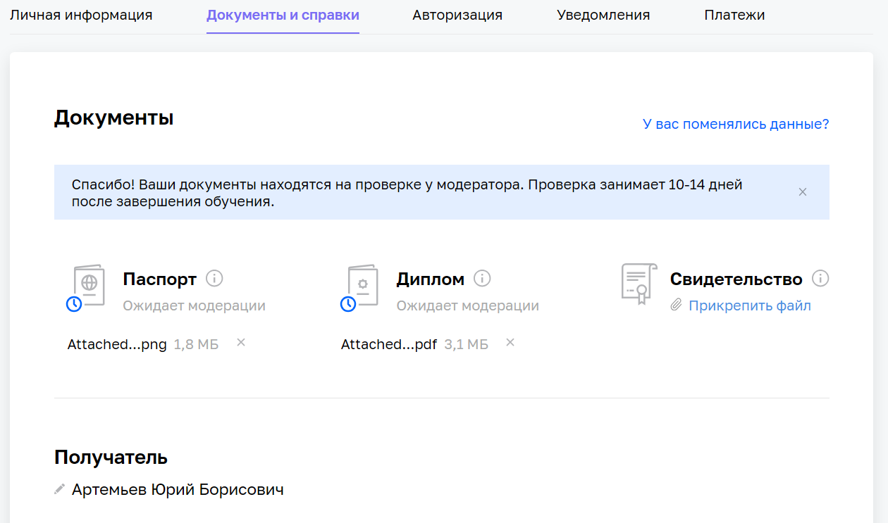

# Домашнее задание к занятию «Кластеры. Ресурсы под управлением облачных провайдеров»

## Получилось ли у вас загрузить в личный кабинет документы, подтверждающие личность, и диплом о высшем или среднем специальном образовании?

Да

## Нужна ли вам справка об обучении после сдачи дипломной работы? Справка выдаётся всем студентам, в том числе тем, у кого нет диплома о высшем или среднем специальном образовании.

Не понимаю, что такое `справка об обучении`. Мне нужны документ о прохождении курса.

Мне нужно Диплом о профессиональной переподготовке (ДПП)/Удостоверение повышения квалификации (УПК)

## Выполнен ли вами необходимый минимум заданий на каждом модуле профессии для допуска к дипломной работе?

Да

Дипломный руководитель - [Булат Замилов|https://docs.google.com/spreadsheets/d/1aqGA0uUx_Mcka0eHk7VVEKyof8TKxBjHQAsGDtRQSus/edit#gid=0].

