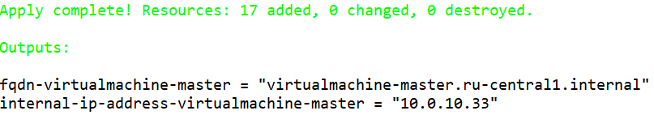
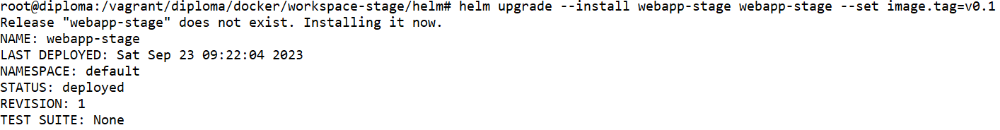

# Дипломный практикум в Yandex.Cloud
  * [Цели:](#цели)
  * [Этапы выполнения:](#этапы-выполнения)
     * [Создание облачной инфраструктуры](#создание-облачной-инфраструктуры)
     * [Создание Kubernetes кластера](#создание-kubernetes-кластера)
     * [Создание тестового приложения](#создание-тестового-приложения)
     * [Подготовка cистемы мониторинга и деплой приложения](#подготовка-cистемы-мониторинга-и-деплой-приложения)
     * [Установка и настройка CI/CD](#установка-и-настройка-cicd)
  * [Что необходимо для сдачи задания?](#что-необходимо-для-сдачи-задания)
  * [Как правильно задавать вопросы дипломному руководителю?](#как-правильно-задавать-вопросы-дипломному-руководителю)

---
## Цели:

1. Подготовить облачную инфраструктуру на базе облачного провайдера Яндекс.Облако.
2. Запустить и сконфигурировать Kubernetes кластер.
3. Установить и настроить систему мониторинга.
4. Настроить и автоматизировать сборку тестового приложения с использованием Docker-контейнеров.
5. Настроить CI для автоматической сборки и тестирования.
6. Настроить CD для автоматического развёртывания приложения.

---
## Этапы выполнения:


### Создание облачной инфраструктуры

Для начала необходимо подготовить облачную инфраструктуру в ЯО при помощи [Terraform](https://www.terraform.io/).

Особенности выполнения:

- Бюджет купона ограничен, что следует иметь в виду при проектировании инфраструктуры и использовании ресурсов;
- Следует использовать последнюю стабильную версию [Terraform](https://www.terraform.io/).

Предварительная подготовка к установке и запуску Kubernetes кластера.

1. Создайте сервисный аккаунт, который будет в дальнейшем использоваться Terraform для работы с инфраструктурой с необходимыми и достаточными правами. Не стоит использовать права суперпользователя
2. Подготовьте [backend](https://www.terraform.io/docs/language/settings/backends/index.html) для Terraform:  
   а. Рекомендуемый вариант: [Terraform Cloud](https://app.terraform.io/)  
   б. Альтернативный вариант: S3 bucket в созданном ЯО аккаунте
3. Настройте [workspaces](https://www.terraform.io/docs/language/state/workspaces.html)  
   а. Рекомендуемый вариант: создайте два workspace: *stage* и *prod*. В случае выбора этого варианта все последующие шаги должны учитывать факт существования нескольких workspace.  
   б. Альтернативный вариант: используйте один workspace, назвав его *stage*. Пожалуйста, не используйте workspace, создаваемый Terraform-ом по-умолчанию (*default*).
4. Создайте VPC с подсетями в разных зонах доступности.
5. Убедитесь, что теперь вы можете выполнить команды `terraform destroy` и `terraform apply` без дополнительных ручных действий.
6. В случае использования [Terraform Cloud](https://app.terraform.io/) в качестве [backend](https://www.terraform.io/docs/language/settings/backends/index.html) убедитесь, что применение изменений успешно проходит, используя web-интерфейс Terraform cloud.

Ожидаемые результаты:

1. Terraform сконфигурирован и создание инфраструктуры посредством Terraform возможно без дополнительных ручных действий.
2. Полученная конфигурация инфраструктуры является предварительной, поэтому в ходе дальнейшего выполнения задания возможны изменения.

---
### Создание Kubernetes кластера

На этом этапе необходимо создать [Kubernetes](https://kubernetes.io/ru/docs/concepts/overview/what-is-kubernetes/) кластер на базе предварительно созданной инфраструктуры.   Требуется обеспечить доступ к ресурсам из Интернета.

Это можно сделать двумя способами:

1. Рекомендуемый вариант: самостоятельная установка Kubernetes кластера.  
   а. При помощи Terraform подготовить как минимум 3 виртуальных машины Compute Cloud для создания Kubernetes-кластера. Тип виртуальной машины следует выбрать самостоятельно с учётом требовании к производительности и стоимости. Если в дальнейшем поймете, что необходимо сменить тип инстанса, используйте Terraform для внесения изменений.  
   б. Подготовить [ansible](https://www.ansible.com/) конфигурации, можно воспользоваться, например [Kubespray](https://kubernetes.io/docs/setup/production-environment/tools/kubespray/)  
   в. Задеплоить Kubernetes на подготовленные ранее инстансы, в случае нехватки каких-либо ресурсов вы всегда можете создать их при помощи Terraform.
2. Альтернативный вариант: воспользуйтесь сервисом [Yandex Managed Service for Kubernetes](https://cloud.yandex.ru/services/managed-kubernetes)  
  а. С помощью terraform resource для [kubernetes](https://registry.terraform.io/providers/yandex-cloud/yandex/latest/docs/resources/kubernetes_cluster) создать региональный мастер kubernetes с размещением нод в разных 3 подсетях      
  б. С помощью terraform resource для [kubernetes node group](https://registry.terraform.io/providers/yandex-cloud/yandex/latest/docs/resources/kubernetes_node_group)
  
Ожидаемый результат:

1. Работоспособный Kubernetes кластер.
2. В файле `~/.kube/config` находятся данные для доступа к кластеру.
3. Команда `kubectl get pods --all-namespaces` отрабатывает без ошибок.

---
### Создание тестового приложения

Для перехода к следующему этапу необходимо подготовить тестовое приложение, эмулирующее основное приложение разрабатываемое вашей компанией.

Способ подготовки:

1. Рекомендуемый вариант:  
   а. Создайте отдельный git репозиторий с простым nginx конфигом, который будет отдавать статические данные.  
   б. Подготовьте Dockerfile для создания образа приложения.  
2. Альтернативный вариант:  
   а. Используйте любой другой код, главное, чтобы был самостоятельно создан Dockerfile.

Ожидаемый результат:

1. Git репозиторий с тестовым приложением и Dockerfile.
2. Регистр с собранным docker image. В качестве регистра может быть DockerHub или [Yandex Container Registry](https://cloud.yandex.ru/services/container-registry), созданный также с помощью terraform.

---
### Подготовка cистемы мониторинга и деплой приложения

Уже должны быть готовы конфигурации для автоматического создания облачной инфраструктуры и поднятия Kubernetes кластера.  
Теперь необходимо подготовить конфигурационные файлы для настройки нашего Kubernetes кластера.

Цель:
1. Задеплоить в кластер [prometheus](https://prometheus.io/), [grafana](https://grafana.com/), [alertmanager](https://github.com/prometheus/alertmanager), [экспортер](https://github.com/prometheus/node_exporter) основных метрик Kubernetes.
2. Задеплоить тестовое приложение, например, [nginx](https://www.nginx.com/) сервер отдающий статическую страницу.

Рекомендуемый способ выполнения:
1. Воспользовать пакетом [kube-prometheus](https://github.com/prometheus-operator/kube-prometheus), который уже включает в себя [Kubernetes оператор](https://operatorhub.io/) для [grafana](https://grafana.com/), [prometheus](https://prometheus.io/), [alertmanager](https://github.com/prometheus/alertmanager) и [node_exporter](https://github.com/prometheus/node_exporter). При желании можете собрать все эти приложения отдельно.
2. Для организации конфигурации использовать [qbec](https://qbec.io/), основанный на [jsonnet](https://jsonnet.org/). Обратите внимание на имеющиеся функции для интеграции helm конфигов и [helm charts](https://helm.sh/)
3. Если на первом этапе вы не воспользовались [Terraform Cloud](https://app.terraform.io/), то задеплойте в кластер [atlantis](https://www.runatlantis.io/) для отслеживания изменений инфраструктуры.

Альтернативный вариант:
1. Для организации конфигурации можно использовать [helm charts](https://helm.sh/)

Ожидаемый результат:
1. Git репозиторий с конфигурационными файлами для настройки Kubernetes.
2. Http доступ к web интерфейсу grafana.
3. Дашборды в grafana отображающие состояние Kubernetes кластера.
4. Http доступ к тестовому приложению.

---
### Установка и настройка CI/CD

Осталось настроить ci/cd систему для автоматической сборки docker image и деплоя приложения при изменении кода.

Цель:

1. Автоматическая сборка docker образа при коммите в репозиторий с тестовым приложением.
2. Автоматический деплой нового docker образа.

Можно использовать [teamcity](https://www.jetbrains.com/ru-ru/teamcity/), [jenkins](https://www.jenkins.io/), [GitLab CI](https://about.gitlab.com/stages-devops-lifecycle/continuous-integration/) или GitHub Actions.

Ожидаемый результат:

1. Интерфейс ci/cd сервиса доступен по http.
2. При любом коммите в репозиторие с тестовым приложением происходит сборка и отправка в регистр Docker образа.
3. При создании тега (например, v1.0.0) происходит сборка и отправка с соответствующим label в регистр, а также деплой соответствующего Docker образа в кластер Kubernetes.

---
## Что необходимо для сдачи задания?

1. Репозиторий с конфигурационными файлами Terraform и готовность продемонстрировать создание всех ресурсов с нуля.
2. Пример pull request с комментариями созданными atlantis'ом или снимки экрана из Terraform Cloud.
3. Репозиторий с конфигурацией ansible, если был выбран способ создания Kubernetes кластера при помощи ansible.
4. Репозиторий с Dockerfile тестового приложения и ссылка на собранный docker image.
5. Репозиторий с конфигурацией Kubernetes кластера.
6. Ссылка на тестовое приложение и веб интерфейс Grafana с данными доступа.
7. Все репозитории рекомендуется хранить на одном ресурсе (github, gitlab)

---
## Как правильно задавать вопросы дипломному руководителю?

Что поможет решить большинство частых проблем:

1. Попробовать найти ответ сначала самостоятельно в интернете или в 
  материалах курса и ДЗ и только после этого спрашивать у дипломного 
  руководителя. Навык поиска ответов пригодится вам в профессиональной 
  деятельности.
2. Если вопросов больше одного, присылайте их в виде нумерованного 
  списка. Так дипломному руководителю будет проще отвечать на каждый из 
  них.
3. При необходимости прикрепите к вопросу скриншоты и стрелочкой 
  покажите, где не получается.

Что может стать источником проблем:

1. Вопросы вида «Ничего не работает. Не запускается. Всё сломалось». 
  Дипломный руководитель не сможет ответить на такой вопрос без 
  дополнительных уточнений. Цените своё время и время других.
2. Откладывание выполнения курсового проекта на последний момент.
3. Ожидание моментального ответа на свой вопрос. Дипломные руководители - практикующие специалисты, которые занимаются, кроме преподавания, 
  своими проектами. Их время ограничено, поэтому постарайтесь задавать правильные вопросы, чтобы получать быстрые ответы :)


# Решение

## Оглавление

- [Создание облачной инфраструктуры](#1)
    - [Подготовим инструменты для работы](#1-1)
    - [Начальная настройка Terraform](#1-2)
    - [Подготовим подключение к Яндекс Облаку в Terraform](#1-3)
    - [Подключим Terraform Cloud и создадим workspaces](#1-4)
    - [Создадим ресурсы в Яндекс Облаке](#1-5)
    - [Удалим созданную инфраструктуру в Яндекс Облаке с помощью Terraform](#1-6)
- [Создание Kubernetes кластера](#2)
    - [Подготовим инструменты для работы](#2-1)
    - [Создадим ресурсы в Яндекс Облаке](#2-2)
- [Создание тестового приложения](#3)
    - [Подготовим инструменты для работы](#3-1)
    - [Создадим Docker образ приложения](#3-2)
    - [Отправим Docker образ в Docker Hub](#3-3)
    - [Развернём Kubernetes deployment для нашего приложения](#3-4)
    - [Развернём Helm чарт для нашего приложения](#3-5)
- [Подготовка системы мониторинга и деплой приложения](#4)
    - [Развернём kube-prometheus на Kubernetes кластере](#4-1)
- [Установка и настройка CI/CD](#5)
    - [Подготовим GitHub](#5-1)
    - [Коммит в репозиторий создаёт Docker образ в Docker Hub](#5-2)
    - [Подготовим GitHub](#5-3)
    - [Коммит с тегом v1.0.0 разворачивает приложение в Kubernetes кластере](#5-4)
- [Созданные ресурсы](#6)
    - [GitHub](#6-1)
    - [Docker Hub](#6-2)
    - [Terrafrom Cloud](#6-2)


---

<a id="1"></a>
## Создание облачной инфраструктуры

<a id="1-1"></a>
### Подготовим инструменты для работы

- Регистрация на Яндекс Облаке по адресу `console.cloud.yandex.ru`  
- Создаём платёжный аккаунт с промо-кодом  
- Скачаем и установим утилиту `yc` на локальную машину:  
    - `curl -sSL https://storage.yandexcloud.net/yandexcloud-yc/install.sh | bash`  
- Запустим утилиту `yc`:    
    - `yc init`  
    - Получим OAuth токен по адресу в браузере
    ```
    https://oauth.yandex.ru/authorize?response_type=token&client_id=1a6990aa636648e9b2ef855fa7bec2fb
    ```
    - В утилите `yc`    
        - Вставим токен из браузера
        - Выберем папку в Яндекс Облаке  
        - Выберем создание Compute по-умолчанию  
        - Выберем зону в Яндекс Облаке  
    - Проверим созданные настройки Яндекс Облака    
    ```
    yc config list
    
    token: y0_A...
    cloud-id: b1gjd8gta6ntpckrp97r
    folder-id: b1gcthk9ak11bmpnbo7d
    compute-default-zone: ru-central1-a
    ```
- Получим IAM-токен  
```
yc iam create-token
```
- Сохраним токен и параметры в переменную окружения  
```
export YC_TOKEN=$(yc iam create-token)
export YC_CLOUD_ID=$(yc config get cloud-id)
export YC_FOLDER_ID=$(yc config get folder-id)
export YC_ZONE=$(yc config get compute-default-zone)
export TF_VAR_yc_token=$(yc iam create-token)
```

- Установим последнюю версию Terraform на локальную машину:
```
wget -O- https://apt.releases.hashicorp.com/gpg | gpg --dearmor | sudo tee /usr/share/keyrings/hashicorp-archive-keyring.gpg
echo "deb [signed-by=/usr/share/keyrings/hashicorp-archive-keyring.gpg] https://apt.releases.hashicorp.com $(lsb_release -cs) main" | sudo tee /etc/apt/sources.list.d/hashicorp.list
sudo apt update && sudo apt install terraform
```

<a id="1-2"></a>
### Начальная настройка Terraform

- Настроем провайдер Terraform добавив файл `~/.terraformrc`
```
provider_installation {
  network_mirror {
    url = "https://terraform-mirror.yandexcloud.net/"
    include = ["registry.terraform.io/*/*"]
  }
  direct {
    exclude = ["registry.terraform.io/*/*"]
  }
}
```
- Создадим папки для workspace для Terraform
```
mkdir -p terraform/workspace-stage
mkdir -p terraform/workspace-prod
```

<a id="1-3"></a>
### Подготовим подключение к Яндекс Облаку в Terraform
- Создадим файл `main.tf` в двух папках `workspace-stage` и `workspace-prod` для Terraform и добавим провайдер Яндекс Облако
```
# Variables
variable "yc_token" {
  default = "t1.9..."
}
variable "yc_cloud_id" {
  default = "b1gjd8gta6ntpckrp97r"
}
variable "yc_folder_id" {
  default = "b1gcthk9ak11bmpnbo7d"
}
variable "yc_region" {
  default = "ru-central1-a"
}
# Terraform providers
terraform {
  required_providers {
    yandex = {
      source = "yandex-cloud/yandex"
    }
  }
  required_version = ">= 0.13"
}
provider "yandex" {
  token     = var.yc_token
  cloud_id  = var.yc_cloud_id
  folder_id = var.yc_folder_id
  zone = var.yc_region
}
```
- Добавим каталог в Яндекс Облако:
    - Отредактируем файл `terraform/workspace-stage/main.tf` для Terraform workspace stage
    ```
    # Folder
    ## Folder for stage
    resource "yandex_resourcemanager_folder" "folder-stage" {
      cloud_id    = var.yc_cloud_id
      name        = "folder-stage"
    }
    ```
    - Отредактируем файл `terraform/workspace-prod/main.tf` для Terraform workspace prod
    ```
    ## Folder for prod
    resource "yandex_resourcemanager_folder" "folder-prod" {
      cloud_id    = var.yc_cloud_id
      name        = "folder-prod"
    }
    ```
    Далее для workspace prod будут аналогичные действия в `terraform/workspace-prod`  

- Добавим сервисный аккаунт в Яндекс Облаке
    - Отредактируем файл `terraform/workspace-stage/main.tf` для stage
    ```
    # Service account
    ## Service account for stage
    resource "yandex_iam_service_account" "serviceaccount-stage" {
      folder_id = "${yandex_resourcemanager_folder.folder-stage.id}"
      name = "serviceaccount-stage"
    }
    resource "yandex_resourcemanager_folder_iam_member" "editor" {
      folder_id = "${yandex_resourcemanager_folder.folder-stage.id}"
      role      = "editor"
      member    = "serviceAccount:${yandex_iam_service_account.serviceaccount-stage.id}"
    }
    ```
    ⚠
    - Отредактируем файл `terraform/workspace-prod/main.tf` для prod  
    Аналогично

<a id="1-4"></a>
### Подключим Terraform Cloud и создадим workspaces

- Зарегистрируемся на Terraform Cloud 
```
https://app.terraform.io
```
- Создадим API токен
    - Зайдём в настройки профиля Terraform Cloud и нажмём Create an API token  
    User Settings / Tokens / Create and API token
    ```
    https://app.terraform.io/app/settings/tokens
    ```
    ⚠

- Создадим новую организацию на Terraform Cloud нажав Create new organization  
⚠
- Добавим Terraform Cloud организацию в Terraform

    - Отредактируем файл `terraform/workspace-stage/main.tf` для stage
    ```
    terraform {
      cloud {
        organization = "yuri-artemiev"
        workspaces {
          name = workspace-stage
        }
      }
    }
    ```
    - Отредактируем файл `terraform/workspace-prod/main.tf` для prod  
    Аналогично

- Из рабочей папки Terraform подключимся к Terraform Cloud
```
terraform login
```
- Введём ранее созданный Terraform API токен
- Токен сохранится в файл `/root/.terraform.d/credentials.tfrc.json`
- Создадим worspace в Terraform
    - Для stage
    ```
    cd terrafrom/workspace-stage
    terraform init
    terrafrom workspace list
    ```
    Увидим, что создался stage workspace
    - Запустим команду `terraform init` для Terraform workspace prod  
    Аналогично

- Проверим синхронизированную конфигурацию Workspaces в Terraform Cloud
```
https://app.terraform.io/app/yuri-artemiev/workspaces
```
⚠
- Зайдём в каждый workspace в Terraform Cloud и настроем выполнение на локальной машине. Это нужно для того чтобы Terraform мог сохранять файлы на локальной машине. Состояние Terraform будет по прежнему синхронизироваться в Terraform Cloud.  
Workspace Settings / General / Execution Mode / Local
```
https://app.terraform.io/app/yuri-artemiev/workspaces
```
⚠


<a id="1-5"></a>
### Создадим ресурсы в Яндекс Облаке
- Добавим VPC сети в Яндекс Облаке
    - Отредактируем файл `terraform/workspace-stage/main.tf` для stage
    ```
    # Network
    resource "yandex_vpc_network" "network-stage" {
      name = "network-stage"
      folder_id = "${yandex_resourcemanager_folder.folder-stage.id}"
    }
    resource "yandex_vpc_subnet" "subnet-stage-a" {
      v4_cidr_blocks = ["10.0.10.0/24"]
      zone           = "ru-central1-a"
      name           = "subnet-stage-a"
      folder_id      = "${yandex_resourcemanager_folder.folder-stage.id}"
      network_id     = "${yandex_vpc_network.network-stage.id}"
    }
    resource "yandex_vpc_subnet" "subnet-stage-b" {
      v4_cidr_blocks = ["10.0.20.0/24"]
      zone           = "ru-central1-b"
      name           = "subnet-stage-b"
      folder_id      = "${yandex_resourcemanager_folder.folder-stage.id}"
      network_id     = "${yandex_vpc_network.network-stage.id}"
    }
    resource "yandex_vpc_subnet" "subnet-stage-c" {
      v4_cidr_blocks = ["10.0.30.0/24"]
      zone           = "ru-central1-c"
      name           = "subnet-stage-c"
      folder_id      = "${yandex_resourcemanager_folder.folder-stage.id}"
      network_id     = "${yandex_vpc_network.network-stage.id}"
    }
    ```
    ⚠
    - Отредактируем файл `terraform/workspace-prod/main.tf` для prod  
    Аналогично

- Развернём инфраструктуру в Яндекс Облаке с помощью Terraform
    - Для stage
    ```
    cd terraform/workspace-stage
    terraform validate
    terraform plan
    export TF_VAR_yc_token=$(yc iam create-token); terraform apply --auto-approve
    ```
    Команда сгенерирует Яндекс токен и сохранит в переменную окружения, которая потом будет использована в манифесте Terraform
    - Для prod  
    Аналогично

- Посмотрим сохранённую конфигурацию в Terraform Cloud
    - Для stage
    ⚠  
    ⚠  
    Увидим, что запуск выполнен    
    Увидим, что состояние Terraform сохранено
    - Для prod  
    Аналогично

<a id="1-6"></a>
### Удалим созданную инфраструктуру в Яндекс Облаке с помощью Terraform
- Для stage
```
cd terraform/workspace-stage
terraform destroy --auto-approve
```
- Для prod  
Аналогично


<a id="2"></a>
## Создание Kubernetes кластера

<a id="2-1"></a>
### Подготовим инструменты для работы
- Сгенерируем SSH ключи на локальной машине  
```
ssh-keygen
```
- Сохраним SSH ключ рядом с конфигурацией Terraform
    - Для stage
    ```
    cd terraform/workspace-stage
    cp ~/.ssh/id_rsa.pub id_rsa.pub
    ```
    - Для prod  
    Аналогично

- Сохраним SSH ключ рядом с конфигурацией Ansible
    - Для stage
    ```
    mkdir -p ansible/workspace-stage
    cd ansible/workspace-stage
    cp ~/.ssh/id_rsa.pub id_rsa.pub
    ```
    - Для stage  
    Аналогично

- Установим kubectl на локальную машину
```
apt-get update
apt-get install -y ca-certificates curl
apt-get install -y apt-transport-https
mkdir -p /etc/apt/keyrings
curl -fsSL https://packages.cloud.google.com/apt/doc/apt-key.gpg | gpg --dearmor -o /etc/apt/keyrings/kubernetes-archive-keyring.gpg
echo "deb [signed-by=/etc/apt/keyrings/kubernetes-archive-keyring.gpg] https://apt.kubernetes.io/ kubernetes-xenial main" | tee /etc/apt/sources.list.d/kubernetes.list
apt-get update
apt-get install -y kubectl
apt-mark hold kubectl
```
- Установим Ansible на локальную машину
```
apt install software-properties-common
apt-add-repository ppa:ansible/ansible
apt update
apt install ansible
```

<a id="2-2"></a>
### Создадим ресурсы в Яндекс Облаке
- Добавим виртуальные машины для Kubernetes в Яндекс Облаке
    - Отредактируем файл `terrafrom/workspace-stage/main.tf` для stage
    ```
    # Virtual machines
    ## Kubernetes master
    resource "yandex_compute_instance" "virtualmachine-master" {
      name = "virtualmachine-master"
      hostname = "virtualmachine-master.ru-central1.internal"
      zone      = "ru-central1-a"
      folder_id      = "${yandex_resourcemanager_folder.folder-stage.id}"
      resources {
        cores  = 2
        memory = 4
      }
      boot_disk {
        initialize_params {
          image_id = "fd8g5aftj139tv8u2mo1"
          size = "20"
        }
      }
      network_interface {
        subnet_id = "${yandex_vpc_subnet.subnet-stage-a.id}"
        nat       = true
      }
      metadata = {
        ssh-keys  = "ubuntu:${file("id_rsa.pub")}"
      }
    }
    ## Kubernetes workers
    resource "yandex_compute_instance" "virtualmachine-worker-a" {
      name = "virtualmachine-worker-a"
      hostname = "virtualmachine-worker-a.ru-central1.internal"
      zone      = "ru-central1-a"
      folder_id      = "${yandex_resourcemanager_folder.folder-stage.id}"
      resources {
        cores  = 2
        memory = 4
      }
      boot_disk {
        initialize_params {
          image_id = "fd8g5aftj139tv8u2mo1"
          size = "10"
        }
      }
      network_interface {
        subnet_id = "${yandex_vpc_subnet.subnet-stage-a.id}"
        nat       = true
      }
      metadata = {
        ssh-keys  = "ubuntu:${file("id_rsa.pub")}"
      }
    }
    resource "yandex_compute_instance" "virtualmachine-worker-b" {
      name = "virtualmachine-worker-b"
      hostname = "virtualmachine-worker-b.ru-central1.internal"
      zone      = "ru-central1-b"
      folder_id      = "${yandex_resourcemanager_folder.folder-stage.id}"
      resources {
        cores  = 2
        memory = 4
      }
      boot_disk {
        initialize_params {
          image_id = "fd8g5aftj139tv8u2mo1"
          size = "10"
        }
      }
      network_interface {
        subnet_id = "${yandex_vpc_subnet.subnet-stage-b.id}"
        nat       = true
      }
      metadata = {
        ssh-keys  = "ubuntu:${file("id_rsa.pub")}"
      }
    }
    resource "yandex_compute_instance" "virtualmachine-worker-c" {
      name = "virtualmachine-worker-c"
      hostname = "virtualmachine-worker-c.ru-central1.internal"
      zone      = "ru-central1-c"
      folder_id      = "${yandex_resourcemanager_folder.folder-stage.id}"
      resources {
        cores  = 2
        memory = 4
      }
      boot_disk {
        initialize_params {
          image_id = "fd8g5aftj139tv8u2mo1"
          size = "10"
        }
      }
      network_interface {
        subnet_id = "${yandex_vpc_subnet.subnet-stage-c.id}"
        nat       = true
      }
      metadata = {
        ssh-keys  = "ubuntu:${file("id_rsa.pub")}"
      }
    }
    ```
    ⚠
    - Отредактируем файл `terrafrom/workspace-prod/main.tf` для prod  
    Аналогично

- Создадим задачи для Terraform по подготовке к развёртыванию Kubernetes с помощью Kuberspray
    - Для stage
        - Отредактируем файл `terrafrom/workspace-stage/main.tf` для stage
        ```
        # Kubespray preparation
        ## Ansible inventory for Kuberspray
        resource "local_file" "ansible-inventory-kubespray" {
          content = <<EOF
        all:
          hosts:
            ${yandex_compute_instance.virtualmachine-master.fqdn}:
              ansible_host: ${yandex_compute_instance.virtualmachine-master.network_interface.0.ip_address}
              ip: ${yandex_compute_instance.virtualmachine-master.network_interface.0.ip_address}
              access_ip: ${yandex_compute_instance.virtualmachine-master.network_interface.0.ip_address}
            ${yandex_compute_instance.virtualmachine-worker-a.fqdn}:
              ansible_host: ${yandex_compute_instance.virtualmachine-worker-a.network_interface.0.ip_address}
              ip: ${yandex_compute_instance.virtualmachine-worker-a.network_interface.0.ip_address}
              access_ip: ${yandex_compute_instance.virtualmachine-worker-a.network_interface.0.ip_address}
            ${yandex_compute_instance.virtualmachine-worker-b.fqdn}:
              ansible_host: ${yandex_compute_instance.virtualmachine-worker-b.network_interface.0.ip_address}
              ip: ${yandex_compute_instance.virtualmachine-worker-b.network_interface.0.ip_address}
              access_ip: ${yandex_compute_instance.virtualmachine-worker-b.network_interface.0.ip_address}
            ${yandex_compute_instance.virtualmachine-worker-c.fqdn}:
              ansible_host: ${yandex_compute_instance.virtualmachine-worker-c.network_interface.0.ip_address}
              ip: ${yandex_compute_instance.virtualmachine-worker-c.network_interface.0.ip_address}
              access_ip: ${yandex_compute_instance.virtualmachine-worker-c.network_interface.0.ip_address}
          children:
            kube_control_plane:
              hosts:
                ${yandex_compute_instance.virtualmachine-master.fqdn}:
            kube_node:
              hosts:
                ${yandex_compute_instance.virtualmachine-worker-a.fqdn}:
                ${yandex_compute_instance.virtualmachine-worker-b.fqdn}:
                ${yandex_compute_instance.virtualmachine-worker-c.fqdn}:
            etcd:
              hosts:
                ${yandex_compute_instance.virtualmachine-master.fqdn}:
            k8s_cluster:
              children:
                kube_control_plane:
                kube_node:
            calico_rr:
              hosts: {}
          EOF
          filename = "../../ansible/workspace-stage/ansible-inventory-kubespray"
          depends_on = [yandex_compute_instance.virtualmachine-master, yandex_compute_instance.virtualmachine-worker-a, yandex_compute_instance.virtualmachine-worker-b, yandex_compute_instance.virtualmachine-worker-c]
        }

        ## Ansible inventory for virtualmachine-master
        resource "local_file" "ansible-inventory-virtualmachine-master" {
          content = <<-DOC
            kuber:
              hosts:
                ${yandex_compute_instance.virtualmachine-master.fqdn}:
                  ansible_host: ${yandex_compute_instance.virtualmachine-master.network_interface.0.nat_ip_address}
            DOC
          filename = "../../ansible/workspace-stage/ansible-inventory-virtualmachine-master"
          depends_on = [yandex_compute_instance.virtualmachine-master, yandex_compute_instance.virtualmachine-worker-a, yandex_compute_instance.virtualmachine-worker-b, yandex_compute_instance.virtualmachine-worker-c]
        }

        ## Ansible inventory for Kubespray configuration
        resource "null_resource" "ansible-kubespray-k8s-config" {
          provisioner "local-exec" {
            command = "wget --quiet https://raw.githubusercontent.com/kubernetes-sigs/kubespray/master/inventory/sample/group_vars/k8s_cluster/k8s-cluster.yml -O ../../ansible/workspace-stage/k8s-cluster.yml"
          }
          depends_on = [yandex_compute_instance.virtualmachine-master, yandex_compute_instance.virtualmachine-worker-a, yandex_compute_instance.virtualmachine-worker-b, yandex_compute_instance.virtualmachine-worker-c]
        }
        resource "null_resource" "ansible-kubespray-k8s-config-add" {
          provisioner "local-exec" {
            command = "echo 'supplementary_addresses_in_ssl_keys: [ ${yandex_compute_instance.virtualmachine-master.network_interface.0.nat_ip_address} ]' >> ../../ansible/workspace-stage/k8s-cluster.yml"
          }
          depends_on = [null_resource.ansible-kubespray-k8s-config]
        }
        ```
    ⚠
    - Для prod  
    Аналогично

- Создадим задачи для Terraform по сохранению скрипта, который развернёт Kubernetes с помощью Kuberspray
    - Для stage
        - Отредактируем файл `terrafrom/workspace-stage/main.tf` для stage
        ```
        ## Script for installation of Kubernetes with Kubespray
        resource "local_file" "install-kubernetes-with-kubespray" {
          content = <<-DOC
            #!/bin/bash
            set -euxo pipefail
            export ANSIBLE_HOST_KEY_CHECKING=False; ansible-playbook -i ansible-inventory-virtualmachine-master prepare-master.yml
            sleep 20
            ssh ubuntu@${yandex_compute_instance.virtualmachine-master.network_interface.0.nat_ip_address} 'export ANSIBLE_HOST_KEY_CHECKING=False; export ANSIBLE_ROLES_PATH=/home/ubuntu/kubespray/roles:/home/ubuntu/.ansible/roles:/usr/share/ansible/roles:/etc/ansible/roles; ansible-playbook -i /home/ubuntu/kubespray/inventory/mycluster/hosts.yaml -u ubuntu -b -v --private-key=/home/ubuntu/.ssh/id_rsa /home/ubuntu/kubespray/cluster.yml'
            sleep 20
            export ANSIBLE_HOST_KEY_CHECKING=False; ansible-playbook -i ansible-inventory-virtualmachine-master get-kubeconfig.yml
            sleep 5
            sed -i -e 's,server: https://127.0.0.1:6443,server: https://${yandex_compute_instance.virtualmachine-master.network_interface.0.nat_ip_address}:6443,g'  ~/.kube/config
            DOC
          filename = "../../ansible/workspace-stage/install-kubernetes-with-kubespray.sh"
          depends_on = [yandex_compute_instance.virtualmachine-master, yandex_compute_instance.virtualmachine-worker-a, yandex_compute_instance.virtualmachine-worker-b, yandex_compute_instance.virtualmachine-worker-c]
        }

        ## Set execution bit on install script
        resource "null_resource" "chmod" {
          provisioner "local-exec" {
            command = "chmod 755 ../../ansible/workspace-stage/install-kubernetes-with-kubespray.sh"
          }
          depends_on = [local_file.install-kubernetes-with-kubespray]
        }
        ```
    ⚠
    - Для prod  
    Аналогично

- Развернём инфраструктуру в Яндекс Облаке с помощью Terraform
    - Для stage
    ```
    cd terraform/workspace-stage
    terraform validate
    terraform plan
    export TF_VAR_yc_token=$(yc iam create-token); terraform apply --auto-approve
    ```
    ⚠  
    По результатам команды у нас должно получится следующее:
        - Созданные ресурсы в Яндекс Облаке  
        ```
        https://console.cloud.yandex.ru
        ```
        ⚠
        - Ansible инвернторий для Kuberspray ⚠ на локальной машине  
        - Ansible инвенторий для виртуальной машины мастера Kubernetes ⚠ на локальной машине  
        - Ansible инвернотрий для Kuberspray ⚠ на локальной машине  
        - Bash скрипт для установки Kubernetes с помощью Kuberspray ⚠ на локальной машине  
    - Для prod  
    Аналогично

- Установим Kubernetes с помощью подготовленного ранее скрипта
    - Для stage
    ```
    cd ansible/workspace-stage
    ./install-kubernetes-with-kubespray.sh
    ```
    ⚠  
    По результатам команды на виртуальных машинах развернётся Kubernetes кластер
    - Дла prod  
    Аналогично

- Выведем список подов Kubernetes
```
kubectl get pods --all-namespaces
```
⚠  
Увидим, что Kubernetes кластер запущен и доступен с локальной машины.


<a id="3"></a>
## Создание тестового приложения

<a id="3-1"></a>
### Подготовим инструменты для работы
- Установим Docker на локальную машину
```
apt-get install ca-certificates curl gnupg lsb-release
mkdir -p /etc/apt/keyrings
curl -fsSL https://download.docker.com/linux/ubuntu/gpg | gpg --dearmor -o /etc/apt/keyrings/docker.gpg
echo "deb [arch=$(dpkg --print-architecture) signed-by=/etc/apt/keyrings/docker.gpg] https://download.docker.com/linux/ubuntu $(lsb_release -cs) stable" | tee /etc/apt/sources.list.d/docker.list > /dev/null
apt-get update
apt-get install docker-ce docker-ce-cli containerd.io docker-compose-plugin docker-compose
```
- Установим Helm на локальной машине
```
curl https://baltocdn.com/helm/signing.asc | gpg --dearmor | tee /usr/share/keyrings/helm.gpg > /dev/null
apt-get install apt-transport-https --yes
echo "deb [arch=$(dpkg --print-architecture) signed-by=/usr/share/keyrings/helm.gpg] https://baltocdn.com/helm/stable/debian/ all main" | tee /etc/apt/sources.list.d/helm-stable-debian.list
apt-get update
apt-get install helm
```
<a id="3-2"></a>
### Cоздадим Docker образ приложения
- Создадим папки для приложения 
```
mkdir -p docker/workspace-stage
mkdir -p docker/workspace-prod
```
- Создадим `Dockerfile`
    - Создадим файл `docker/workspace-stage/Dockerfile` для stage
    ```
    FROM nginx:latest
    RUN rm -rf /usr/share/nginx/html/*
    RUN mkdir -p /usr/share/nginx/html/
    COPY index.html /usr/share/nginx/html/
    EXPOSE 80
    ```
    Команда скопируем файл веб приложения внутрь Docker образа  
    ⚠  
    - Создадим файл `docker/workspace-prod/Dockerfile` для prod  
    Аналогично

- Создадим статическую страницу веб приложения
    - Создадим файл `docker/workspace-stage/index.html` для stage
    ```
    <html>
    <head>
    Example page
    </head>
    <body>
    <h1>stage-v0.1</h1>
    </body>
    </html>
    ```
    ⚠  
    - Создадим файл `docker/workspace-prod/index.html` для prod  
    Аналогично

- Построим образ Docker
    - Для stage
    ```
    cd docker/workspace-stage
    docker build -t yuriartemiev/webapp-stage:v0.1 .
    ```
    ⚠  
    Используем название DockerHub репозитория  
    - Для prod  
    Аналогично

<a id="3-3"></a>
### Отправим Docker образ в Docker Hub
- Создадим репозиторий на DockerHub
    - Для stage  
        - Зайдём на Docker Hub
        ```
        https://hub.docker.com/u/yuriartemiev
        ```
        - Выберем Create repository  
        Укажем имя репозитория: webapp-stage  
        ⚠
    - Для prod  
    Аналогично

- Отправим образ в Docker Hub
    - Для stage
    ```
    docker login -u yuriartemiev
    docker push yuriartemiev/webapp-stage:v0.1
    ```
    - Для prod  
    Аналогично

- Посмотрим образ на DockerHub
    - Для stage
    ```
    https://hub.docker.com/repository/docker/yuriartemiev/webapp-stage/general
    ```
    ⚠  
    Увидим, что образ загрузился на Docker Hub.
    - Для prod  
    Аналогично


<a id="3-4"></a>
### Развернём Kubernetes deployment для нашего приложения
- Создадим файл `deployment.yaml` для развёртывания приложения в Kubernetes.
    - Создадим файл `docker/workspace-stage/deployment.yaml` для stage
    ```
    ---
    apiVersion: apps/v1
    kind: Deployment
    metadata:
      name: webapp-stage
      labels:
        app: webapp
    spec:
      replicas: 1
      selector:
        matchLabels:
          app: webapp
      template:
        metadata:
          labels:
            app: webapp
        spec:
          containers:
          - name: webapp-container
            image: yuriartemiev/webapp-stage
            ports:
            - containerPort: 80
    ---
    apiVersion: v1
    kind: Service
    metadata:
      name: webapp-service
    spec:
      type: NodePort
      selector:
        app: webapp
      ports:
        - protocol: TCP
          port: 80
          nodePort: 31080
    ```
    Команда разворачивает контейнер и публикует его на порту 31080.  
    ⚠
    - Создадим файл `docker/workspace-prod/deployment.yaml` для prod  
    Аналогично

- Применим конфигурацию к Kubernetes кластеру
    - Для stage
    ```
    kubectl apply -f deployment.yaml && kubectl set image deployment/webapp-stage webapp-container=yuriartemiev/webapp-stage:v0.1

    ```
    ⚠  
    - Для prod  
    Аналогично

- Откроем веб браузер по адресу любой ноды кластера Kubernetes на порту `31080`
```
http://158.160.118.254/:31080/
```
⚠  
Увидим, что приложение доступно.  
- Удалим развернутое приложение с Kubernetes кластера
    - Для stage
    ```
    kubectl delete deploy webapp-stage
    ```
    - Для prod  
    Аналогично


<a id="3-5"></a>
### Развернём Helm чарт для нашего приложения
- Создадим папку для чарта
    - Для stage
    ```
    mkdir -p docker/workspace-stage/helm/webapp-stage/templates
    ```
    - Для prod  
    Аналогично

- Заполним Helm чарт файлами
    - `docker/workspace-stage/helm/webapp-stage` для stage
        - Chart.yaml
        - values.yaml
        - templates/deployment.yaml
    - `docker/workspace-prod/helm/webapp-prod` для prod  
    Аналогично

- Создадим файл `Chart.yaml`
    - `docker/workspace-stage/helm/webapp-stage/Chart.yaml` для stage
    ```
    ---
    apiVersion: v2
    name: webapp-chart
    description: A Helm chart for Kubernetes

    type: application

    version: "0.1"
    appVersion: "0.1"
    ```
    ⚠  
    - `docker/workspace-prod/helm/webapp-prod/Chart.yaml` для prod  
    Аналогично

- Создадим файл `values.yaml`
    - `docker/workspace-stage/helm/webapp-stage/values.yaml` для stage
    ```
    ---
    replicaCount: 1
    app:
      name: webapp
    image:
      repository: yuriartemiev/webapp-stage
      tag: latest
    service:
      type: NodePort
      port: 80
      nodePort: 31080
    ```
    ⚠![docker/workspace-stage/helm/webapp-stage/values.yaml](docker/workspace-stage/helm/webapp-stage/values.yaml  
    - `docker/workspace-prod/helm/webapp-prod/values.yaml` для prod  
    Аналогично

- Создадим файл `templates/deployment.yaml`
    - `docker/workspace-stage/helm/webapp-stage/templates/deployment.yaml` для stage
    ```
    ---
    apiVersion: apps/v1
    kind: Deployment
    metadata:
      name: webapp-stage
      labels:
        app: {{ .Values.app.name }}
    spec:
      replicas: {{ .Values.replicaCount }}
      selector:
        matchLabels:
          app: {{ .Values.app.name }}
      template:
        metadata:
          labels:
            app: {{ .Values.app.name }}
        spec:
          containers:
          - name: webapp-container
            image: "{{ .Values.image.repository }}:{{ .Values.image.tag }}"
            ports:
            - containerPort: 80
    ---
    apiVersion: v1
    kind: Service
    metadata:
      name: webapp-service
    spec:
      type: {{ .Values.service.type }}
      selector:
        app: {{ .Values.app.name }}
      ports:
        - protocol: TCP
          port: 80
          nodePort: {{ .Values.service.nodePort }}
    ```
    ⚠  
    - `docker/workspace-prod/helm/webapp-prod/templates/deployment.yaml` для prod  
    Аналогично

- Проверим конструктор Helm чарта
    - Для stage
    ```
    cd docker/workspace-stage/helm
    helm template webapp-stage
    ```
    Увидим, что переменные из файла values.yaml применились к манифестам для Kubernetes.
    - Для prod  
    Аналогично

- Проверим синтаксис Helm чарта 
    - Для stage
    ```
    helm lint webapp-stage
    ```
    ⚠  
    - Для prod  
    Аналогично

- Запустим развёртывание Helm чарта 
    - Для stage
    ```
    helm upgrade --install webapp-stage webapp-stage --set image.tag=v0.1
    ```
    ⚠
    - Для prod  
    Аналогично

- Проверим развёрнутые Helm ресурсы  
    - Для stage
    ```
    helm ls
    kubectl get deployment
    ```
    ⚠  
    Увидим, что helm релиз развернулся из Helm чарта.  
    Увидим, что развернулись ресурсы на Kubernetes кластере.
    - Для prod  
    Аналогично

- Откроем веб браузер по адресу любой ноды кластера Kubernetes на порту `31080`
```
http://158.160.118.254:31080/
```
Увидим, что приложение доступно.  
⚠
- Удалим Helm релиз 
    - Для stage
    ```
    helm uninstall webapp-stage
    ```
    - Для prod  
    Аналогично


<a id="4"></a>
## Подготовка cистемы мониторинга и деплой приложения

<a id="4-1"></a>
### Развернём kube-prometheus на Kubernetes кластере
- Создадим папку для `kube-prometheus`
    - Для stage
    ```
    mkdir -p helm/workspace-stage/kube-prometheus
    ```
    - Для prod  
    Аналогично

- Подготовим значения переменных для kube-prometheus чарта Helm
    - Для stage
    ```
    cd helm/workspace-stage/kube-prometheus
    helm repo add prometheus-community https://prometheus-community.github.io/helm-charts
    helm repo update
    helm show values prometheus-community/kube-prometheus-stack > values.yaml
    ```
    Получим файл `values.yml` со значениями переменных для Helm
    - Для prod  
    Аналогично

- Отредактируем файл `values.yaml` изменив указанные значения
    - `helm/workspace-stage/kube-prometheus/values.yaml` для stage
    ```
    grafana:
      service:
        type: NodePort
        nodePort: 30081
    ```
    Команда опубликует Grafana на порту `30081`  
    ⚠
    - `helm/workspace-prod/kube-prometheus/values.yaml` для prod  
    Аналогично

- Установим kube-prometheus с помощью Helm
    - Для stage
    ```
    helm upgrade --install monitoring prometheus-community/kube-prometheus-stack --create-namespace -n monitoring -f values.yaml
    ```
    ⚠  
    Укажем Helm релиз `monitoring`  
    Укажем Kubernetes namespace `monitoring`  
    Укажем файл с переменными Helm `values.yaml`
    - Для prod  
    Аналогично

- Проверим установленный Helm релиз `monitoring`
    - Для stage
    ```
    kubectl --namespace monitoring get pods -l "release=monitoring"
    ```
    ⚠  
    Увидим, что поды для мониторинга развернулись в Kubernetes кластере.
    - Для prod  
    Аналогично

- Получим пароль от интерфейса Grafana
    - Для stage
    ```
    kubectl get secret monitoring-grafana -o jsonpath="{.data.admin-password}" -n monitoring | base64 --decode
    ```
    ⚠  
    Укажем namespace `monitoring`, где был развёрнут kube-prometheus  
    Grafana пароль также доступен в `helm/workspace-prod/kube-prometheus/values.yaml`:
    ```
    grafana:
      adminPassword: prom-operator
    ```
    ⚠
    - Для prod  
    Аналогично

- Зайдём на веб интерфейс Grafana  
Откроем IP адрес любой ноды с портом 30081
```
http://158.160.118.254:30081/
```
Укажил логин `admin` и пароль, полученный ранее  
Откроем Home / Dashboards / General / Kubernetes
⚠  
Увидим, что веб Grafana и dashboard Kubernetes кластера доступны


<a id="5"></a>
## Установка и настройка CI/CD

<a id="5-1"></a>
### Подготовим GitHub
- Зайдём на GitHub и создадим новый репозиторий
```
https://github.com/yuri-artemiev/
```
- Нажмём New repository
    - Для stage  
    Укажем имя репозитория `webapp-stage`  
    `yuri-artemiev/webapp-stage.git`  
    ```
    https://github.com/yuri-artemiev/webapp-stage
    ```
    ⚠
    - Для prod  
    Аналогично

- Изменим настройки GitHub репозитория
    - Добавим секреты для доступа в Docker Hub  
    Settings / Secrets and variables / Actions / Secrets
    - Нажмём на кнопку New repository secret в разделе Secrets
    - Укажем пользователя и пароль дла нашего Docker Hub репозитория
        - Name: DOCKERHUB_USERNAME  
        Secret: yuriartemiev
        - Name: DOCKERHUB_PASSWORD  
        Secret: пароль от Docker Hub репозитория  
    ⚠

- Изменим настройки GitHub профиля
    - Добавим SSH публичный ключ из файла `~/.ssh/id_rsa.pub` на локальной машине  
    Settings / SSH and GPG keys / New SSH key  
    ⚠


<a id="5-2"></a>
### Коммит в репозиторий создаёт Docker образ в Docker Hub
- Создадим папку описания процесса развёртывания GitHub
    - Для stage
    ```
    mkdir -p docker/workspace-stage/.github/workflows
    ```
    - Для prod  
    Аналогично

- Создадим файл для описания процесса развёртывания в GitHub
    - `docker/workspace-stage/.github/workflows/dockerimage.yml` для stage 
    ```
    name: Docker Image CI
    on:
      push:
        branches: [ main ]
    jobs:
      build:
        runs-on: ubuntu-latest
        steps:
        - uses: actions/checkout@v2
        - name: Login to DockerHub
          uses: docker/login-action@v1
          with:
            username: ${{ secrets.DOCKERHUB_USERNAME }}
            password: ${{ secrets.DOCKERHUB_PASSWORD }}
       
        - name: Build and push Docker image
          uses: docker/build-push-action@v2
          with:
            context: .
            push: true
            tags: yuriartemiev/webapp-stage:latest
    ```
    ⚠   
    Используем имя нашего Docker репозитория  
    Команда по коммиту в GitHub построит Docker образ и отправит его в Docker Hub
    - `docker/workspace-prod/.github/workflows/dockerimage.yml` для prod  
    Аналогично

- В итоге в папке для GitHub репозитория должны быть следующие файлы:
    - Для stage:
        - Dockerfile
        - deployment.yaml
        - index.html
        - .github/workflows/dockerimage.yml
    - Для prod  
    Аналогично

- Загрузим файлы в GitHub
    - Для stage
    ```
    git init
    git add .
    git commit -m "Initial commit"
    git branch -M main
    git remote add origin git@github.com:yuri-artemiev/webapp-stage.git
    git push -u origin main
    ```
    ⚠
    Укажем адрес нашего репозитория  
    Аутентификация произойдёт с помощью  публичного SSH ключа из  ~/.ssh/id_rsa.pub
    - Для prod  
    Аналогично

- Изменим файл веб приложения в GitHub репозитории
    - Для stage  
    `docker/workspace-prod/index.html`  
    ⚠
    - Для prod  
    Аналогично

- Отправим изменения на GitHub
```
git add .
git commit -m "changed index.html"
git push -u origin main
```
- Зайдём на GitHub
    - Для stage
    Repository / Actions / Docker Image CI
    ```
    https://github.com/yuri-artemiev/webapp-stage/actions/workflows/dockerimage.yml
    ```
    ⚠  
    Увидим, что коммит в репозиторий создал Docker образ и сохранил его в Docker Hub  
    - Для prod  
    Аналогично

- Зайдём на Docker Hub
    - Для stage
    ```
    https://hub.docker.com/repository/docker/yuriartemiev/webapp-stage/general
    ```
    ⚠  
    Увидим, что новый образ добавился в Docker Hub репозиторий  
    - Для prod  
    Аналогично


<a id="5-3"></a>
### Подготовим GitHub
- В свойствах репозитория Github добавим секрет для kuberconfig  
Укажем содержание kubeconfig файла для подключения к Kubernetes кластеру
    - Name: KUBECONFIG_FILE  
    Secret: содержание файла `~/.kube/config` на локальной машине  
    ⚠ 


<a id="5-4"></a>
### Коммит с тегом v1.0.0 разворачивает приложение в Kubernetes кластере
- Создадим файл для описания процесса развёртывания в GitHub
    - `docker/workspace-stage/deploy.yml` для stage 
    ```
    name: Deploy CI/CD
    on:
      push:
        tags:
        - "v*"
    jobs:
      build:
        runs-on: ubuntu-latest
        steps:
        - name: Checkout code
          uses: actions/checkout@v2
        - name: Build and push Docker image
          uses: docker/build-push-action@v2
          with:
            context: .
            push: true
            tags: yuriartemiev/webapp-stage:${{ github.ref_name }}
        - name: Setup kubeconfig
          run: echo '${{ secrets.KUBECONFIG_FILE }}' > kubeconfig
        - name: Install Kubernetes CLI
          run: |
            curl -LO "https://storage.googleapis.com/kubernetes-release/release/$(curl -s https://storage.googleapis.com/kubernetes-release/release/stable.txt)/bin/linux/amd64/kubectl"
            chmod +x kubectl
            sudo mv kubectl /usr/local/bin/
        - name: Delete old deployment
          run: |
            export KUBECONFIG=kubeconfig
            kubectl delete deploy webapp-stage || true
        - name: Deploy to Kubernetes
          run: |
            export KUBECONFIG=kubeconfig
            kubectl apply -f deployment.yaml && kubectl set image deployment/webapp-stage webapp-container=yuriartemiev/webapp-stage:${{ github.ref_name }}
    ```
    ⚠  
    Используем имя нашего Docker репозитория  
    Команда по коммиту с тегом `v` построит Docker образ, отправит его в Dcoker Hub и развернёт его в Kubernetes кластере
    - `docker/workspace-prod/deploy.yml` для prod  
    Аналогично

- Отправим изменения на GitHub
```
git add .
git commit -m "added github workflow"
git push -u origin main
```

- Изменим файл веб приложения в GitHub репозитории
    - Для stage  
    `docker/workspace-prod/index.html`  
    ⚠
    - Для prod  
    Аналогично

- Отправим изменения на GitHub
```
git add .
git commit -m "changed index.html"
git push -u origin main
```
- Поставим тег на последний коммит 
```
git tag v0.3
git push origin v0.3
```
⚠  
- Зайдём на GitHub
    - Для stage
    Repository / Actions / Deploy CI/CD
    ```
    https://github.com/yuri-artemiev/webapp-stage/actions/workflows/deploy.yml
    ```
    ⚠  
    Увидим, что коммит в репозиторий собрал Docker образ, отправил его в Docker Hub и развернул в Kubernetes кластере  
    - Для prod  
    Аналогично

- Зайдём на Docker Hub
    - Для stage
    ```
    https://hub.docker.com/repository/docker/yuriartemiev/webapp-stage/general
    ```
    Увидим, что новый образ добавился в Docker Hub репозиторий  
    ⚠
    - Для prod  
    Аналогично

- Посмотрим развёрнутые ресурсы Kubernetes кластера
```
kubectl get all
```
⚠  
Увидим что развернулись ресурсы на Kubernetes кластере  

- Откроем веб браузер по адресу любой ноды кластера Kubernetes на порту `31080`  
```
http://158.160.118.254:31080/
```
⚠  
Увидим, что приложение доступно

- Создадим файл для описания процесса развёртывания в GitHub c помощью Helm
    - `docker/workspace-stage/.github/workflows/helm.yml` для stage 
    ```
    name: Deploy with Helm
    on:
      push:
        tags:
        - "v*"
    jobs:
      build:
        runs-on: ubuntu-latest
        steps:
        - uses: actions/checkout@v2
        - name: Login to DockerHub
          uses: docker/login-action@v1
          with:
            username: ${{ secrets.DOCKERHUB_USERNAME }}
            password: ${{ secrets.DOCKERHUB_PASSWORD }}
        - name: Build and push Docker image
          uses: docker/build-push-action@v2
          with:
            context: .
            push: true
            tags: yuriartemiev/webapp-stage:${{ github.ref_name }}
        - name: Setup kubeconfig
          run: echo '${{ secrets.KUBECONFIG_FILE }}' > kubeconfig
        - name: Setup Helm
          uses: azure/setup-helm@v1
        - name: Deploy
          run: |
            export KUBECONFIG=kubeconfig
            helm upgrade --install webapp-stage ./helm/webapp-stage --set image.tag=${{ github.ref_name }}
    ```
    ⚠  
    Укажем путь до Helm чарта из корня репозитория  
    Используем имя нашего Docker репозитория  
    Команда по коммиту с тегом `v` построит Docker образ, отправит его в Dcoker Hub и развернёт его в Kubernetes кластере с помощью Helm  
    - `docker/workspace-prod/helm.yml` для prod 
    Аналогично

- Отправим изменения на GitHub
```
git add .
git commit -m "added github workflow"
git push -u origin main
```

- Изменим файл веб приложения в GitHub репозитории
    - Для stage  
    `docker/workspace-prod/index.html`  
    ⚠
    - Для prod  
    Аналогично

- Отправим изменения на GitHub
```
git add .
git commit -m "changed index.html"
git push -u origin main
```
- Поставим тег на последний коммит 
```
git tag v1.0
git push origin v1.0
```
- Зайдём на GitHub
    - Для stage
    Repository / Actions / Deploy with Helm
    ```
    https://github.com/yuri-artemiev/webapp-stage/actions/workflows/helm.yml
    ```
    ⚠  
    Увидим, что коммит в репозиторий собрал Docker образ, отправил его в Docker Hub и развернул в Kubernetes кластере c помощью Helm  
    - Для prod  
    Аналогично

- Зайдём на Docker Hub
    - Для stage
    ```
    https://hub.docker.com/repository/docker/yuriartemiev/webapp-stage/general
    ```
    ⚠  
    Увидим, что новый образ добавился в Docker Hub репозиторий
    - Для prod  
    Аналогично

- Посмотрим развёрнутые ресурсы Kubernetes кластера
```
kubectl get all
```
⚠  
Увидим что развернулись ресурсы на Kubernetes кластере
- Откроем веб браузер по адресу любой ноды кластера Kubernetes на порту `31080`  
```
http://158.160.118.254:31080/
```
⚠  
Увидим, что приложение доступно


<a id="6"></a>
## Созданные ресурсы
<a id="6-1"></a>
### GitHub
- Репозиторий простого веб приложения web-stage
```
https://github.com/yuri-artemiev/webapp-stage
```
⚠
    - ⚠ - GitHub Action для отправки образа в Docker Hub и развёртывания приложения в Kubernetes кластер  
    - ⚠ - GitHub Action для отправки образа в Docker Hub  
    - ⚠ - GitHub Action для отправки образа в Docker Hub и развёртывания приложения в Kubernetes кластер с помощью Helm  
    - ⚠ - файл задач для развёртывания приложения в Kubernetes кластер  
    - ⚠ - файл для создания образа Docker контейнера  
    - ⚠ - простое веб приложение  

- Репозиторий рабочих файлов diploma
```
https://github.com/yuri-artemiev/devops-netology/tree/main/diploma
```
⚠
    - ⚠ - инвентарий для Ansible  
    - ⚠ - инвентарий для Ansible  
    - ⚠ - скрипт для установки Kubernetes с помощью Kubespray  
    - ⚠ - файл переменных для Ansible  
    - ⚠ - файл задач для Ansible  
    - ⚠ - файл задач для Ansible  
    - ⚠ - публичный ключ для SSH  
    - ⚠ - GitHub Action для отправки образа в Docker Hub и развёртывания приложения в Kubernetes кластер  
    - ⚠ - GitHub Action для отправки образа в Docker Hub  
    - ⚠ - GitHub Action для отправки образа в Docker Hub и развёртывания приложения в Kubernetes кластер с помощью Helm  
    - ⚠  - файл задач для развёртывания приложения в Kubernetes кластер с помощью Helm  
    - ⚠ - файл описание Helm chart  
    - ⚠ - файл переменных для Helm chart  
    - ⚠ - файл задач для развёртывания приложения в Kubernetes кластер  
    - ⚠ - файл для создания образа Docker контейнера  
    - ⚠ - простое веб приложение  
    - ⚠ - файл переменных для Helm chart с `kube-prometheus`  
    - ⚠ - публичный ключ для SSH
    - ⚠ - файл задач для Terraform  

<a id="6-2"></a>
### Docker Hub 
- Репозиторий приложения
```
https://hub.docker.com/r/yuriartemiev/webapp-stage/tags
```
⚠
<a id="6-3"></a>
### Terraform Cloud 
- Репозиторий приложения
```
https://app.terraform.io/app/yuri-artemiev/workspaces
```
⚠

